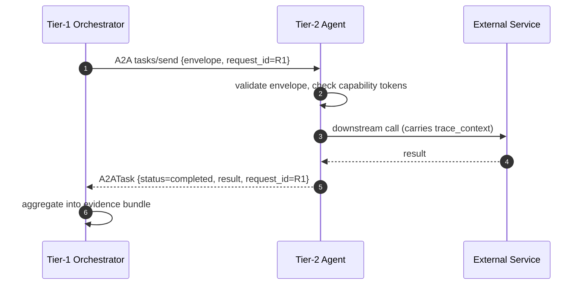
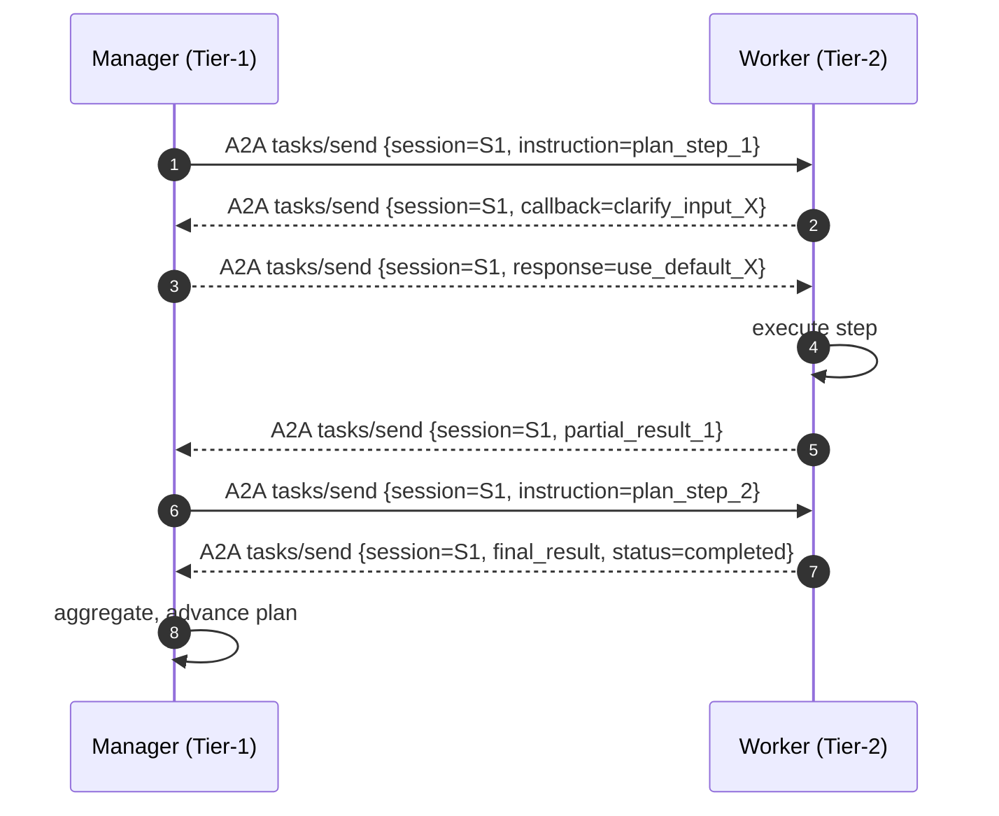
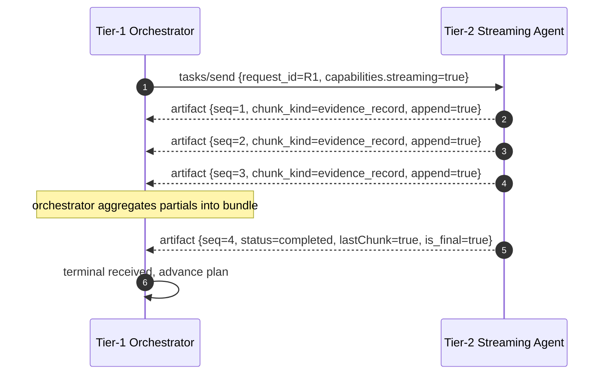

# Agent Communication Protocol

**Status:** Draft v1 — design contract for Tier-1 / Tier-2 communication
**Owners:** apecx-mcp-integration core
**Audience:** orchestrator-agent authors, Tier-2 (retrieval / tool / synthesis) authors, control-plane operators
**Last updated:** 2026-05-08
**Anchors:** `nanobrain_alignment_audit.md` C-52 (USE-AS-IS), §4.3 U-2

---

## 1. Why this document exists

The design package mentions Tier-1 → Tier-2 calls in many places — `multiagent_architecture.md §5` describes orchestrators dispatching to retrieval and tool-execution agents in parallel; `reasoning_patterns_library.md` P5 (manager / worker / CEO) and P4 (debate) and P8 (concordance) all assume an inter-agent transport with at-least-once delivery, structured errors, and cancellation; `hitl_safety_gates.md §3.3` (GATE-A2) assumes capability-token checks happen at the protocol layer; `tool_descriptor_contract.md §6` assumes capability tokens travel on the wire. None of those documents specify:

- **What** wraps a Tier-1 → Tier-2 call (the message envelope: request_id, deadline, trace context, capability tokens, payload).
- **How** errors propagate, which are retryable, and which surface to the user.
- **How** streaming, cancellation, and backpressure behave.
- **How** the W3C trace context flows from MCP through the orchestrator into Tier-2 and onward to external services.
- **Where** the protocol surface lives — what is provided by nanobrain's `a2a_support.py` versus what is APECx-side convention layered on top.

Without this contract, every orchestrator invents its own RPC. The `nanobrain_alignment_audit.md` calls this out as C-52 and tags it **USE-AS-IS**: the framework already ships A2A; APECx must not reinvent the protocol. The user's framing in the original brief was that the inherited package was a *hodge-podge* of inter-agent conventions — this document removes the hodge-podge by writing the conventions down.

This document is **not** a new protocol. It is a specification of how APECx uses the A2A primitives that already exist in nanobrain. Where a concept is provided by A2A, this document cites it. Where APECx adds a convention on top of A2A (envelope wrapping, error catalog, streaming partial-message convention, communication-pattern catalog), it labels the addition explicitly and locates it in apecx-mcp.

This document is **not** an implementation plan. It does not pick a transport timeout, a retry-jitter algorithm, a streaming chunk size, or a message-encoding library. Those are deployment decisions; the contract is identical across them.

---

## 2. What nanobrain A2A provides

The authoritative source is `nanobrain/nanobrain/core/a2a_support.py` (≈1363 lines, verified during this pass). A2A is a Google-spec implementation: agents discover each other through a published Agent Card, dispatch tasks via JSON-RPC, and exchange structured messages with parts (text, file, data) and artifacts. The following primitives are **already provided** and APECx MUST NOT reimplement:

| A2A primitive | Source (`a2a_support.py`) | What it gives APECx |
|---|---|---|
| `A2AAgentCard` | dataclass at lines 145–222 | Capability discovery: name, description, url, version, provider, capabilities (streaming, pushNotifications, stateTransitionHistory), authentication schemes, default input/output modes, list of `A2ASkill` |
| `A2ASkill` | dataclass at lines 110–119 | Per-skill metadata: id, name, description, tags, examples, inputModes, outputModes |
| `A2ACapabilities` | dataclass at lines 122–127 | Boolean flags: `streaming`, `pushNotifications`, `stateTransitionHistory` |
| `A2AAuthentication` | dataclass at lines 130–133 | Supported auth schemes (e.g., `["none"]`, `["bearer"]`, `["oauth2"]`) |
| `A2AMessage` + `A2APart` | lines 62–78 | Wire format: messages are role-tagged (`user` / `agent`); parts are typed (`text` / `file` / `data`) with optional metadata |
| `A2AArtifact` | lines 80–89 | Streaming artifacts: `name`, `description`, `parts`, `index`, `append`, `lastChunk`, `metadata` — the `lastChunk` flag is the framework's terminal-message marker |
| `A2ATask` + `A2ATaskStatus` + `TaskStatus` enum | lines 44–107 | Task lifecycle: `submitted` / `working` / `input-required` / `completed` / `canceled` / `failed` / `unknown` |
| `A2AClient.send_task` / `get_task` / `cancel_task` | lines 603–770 | JSON-RPC method dispatch (`tasks/send` / `tasks/get` / `tasks/cancel`) over aiohttp, with bearer-token / OAuth2 auth headers |
| Agent Card discovery | `discover_agent_capabilities`, lines 560–601 | Fetched from `/.well-known/agent.json` per the Google spec |
| `A2ASupportMixin` | per `nanobrain-agents-tools` SKILL.md, lines 261–280 | Mixin that exposes `call_a2a_agent`, `discover_and_register_a2a_agents`, `get_a2a_status` to any nanobrain agent |
| Tool `tool_card` schema | per `nanobrain-agents-tools` SKILL.md, line 194 | Discovery metadata required for A2A — every Tool advertises a `tool_card` dict |
| Structured exceptions | lines 292–328 | `A2AError`, `A2AConnectionError`, `A2AAuthenticationError`, `A2ATaskExecutionError`, `A2AConfigurationError`, `A2ANotAvailableError` |

What APECx adds on top of A2A (each is specified in a later section of this document):

| APECx convention | Section | Why it's APECx, not nanobrain |
|---|---|---|
| Request envelope wrapping (`request_id`, `session_id`, `intent`, `deadline_ms`, `trace_context`, `auth.capability_tokens`, `payload`) | §3 | The shape of the payload and the auth scheme are APECx-tier policy; the framework cannot know the intent vocabulary or the capability-token taxonomy |
| Five communication patterns CP-1 … CP-5 | §4 | Catalog of how APECx orchestrators choose to use A2A; not a framework concern |
| Eight-row error catalog | §5 | APECx-tier semantics — which errors are retryable, which surface to user, which trigger HITL |
| Partial-message streaming convention | §6 | A2A provides `A2AArtifact.append` + `lastChunk`; APECx defines the partial-payload contract on top |
| Capability-token enforcement at the protocol layer | §10 | GATE-A2 (capability gate) is APECx HITL policy; not a framework concept |

**Verification gap:** the inventory above is grounded in a direct read of `a2a_support.py` (lines 1–1000 read in the source pass; 1000–1363 not directly inventoried). Specifically: the `A2ASupportMixin` agent-side surface (`call_a2a_agent`, `discover_and_register_a2a_agents`, `get_a2a_status`) is documented in `nanobrain-agents-tools` SKILL.md but its exact method signatures were not read line-by-line in this pass. Treat the SKILL.md citations as authoritative for the agent-side surface; treat the `A2AClient` table above as direct-source-verified.

---

## 3. APECx message envelope

Every Tier-1 → Tier-2 A2A call wraps its payload in a uniform envelope. The envelope is APECx-side: it lives in apecx-mcp as a Pydantic `ConfigBase` subclass with `extra='forbid'` (per `pydantic_extra_forbid_rule`). The envelope is carried inside the A2A message — concretely, as the `data` field of an `A2APart` of type `data` (the framework's wire-format slot for structured non-text payloads).

### 3.1 Request envelope

```json
{
  "envelope_version": "1",
  "request_id": "550e8400-e29b-41d4-a716-446655440000",
  "session_id": "f47ac10b-58cc-4372-a567-0e02b2c3d479",
  "user_id": "u-12345",
  "intent": "retrieve_evidence_for_layer_3",
  "deadline_ms": 30000,
  "trace_context": {
    "trace_id": "4bf92f3577b34da6a3ce929d0e0e4736",
    "span_id": "00f067aa0ba902b7",
    "trace_flags": "01",
    "trace_state": "apecx=tier1-orch-A"
  },
  "auth": {
    "capability_tokens": ["read:catalog_X", "exec:tool_Y"],
    "token_expiry_ms": 1714694400000
  },
  "payload": {
    "tool_name": "retrieve_evidence",
    "arguments": { "...tool-specific..." : "..." }
  }
}
```

| Field | Type | Required | Meaning |
|---|---|---|---|
| `envelope_version` | string | yes | Schema version; bumps on breaking changes (§14) |
| `request_id` | UUID | yes | Stable handle for cancellation, retry, dedup, trace correlation |
| `session_id` | UUID | yes | The conversation chain the request belongs to (P10) |
| `user_id` | string | yes | The end-user account; authoritative for capability-token lookup |
| `intent` | string | yes | The orchestrator's reason for calling — short, machine-readable, audit-visible |
| `deadline_ms` | integer | yes | Absolute deadline in ms-from-epoch OR relative budget; per-pattern policy in §4 |
| `trace_context` | object | yes | W3C Trace Context (see §9); Tier-2 propagates to downstream calls |
| `auth.capability_tokens` | array of string | yes | Tokens the user holds at request time; checked per §10 |
| `auth.token_expiry_ms` | integer | optional | Earliest expiry across tokens; informational |
| `payload` | object | yes | Tool-specific body; schema is per-tool, not per-protocol |

### 3.2 Response envelope

```json
{
  "envelope_version": "1",
  "request_id": "550e8400-e29b-41d4-a716-446655440000",
  "status": "completed",
  "result": { "...tool-specific..." : "..." },
  "error": null,
  "partials_count": 0,
  "trace_context": {
    "trace_id": "4bf92f3577b34da6a3ce929d0e0e4736",
    "span_id": "00f067aa0ba902b7"
  }
}
```

| Field | Type | Required | Meaning |
|---|---|---|---|
| `envelope_version` | string | yes | Echoes the request's version |
| `request_id` | UUID | yes | Echoes the request's id |
| `status` | enum | yes | `completed` / `failed` / `cancelled` / `partial` (only on streaming intermediate frames) |
| `result` | object | conditional | Present iff `status == "completed"`; tool-specific |
| `error` | object | conditional | Present iff `status == "failed"`; shape per §5 |
| `partials_count` | integer | optional | For streaming patterns; final-frame total |
| `trace_context` | object | yes | The Tier-2 span context (caller correlates) |

The envelope is the only thing this document standardizes about the wire format. Everything else — connection setup, JSON-RPC method names, message-part types, agent-card publication — comes from `a2a_support.py` unchanged.

---

## 4. The five communication patterns

APECx orchestrators talk to Tier-2 agents in five distinct shapes. Each shape uses A2A primitives differently. The pattern is chosen per-call, not per-orchestrator: a single orchestrator may use CP-1 for the bulk of its sub-task graph, CP-2 for one long-running retrieval, and CP-3 for an audit-write fire-and-forget — all in the same execution.

| Pattern | Name | A2A surface used | Default deadline |
|---|---|---|---|
| **CP-1** | Request / Response | `tasks/send` then await terminal | 30 s |
| **CP-2** | Streaming | `tasks/send` with `capabilities.streaming=true`; `A2AArtifact.append=true` chunks | 5 min total, 10 s inter-chunk |
| **CP-3** | Fire-and-forget | `tasks/send` with `metadata.fire_and_forget=true`; caller does not await | 100 ms send budget |
| **CP-4** | Pub / Sub | `pushNotifications` capability; subscribers register endpoints | 1 s notification dispatch |
| **CP-5** | Bidirectional | Two parallel `tasks/send` channels (manager↔worker) over the same `session_id` | per-message 30 s |

### 4.1 CP-1 Request / Response (default)

The orchestrator submits one task, awaits the terminal `A2ATask` response, validates the response envelope, and continues. This is the default shape — every Tier-2 call is CP-1 unless the caller deliberately selects another pattern.

**When to use.** Bounded retrieval (FAISS top-k, single-database lookup, small synthesis), single-tool execution, single-LLM call.

**Deadline policy.** `deadline_ms` defaults to 30 000. Tier-2 SHOULD return a result or an error before deadline; if it cannot, it MUST return `TIMEOUT` (§5) before deadline+grace (default grace = 1 s).

**Error semantics.** On `failed` status, the orchestrator inspects `error.code`. Retryable errors (per §5) are retried with exponential backoff, reusing the same `request_id`. Non-retryable errors propagate up.



### 4.2 CP-2 Streaming

The orchestrator submits one task; Tier-2 emits a sequence of partial frames followed by exactly one terminal frame. A2A's `A2AArtifact` carries the partial-frame convention (`append=true` on intermediate, `lastChunk=true` on terminal); APECx adds the partial-payload contract (§6).

**When to use.** Long retrieval that produces evidence incrementally (e.g., RAG search streaming chunks; multi-source aggregation that benefits from early visibility); LLM token streaming when the orchestrator wants to begin downstream work before completion.

**Deadline policy.** `deadline_ms` is the **total** budget (default 5 min). An additional `inter_chunk_deadline_ms` (default 10 s) bounds the gap between consecutive partials — Tier-2 missing the inter-chunk deadline is treated by the orchestrator as a stalled stream (cancel + retry).

**Error semantics.** Errors mid-stream are emitted as the terminal frame with `status=failed` and an error object. The orchestrator MUST discard partial state on `failed` unless the partials carry independent commit-points (caller-defined, not protocol-defined).

### 4.3 CP-3 Fire-and-forget

The orchestrator submits one task with `metadata.fire_and_forget=true` and does **not** await the response. Tier-2 SHOULD acknowledge submission (HTTP 202) but the orchestrator does not block on the acknowledgment beyond a small send-budget.

**When to use.** Provenance writes, audit-log appends, telemetry emission. Anything where the orchestrator's correctness does not depend on the call's outcome.

**Deadline policy.** Send-budget only (default 100 ms). The orchestrator does not measure end-to-end latency.

**Error semantics.** The orchestrator does NOT see Tier-2-side errors. Tier-2 is responsible for its own retry, dead-letter, or alert. If the orchestrator's correctness depends on the side effect, this is the wrong pattern — use CP-1.

### 4.4 CP-4 Pub / Sub

Multiple Tier-1 orchestrators (or Tier-2 agents acting as observers) subscribe to a Tier-2 broadcast channel. The publisher emits notifications via A2A's `pushNotifications` capability; subscribers register webhook endpoints during agent-card discovery.

**When to use.** Audit-log fan-out (every active orchestrator wants to see new approval decisions), evidence-stream subscription (P8 concordance — multiple agents subscribe to a shared evidence stream).

**Deadline policy.** Notification dispatch is best-effort with a 1 s budget per subscriber. A subscriber that does not ack within budget is recorded as `delivery_pending`; the publisher does NOT block other subscribers.

**Error semantics.** Subscriber failures do not propagate to the publisher's caller. Persistent subscriber failure (3 consecutive misses) deactivates the subscription; reactivation is manual.

### 4.5 CP-5 Bidirectional

Two parallel A2A task channels share a `session_id`: manager → worker for instructions, worker → manager for callbacks (intermediate questions, sub-results, capability requests). Each direction is its own `tasks/send` stream; the session id is the correlation key.

**When to use.** P5 (manager / worker / CEO) when the worker needs to ask the manager for clarification or escalation mid-execution. Long-running worker tasks where the manager wants to push parameter updates.

**Deadline policy.** Per-message 30 s by default. The `session_id` lives until the manager terminates it (sends a `session_close` envelope) or both sides go idle for 5 minutes.

**Error semantics.** Either side can emit a structured error on its outgoing channel. A `CANCELLED` from the manager terminates the session; a `CANCELLED` from the worker is treated as the worker giving up (manager decides whether to retry, escalate, or fail).



---

## 5. Error catalog

Every Tier-2 → Tier-1 error response carries a structured error object inside the response envelope (§3.2). The catalog is closed: Tier-2 agents MUST NOT invent error codes outside this set. The error object schema:

```json
{
  "code": "RATE_LIMITED",
  "message": "exceeded 10 requests per second on Tier-2 retrieval agent",
  "detail": { "current_rate": 12, "limit": 10 },
  "retry_after_ms": 1500,
  "trace_context": { "trace_id": "...", "span_id": "..." },
  "suggested_action": "back off and retry"
}
```

| Code | Meaning | Retryable | Surface to user? | Notes |
|---|---|---|---|---|
| `INVALID_REQUEST` | Envelope or payload schema validation failed (e.g., missing `request_id`, malformed `payload`) | **No** | As a bug | Caller has a code defect; do not retry the same request |
| `UNAUTHORIZED` | `auth.capability_tokens` missing the token required by the tool's `requires_capability` (§10) | **No** | As an auth issue | Orchestrator routes to GATE-A2 (capability gate) approval flow |
| `RATE_LIMITED` | Per-user or per-tool rate ceiling exceeded | **Yes** | Optional | Use `retry_after_ms`; do not exceed envelope `deadline_ms` on retry |
| `TIMEOUT` | Tier-2 could not complete within `deadline_ms` | **Yes** | Optional | Caller may retry with extended deadline; reuse `request_id` |
| `UPSTREAM_FAILURE` | Tier-2 → external service (e.g., index, LLM, control plane) failed | **Conditional** | Optional | Retryable iff `detail.upstream_retryable=true`; surface only on persistent failure |
| `CANCELLED` | Caller cancelled (or deadline exceeded with cancel-precedence) | **No** | No | Clean exit; orchestrator already knows |
| `BACKPRESSURE` | Tier-2 saturated; cannot accept more work right now | **Yes** | No | Use `retry_after_ms`; the control plane may also receive a backpressure hint |
| `INTERNAL_ERROR` | Uncaught Tier-2 exception | **No** | As a bug | Tier-2 logs full trace; orchestrator surfaces a sanitized message |

Error-handling rules:

1. **Retryable errors** are retried with exponential backoff. Default base = 250 ms, multiplier = 2.0, max-attempts = 3, jitter ±20 %. The `request_id` is reused across retries — Tier-2 deduplication is the contract; if Tier-2 cannot deduplicate, it MUST mark the operation idempotent or accept double-execution.
2. **Non-retryable errors** propagate. The orchestrator does not retry. If the error has `surface=user`, the user-facing response is updated; otherwise it is logged at error level with the `trace_context` and the operator is paged.
3. **Conditional errors** (`UPSTREAM_FAILURE`) require Tier-2 to populate `detail.upstream_retryable` accurately. A Tier-2 that always returns `true` will cause retry storms; a Tier-2 that always returns `false` will surface transient errors as permanent. Tier-2 authors are accountable for this determination.
4. **`CANCELLED` is terminal.** A cancelled request never returns a result, even if the underlying work completed between cancel-emit and cancel-arrival. The result is discarded (§7).

---

## 6. Streaming protocol

CP-2 (streaming) layers a partial-message convention on top of A2A's `A2AArtifact` mechanism. The framework provides the wire-level support (`append=true` for chunked, `lastChunk=true` for terminal); APECx defines the payload shape on the chunks.

### 6.1 Partial frame

```json
{
  "envelope_version": "1",
  "request_id": "550e8400-e29b-41d4-a716-446655440000",
  "sequence_number": 3,
  "is_final": false,
  "partial_payload": {
    "chunk_kind": "evidence_record",
    "data": { "...evidence-record-fields..." : "..." }
  },
  "trace_context": { "trace_id": "...", "span_id": "..." }
}
```

### 6.2 Terminal frame

```json
{
  "envelope_version": "1",
  "request_id": "550e8400-e29b-41d4-a716-446655440000",
  "sequence_number": 17,
  "is_final": true,
  "status": "completed",
  "result": { "summary": "...", "total_chunks": 16 },
  "error": null,
  "trace_context": { "trace_id": "...", "span_id": "..." }
}
```

### 6.3 Rules

- `sequence_number` starts at 1 and increases monotonically. Gaps indicate dropped frames; the orchestrator MAY request resume from the last received `sequence_number` (Tier-2 SHOULD support resume but MAY restart).
- The terminal frame's `sequence_number` equals the count of frames sent (partials + terminal). The orchestrator validates this on receipt; mismatch is an `INVALID_REQUEST`-class protocol bug.
- `partial_payload.chunk_kind` is a tool-specific tag; the orchestrator uses it to route partials into the appropriate slot of the evidence bundle.
- Partials MAY be aggregated into evidence-bundle entries before the terminal arrives. Aggregation must be idempotent in `sequence_number` so resume works.
- Cancellation: the orchestrator sends a `cancel` envelope with the same `request_id` over the A2A control channel (`tasks/cancel` per `a2a_support.py:719`). Tier-2 SHOULD stop emitting partials within 100 ms and emit a terminal frame with `status=cancelled` and an error of code `CANCELLED`.



---

## 7. Cancellation semantics

Cancellation is a first-class protocol concern. Three triggers can cancel an in-flight Tier-1 → Tier-2 call:

1. **User cancellation.** The user invokes the MCP-level cancel surface; Tier 0 propagates the cancel down the orchestrator chain. The orchestrator emits `tasks/cancel` for every in-flight Tier-2 request_id.
2. **Deadline exceeded.** The envelope's `deadline_ms` elapsed without a terminal response. The orchestrator emits `tasks/cancel`, marks the call `TIMEOUT`-then-`CANCELLED`, and applies the retry policy (if any).
3. **Capability revocation.** A capability admin (per `hitl_safety_gates.md §3.3`) revokes a token mid-execution. The control plane notifies the orchestrator; the orchestrator cancels every in-flight call whose envelope listed that token.

### 7.1 Cancellation contract

- The orchestrator MUST tolerate cancellation at any `await` point. Pending state is discarded; partial evidence may be retained or dropped per orchestrator policy (recorded in trace).
- Tier-2 MUST clean up partial work on cancel: close streams, release ProxyStore keys (per nanobrain `ProxyStore` integration in Academy links), abort any in-flight tool execution, flush partial provenance writes.
- Tier-2 MUST emit a terminal frame with `status=cancelled` and `error.code=CANCELLED` to acknowledge. If Tier-2 cannot stop within the cancel grace (default 5 s), it logs a warning but still emits the terminal — no silent abandonment.
- The orchestrator MAY discard a `completed` result that arrives **after** the cancel was emitted. The race is resolved by precedence: `CANCELLED` wins.

### 7.2 Cancellation across CP-5 (bidirectional)

Cancelling one side of a CP-5 session terminates the session. The orchestrator emits `tasks/cancel` for both the manager → worker and worker → manager channels using the shared `session_id` as correlation. Workers in the middle of escalation callbacks see the cancellation as a `CANCELLED` response on their callback request_id.

### 7.3 Cancellation across CP-2 (streaming)

The orchestrator emits `tasks/cancel` once. Tier-2 stops emitting new partials within 100 ms (target). Already-in-flight partials may arrive after cancel; the orchestrator discards them (the terminal `cancelled` frame is the source of truth for `sequence_number` count).

---

## 8. Backpressure

A saturated Tier-2 signals "slow down" through structured backpressure. Two channels:

### 8.1 Hard backpressure (per-request)

Tier-2 returns a response envelope with `status=failed` and `error.code=BACKPRESSURE`. The error MUST include `retry_after_ms`. The orchestrator does not retry before that interval; on retry the same `request_id` is reused (so the Tier-2 deduplicator handles the second arrival as the same logical request).

### 8.2 Soft backpressure (mid-stream hint)

For CP-2 streaming, Tier-2 may emit a partial frame whose `partial_payload.chunk_kind="backpressure_hint"` and `partial_payload.data={"slow_down_ms": 500}`. The orchestrator continues consuming partials but throttles its downstream side-effects (e.g., reducing parallelism on subsequent fan-out).

### 8.3 Multi-orchestrator coordination

Backpressure is also a control-plane concern. When N orchestrators all hit the same Tier-2 simultaneously, per-call `BACKPRESSURE` may not converge — every orchestrator backs off the same amount and the storm repeats. The control plane (per `deployment_architecture.md`) is the canonical fairness arbiter:

- Tier-2 reports its current saturation (`current_concurrency`, `target_concurrency`) to the control plane on a heartbeat.
- The control plane gates new request admissions per-user, so one user's heavy load does not starve another's.
- An orchestrator that receives 3 consecutive `BACKPRESSURE` responses on the same Tier-2 within 10 s SHOULD switch to control-plane-mediated dispatch (the control plane queues until Tier-2 frees capacity).

This document specifies the protocol-level contract; the control-plane queueing algorithm is a deployment decision, not a protocol decision.

---

## 9. Tracing

Every envelope carries a `trace_context` field in W3C Trace Context format (`traceparent` and optional `tracestate`). The orchestrator generates a fresh `span_id` per outgoing call and records the parent context. Tier-2 propagates the context to its downstream calls — to other Tier-2 agents (CP-2 fan-out within a tier), to external services (catalog index, LLM, control plane), to provenance writers.

### 9.1 Format

```json
{
  "trace_id": "4bf92f3577b34da6a3ce929d0e0e4736",
  "span_id": "00f067aa0ba902b7",
  "trace_flags": "01",
  "trace_state": "apecx=tier1-orch-A,session=S-12345"
}
```

`trace_id` is the 32-hex-char W3C trace identifier; `span_id` is the 16-hex-char span identifier. `trace_flags` carries the sampled-bit. `trace_state` is APECx-specific key/value metadata (orchestrator id, session id, gate hints).

### 9.2 Propagation rules

- Tier-2 MUST inject `trace_context` into every downstream protocol it speaks: HTTP via `traceparent` header, A2A sub-calls via the envelope, control-plane writes via the audit-record metadata.
- Tier-2 MUST NOT mutate the parent's `trace_id`. A new `span_id` is allocated per downstream call.
- The orchestrator's `intent` and the Tier-2's tool name SHOULD appear in span attributes (not in `trace_state`, which is for routing hints).
- The control plane aggregates traces for observability (cross-reference `deployment_architecture.md` and the future observability spec). A future doc will pin the actual exporter (OTLP/HTTP, OTLP/gRPC, Zipkin) — that is a deployment decision.

### 9.3 Failure mode

Lost `trace_context` (Tier-2 forgot to propagate, or middleware stripped it) does not break execution — traces simply become disconnected. The orchestrator logs a warning when a Tier-2 response arrives with a `trace_context` that does not match the request's `trace_id`. Persistent mismatch from the same Tier-2 is a defect (see §13 row 7).

---

## 10. Auth and capability tokens

GATE-A2 (the capability gate from `hitl_safety_gates.md §3.3`) is enforced at the protocol level. The contract:

### 10.1 Request side

The orchestrator builds the envelope with `auth.capability_tokens` set to the tokens the user holds at request-build time. The token list MUST be derived from the same authoritative source the control plane uses for GATE-A2 evaluation — drift here is a class-of-bug (the orchestrator says "user has token X" but the control plane disagrees).

### 10.2 Tier-2 side

Tier-2 MUST validate `auth.capability_tokens` against the called tool's `requires_capability` declaration. The descriptor source is `tool_descriptor_contract.md §6` — every UTD that requires a capability lists the token(s) needed.

Validation is performed by the `ToolExecutionStep` (per `nanobrain_alignment_audit.md` F-4: tool dispatch is a Step concern, not an Agent concern). Validation order:

1. Check `auth.token_expiry_ms` — if past, return `UNAUTHORIZED` immediately.
2. Check the token list against `requires_capability`. Missing token returns `UNAUTHORIZED`. Detail field includes the missing token name so the orchestrator can route to GATE-A2.
3. Optional integrity check: if tokens are signed (deployment-policy decision), verify the signature. Failed signature returns `UNAUTHORIZED` with `detail.reason="signature_invalid"`.

### 10.3 GATE-A2 routing

On `UNAUTHORIZED` with `detail.reason="missing_token"`, the orchestrator does NOT retry. It surfaces the missing token to GATE-A2: posts an `Approval` record (per `hitl_safety_gates.md §3.3`) requesting the capability admin grant the token. If granted, the orchestrator re-builds the envelope with the new token list and re-issues the call (new `request_id`). If denied, the orchestrator fails the parent task.

### 10.4 Token lifecycle relative to streaming

In CP-2 (streaming), tokens are checked at request acceptance, not per-frame. A token that expires mid-stream is not re-validated; the stream completes. The token-expiry-mid-stream case is documented as an open question (§16).

---

## 11. Pattern → orchestrator behavior table

Each reasoning pattern from `reasoning_patterns_library.md` (P1–P10) selects a default communication pattern (CP-1 to CP-5). The selection is the pattern author's; orchestrators MAY override per-call but the defaults are how the patterns are documented.

| Pattern | Default Comm | Notes |
|---|---|---|
| **P1** Decompose & Fan-out | CP-1 ×N parallel | Each sub-task is an independent CP-1 call; orchestrator awaits all via `asyncio.gather`. Failure of one call does not cancel the others (sibling-failure isolation is the orchestrator's policy). |
| **P2** Hypothesis Tournament | CP-1 fan-out + CP-3 audit writes | Proposers run as parallel CP-1 calls (one per proposer). Per-round audit records (proposal, score, ranking) are written via CP-3 fire-and-forget. |
| **P3** Refinement Loop | CP-1 with iteration counter | Each loop iteration is one CP-1 call. The envelope's `payload` carries `iteration_n`; the orchestrator's loop controller terminates per `LoopController` config (per gap G18). |
| **P4** Debate | CP-2 streaming for round-by-round dialogue | Each debate round emits an `argument` partial; terminal carries the final stance. Streaming lets the orchestrator surface intermediate arguments to a watching scientist (HITL transparency). |
| **P5** Manager / Worker / CEO | CP-5 bidirectional | Manager↔worker via CP-5 session; CEO planning and decision use CP-1 (CEO is stateless across the two calls per `reasoning_patterns_library.md §P5`). |
| **P6** Branch-and-Prune | CP-1 fan-out (broad) + CP-1 to top-K (deep) | Two phases, both CP-1; the prune step is implemented orchestrator-side (no protocol work). |
| **P7** Retry-with-Feedback | CP-1 with delta-payload on retry | The retry envelope carries `payload.previous_attempt_summary` so Tier-2 sees the prior failure. New `request_id` per retry (this is a logically distinct request, unlike protocol-level retry which reuses the id). |
| **P8** Concordance | CP-1 + CP-4 subscribe | Each retrieval is CP-1; agents that need to observe the evidence stream subscribe via CP-4 to the published evidence channel. |
| **P9** Capability Gap | CP-1 returning capability_gap result | The Tier-2 call returns `status=completed` with a structured `result.capability_gap` — not an error, because the inability is data, not a fault. The orchestrator routes to GATE-A2 (or surfaces the gap to the user). |
| **P10** Conversation Chaining | CP-1 with `session_id` reuse | The envelope's `session_id` is the same across all calls in the chain; Tier-2 may use it for warm-cache lookups but MUST not assume it. |

---

## 12. MCP surface as orchestrator entry

The user's path into the system has three transports, each at a different surface layer. A2A is **only** used between orchestrators and Tier-2 agents — not at the user-facing entry, not at the Tier-2-to-external boundary.

| Hop | Transport | Why |
|---|---|---|
| User → MCP tool call | FastMCP (Model Context Protocol) | Standardized for LLM-tool clients (Claude Desktop, IDE plugins); not reinvented |
| MCP tool → Tier-1 orchestrator | In-process function call OR control-plane RPC | Same node when colocated; control-plane RPC when distributed (deployment decision) |
| Tier-1 → Tier-2 | A2A (this document) | The protocol surface APECx formalizes here |
| Tier-2 → external (catalog index, LLM, control plane, HPC bundle) | Each external service's native protocol | Catalog index uses its native HTTP API; LLM uses OpenAI-compatible HTTP; control plane uses its native protocol |

### 12.1 Boundary clarity

The MCP surface is **not** A2A. The MCP transport is the FastMCP server (`src/apecx_integration/mcp_surface/server.py` per the apecx-mcp-integration CLAUDE.md). The MCP tool implementations dispatch to a Tier-1 orchestrator via a thin wrapper — in-process when colocated, control-plane-mediated when distributed. From the orchestrator down, communication is A2A.

This boundary matters: the design avoids the temptation to expose A2A as the user-facing surface (which would force MCP clients to learn A2A's discovery model). It also avoids the opposite temptation — using FastMCP between Tier-1 and Tier-2 (which would lose A2A's task lifecycle, push notifications, and structured error catalog).

### 12.2 What changes for cloud mode

In cloud mode, the orchestrator-to-orchestrator dispatch uses A2A as well (the MCP tool's wrapper resolves to a remote orchestrator's agent card and calls it via CP-1). This is the same protocol surface specified in this document — no new patterns.

### 12.3 A2U — Agent-to-User communication (autonomous agent)

When an autonomous agent (per `autonomous_workflow_agent.md`) wants to ask
the human user a question, the communication is "agent-initiated, user-facing"
— neither A2A (which is agent-to-agent) nor a normal MCP tool call (which is
user-initiated). This document calls the surface **A2U** to disambiguate.

**v1 design — approvals-table polling.** The autonomous agent does NOT push
to the MCP client. Instead, it writes an `Approval` row into the existing
control-plane approvals table (per `hitl_safety_gates.md §6`), with two new
fields per `autonomous_workflow_agent.md §6.1`:

```python
class Approval(BaseModel):
    # ... existing fields per hitl_safety_gates.md §6 ...
    task_id:           Optional[str] = None    # NEW — links to autonomous_task row
    deferred_hitl:     bool = False            # NEW — distinguishes autonomous-initiated from interactive-initiated
```

The user discovers the request through the **existing**
`list_pending_approvals` MCP tool (no new tool needed). When connected to
Claude Desktop, the client polls every N seconds and surfaces new requests.

The user's response (`approve` / `reject` / `correct`) writes to the same
table; the autonomous agent's runtime polls the table for its own pending
requests every 5 seconds and resumes the paused workflow run on response.

```
Autonomous agent (Tier 1)               Control plane                 MCP client (Claude Desktop)
       │                                       │                              │
       │ writes Approval(task_id, deferred_hitl=true)                        │
       ├──────────────────────────────────────►│                              │
       │ pause workflow run; wait              │                              │
       │                                       │ ◄──── poll list_pending_approvals(user_id, ~5s)
       │                                       │ ─── returns the new request ─►
       │                                       │                              │
       │                                       │                              │ user reviews + decides
       │                                       │ ◄──── approve(approval_id, ...)
       │ ◄──── poll for resolved approvals ────│                              │
       │ resume paused workflow run            │                              │
       ▼                                       ▼                              ▼
```

**Why polling, not push:** server-initiated MCP push (gap **G23** in
`nanobrain_capability_gaps.md`) is the v2 promise. The v1 polling design is
chosen because:

1. The MCP transport in v1 is stdio (per Claude Desktop's standard config),
   which has no clean primitive for server-initiated messages outside of an
   active call.
2. The polling approach reuses the existing approvals table, lifecycle, and
   audit log without introducing a new IPC mechanism.
3. The user-perceived latency (worst case ~30s when actively connected) is
   acceptable for HITL decisions whose timeout windows are 24-72h
   (per `hitl_safety_gates.md §11`).

**v2 promise:** when the user is not actively polling Claude Desktop, the
deferred-HITL request goes unseen until the next user connect. v2 (G23)
adds true MCP server push so a connected client receives a
`notifications/message` immediately on request creation. The v1 polling
path remains supported as the fallback for clients that don't subscribe.

**A2U is not A2A.** A2A's task lifecycle (per §2) handles agent-to-agent
push notifications; we considered routing A2U through the same primitive.
The decision against: A2A's discovery model assumes the receiver is an
agent (with an agent card), which the user is not. The approvals table is
the right durability layer for human-in-the-loop decisions because it
already supports cross-session persistence, multiple approver eligibility,
and the audit log requirement.

---

## 13. Failure-mode atlas

Eight protocol-level failures and how they are detected and mitigated. This is the "what goes wrong on the wire" companion to the §5 error catalog.

| # | Failure | Detection | Mitigation |
|---|---|---|---|
| 1 | Tier-2 hangs past `deadline_ms` | No frame received before deadline | Orchestrator emits `tasks/cancel`; applies retry policy if call is retryable (per §5); else surfaces `TIMEOUT` to caller |
| 2 | Tier-2 returns malformed envelope (missing `request_id`, wrong `envelope_version`, `payload` fails schema) | Pydantic `extra='forbid'` validation fails on receipt | Orchestrator records `INVALID_REQUEST`; does NOT retry (caller-side or callee-side bug); pages operator |
| 3 | Streaming connection drops mid-stream | Inter-chunk deadline elapsed without next frame | Orchestrator MAY resume from last `sequence_number` if Tier-2 advertises `capabilities.stateTransitionHistory=true`; else emits cancel and restarts |
| 4 | Backpressure storm (all Tier-2 instances saturated) | 3+ consecutive `BACKPRESSURE` from same Tier-2 within 10 s | Orchestrator falls back to control-plane-mediated queueing (§8.3); user notified of degraded latency |
| 5 | Auth token expires mid-stream | Next frame returns `UNAUTHORIZED` despite valid earlier frames | Orchestrator may attempt re-auth and restart from last `sequence_number`; else fails the call and routes to GATE-A2 |
| 6 | Two orchestrators submit identical `request_id` | Tier-2 detects duplicate id with conflicting envelope contents | `request_id` MUST be UUID (v4 minimum, v7 recommended for monotonicity at scale); collision is a UUID-generator bug — investigate immediately, do not paper over |
| 7 | `trace_context` lost (Tier-2 forgot to propagate, or middleware stripped) | Spans appear disconnected in observability backend | Warning logged; not fatal. Persistent loss from same Tier-2 → defect ticket; the protocol does not enforce trace propagation, only requires it |
| 8 | Cancellation race (`deadline_ms` exceeded just as `result` arrives) | Both `CANCELLED` and `completed` frames in flight | `CANCELLED` takes precedence per §7.1; `completed` is discarded; trace records both for forensics |

Additional failure modes worth noting but not in the top eight:

- **Agent-card drift.** Tier-2 publishes a card claiming `streaming=true` but rejects every CP-2 call. Detection: orchestrator falls back to CP-1 after the first failure; defect ticket against the Tier-2 owner.
- **Capability-token format change.** A token format upgrade lands in Tier-2 before the orchestrator. Detection: every call returns `UNAUTHORIZED` with `detail.reason="signature_invalid"`. Mitigation: rolling deploys must update the token verifier before the issuer; envelope version bumps when the format changes (§14).

---

## 14. Compatibility and versioning

The `envelope_version` field is the single source of truth for envelope-shape compatibility. The version bumps on **breaking** changes only — adding an optional field is non-breaking; renaming a field, removing a field, or changing field semantics is breaking.

### 14.1 Negotiation

Tier-2 advertises supported envelope versions in its `tool_card` (per nanobrain `tool_card` schema, per `nanobrain-agents-tools` SKILL.md line 194). The advertisement is a list, e.g., `supported_envelope_versions: ["1", "2"]`. The orchestrator selects the **highest** mutually-supported version when constructing the envelope; if no overlap exists, the call fails before send (`INVALID_REQUEST` with `detail.reason="envelope_version_mismatch"`).

### 14.2 Deployment discipline

- A new envelope version MUST land in Tier-2 before any orchestrator emits it.
- Old envelope versions MUST remain supported for at least one major release after their successor lands. Operators on N-1 orchestrators MUST be able to call N Tier-2 agents during rolling upgrades.
- Deprecation of an envelope version MUST be advertised in the agent card (`deprecated_envelope_versions`) for one full release cycle before removal.

### 14.3 Field-level evolution

The error catalog (§5) is closed by version. Adding a new error code is a minor-version bump (the orchestrator's catalog must learn the code, but old orchestrators get the new code as `INTERNAL_ERROR` semantically — `code` is a string and unknown codes degrade to "non-retryable, surface as bug").

---

## 15. What lives in nanobrain vs. apecx-mcp

The split rule from `nanobrain_alignment_audit.md §2` applies. Concretely for this protocol:

| Concern | Layer | Why |
|---|---|---|
| A2A transport (JSON-RPC, aiohttp, agent sessions, retry/backoff plumbing) | nanobrain (`a2a_support.py`) | Domain-neutral framework; reused by every nanobrain consumer |
| Agent registry, agent-card discovery, `/.well-known/agent.json` | nanobrain (`a2a_support.py`) | Google-spec primitive; not APECx-specific |
| `tool_card` schema on Tools | nanobrain (per SKILL.md) | Discovery metadata is domain-neutral |
| Structured A2A exceptions (`A2AError`, `A2AConnectionError`, `A2ATaskExecutionError`, `A2ANotAvailableError`) | nanobrain | Transport-level errors |
| Envelope schema (`envelope_version`, `request_id`, `intent`, `deadline_ms`, `auth.capability_tokens`, `payload`) | apecx-mcp | APECx-tier policy: intent vocabulary, capability-token taxonomy, deadline conventions |
| Error catalog rows (codes, retryability, surface-to-user policy) | apecx-mcp | APECx semantics — which errors trip which HITL gate, which feed retry policy |
| Communication patterns CP-1 to CP-5 | apecx-mcp (conventions over A2A) | APECx orchestrator policies; the framework provides the primitives, APECx provides the catalog |
| Partial-message convention (`sequence_number`, `is_final`, `chunk_kind`) | apecx-mcp | A2A provides `A2AArtifact.append`+`lastChunk`; APECx defines the payload contract on top |
| Capability-token validation in `ToolExecutionStep` | apecx-mcp | GATE-A2 is APECx HITL policy |
| Trace context propagation rules (W3C format, intent in span attrs) | apecx-mcp (using OTel-compatible primitives) | OTel exporter selection is a deployment decision; the format is the protocol concern |

Promotion candidates (concepts that could migrate to nanobrain when a second non-APECx consumer materializes):

- The **envelope schema** is APECx-specific today (intent vocabulary is ours), but a generic version with `intent` left as an opaque string would be useful to any nanobrain consumer doing tier-to-tier work. If a second framework consumer asks for it, promote.
- **Streaming partial-payload contract.** Same logic; the `chunk_kind` taxonomy is APECx-specific, but the framing convention is generic.
- **Backpressure protocol** (`BACKPRESSURE` error + `retry_after_ms` + soft-hint partial frame). Generic; would be valuable as a framework-level pattern.

---

## 16. Open questions

1. **Trace context standard.** Do we mandate W3C Trace Context (`traceparent` / `tracestate`) or use OpenTelemetry's full propagation API (which adds baggage and OT-specific extensions)? W3C is the leaner contract; OTel offers richer instrumentation. Decision blocked on observability-spec ownership.
2. **A2A transport for streaming.** What is the actual wire transport for CP-2 streaming? `a2a_support.py` uses HTTP JSON-RPC for `tasks/send` — does streaming use Server-Sent Events, WebSocket, or a polling `tasks/get` loop? The framework's `A2ACapabilities.streaming` flag is true, but the transport mechanics are not pinned in the source we read. Direct verification of `a2a_support.py:1000–1363` needed.
3. **`request_id` collision at scale.** UUIDv4 has ~10⁻¹⁸ collision probability per ID, but in distributed cloud mode with many orchestrators, monotonic generation (UUIDv7) is operationally valuable for debugging and per-second sharding. Do we mandate UUIDv7? The collision-safety case is the same; the operability case is real.
4. **Cancellation latency on HPC.** `deadline_ms` interacts poorly with HPC executors — a PBS job already in the queue cannot be cancelled instantly; an Aurora task already running pays minutes-of-walltime for graceful shutdown. Does the protocol need a separate `cancel_grace_ms` envelope field for HPC-bound calls, or is it sufficient to express this in the descriptor's cost-estimate and let the orchestrator avoid setting tight deadlines? (Cross-reference `hpc_reproducibility_spec.md`.)
5. **A2A bridge over MCP.** External MCP clients today reach APECx via FastMCP; they cannot speak A2A directly. Do we need an A2A-over-MCP bridge so external MCP clients can address Tier-2 agents directly (bypassing Tier-1)? Arguments for: clients with their own orchestration. Arguments against: bypasses HITL gates, capability checks, and provenance. Default: NO bridge; document as a constraint.
6. **Token expiry mid-stream.** §10.4 says tokens are checked at request acceptance, not per-frame. For long CP-2 streams (5+ minutes), should mid-stream re-validation be a Tier-2 option (via agent card flag), or is the current "check once" model adequate? The risk window is the stream duration; quantifying it requires usage data.
7. **CP-3 dead-letter policy.** Fire-and-forget calls that fail Tier-2-side are invisible to the caller. Do we need a control-plane-managed dead-letter queue? Without it, audit-write failures are silent. Default: control plane offers a dead-letter; Tier-2 opts in via tool_card flag.
8. **Multi-tenant fairness without control plane.** §8.3 assumes the control plane mediates fairness. In single-node deployments without a control plane, how is fairness expressed? Default: single-node deployments are single-user; multi-tenancy requires the control plane.

---

## 17. Cross-references

| Topic | Source |
|---|---|
| A2A primitive inventory (authoritative) | `nanobrain/nanobrain/core/a2a_support.py` |
| A2A surface (skill-level summary) | `.claude/skills/nanobrain-agents-tools/SKILL.md` §A2A |
| Tier 1 / Tier 2 architecture | `apecx-mcp-integration/docs/multiagent_architecture.md` |
| Reasoning patterns P1–P10 | `apecx-mcp-integration/docs/reasoning_patterns_library.md` |
| Manager / worker / CEO (P5) — heaviest CP-5 consumer | `reasoning_patterns_library.md §P5` |
| Capability gate (GATE-A2) | `apecx-mcp-integration/docs/hitl_safety_gates.md §3.3` |
| `requires_capability` on UTDs | `apecx-mcp-integration/docs/tool_descriptor_contract.md §6` |
| `ToolExecutionStep` (validates capability tokens) | `nanobrain_alignment_audit.md` F-4 |
| Pydantic `extra='forbid'` rule (envelope schema) | user-memory `pydantic_extra_forbid_rule` |
| C-52 USE-AS-IS classification | `nanobrain_alignment_audit.md §3.8 C-52`, §4.3 U-2 |
| Deployment topology (control plane) | `apecx-mcp-integration/docs/deployment_architecture.md` |
| HPC executor cancellation latency | `apecx-mcp-integration/docs/hpc_reproducibility_spec.md` |
| MCP surface (FastMCP, user entry) | `apecx-mcp-integration/docs/mcp_integration.md`, `mcp_surface.md` |
| Observability spec | TBD (referenced as future doc) |

---

**Document health.** Two verification gaps disclosed in line with the workspace honesty rule:

1. `a2a_support.py` was directly read for lines 1–1000; the `A2ASupportMixin` agent-side surface (lines ~1000–1363) is documented from `nanobrain-agents-tools` SKILL.md, not from a direct source pass.
2. The actual A2A streaming transport mechanics (open question #2) are not pinned in the source we read. The CP-2 specification in §6 assumes the framework supports the partial-frame convention via `A2AArtifact.append=true` and `lastChunk=true` (which IS in the source); the underlying wire-level streaming transport (HTTP SSE? WebSocket? polling?) is not.

Both gaps are resolvable by a second source-pass on `a2a_support.py:1000–1363` and a check of any active A2A consumer in nanobrain's library/ tree. Treat the framework-side claims as inventory-grade until that pass lands.
