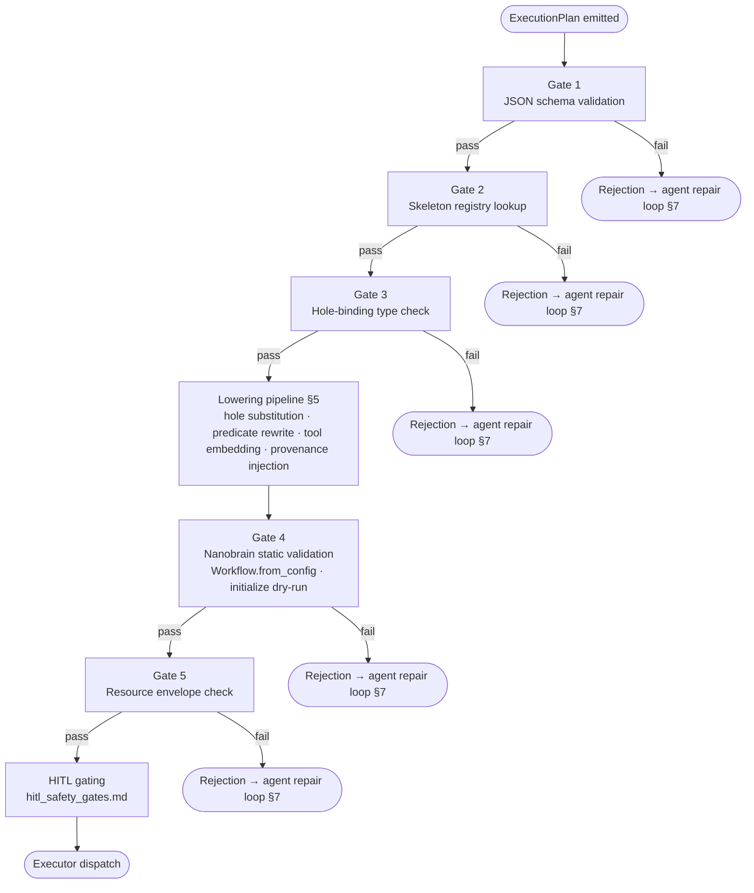

# APECx Agent-Authored Workflow Construction — Design Document

**Status:** Design / pre-implementation
**Audience:** Tier-1 orchestrator authors, composer maintainers, control-plane engineers, reviewers of LLM-authored YAML
**Supplements:** `multiagent_architecture.md`, `workflow_output_contract.md`, `nanobrain_workflow_design.md`, `external_tool_integration.md`, `development_roadmap.md`
**Read first:** `.claude/skills/nanobrain-workflow-authoring/SKILL.md`, `.claude/skills/nanobrain-config-yaml/SKILL.md`, `.claude/skills/nanobrain-from-config/SKILL.md`

---

## 1. Why this document exists

The four sister design documents define **what** the target system does and **what shape** its outputs must have. None of them describe **how a Tier-1 orchestrator agent — running inside one MCP request — converts a free-text scientist question into a runnable nanobrain workflow YAML that downstream Tier-2 retrieval and reasoning agents can execute and Tier-3 can ship to HPC.**

The central question is the one a fresh implementer hits the moment they finish reading `nanobrain_workflow_design.md`:

> Phase 0 produces an `ExecutionPlan` (`workflow_output_contract.md §3.2`). The framework loads workflows from YAML on disk via `Workflow.from_config()` (`nanobrain-workflow-authoring` SKILL). What is the bridge between the two? Who writes the YAML, when, with what guardrails, and how do we keep an LLM from emitting a syntactically-valid workflow that silently produces no output?

This document defines that bridge. Concretely, it specifies:

1. The taxonomy of authoring strategies the orchestrator may use, ranked by safety, with one explicitly forbidden.
2. The JSON `ExecutionPlan` schema the orchestrator emits as its authoring artifact (NOT YAML — important).
3. The skeleton library: pre-validated workflow templates with explicit holes the orchestrator fills.
4. The deterministic, code-owned (NOT LLM) lowering from `ExecutionPlan` → runnable workflow YAML.
5. A five-gate validation pipeline that every produced YAML must pass before any executor sees it.
6. The structured-rejection / repair contract the orchestrator uses to recover when a gate rejects.
7. How conversation chaining (multi-turn sessions) drives delta-vs-fresh authoring.
8. A failure-mode atlas seeded from the brutal-truth section of `architecture.md §13`.

What this document does **not** do:

- It does not define the `ExecutionPlan` semantics (those are in `workflow_output_contract.md §3`) — only its on-the-wire shape and the new fields the lowering pipeline needs.
- It does not define the static DAG shape of the layered reasoning workflow (that is in `nanobrain_workflow_design.md §2`).
- It does not define the contract by which Tier-2B tool execution agents are invoked (that is in `external_tool_integration.md §2`).
- It does not specify implementation. No Python module, no complete workflow YAML, no test fixture is in scope. Schemas, JSON examples, and YAML *fragments* used as illustrations are fine; production code belongs in implementation PRs.

---

## 2. Three authoring strategies (ranked by safety)

Authoring strategies are ranked from least risky to most risky. An orchestrator agent selects a strategy based on the classified intent, the operator's per-user capability flags, and the planning step's confidence that an existing skeleton matches the query. **The default for every new orchestrator is Strategy A.** Strategies B and C are opt-in per deployment and require an HITL gate before the produced YAML reaches any executor.

### 2.1 Strategy taxonomy

| Strategy | Name | What the LLM does | What the LLM never touches | Risk | Default? |
|---|---|---|---|---|---|
| A | Skeleton selection + parameter binding | Picks one skeleton ID, fills its declared holes (parameters, layer toggles, tool slots) | The skeleton YAML, link wiring, trigger types, executor types | Low | Yes |
| B | Skeleton composition | Picks K skeletons, declares typed inter-skeleton links and conditional gates between their boundary data units | Internal skeleton structure, internal links, internal triggers | Medium | No (opt-in) |
| C | Constrained YAML synthesis | Emits full workflow YAML using a frozen catalog of step classes, link classes, trigger types, executors | Nothing inside the catalog (catalog is the only legal vocabulary) | High | No (opt-in; this is what `T-COMP` does today) |
| D | Free-form YAML | (Forbidden) | (Forbidden) | Catastrophic | **Never** |

### 2.2 Why D is forbidden

Free-form YAML synthesis lets the LLM emit any string that the YAML parser accepts. The framework's static validators (the `Workflow.from_config()` integrity checks documented in `nanobrain-workflow-authoring` and the FAIL-FAST checks at step initialization documented in `nanobrain-step-authoring`) are necessary but not sufficient: a workflow can pass every static check and still produce nothing at runtime. `architecture.md §13` brutal-truth #3 calls this out explicitly:

> **DirectLink defaults to `auto_transfer=False`.** Without explicit `auto_transfer: true` in the link config, the workflow YAML loads cleanly but every link is a runtime no-op. The composer prompt now mandates this; manually-authored YAMLs must set it. This was one of FOUR silent-failure bugs uncovered by the trigger-cascade test.

`#4` (workflow-level data unit shape), `#5` (trigger payload wrapping), and `#11` (`extra='forbid'` enforcement) are siblings of the same failure mode: a YAML that parses, instantiates, and walks the DAG without producing any output. There is no observable runtime signal — the cascade simply terminates with `data_flow_initiated` and the operator sees an empty bundle. Free-form synthesis cannot be made safe against this class of failure because the LLM cannot infer non-default flags from semantically valid templates that omit them. Strategy D is therefore not "off by default" — it is structurally absent from the authoring API.

### 2.3 Capability flags and HITL gating

Every orchestrator deployment exposes four flags on its composer config. The
first two govern authoring strategy; the last two govern autonomous operation
(per `autonomous_workflow_agent.md §3.2`).

| Flag | Default | Effect |
|---|---|---|
| `composer.allow_composition` | `false` | When `true`, the orchestrator may emit Strategy B plans. When `false`, the planner must select a single skeleton or escalate. |
| `composer.allow_synthesis` | `false` | When `true`, the orchestrator may emit Strategy C plans. When `false`, attempts to synthesize raise a Gate-1 rejection. |
| `composer.allow_autonomous` | `false` | When `true`, the orchestrator may run as a long-lived autonomous task (per `autonomous_workflow_agent.md`). When `false`, all autonomous-task triggers are rejected at trigger time. |
| `composer.max_autonomy_level` | `strict_hitl` | Hard ceiling on `autonomy_level` for any task. Tasks requesting a higher level than the deployment's max are rejected. Values: `strict_hitl` < `opt_in_hitl` < `pure_autonomous`. |

When `allow_composition=true`, the produced composition plan is presented to the user via the existing `approve` / `reject` / `correct` MCP tools (`mcp_surface.md`) before the lowering pipeline runs. Strategy C requires the same HITL gate plus a second gate after lowering, before execution: the operator sees the lowered YAML diff and must explicitly approve it. The HITL surface is reused from `multiagent_architecture.md §7.3` and the existing approval tooling — no new gate primitives are introduced.

**Autonomy and authoring strategy are orthogonal.** A deployment with
`max_autonomy_level: pure_autonomous` may still constrain `allow_synthesis: false` —
an autonomous task that would require Strategy C synthesis is rejected at the
authoring boundary, not at the autonomy boundary. Conversely, a deployment with
`allow_synthesis: true` but `allow_autonomous: false` runs Strategy C plans
only in interactive (synchronous) mode. The two axes compose:

| autonomy_level / strategy | A (skeleton selection) | B (skeleton composition) | C (synthesis) |
|---|---|---|---|
| `strict_hitl` | No HITL gate; runs unattended on a schedule with no user pause | Standard B-gate before lower; standard B-gate before execute | Standard C-gates (twice, before lower + before execute) |
| `opt_in_hitl` | Same as strict_hitl (no gates apply for Strategy A) | B-gates can timeout-default-approve for low-risk classes (per `hitl_safety_gates.md §3` deferral table); hard-gate categories remain | C-gates can timeout-default-approve for low-risk classes; hard-gate categories remain |
| `pure_autonomous` | Same | B-gates auto-approve on timeout (configurable to 0s for non-blocking) for all but hard-gate categories | C-gates auto-approve on timeout for all but hard-gate categories. **Operators rarely combine `pure_autonomous` + Strategy C** — the combination ships novel YAML without human review, which is high-risk; an additional deployment flag may be added in v2. |

### 2.4 Decision rule for the orchestrator

The orchestrator's strategy selection is itself deterministic, not LLM-decided:

1. If a skeleton with `match_score ≥ skeleton_match_threshold` exists for the classified intent → **Strategy A**.
2. Else, if `composer.allow_composition` is `true` and ≥2 skeletons have `match_score ≥ composition_threshold` whose boundary data units are link-compatible → **Strategy B**.
3. Else, if `composer.allow_synthesis` is `true` → **Strategy C**, with mandatory HITL.
4. Else → escalate to the user with a structured `cannot_construct` message (see §7).

The match scoring function is part of the skeleton library (§4) and is computed by the orchestrator before any LLM call beyond the intent classifier. **The LLM is never asked "which strategy?".**

---

## 3. The Execution Plan — the agent's authoring artifact

The orchestrator agent never writes YAML directly under Strategies A and B. Its sole authoring output is an **ExecutionPlan** — a JSON document that names a skeleton, fills its holes, declares the active layer set, and pins the resource envelope. The plan is the only artifact the LLM produces; the lowering pipeline (§5) is code-owned and deterministic.

The decision to keep the plan in JSON, not YAML, is intentional. JSON Schema validation tooling is mature and produces machine-readable rejection paths; LLM-generated YAML is a known source of structural ambiguity (block-vs-flow, type coercion, multiline string handling) that we do not want to debug at the planning boundary.

### Nanobrain implementation mapping

The ExecutionPlan maps to two nanobrain primitives:

- **`ExecutionPlanConfig(ConfigBase)`** — the Pydantic model wrapping the plan fields, with `extra='forbid'` enforced so YAML typos surface immediately. This is gap **G16** in `nanobrain_capability_gaps.md`. The `additionalProperties: false` constraint in §3.1 is the JSON-Schema equivalent; the Pydantic implementation is the runtime enforcement.
- **`ExecutionPlanDataUnit(DataUnitMemory)`** — the nanobrain data unit that carries the `ExecutionPlanConfig` between orchestrator steps. The `Phase0PlanningStep` outputs this data unit; `PlanLoweringStep` (§5) consumes it.

The plan travels through the orchestrator's workflow as a typed data unit, not as a raw dict. This keeps the data-flow contract explicit and checkable by nanobrain's link-wiring validator.

### 3.1 ExecutionPlan schema (v1)

```json
{
  "$schema": "https://apecx.local/schemas/execution_plan.v1.json",
  "type": "object",
  "additionalProperties": false,
  "required": [
    "plan_version",
    "strategy",
    "skeleton_id",
    "skeleton_version",
    "active_layers",
    "parameter_bindings",
    "tool_invocations",
    "resource_envelope",
    "provenance_seed"
  ],
  "properties": {
    "plan_version":     {"const": "1"},
    "strategy":         {"enum": ["A", "B", "C"]},
    "skeleton_id":      {"type": "string"},
    "skeleton_version": {"type": "string", "pattern": "^[a-f0-9]{12}$"},
    "skeleton_refs":    {
      "type": "array",
      "description": "Strategy B only — additional skeletons composed with skeleton_id",
      "items": {
        "type": "object",
        "required": ["skeleton_id", "skeleton_version", "alias"],
        "properties": {
          "skeleton_id":      {"type": "string"},
          "skeleton_version": {"type": "string"},
          "alias":            {"type": "string"}
        }
      }
    },
    "active_layers": {
      "type": "array",
      "description": "Subset of the layer-type vocabulary from workflow_output_contract.md §4.1",
      "items": {"enum": ["sequence", "structural", "functional", "evidence", "cross_source", "design"]}
    },
    "parameter_bindings": {
      "type": "object",
      "description": "Values for the holes declared in skeleton.schema.json. Keys MUST match skeleton holes.",
      "additionalProperties": true
    },
    "tool_invocations": {
      "type": "array",
      "items": {
        "type": "object",
        "required": ["slot_id", "tool_descriptor_ref"],
        "properties": {
          "slot_id":             {"type": "string"},
          "tool_descriptor_ref": {"type": "string", "description": "ID in the unified tool descriptor catalog"},
          "input_bindings":      {"type": "object"}
        }
      }
    },
    "resource_envelope": {
      "type": "object",
      "required": ["executor", "walltime_minutes", "estimated_cost_usd", "hpc_eligible"],
      "properties": {
        "executor":           {"enum": ["LocalExecutor", "ThreadExecutor", "ProcessExecutor", "ParslExecutor"]},
        "walltime_minutes":   {"type": "integer", "minimum": 1, "maximum": 1440},
        "estimated_cost_usd": {"type": "number", "minimum": 0},
        "hpc_eligible":       {"type": "boolean"}
      }
    },
    "inter_skeleton_links": {
      "type": "array",
      "description": "Strategy B only — typed boundary links between composed skeletons",
      "items": {
        "type": "object",
        "required": ["from", "to", "link_class"],
        "properties": {
          "from":       {"type": "string", "description": "<alias>.<output_data_unit_name>"},
          "to":         {"type": "string", "description": "<alias>.<input_data_unit_name>"},
          "link_class": {"enum": ["DirectLink", "ConditionalLink"]},
          "predicate":  {"type": "string", "description": "Reference to a registered predicate in the catalog"}
        }
      }
    },
    "provenance_seed": {
      "type": "object",
      "required": ["session_id", "user_id", "intent", "phase0_evidence_refs"],
      "properties": {
        "session_id":           {"type": "string"},
        "user_id":              {"type": "string"},
        "intent":               {"type": "string"},
        "phase0_evidence_refs": {"type": "array", "items": {"type": "string"}}
      }
    }
  }
}
```

### 3.2 Worked example — Strategy A multi-source discovery

The example below conforms to the JSON schema in §3.1 and (once G16 ships)
to the `ExecutionPlanConfig(ConfigBase)` Pydantic model. Until G16 ships,
this is a free-floating JSON document that apecx-mcp validates with a
hand-rolled JSON-Schema check.

```json
{
  "plan_version": "1",
  "strategy": "A",
  "skeleton_id": "multi_source_discovery",
  "skeleton_version": "a7c2e4f91b03",
  "active_layers": ["sequence", "structural", "functional", "evidence"],
  "parameter_bindings": {
    "primary_entity": {"canonical_id": "ONTO:12345", "surface_form": "example organism X"},
    "target_protein": {"surface_form": "target protein of interest"},
    "data_sources": {
      "databases": ["StructureDB", "LiteratureDB", "BioactivityDB"],
      "faiss_index": "apecx_domain_rag"
    },
    "layer_toggles": {
      "sequence": true,
      "structural": true,
      "functional": true,
      "evidence": true,
      "cross_source": false,
      "design": false
    },
    "executor_hint": "parsl_node"
  },
  "tool_invocations": [
    {
      "slot_id": "alignment_slot",
      "tool_descriptor_ref": "rhea:muscle.align@5.1.0",
      "input_bindings": {
        "sequences": "{{sequence_layer_output.sequences}}",
        "alphabet": "protein"
      }
    }
  ],
  "resource_envelope": {
    "executor": "ParslExecutor",
    "walltime_minutes": 45,
    "estimated_cost_usd": 1.80,
    "hpc_eligible": false
  },
  "provenance_seed": {
    "session_id": "sess-0f9a8b7c6d5e",
    "user_id": "user-scientist-42",
    "intent": "multi_source_retrieval_and_synthesis",
    "phase0_evidence_refs": ["ref-a1b2c3d4", "ref-e5f6a7b8"]
  }
}
```

---

## 4. The Skeleton Library

A **skeleton** is a pre-validated nanobrain workflow YAML with typed *holes* — named placeholders that the orchestrator fills at authoring time. Each skeleton lives at:

```
composition/workflows/<skeleton_id>/skeleton.yml
composition/workflows/<skeleton_id>/skeleton.schema.json
```

The `skeleton.yml` is a complete, loadable nanobrain workflow YAML that passes `Workflow.from_config()` + `Workflow.initialize()` in dry-run mode *before any holes are filled*. Unfilled holes are represented as YAML scalar values of the form `"{{hole_name: type}}"` — a string token the lowering pipeline (§5) finds and replaces. The schema JSON describes each hole's type, whether it is required or optional, its default value (if optional), and a human description.

### 4.1 Hole grammar

In `skeleton.yml`, a hole appears as a YAML scalar:

```yaml
step_config:
  primary_entity_id: "{{primary_entity_canonical_id: string}}"
  databases: "{{database_list: array[string]}}"
  max_results_per_db: "{{max_results: integer | default=100}}"
```

In `skeleton.schema.json`, each hole is declared explicitly:

```json
{
  "holes": {
    "primary_entity_canonical_id": {
      "type": "string",
      "required": true,
      "description": "Canonical ontology ID for the primary entity of interest."
    },
    "database_list": {
      "type": "array",
      "items": {"type": "string"},
      "required": true,
      "description": "Ordered list of database names to query, in fan-out order."
    },
    "max_results": {
      "type": "integer",
      "required": false,
      "default": 100,
      "description": "Per-database row cap applied during retrieval."
    }
  }
}
```

The type system is a strict subset of JSON Schema: `string`, `integer`, `number`, `boolean`, `array` (with `items`), `object` (with `properties`), and `tool_descriptor_ref` (a string constrained to the UTD `descriptor_id` grammar from `tool_descriptor_contract.md §2.2`). The `tool_descriptor_ref` type triggers special handling in the lowering pipeline (§5, step 5).

### 4.2 Skeleton inventory

The initial skeleton catalog ships with five skeletons. All five are code-owned and reviewed; adding a skeleton follows the same review process as a framework change, because a skeleton error propagates silently to every plan that selects it.

| Skeleton ID | Purpose | Active phases | Hole categories |
|---|---|---|---|
| `rag_e2e_synthesis` | Single-question grounded answer from the domain RAG index | assembly → synthesis | query string |
| `multi_source_discovery` | Multi-DB retrieval with parallel fan-out and structured evidence accumulation | plan → K retrieval layers → evidence accumulation → synthesis | entity filter, database list, executor |
| `hypothesis_tournament` | Parallel specialized proposers with evidence-ranked hypothesis selection and HITL | plan → N proposers → scoring → HITL → synthesis | proposer count, scoring function, HITL threshold |
| `structural_analysis` | Structural and literature cross-validation for a target molecule | plan → structure layer → literature layer → synthesis | target molecule identifier, resolution threshold |
| `single_db_lookup` | Single-database direct lookup for simple factual queries (fallback path) | lookup → synthesis | database name, query token |

### 4.3 Skeleton versioning

Skeletons are content-addressed. The canonical version identifier is the SHA-256 hex digest of the `skeleton.yml` file at the time of publication. The ExecutionPlan's `skeleton_version` field (§3.1 schema) accepts either:

- A 12-character hex prefix of the SHA-256 digest (sufficient for uniqueness in the registry at current catalog scale), or
- A semver tag (`1.0.0`, `1.2.3-beta.1`) from the registry manifest, which the registry resolves to the corresponding digest at lookup time.

A plan that pins by digest is fully reproducible: replaying it on a different machine, or replaying it after the registry has been updated, loads the exact same skeleton bytes. A plan that pins by semver tag is reproducible only within the same registry deployment. Production plans should pin by digest; human-authored plans during development may pin by tag.

The registry never deletes a skeleton version once it has been referenced by any executed plan. Deprecation is a marker, not a deletion: deprecated skeleton versions remain loadable so prior bundles remain replayable.

---

## 5. Plan-to-YAML Lowering — The Deterministic Transformation

The lowering is implemented as **`PlanLoweringStep(BaseStep)`** (gap **G17** in `nanobrain_capability_gaps.md`). It is code-owned (not LLM-authored) and deterministic. Given the same `skeleton_version` and the same `parameter_bindings`, it always produces the same YAML bytes and the same content hash. This determinism is load-bearing for reproducibility: the lowered YAML hash is the key under which HPC bundles are indexed and replayed (`workflow_output_contract.md §10`).

`PlanLoweringStep` consumes an `ExecutionPlanDataUnit` and emits a `LoweredWorkflowYAMLDataUnit(DataUnitMemory)`. Its `process()` implementation is the ordered steps below. It is not a jinja template render — it is a structured transformation that understands nanobrain's YAML schema, validates at each sub-step, and rejects rather than silently degrades. If any sub-step raises a rejection, the step emits a `ValidationRejectionDataUnit` and the repair `LoopController` (§7) routes back to `Phase0PlanningStep` for repair.

### 5.1 Lowering steps (in order)

**Step 1 — Skeleton resolution.**
Resolve `skeleton_id + skeleton_version` against the content-addressed registry. Fetch `skeleton.yml` and `skeleton.schema.json`. If the version is a semver tag, resolve it to a digest now and record the resolved digest in the lowered YAML's provenance header. If the skeleton is absent or the digest does not match, reject (Gate 2).

**Step 2 — Binding validation.**
Validate the ExecutionPlan's `parameter_bindings` against `skeleton.schema.json`. This is Gate 3. Missing required holes, extra keys not declared in the schema, and type mismatches all produce a structured rejection. Defaults for optional holes are applied here: if a hole is optional and absent from the plan's `parameter_bindings`, the skeleton's `default` value is substituted.

**Step 3 — Hole substitution.**
For each `{{hole_name: type}}` token in the skeleton YAML, replace the token with the bound value from `parameter_bindings` (or the applied default). The replacement must preserve YAML structural correctness: a string-type hole in a YAML scalar position gets the string value; an array-type hole in a YAML sequence position gets the array inlined as YAML block sequence. Any mismatch between the declared type and the YAML structural position is a lowering error (caught at Step 4 by the dry-run, not silently coerced).

**Step 4 — ConditionalLink predicate rewriting.**
For each layer type NOT present in the ExecutionPlan's `active_layers` list, locate the `ConditionalLink` from `Phase0PlanningStep` to that layer's step in the skeleton YAML and set its predicate to the always-false registered predicate (`"apecx.predicates.always_false"`). The layer step remains structurally present in the YAML (preserving the static DAG that nanobrain's cycle and orphan detection expects), but the gated-off ConditionalLink ensures it never receives input and therefore never fires. This is the static-DAG-with-conditional-gating pattern specified in `nanobrain_workflow_design.md §2`.

**Step 5 — Tool descriptor embedding.**
For each entry in `tool_invocations`, fetch the referenced UTD from the catalog using `tool_descriptor_ref` as the `descriptor_id` (`tool_descriptor_contract.md §4`). Embed the resolved `descriptor_id` (with its `@version` suffix pinned to the catalog's current deployed version, or the plan-pinned version if one is specified) into the target step's config in the YAML. If the UTD is not found, reject (Gate 3, hole binding fails on `tool_descriptor_ref` type).

**Step 6 — Provenance seed injection.**
Thread the ExecutionPlan's `provenance_seed` object into every step config's `metadata.provenance` field. This is the mechanism by which session ID, user ID, intent, and Phase 0 evidence references propagate to every step that writes a provenance record. Steps that do not declare a `metadata.provenance` field in their config schema receive it via the workflow's global metadata passthrough.

**Step 7 — Content hash computation.**
Serialize the fully-lowered YAML in canonical form (sorted keys, normalized whitespace) and compute its SHA-256 digest. Record this hash as the `lowered_yaml_hash` in the plan's provenance header. This hash is the reproducibility key: every HPC bundle, every audit record, and every replay reference pins this hash.

**Why determinism is mandatory.** Two authoring calls with identical inputs must produce identical output. If the lowering function has any non-deterministic component (timestamp injection, random UUID generation, non-sorted key ordering), the content hash changes across calls, the bundle becomes unreplayable, and the audit chain loses its integrity guarantee. All mutable state (timestamps, run IDs) is injected from the provenance seed, not generated inside the lowering function.

---

## 6. The Validation Pipeline

Every ExecutionPlan passes through five sequential gates before the lowered YAML reaches any executor. The gates fire in order; the first failing gate stops the pipeline and returns a structured rejection payload. The agent never sees a partial-pass state: the pipeline is all-or-nothing.

**Nanobrain implementation:** Each gate is a **`BaseStep`** subclass whose `process()` either passes (emitting the validated artifact as a data unit) or raises a structured `ValidationRejectionError` that the `LoopController` (§7) intercepts. The five gates are connected by `ConditionalLink`s that short-circuit to the rejection path on error. This maps to finding **F-3** in `nanobrain_alignment_audit.md`.

On rejection, the agent receives the rejection payload and enters the repair loop described in §7. On full pass, the lowered YAML hash is recorded and the workflow proceeds to the HITL gating defined in `hitl_safety_gates.md` (GATE-A1 for Strategy B and C plans; no gate for Strategy A).

### 6.1 Gate definitions

**Gate 1 — JSON schema validation of the ExecutionPlan.**

- **What it catches:** Missing required fields (`plan_version`, `strategy`, `skeleton_id`, etc.), extra fields that violate `additionalProperties: false`, wrong enum values (e.g., `strategy: "D"`), type errors, and plan-level structural invariants (e.g., `skeleton_refs` present when `strategy == "A"`).
- **Input:** The raw ExecutionPlan JSON as the agent emitted it.
- **Output on success:** Typed, parsed plan object; gates 2–5 receive this object, not raw JSON.
- **Structured rejection on failure:**
  ```json
  {
    "gate_id": "gate_1",
    "failed_at": "json_schema_validation",
    "error_code": "SCHEMA_VIOLATION",
    "error_detail": "<ajv-style path + message>",
    "suggested_repair": "Fix the declared schema violation before re-emitting the plan.",
    "plan_hash": "<sha256 of the raw plan bytes>"
  }
  ```

**Gate 2 — Skeleton existence and version match.**

- **What it catches:** A `skeleton_id` that does not exist in the registry; a `skeleton_version` that does not match any digest or semver tag for the declared skeleton; a skeleton whose content digest has changed since the plan was authored (skeleton tampered or expired).
- **Input:** Parsed plan's `skeleton_id` + `skeleton_version`.
- **Output on success:** Resolved skeleton digest + confirmed `skeleton.yml` + `skeleton.schema.json` paths.
- **Structured rejection on failure:**
  ```json
  {
    "gate_id": "gate_2",
    "failed_at": "skeleton_registry_lookup",
    "error_code": "SKELETON_NOT_FOUND | SKELETON_VERSION_MISMATCH | SKELETON_DIGEST_CHANGED",
    "error_detail": "<which field failed and what the registry returned>",
    "suggested_repair": "Re-query the skeleton catalog for the current version and update skeleton_version.",
    "plan_hash": "<sha256>"
  }
  ```

**Gate 3 — Hole-binding type check against `skeleton.schema.json`.**

- **What it catches:** Missing required holes; holes bound to values of the wrong type; `tool_descriptor_ref`-typed holes bound to a descriptor ID not present in the UTD catalog; array-typed holes bound to non-array values; extra binding keys not declared in the schema.
- **Input:** Plan's `parameter_bindings` and `tool_invocations` against the resolved `skeleton.schema.json`.
- **Output on success:** Binding map with optional-hole defaults applied.
- **Structured rejection on failure:**
  ```json
  {
    "gate_id": "gate_3",
    "failed_at": "hole_binding_validation",
    "error_code": "MISSING_REQUIRED_HOLE | TYPE_MISMATCH | TOOL_DESCRIPTOR_NOT_FOUND | EXTRA_BINDING_KEY",
    "error_detail": "<hole name, declared type, provided type or absent>",
    "suggested_repair": "<hole-specific actionable message>",
    "plan_hash": "<sha256>"
  }
  ```

**Gate 4 — Static nanobrain validation.**

- **What it catches:** All FAIL-FAST errors that nanobrain raises at initialization — specifically:
  - `ComponentConfigurationError` with the `FAIL-FAST:` prefix (e.g., a step class that overrides `execute()` instead of `process()`).
  - Missing or mismatched input/output data units between linked steps.
  - `auto_transfer=False` on a DirectLink — the dominant silent-failure shape documented in `architecture.md §13` brutal-truth #3. The validator checks every DirectLink in the lowered YAML and rejects any that omit `auto_transfer: true`.
  - Cyclic DAG (cycle detection run by `workflow_graph.py`).
  - Orphaned steps (steps present in the YAML but unreachable from any trigger and not connected by any link).
- **Input:** The fully-lowered YAML (output of §5, Steps 3–6).
- **Mechanism:** `Workflow.from_config(lowered_yaml)` followed by `Workflow.initialize()` in dry-run mode (no executors launched, no data emitted).
- **Output on success:** Confirmed-loadable workflow object.
- **Structured rejection on failure:**
  ```json
  {
    "gate_id": "gate_4",
    "failed_at": "nanobrain_static_validation",
    "error_code": "FAIL_FAST_COMPONENT_ERROR | MISSING_DATA_UNIT | AUTO_TRANSFER_FALSE | CYCLIC_DAG | ORPHAN_STEP",
    "error_detail": "<verbatim framework error message including step class and field>",
    "suggested_repair": "<specific fix instruction>",
    "plan_hash": "<sha256>"
  }
  ```

**Gate 5 — Resource envelope check.**

- **What it catches:** Estimated cost exceeding the per-user threshold (GATE-R1 from `hitl_safety_gates.md §3.4`); expected walltime exceeding the per-executor cap (GATE-R2 from `hitl_safety_gates.md §3.5`); `hpc_eligible: true` combined with a step that disqualifies HPC (GATE-R3 from `hitl_safety_gates.md §3.6`). Gate 5 is the pipeline's internal pre-check; the corresponding HITL gates (GATE-R1/R2/R3) fire afterward if the resource envelope is valid but above threshold.
- **Input:** Plan's `resource_envelope` plus per-UTD `cost_estimate` blocks for all `tool_invocations`.
- **Output on success:** Confirmed resource envelope with rolled-up cost and walltime estimates.
- **Structured rejection on failure:**
  ```json
  {
    "gate_id": "gate_5",
    "failed_at": "resource_envelope_check",
    "error_code": "COST_EXCEEDS_THRESHOLD | WALLTIME_EXCEEDS_CAP | HPC_INELIGIBLE_STEP",
    "error_detail": "<which limit was exceeded, by how much, which step triggered it>",
    "suggested_repair": "<e.g., reduce active layers, use a cheaper executor, set hpc_eligible: false>",
    "plan_hash": "<sha256>"
  }
  ```

### 6.2 Validation flowchart



### 6.3 Structured rejection schema (normative)

All rejection payloads across all five gates share the same top-level schema:

```json
{
  "gate_id":        "gate_1 | gate_2 | gate_3 | gate_4 | gate_5",
  "failed_at":      "string — the specific check within the gate",
  "error_code":     "string — uppercase_snake_case code from the gate's enumerated set",
  "error_detail":   "string — verbatim machine + human readable detail",
  "suggested_repair": "string — actionable instruction to the agent",
  "plan_hash":      "string — sha256 hex of the plan as submitted to the gate"
}
```

The `plan_hash` is present on every rejection so the agent can correlate a rejection with the plan it submitted without re-hashing. The `suggested_repair` is authored by the pipeline, not the LLM — it references specific schema paths, hole names, or step class names so the agent's repair is targeted rather than speculative.

---

## 7. Repair Contract — When Validation Rejects

The validation pipeline rejects plans; the agent repairs them. This section defines the bounded retry loop, the agent's repair obligation, and the escalation path when the loop exhausts.

### 7.1 Bounded retry loop

**Nanobrain implementation:** The repair loop is implemented using a **`LoopController`** (gap **G18** in `nanobrain_capability_gaps.md`) that owns the back-edge from the validation pipeline to `Phase0PlanningStep`. The loop controller is configured with `max_iterations: 2` and exits to the escalation path when the counter is exhausted. The back-edge is a `ConditionalLink` whose predicate fires when a `ValidationRejectionDataUnit` is present on the current turn and the iteration count has not exceeded the cap. This maps to finding **F-6** in `nanobrain_alignment_audit.md`.

The repair loop has a hard cap of **two repair attempts per validation cycle**. A single authoring cycle is defined as: one initial plan submission plus at most two corrected resubmissions. After the second failed resubmission the agent must escalate. It cannot attempt a third repair.

This cap is tighter than the workspace three-attempt rule (CLAUDE.md). The workspace rule governs the outer orchestration context; this cap governs the inner authoring loop. Both apply simultaneously: the two-attempt cap fires first; if escalation itself fails three times (e.g., the user's feedback cannot be incorporated), the workspace cap governs the escalation path.

### 7.2 Repair attempt lifecycle

**On rejection:**

1. The agent receives the structured rejection payload (`gate_id`, `error_code`, `error_detail`, `suggested_repair`, `plan_hash`).
2. The agent analyzes the rejection, consulting the `suggested_repair` field as the primary directive and the `error_detail` as supporting evidence.
3. The agent forms a revised ExecutionPlan that addresses the rejection. The revision must be targeted: only fields related to the rejection should change. The agent must not speculatively change unrelated fields (which could introduce new violations at other gates).
4. The agent resubmits the revised plan. Validation restarts from Gate 1.
5. If the revised plan passes all five gates, the repair loop exits successfully.
6. If the revised plan fails at any gate, the rejection count increments and the loop continues.

### 7.3 Escalation on third failure

If the agent has submitted the initial plan plus two revised plans and all three have been rejected, the agent must escalate. The escalation message has this shape:

```json
{
  "reason": "workflow_authoring_failed",
  "gate_failures": [
    {
      "attempt": 1,
      "gate_id": "gate_3",
      "error_code": "MISSING_REQUIRED_HOLE",
      "error_detail": "Hole 'database_list' is required but was not bound.",
      "plan_hash": "a1b2c3d4..."
    },
    {
      "attempt": 2,
      "gate_id": "gate_4",
      "error_code": "AUTO_TRANSFER_FALSE",
      "error_detail": "DirectLink 'sequence_to_accumulation' missing auto_transfer: true.",
      "plan_hash": "e5f6a7b8..."
    },
    {
      "attempt": 3,
      "gate_id": "gate_3",
      "error_code": "TOOL_DESCRIPTOR_NOT_FOUND",
      "error_detail": "tool_descriptor_ref 'rhea:unknown.tool@1.0.0' not found in catalog.",
      "plan_hash": "c9d0e1f2..."
    }
  ],
  "suggested_action": "Please provide the missing information or correct the plan manually.",
  "required_information": [
    "A valid tool descriptor ID for the alignment step. Available options: rhea:muscle.align@5.1.0, rhea:clustalw.align@2.1.0.",
    "The complete list of databases to query. Current binding was empty."
  ]
}
```

The agent never silently accepts a broken plan, fabricates a fix that bypasses the validation pipeline, or claims the workflow is ready when a gate has not passed. The escalation message is the only valid terminal action after three failures.

### 7.4 Example rejection and repair exchange

**Rejection (Gate 3, attempt 1):**

```json
{
  "gate_id": "gate_3",
  "failed_at": "hole_binding_validation",
  "error_code": "MISSING_REQUIRED_HOLE",
  "error_detail": "Hole 'database_list' declared as required in skeleton.schema.json but absent from parameter_bindings.",
  "suggested_repair": "Add 'database_list' to parameter_bindings with an array of one or more database name strings.",
  "plan_hash": "4f9a1b2c..."
}
```

**Repair (revised plan fragment, attempt 2):**

```json
{
  "parameter_bindings": {
    "primary_entity": {"canonical_id": "ONTO:12345", "surface_form": "example organism X"},
    "target_protein": {"surface_form": "target protein of interest"},
    "data_sources": {
      "database_list": ["StructureDB", "LiteratureDB"],
      "faiss_index": "apecx_domain_rag"
    }
  }
}
```

The repair adds only the missing field. No other bindings are touched. If the revised plan passes Gate 3 and all subsequent gates, the loop exits.

---

## 8. Authoring Under Conversation Chaining

Multi-turn conversations are the normal operating mode, not an edge case. A scientist asks a question, receives an answer, and follows up. The orchestrator must decide, for each follow-up, whether to author a new workflow, adapt the prior one, or skip authoring entirely. The decision is deterministic (not LLM-decided) and is made by the orchestrator before any LLM authoring call.

### 8.1 Decision heuristic — three paths

**Path (a): Session reuse (no new workflow).**

If the follow-up query is a **refinement of the prior query** — same entity, same intent, narrower scope — and all required layers are already answered in the `accumulated_evidence` of the current session context (`workflow_output_contract.md §9`), the orchestrator runs synthesis only over the prior EvidenceBundle. No new skeleton is selected, no new ExecutionPlan is emitted, and no new workflow YAML is lowered. The session reuse path is the P10 pattern from `reasoning_patterns_library.md`.

Detection signal: the follow-up's entity canonical ID matches the prior turn's entity, the required layer types are a subset of the prior turn's `layers_completed`, and the cache TTL has not expired for any required layer.

**Path (b): Delta workflow.**

If the follow-up **extends** the prior query — same entity, but adds a new data source, adds a new layer type, or requests a deeper analysis within one layer — the orchestrator authors a skeleton that executes **only the new layers** and injects the prior session's EvidenceBundle as `session_context` into the accumulation step. The delta workflow skips already-answered layers by setting their ConditionalLink predicates to always-false (Step 4 of the lowering pipeline, §5).

Detection signal: the follow-up's entity matches the prior turn's entity; the required layer set is a superset of the prior turn's `layers_completed`; the delta (new layers only) is non-empty.

**Path (c): Fresh workflow.**

If the follow-up is a **different intent** — different entity, different domain, or a fundamentally different question type — the orchestrator authors a complete new plan from scratch, as if no prior session existed. The prior EvidenceBundle is not consulted or passed through.

Detection signal: the follow-up's entity canonical ID differs from the prior turn's entity; or the classified intent differs from the prior turn's intent category; or the prior session's TTL has expired.

### 8.2 Artifacts that must persist between turns

The following artifacts must survive from one turn to the next within a session. They are stored in the session context at the control plane, keyed by `session_id`:

| Artifact | Why it must persist |
|---|---|
| `session_id` | Primary key for all session-scoped state |
| `EvidenceBundle` from the prior run | The source of evidence for Path (a) reuse and Path (b) injection |
| `provenance_seed` chain | Each turn appends to the chain; the chain is the audit record of which evidence was used in which turn |
| `entity_registry` | Canonical entity IDs resolved in turn 1 are reused in turn 2 without re-querying `CanonicalEntityResolver` |
| `execution_history` | Compact record of which layers were executed in which turns, with which plans |

Cross-reference: `workflow_output_contract.md §9` defines the full session context schema.

### 8.3 Session context injection (Path b) — how it works

On Path (b), the prior EvidenceBundle is **not** re-fetched through retrieval layers. It is injected directly into the `EvidenceAccumulationStep` as pre-existing evidence at workflow instantiation time. This prevents duplicate retrieval and eliminates the latency of re-running layers whose results are already known.

Concretely: the delta workflow's skeleton YAML has an `EvidenceAccumulationStep` that declares an optional `session_context` input data unit. The lowering pipeline, in Step 6 (provenance seed injection), also injects the serialized prior `EvidenceBundle` into this input data unit's initial value. When the accumulation step fires, it merges incoming new layer results with the injected prior evidence as if they had arrived through active layers.

The injected evidence is marked with `source: session_context` in the merged bundle so the synthesis step and the audit record can distinguish session-carried evidence from freshly-retrieved evidence.

---

## 9. Failure-Mode Atlas

The following table maps every identified authoring-time failure mode to the gate that catches it and the message the agent must surface. "Authoring-time" means failures that the validation pipeline (§6) can detect before any executor has run; runtime failures (tool timeouts, OOM, network errors) are documented in `tool_descriptor_contract.md §9`.

All FAIL-FAST error messages quoted below are verbatim framework messages from `nanobrain/core/step.py` and `nanobrain/core/workflow_graph.py`. They are reproduced here so that an agent receiving them in a Gate 4 rejection can match them to this table without consulting the source files.

| Failure mode | Gate that catches it | Framework error / detection | Message the agent must surface |
|---|---|---|---|
| LLM hallucinates a step class not in the catalog (e.g., `class: apecx.steps.NonExistentStep`) | Gate 4 | `ComponentConfigurationError: FAIL-FAST: class 'apecx.steps.NonExistentStep' is not registered in the component catalog` | "A step class referenced in the skeleton is not registered. The skeleton may be corrupt or the wrong version. Contact the skeleton catalog owner." |
| LLM omits `auto_transfer: true` on a DirectLink | Gate 4 | `ComponentConfigurationError: FAIL-FAST: DirectLink 'link_name' has auto_transfer=False; data will never be transferred` | "A DirectLink is missing `auto_transfer: true`. Without it, the link is a runtime no-op and the workflow will complete with empty evidence. This is the most common silent-failure shape. The lowering pipeline rejects plans whose skeletons contain this defect." |
| LLM emits a cyclic DAG (step A → step B → step A) | Gate 4 | `WorkflowValidationError: Cycle detected in workflow DAG: ['StepA', 'StepB', 'StepA']` | "The lowered workflow YAML contains a cycle. Cycles are structurally forbidden by the nanobrain workflow runtime. The skeleton is likely corrupt — a sound skeleton cannot produce a cyclic DAG from well-formed bindings. Report to the skeleton catalog owner." |
| Tool descriptor not found in the UTD catalog (`tool_descriptor_ref` is present but the ID does not match any registered descriptor) | Gate 3 | N/A (pipeline check) | "The referenced tool descriptor was not found in the catalog. Available alternatives are listed in the rejection payload's `suggested_repair` field. Select a valid `descriptor_id` from the discovery API output." |
| Resource envelope exceeds per-user cost quota | Gate 5 | N/A (pipeline check, cross-references GATE-R1 from `hitl_safety_gates.md §3.4`) | "The estimated cost of this plan exceeds your per-run threshold. To reduce cost: reduce the `active_layers` set, switch to a cheaper executor (`LocalExecutor` instead of `ParslExecutor`), or reduce the number of `tool_invocations`." |
| Required skeleton hole left unfilled in `parameter_bindings` | Gate 3 | N/A (pipeline check) | "A required hole in the selected skeleton was not bound. The `suggested_repair` field names the specific hole. Add it to `parameter_bindings` with a value of the declared type." |
| Skeleton hash mismatch — skeleton content differs from the pinned version in the registry (skeleton tampered or expired from registry) | Gate 2 | N/A (pipeline check) | "The skeleton digest does not match the registry. The skeleton may have been updated since the plan was authored. Re-query the skeleton catalog for the current version, update `skeleton_version`, and resubmit." |
| `inter_skeleton_links` (Strategy B) reference a data unit that does not exist in either skeleton's declared boundary data units | Gate 4 | `WorkflowValidationError: Link 'link_id' references unknown data unit 'alias.unit_name' in step 'StepClass'` | "A cross-skeleton link references a data unit that is not declared in either skeleton's boundary. Each linked data unit must be declared as an output of its source skeleton and as an input of its target skeleton. Revise the `inter_skeleton_links` to reference existing boundary data units." |
| LLM binds a `tool_descriptor_ref` hole to a descriptor whose `requires_capability` tokens the user does not hold | Gate 3 + GATE-A2 (deferred) | Gate 3 detects absence at binding time; GATE-A2 from `hitl_safety_gates.md §3.3` fires at HITL | "The selected tool requires capability tokens the current user does not hold. Either select a tool the user is authorized to use, or request a capability grant via the GATE-A2 approval flow before submitting this plan." |
| Strategy C plan emitted when `composer.allow_synthesis` is `false` | Gate 1 | N/A (schema check — `strategy: "C"` with `allow_synthesis: false` on the composer config) | "Strategy C (constrained YAML synthesis) is not enabled for this deployment. Use Strategy A (skeleton selection) or, if composition is enabled, Strategy B. Contact the deployment operator to enable Strategy C." |

### 9.1 Relationship to brutal-truth failure modes

`architecture.md §13` documents four silent-failure shapes uncovered during development. Their relationship to the validation gates above:

- **Brutal-truth #3** (`auto_transfer=False` on DirectLink) → caught by Gate 4. This is the single most common failure mode. The lowering pipeline's Step 4 explicitly checks every DirectLink for `auto_transfer: true`.
- **Brutal-truth #4** (workflow-level data unit shape mismatch) → caught by Gate 4 (dry-run detects the missing data unit reference).
- **Brutal-truth #5** (trigger payload wrapping) → caught by Gate 4 (initialization dry-run fires FAIL-FAST if the trigger's expected payload type does not match the link's declared output type).
- **Brutal-truth #11** (`extra='forbid'` enforcement) → caught by Gate 1 (the ExecutionPlan schema uses `additionalProperties: false`) and by Gate 4 (Pydantic models with `extra='forbid'` raise `ValidationError` at step initialization with the exact field name).

---

## 10. Open Questions

The following questions are unresolved and block or constrain implementation. Each is a conscious deferral, not an oversight. Resolving any one of them may require changes to the schemas, gate logic, or skeleton library.

1. **Skeleton-version content-addressing granularity.** The current design uses the SHA-256 of `skeleton.yml` as the canonical version identifier and allows 12-character hex prefix pins in the ExecutionPlan. This is sufficient for the current catalog scale (5 skeletons) but would produce collisions in a catalog of ~10,000 skeletons at the birthday-bound prefix length. Decision needed: use the full 64-character hex digest in the plan (verbose but collision-proof) or adopt a semver tag registry where the tag→digest mapping is externally auditable? The plan's `skeleton_version` field currently accepts both forms, but production tooling should canonicalize on one.

2. **Strategy B as a separate composer LLM call or inline with Phase 0.** The current design (§2.4) describes Strategy B skeleton composition as a distinct authoring path, but does not specify whether the Phase 0 intent classifier emits a composition plan in the same LLM call that classifies intent, or whether a separate "composition call" fires after Phase 0. Folding composition into Phase 0 reduces latency but forces a single LLM call to reason about skeleton compatibility, inter-skeleton link types, and boundary data unit matching simultaneously — a context that may exceed the reliable reasoning horizon of current models. Decision needed: separate call (with the intent classifier handing off a structured `composition_request` to a dedicated composer LLM step) or single call (Phase 0 emits the full `ExecutionPlan` including `skeleton_refs` and `inter_skeleton_links`).

3. **Structured rejection surfacing in the MCP `start_workflow` response.** When the validation pipeline rejects a plan, the rejection payload must reach the MCP client (Claude Desktop or the API caller) so the operator or the agent can act on it. The `start_workflow` tool today returns a `task_id` and a status URL. A rejection before any executor has run is synchronous — there is no task to poll. Decision needed: does `start_workflow` return the rejection inline (changing the response schema to include a `rejection` field), or does it create a task in a "rejected" terminal state that the client polls? The synchronous path is simpler but changes the response contract; the asynchronous path is consistent with the existing polling model but adds latency for a sub-second rejection.

4. **Audit retention for lowered YAMLs.** The §5 lowering pipeline computes a `lowered_yaml_hash` and records it in the plan's provenance header. This hash is load-bearing for reproducibility — a reviewer can verify that the YAML that ran matches the hash. But if the YAML itself is not stored (only the hash), verification requires re-lowering from the same inputs, which requires the skeleton to still be in the registry. Decision needed: should every lowered YAML be stored verbatim in an append-only audit log in the control plane (largest reproducibility guarantee, highest storage cost), or should the policy be "hash stored; YAML reconstructable from pinned skeleton + bindings" (lower cost, relies on skeleton retention)?

5. **Human override of Gate 5 (resource envelope) for one-time exceptions.** The `hitl_safety_gates.md` design defines GATE-R1 and GATE-R2 with operator-level approval semantics. But Gate 5 (the pipeline's internal pre-check before the HITL gates) currently rejects hard — there is no override path within the validation pipeline itself. The HITL gates fire after the pipeline passes. This means a run that exceeds the resource envelope never reaches GATE-R1 for operator approval; it is rejected at Gate 5 before the HITL surface sees it. Decision needed: should Gate 5 produce a structured rejection that is immediately forwarded to GATE-R1 for operator approval (collapsing the pipeline check and the HITL gate), or should Gate 5 remain a hard pre-filter with no override path (operators must re-author the plan with a smaller envelope)?

---

## 11. Cross-References

All sister documents in the APECx design package.

| Document | File path | What this doc references from it |
|---|---|---|
| Multi-agent architecture | `docs/multiagent_architecture.md` | Tier-1 orchestrator design (§5), HypothesisTournamentStep (§8.2), HITL approval tools (§7.3), intent classifier (§4.3) |
| Layered workflow design | `docs/nanobrain_workflow_design.md` | Static-DAG-with-conditional-gating pattern (§2), ConditionalLink predicate semantics, step contracts (§3), session reuse logic (§4.2) |
| Workflow output contract | `docs/workflow_output_contract.md` | ExecutionPlan schema (§3.2), LayerResult schema (§4.2), session context (§9), HPC bundle layout (§10) |
| Unified tool descriptor contract | `docs/tool_descriptor_contract.md` | UTD schema (§2), `descriptor_id` grammar (§2.2), `requires_capability` (§2.1), backend adapters (§4), discovery API (§5), failure mode taxonomy (§9) |
| HITL and safety gates | `docs/hitl_safety_gates.md` | GATE-A1 (authoring strategy elevation, §3.2), GATE-A2 (capability pre-check, §3.3), GATE-R1 (cost, §3.4), GATE-R2 (walltime, §3.5), GATE-R3 (HPC eligibility, §3.6) |
| External tool integration | `docs/external_tool_integration.md` | Rhea HTTP+SSE transport, ProxyStore I/O, GalaxyMCP integration path |
| Current-state architecture | `docs/architecture.md` | Brutal-truth failure modes (§13) that the validation pipeline is designed to catch |
| MCP surface specification | `docs/mcp_surface.md` | `approve` / `reject` / `correct` / `show_diff` tools reused by the HITL gate surface |
| Reasoning patterns library | `docs/reasoning_patterns_library.md` | P10 (session reuse, referenced in §8.1), P7 (tournament rejection feedback, referenced via `hitl_safety_gates.md §3.9`) |
| HPC reproducibility spec | `docs/hpc_reproducibility_spec.md` | Provenance seed injection (§5 Step 6), lowered YAML hash as reproducibility key, bundle content-addressing — **this document does not exist yet; the forward reference is intentional** |
| Nanobrain step authoring skill | `.claude/skills/nanobrain-step-authoring/SKILL.md` | `process()` vs `execute()` contract, FAIL-FAST validation messages, `from_config` requirement |
| Nanobrain workflow authoring skill | `.claude/skills/nanobrain-workflow-authoring/SKILL.md` | `Workflow.from_config()`, DAG validation, link wiring, executor selection |
| Nanobrain alignment audit | `docs/nanobrain_alignment_audit.md` | F-1 (ExecutionPlan as DataUnit), F-2 (PlanLoweringStep), F-3 (validation gates as Steps), F-6 (LoopController repair loop); G16/G17/G18 gap proposals |
| Nanobrain capability gaps | `docs/nanobrain_capability_gaps.md` | G16 (ExecutionPlanConfig + DataUnit), G17 (PlanLoweringStep + SkeletonLoaderStep), G18 (LoopController) |
