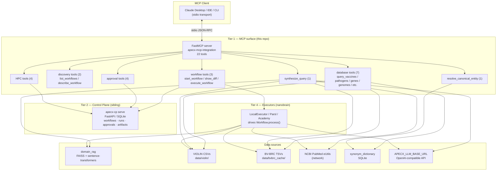
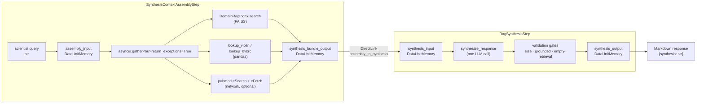
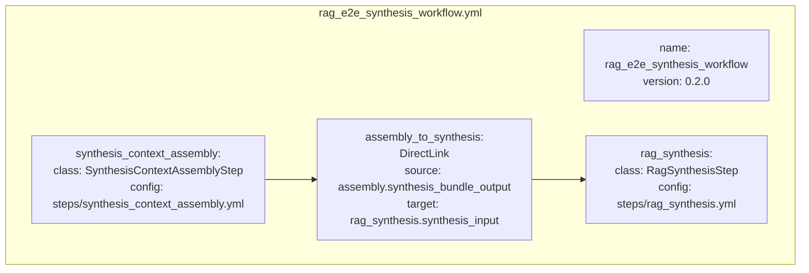
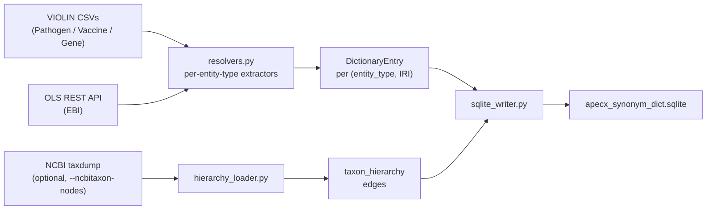
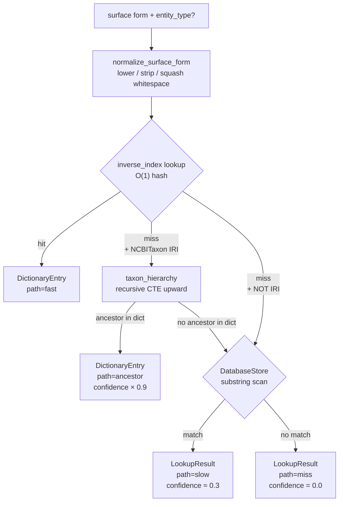
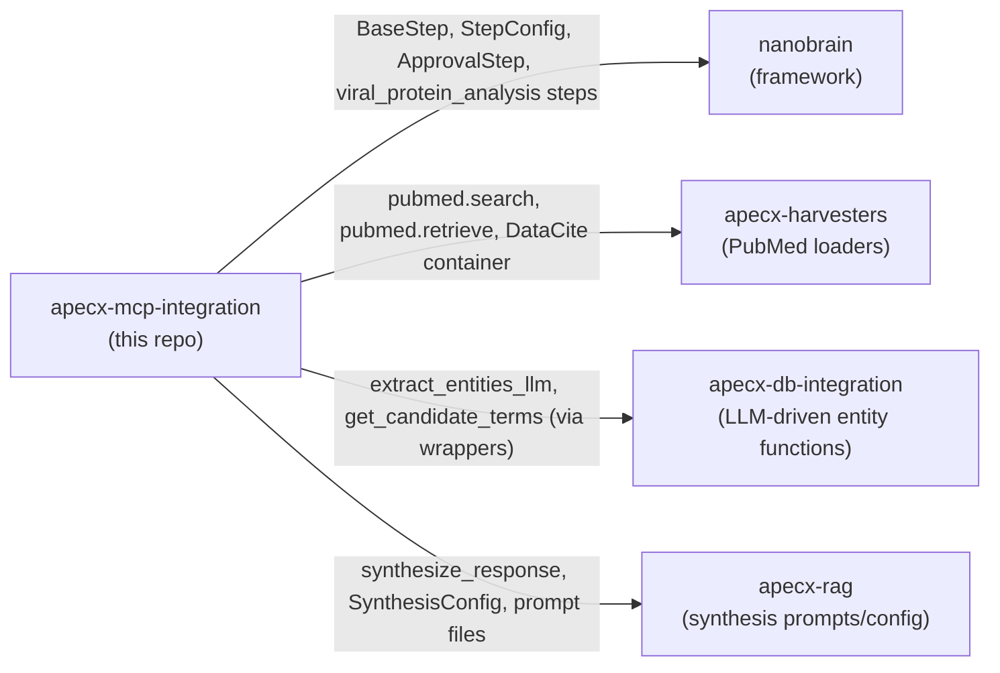
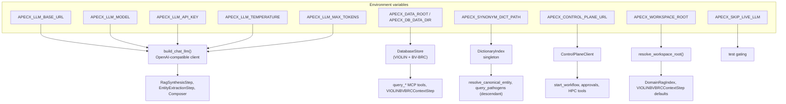

# APECx MCP Integration — End-to-End Architecture

This document is the canonical map of the apecx-mcp-integration system.
It covers the three runtime tiers (MCP surface, control plane, executor),
the synthesis pipeline, all 22 MCP tools, all six ontologies, the
mapping/resolution strategies, the test surface, and external service
dependencies.

Audience: a fresh engineer onboarding to the project, or an operator
deploying the system to a new environment. The text is structured to be
read top-down; Mermaid diagrams render in GitHub, GitLab, and most
Markdown viewers (including Claude Desktop's preview).

---

## 1. System purpose in one paragraph

APECx-MCP-integration takes free-text scientist questions about
viral pathogens, vaccines, genes, and genomes, and turns them into
**grounded Markdown answers with inline citations**. It does this by
fanning out across local FAISS-indexed knowledge (domain RAG),
local VIOLIN/BV-BRC tabular data (substring lookup), and live PubMed
publications, then driving one LLM call to weave the retrieved
evidence into a structured response. The system is exposed through
the Model Context Protocol (MCP) so it appears as a tool surface
inside Claude Desktop and any MCP-compatible client.

---

## 2. Three-tier runtime topology



**Key facts:**
- **Tier 1 (this repo)** ships 22 MCP tools registered via FastMCP.
  Source: `src/apecx_integration/mcp_surface/server.py:96-138` (verified
  count: 22 `server.tool()` calls).
- **Tier 2** is the control plane (`apecx-cp serve`, separate package).
  Auto-starts on first MCP startup unless `APECX_MCP_AUTOSTART_BACKEND=0`.
- **Tier 4** is the nanobrain executor that drives composed workflows
  through the trigger graph.
- **Tier 3** (HPC bundle export) is not a runtime component — it
  produces qsub-able artifacts for offline submission. Re-ingest
  happens via `ingest_hpc_bundle`.

---

## 3. Synthesis pipeline (the headline feature)

The synthesis pipeline answers a single scientist question by fanning
out across three retrieval sources, then producing a Markdown answer
with inline citations.

### 3.1 Data flow



**Bundle shape** (verified at
`src/apecx_integration/composition/steps/synthesis_context_assembly_step.py`):

```python
{
    "query":           str,           # the original question
    "rag_chunks":      list[dict],    # FAISS hits: id, text, score, source, metadata
    "bvbrc_genomes":   list[dict],    # genome_id, genome_name
    "violin_mappings": list[dict],    # synonym_id, canonical_term, query_term, entity_type, source
    "publications":    list[dict],    # doi, title, authors[], year, journal, pmid
}
```

### 3.2 Failure contract per branch

| Branch | What can fail | Effect | Where caught |
|---|---|---|---|
| Domain RAG | Missing FAISS index, corrupted bin file | `rag_chunks=[]`, WARNING logged | `asyncio.gather(return_exceptions=True)` in `synthesis_context_assembly_step.py:391` |
| VIOLIN/BV-BRC | Missing CSV, missing required column | both bundles `[]`, WARNING logged | same gather |
| PubMed | Network error, eUtils 5xx, timeout | `publications=[]`, WARNING logged | inner try/except in `_pubmed_harvest` + outer gather |
| Synthesis LLM | Endpoint down, model rejects request | `ValueError` raised | caller (synthesize_query MCP tool catches and returns `{"error": ...}`) |
| All branches empty | Synthesizer's `fail_on_empty_retrieval` gate | `ValueError` raised | synthesis_config.yml gate |

### 3.3 Three invocation paths

```mermaid
flowchart TB
    Q["scientist query"]

    subgraph "Path A — MCP tool (canonical)"
        TOOL["synthesize_query MCP tool<br/>tools/synthesis.py"]
        Q --> TOOL
        TOOL -- "module-level singleton<br/>(loaded once)" --> A1["assembly.process()"]
        A1 --> A2["synthesis.process()"]
        A2 --> A3["{synthesis: markdown}"]
    end

    subgraph "Path B — Workflow runtime"
        WF["Workflow.from_config(rag_e2e_synthesis_workflow.yml)"]
        Q --> WF
        WF -- "data-driven<br/>process(input)" --> B1["assembly_input.set()"]
        B1 -. "trigger cascade<br/>(async background)" .-> B2["assembly fires"]
        B2 -. "DirectLink<br/>auto-transfer" .-> B3["synthesis fires"]
        B3 -. "" .-> B4["{synthesis: markdown}"]
    end

    subgraph "Path C — Direct step instantiation (test code)"
        S1["BaseStep.from_config(assembly.yml)"]
        S2["BaseStep.from_config(synthesis.yml)"]
        Q --> S1 --> S2 --> C1["{synthesis: markdown}"]
    end
```

**Pick one:** Path A is the canonical operator path (one LLM call, no
composer overhead, cached steps). Path B is for the case where the
composer plans the synthesis as part of a larger workflow. Path C is
exclusive to test code.

---

## 4. The 22 MCP tools

Source: `src/apecx_integration/mcp_surface/server.py`. Every tool
returns either a result dict or `{"error": "..."}`; tools never raise
to the MCP transport.

### 4.1 Workflow tools (3)

| Tool | Purpose | Input | Backend |
|---|---|---|---|
| `start_workflow` | Compose a workflow from a natural-language description (T-COMP) | `description, user_id, preferred_executor` | Composer LLM + Control Plane |
| `show_diff` | Surface the differential-review payload (HITL approval prep) | `run_id` | Control Plane |
| `execute_workflow` | Run a composed workflow locally (synchronous) | `run_id` | LocalExecutor + Control Plane |

### 4.2 Discovery tools (2)

| Tool | Purpose | Input | Backend |
|---|---|---|---|
| `list_workflows` | Enumerate workflows the composer can build | none | Manifest YAML parse |
| `describe_workflow` | Per-component view of one workflow | `name` | Manifest YAML parse |

### 4.3 Database tools (7) — direct VIOLIN + BV-BRC lookup

| Tool | Purpose | Resolution | Backend |
|---|---|---|---|
| `query_vaccines` | Search VIOLIN vaccine DB (~3,500 rows) | dict fast → substring slow | DatabaseStore (pandas) |
| `query_pathogens` | Search VIOLIN pathogen DB (~220 rows) | dict fast → ancestor walk → strict descendant expansion | DatabaseStore + DictionaryIndex |
| `query_genes` | Search VIOLIN gene DB (~4,000 rows) | dict fast → substring slow | DatabaseStore |
| `query_bvbrc_genomes` | Search BV-BRC alphavirus genomes (~17,000 rows) | dict fast → substring slow | DatabaseStore |
| `get_vaccine_pathogen_genes` | Traverse VIOLIN junction tables | direct lookup | DatabaseStore |
| `resolve_entity` | Multi-table substring scan + dict lookup | dict + substring | DatabaseStore + DictionaryIndex |
| `database_statistics` | Row counts + columns for all loaded tables | none | DatabaseStore metadata |

### 4.4 Entity resolution + synthesis (2)

| Tool | Purpose | Output |
|---|---|---|
| `resolve_canonical_entity` | Stage 2 fast path: lookup → ancestor → slow → miss | `{path, canonical_iri, canonical_label, confidence, ...}` |
| `synthesize_query` | Drive the rag_e2e_synthesis pipeline directly | `{synthesis: markdown, retrieved: {counts}}` |

### 4.5 Approval tools (4) — HITL gate

| Tool | Purpose |
|---|---|
| `list_pending_approvals` | List pending HITL gates for a user |
| `approve` | Approve a gate |
| `reject` | Reject with required justification |
| `correct` | Approve with reviewer modifications |

### 4.6 HPC tools (4) — Polaris/Aurora bundle export

| Tool | Purpose |
|---|---|
| `estimate_cost` | Estimate core-hours for a composed run |
| `confirm_allocation` | Lock in operator-approved allocation |
| `export_hpc_bundle` | Write qsub-able bundle to disk (no submission) |
| `ingest_hpc_bundle` | Re-ingest provenance after offline run completes |

---

## 5. Synthesis pipeline components (deep view)

### 5.1 Step inventory

| Class | File | Purpose | I/O contract |
|---|---|---|---|
| `SynthesisContextAssemblyStep` | `composition/steps/synthesis_context_assembly_step.py` | Fan-in retrieval (3 branches concurrently) | in: `{query, entities?, query_terms?}` → out: bundle dict (5 keys) |
| `RagSynthesisStep` | `composition/steps/rag_synthesis_step.py` | One LLM call → Markdown with citations | in: bundle dict → out: `{synthesis: str}` |
| `DomainRagSearchStep` | `composition/steps/domain_rag_step.py` | FAISS semantic search over pre-built index | in: `{query}` → out: `{rag_chunks: [...]}` |
| `VIOLINBVBRCContextStep` | `composition/steps/violin_bvbrc_context_step.py` | Pure-pandas substring lookup | in: `{entities? \| query_terms?}` → out: `{violin_mappings, bvbrc_genomes}` |
| `PubMedHarvesterStep` | `composition/steps/pubmed_harvester_step.py` | NCBI eSearch + eFetch | in: `{query, entities?}` → out: `{publications: [...]}` |

### 5.2 Stateless utility modules (extracted 2026-05-05)

To avoid `object.__new__` shortcuts, two helper modules carry the
shared logic that both the step classes and `SynthesisContextAssemblyStep`
need:

| Module | Provides | Used by |
|---|---|---|
| `composition/steps/_violin_bvbrc_lookup.py` | `lookup_violin`, `lookup_bvbrc` | VIOLINBVBRCContextStep + SynthesisContextAssemblyStep |
| `composition/steps/_pubmed_helpers.py` | `build_term`, `entity_name`, `container_to_dict`, `harvest` | PubMedHarvesterStep + SynthesisContextAssemblyStep |

Both are pure functions; `owner_name` parameter flows into log
prefixes for caller correlation.

### 5.3 Workflow YAML (rag_e2e_synthesis)



**Loadability is pinned by:** `tests/integration/test_rag_e2e_workflow_yaml.py`
(6 tests: 5 static + 1 runtime). The runtime test drives the
framework-instantiated step instances via direct `process()` calls
because nanobrain's `Workflow.process(input)` is fire-and-forget
(populates the first input data unit and returns immediately;
the actual cascade runs in async background tasks).

---

## 6. Ontologies

Source: `src/apecx_integration/synonym_dictionary/enums.py`.

| Ontology | Code | IRI prefix | Hierarchy walk | Used by |
|---|---|---|---|---|
| **NCBITaxon** | `ncbitaxon` | `http://purl.obolibrary.org/obo/NCBITaxon_<id>` | ✅ ancestor + descendant CTEs | pathogen/genome lookup, `query_pathogens`, taxonomy expansion |
| **Vaccine Ontology (VO)** | `vo` | `http://purl.obolibrary.org/obo/VO_<id>` | ❌ flat | vaccine entity resolution, `query_vaccines` |
| **Disease Ontology (DOID)** | `doid` | `http://purl.obolibrary.org/obo/DOID_<id>` | reserved (no hierarchy load yet) | disease entity resolver |
| **Gene Ontology (GO)** | `go` | `http://purl.obolibrary.org/obo/GO_<id>` | reserved | gene/protein function annotation |
| **NCBI Gene** | `ncbigene` | `http://identifiers.org/ncbigene/<id>` (NOT OBO) | ❌ flat | gene entity resolver, `query_genes` |
| **APECx Local** | `apecx_local` | `http://apecx.local/...` | ❌ flat | lab strains, project-private entities (per analysis doc §4.9(3)) |

**Resolution-status taxonomy** (orthogonal to ontology source):

| Status | Confidence | Meaning |
|---|---|---|
| `id_anchored` | 1.0 | Source row carried an authoritative ID; synonyms fetched from OLS |
| `ols_exact` | ~0.9 | OLS exact-match search hit (label or synonym) |
| `ols_fuzzy` | <0.9 | OLS multi-match disambiguated by row context |
| `project_local` | varies | Project-private IRI (no external ontology mapping exists) |
| `unresolved` | 0.0 | No mapping; row stays in dictionary with `canonical_iri = None` (surfaces explicitly per §4.10) |

---

## 7. Mapping / resolution strategies

### 7.1 Stage 1 — dictionary build (offline, one-time per release)



Built by the `apecx-build-dictionary` CLI. The output SQLite carries:
- `dictionary_entries` — one row per `(entity_type, canonical_iri)`
- `synonym_synonyms_index` — inverse index `(entity_type, normalized) → IRI`
- `taxon_hierarchy` — parent/child edges for NCBITaxon (only when built with `--ncbitaxon-nodes`)
- `merged_taxons` — old→new ID redirect table for deprecated NCBITaxon IDs
- `ambiguous_surface_forms` — when two IRIs share a normalized form, the loser is recorded here

### 7.2 Stage 2 — runtime lookup (every query)



**Special case — descendant expansion (NCBITaxon only):**

`query_pathogens` calls `lookup_descendant_taxon_ids(iri)` after a fast
or ancestor hit. A family-level IRI like Coronaviridae expands to its
~20+ species; a species-level IRI like SARS-CoV-2 expands to itself
plus any strain-level children. The pandas filter then matches by
`NCBI_Taxonomy_ID.isin(expanded_set)`.

| Query | IRI resolved | Descendant expansion | Filter set |
|---|---|---|---|
| `"Coronaviridae"` | `NCBITaxon_11118` (family) | walks down 4 levels | ~20+ species |
| `"covid-19"` | `NCBITaxon_2697049` (species) | empty (leaf) | just `[2697049]` |
| `"SARS-CoV-2 strain X"` | `NCBITaxon_2697049` (via ancestor walk from strain) | `[2697049]` | just SARS-CoV-2 |

This is the **strict hierarchy contract** (user directive 2026-05-05).

---

## 8. External services + data dependencies

### 8.1 Required at runtime

| Service | What it provides | How to configure | Failure mode |
|---|---|---|---|
| **APECX_LLM_BASE_URL** | LLM completion (synthesis, composition, entity extraction) | env var; default `http://localhost:11434/v1` (Ollama) | Synthesis raises ValueError → MCP returns `{"error": ...}` |
| **NCBI eUtils** (network) | PubMed eSearch + eFetch | hard-coded `https://eutils.ncbi.nlm.nih.gov/entrez/eutils/`; rate-limit 3/s | Branch returns `[]`, WARNING logged |
| **Control Plane** | workflow + approval + HPC state | `APECX_CONTROL_PLANE_URL` env var (default `http://localhost:8000`); auto-starts on first MCP call | Server exits(2) with remediation hint if unreachable |

### 8.2 Required offline data

| Asset | Where | Builder | Resolution order |
|---|---|---|---|
| Domain RAG FAISS index | `<workspace>/data/apecx_domain_rag/{faiss_index.bin, metadata.json}` | `scripts/build_domain_rag_index.py` | YAML override → workspace default |
| VIOLIN CSVs | `<workspace>/data/violin/Pathogen_Information.csv` etc. | `apecx-setup` (downloads from private repo) | YAML → APECX_DB_DATA_DIR → APECX_WORKSPACE_ROOT |
| BV-BRC TSV | `<workspace>/data/bvbrc_cache/alphavirus_genomes.tsv` | bundled with `apecx-setup` | YAML → APECX_WORKSPACE_ROOT |
| Synonym dictionary | `APECX_SYNONYM_DICT_PATH` (no default) | `apecx-build-dictionary` | env var only; missing → fast path disabled |

`<workspace>` resolves via `apecx_integration._workspace.resolve_workspace_root`
in this order: `APECX_WORKSPACE_ROOT` env var → marker-walk for
`apecx-mcp-integration/` + `nanobrain/_workspace_notes/data` siblings →
`Path(__file__).parents[N]` fallback for the standard checkout.

### 8.3 Cross-repo dependencies



All sibling repos must be `pip install -e ../<repo>`'d into the project venv.

---

## 9. Composer catalog — workflows the LLM can build

The composer (T-COMP) reads `composition/composer_config.yml`'s
`component_catalog_paths` list. Two manifests are registered:

### 9.1 `workflows/violin_bvbrc/manifest.yml` — VIOLIN × BV-BRC synonym gate

13 components (1 deferred). The full HARD-synonym workflow plus the
four Day-2 retrieval/synthesis steps. Verbatim from the manifest:

| Step ID | Step | Disposition | Status |
|---|---|---|---|
| 1 | entity_extraction | wrap | ready |
| 2 | bvbrc_snapshot_match | wrap | ready |
| 3a | synonym_cache_lookup | new | ready |
| 3b | synonym_fuzzy_match | deferred | per HARD-synonym 2026-04-21 |
| 3c | synonym_llm_proposals | wrap | ready |
| 4 | synonym_approval_gate | new | ready |
| 4p | verified_synonym_writeback | new | ready |
| 5 | violin_entity_lookup | wrap | ready |
| 6 | genomic_annotation | wrap | ready |
| 7 | result_ranking | reuse | ready |
| 8a | domain_rag_search | new | ready |
| 8b | violin_bvbrc_context | new | ready |
| 8c | pubmed_harvester | new | ready |
| 8d | rag_synthesis | new | ready |

### 9.2 `workflows/rag_e2e_synthesis/manifest.yml` — pure synthesis

| Step ID | Step | Status |
|---|---|---|
| A1 | synthesis_context_assembly | ready |
| A2 | rag_synthesis | ready |

The `system.md` composer prompt explicitly tells the LLM: prefer the
`SynthesisContextAssemblyStep` fan-in over wiring three retrieval
steps directly into `RagSynthesisStep` (its input data unit
expects a single pre-assembled bundle).

---

## 10. Test surface

### 10.1 Counts (verified 2026-05-05)

| Suite | Files | Tests | Notes |
|---|---|---|---|
| `tests/unit/` | 36 | **478** | All run against pure pandas / SQLite / mocks; no external services |
| `tests/integration/` | 152 | **2,096** | Many gated on env vars (Ollama, control plane, GitHub); auto-skip when absent |

Full unit run: ~13s. Integration including Ollama subset: ~3 min when
Ollama is reachable.

### 10.2 Synthesis-pipeline-specific test coverage

| File | Tests | What it covers |
|---|---|---|
| `tests/unit/test_synthesis_assembly_branch_failures.py` | 6 | Per-branch failure → empty bundle (gather degradation) |
| `tests/unit/test_synthesize_query_tool.py` | 7 | MCP tool input validation, load-error caching, gate marshaling, skip_pubmed restoration |
| `tests/unit/test_violin_bvbrc_lookup_helpers.py` | 12 | Stateless lookup utility — substring match, vaccine override, missing files, dedupe |
| `tests/unit/test_pubmed_helpers.py` | 26 | Stateless PubMed helpers — entity_name, build_term, container_to_dict, 25-author cap |
| `tests/unit/test_workspace_root_resolver.py` | 6 | Env var override > marker walk > parents[N] fallback |
| `tests/unit/test_descendant_traversal.py` | 9 | Strict NCBITaxon hierarchy expansion |
| `tests/integration/test_rag_e2e_workflow_yaml.py` | 6 | 5 static loadability tests + 1 runtime test driving framework-instantiated steps |
| `tests/integration/test_rag_e2e_pipeline.py` | 25 | E2E with real Ollama, real FAISS, real CSVs (gated; auto-skip) |
| `tests/integration/test_violin_bvbrc_workflow_yaml.py` | 8 | Loadability of the violin_bvbrc workflow + each step YAML |

### 10.3 Test gating

- `pytest.importorskip("sentence_transformers")` (BEFORE faiss — load-bearing on macOS ARM)
- `_ollama_reachable()` — checks `http://localhost:11434/api/tags`
- `(DOMAIN_RAG_INDEX / "faiss_index.bin").exists()` — auto-skips when not built
- `(VIOLIN_DIR / "Pathogen_Information.csv").exists()` — auto-skips when not provisioned
- `APECX_SKIP_LIVE_LLM=1` — operator-side opt-out

---

## 11. Configuration flow



---

## 12. Ten things that will surprise you (brutal-truth section)

1. **`Workflow.process(input_data)` is fire-and-forget.** It writes
   to the first step's input data unit and returns
   `{"status": "data_flow_initiated", ...}`. The actual trigger
   cascade runs in background tasks the caller can't await. If you
   want synchronous workflow execution, drive the steps directly via
   `process()` like `synthesize_query` does, or set
   `divergence_enabled: true` on the workflow YAML.

2. **`BaseStep.execute()` takes only kwargs.** `wf.execute(input)`
   raises `TypeError`. The data-driven entry point is `process(input)`.

3. **The FAISS / sentence-transformers import order is load-bearing.**
   `sentence_transformers` MUST import before `faiss` on macOS ARM
   or you get a silent segfault. There's a `# ruff: noqa: I001, E402`
   directive at the top of `domain_rag/index.py` to prevent auto-sort.

4. **`object.__new__(StepClass)` was the prior shortcut for sharing
   logic between steps.** As of 2026-05-05 it's gone — replaced by
   stateless utility modules (`_violin_bvbrc_lookup`, `_pubmed_helpers`).

5. **Synthesis branch failures degrade gracefully but the all-empty
   case still raises.** A single corrupt FAISS or PubMed 5xx → empty
   slot in the bundle. ALL three retrieval branches empty → the
   synthesizer's `fail_on_empty_retrieval` gate fires `ValueError`.

6. **The composer is not on the synthesize_query path.** The
   `synthesize_query` MCP tool drives the rag_e2e_synthesis workflow
   directly via `from_config + process()`. No LLM-driven workflow
   composition. Use `start_workflow` when the operator wants
   composer-planned multi-step workflows.

7. **`extra='forbid'` is mandatory on every step config.** YAML typos
   in step configs would otherwise be silently dropped. The workspace
   rule is enforced; auditors check for this on every PR.

8. **Path resolution honors `APECX_WORKSPACE_ROOT` first.** If the
   env var is set, marker-walk + `parents[5]` fallback are skipped.
   Use this in non-standard checkout layouts (vendored, monorepo,
   container).

9. **The slow path does NOT use the synonym dictionary.** It scans
   the DatabaseStore (VIOLIN + BV-BRC pandas frames) for substring
   matches. Confidence ≈ 0.3. Only used as last resort.

10. **`_workspace_notes/` is a separate sibling repo.** Friction logs
    and dev-history docs live there, NOT in this repo. Workspace
    rules are documented in `../CLAUDE.md` (also outside this repo).

---

## 13. References

| Topic | File |
|---|---|
| Workspace policy | `../CLAUDE.md` (workspace root, not in this repo) |
| Repo policy | `CLAUDE.md` (this repo) |
| MCP setup for Claude Desktop | `docs/mcp_integration.md` |
| MCP surface reference | `docs/mcp_surface.md` |
| Operator quickstart | `docs/QUICKSTART.md` |
| Tutorial (4 chapters) | `docs/tutorial/` |
| VIOLIN × BV-BRC workflow | `docs/violin_bvbrc_workflow.md` |
| Composer task spec | `../_workspace_notes/.../composer_task_spec.md` |
| Synonym dictionary contract | `../_workspace_notes/.../synonym_dictionary_contract.md` |
| Friction log (recurring time-sinks) | `../_workspace_notes/.../session_friction_log.md` |
