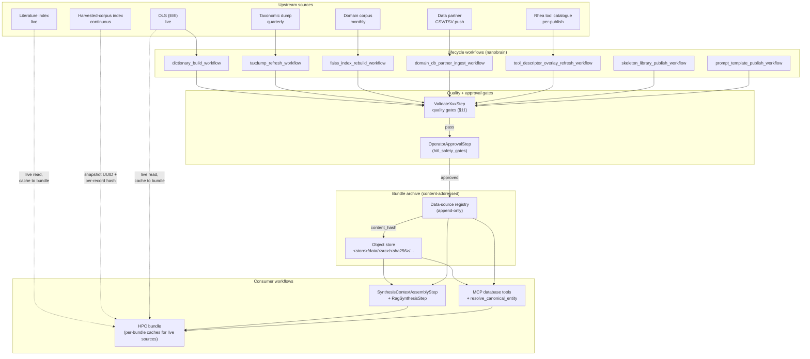

# APECx Data Layer Evolution

**Status:** Design / pre-implementation
**Audience:** Data-plane operators, workflow authors, framework reviewers
**Supplements:** `architecture.md §7 + §8 + §14` · `multiagent_architecture.md §9` · `hpc_reproducibility_spec.md §6 + §10` · `nanobrain_alignment_audit.md §3.8 (C-55)`
**Read first:** `hpc_reproducibility_spec.md` (the reproducibility tiers R1/R2/R3 are the unit of analysis throughout)

---

## 1. Why this document exists

Today the data layer is described in three places and unified nowhere:

- `architecture.md §7 + §8 + §14` describes the *current* artifacts, where they
  live on disk, and which user-facing branches consume them.
- `multiagent_architecture.md §9` sketches the *target* — a Globus-backed data
  access layer behind a `DataAccessInterface` abstraction.
- `CLAUDE.md` plus the `dictionary_build_workflow` YAML carry the build
  instructions for the synonym dictionary and the FAISS index.

None of those documents states the lifecycle contract. None of them says
"a FAISS rebuild is itself a nanobrain workflow whose output is a content-hashed
artifact published to the bundle archive, and any run that consumed the prior
hash continues to use the prior hash until a deliberate consumer-side update."
That contract is what this document writes down.

The gap matters because the data layer is the dependency that breaks
reproducibility silently. Per `hpc_reproducibility_spec.md §6`, R2 means
"deterministic given identical inputs." A FAISS index rebuild changes embedding
vectors. An Ontology Lookup Service sync changes synonym dictionary contents.
A continuous Globus Search harvest adds rows that did not exist when the
previous bundle was exported. None of those refreshes is malicious; each is
routine. Each is also a structural R2/R3 violation if the consumer is not
explicitly pinned to the prior version.

Three concrete failure shapes motivate this document:

1. **Silent embedding drift.** A monthly FAISS rebuild produces a new
   `faiss_index.bin`. The prior bundle's `embedding_index_hash` no longer
   resolves to a retrievable artifact. Replay either fails (artifact missing)
   or — worse — silently uses the new index and produces different top-K
   results that the operator misreads as "still reproducible enough."
2. **Synonym dictionary regression.** OLS publishes a deprecated-IRI redirect
   that the dictionary builder absorbs without re-running its accuracy floors.
   The next workflow run resolves a query through the new redirect and returns
   a different result for what the user perceives as the same question.
3. **Continuous harvest non-stationarity.** The Globus Search index is
   continuously updated by `apecx-harvesters`. Two runs of the same query
   thirty minutes apart return different result sets. There is no "version" to
   pin against unless the data layer publishes one.

This document specifies, for every data source the system depends on:

- **What it is** (type, owner, refresh cadence).
- **How its content is hashed** for the manifest.
- **The lifecycle workflow that produces or refreshes it.**
- **The version policy the consumer uses to pin it.**
- **The snapshot policy for archival** and the retention period.
- **The schema-evolution rule** for additive vs. structural change.
- **The maximum reproducibility tier** the source can support.
- **The failure modes** and their detection signals.

Per `nanobrain_alignment_audit.md §3.8 C-55`, every lifecycle workflow listed
here is itself a nanobrain workflow built from the same primitives the
user-facing pipelines use. There is no second framework for "data ops."
There is one framework, and the data ops are workflows in it.

---

## 2. Data source inventory

Every load-bearing artifact and live service the system depends on, in one
table. The "tier impact" column states the worst-case reproducibility tier
this source can pull a workflow down to if it is not properly pinned and
snapshotted.

| # | Source | Type | Cadence | Owner | Tier impact |
|---|---|---|---|---|---|
| D-1 | Domain RAG FAISS index | binary index + metadata.json | monthly rebuild | apecx-mcp-integration | R2 with hash pin; R3 if rebuilt mid-run |
| D-2 | Synonym dictionary (`apecx_synonym_dict.sqlite`) | SQLite | per-OLS-sync (≈monthly) | apecx-mcp-integration (long-term: apecx-harvesters sink) | R2 with hash pin |
| D-3 | NCBI taxdump (or generic taxonomic hierarchy dump) | tar.gz feeding `taxon_hierarchy` rows | quarterly | apecx-mcp-integration | R2 with hash pin |
| D-4 | Local domain-database CSVs (Pathogen / Vaccine / Gene / Mapping) | CSV files | partner-driven (irregular) | external data partner | R2 per-file hash |
| D-5 | Local genomics-database TSVs | TSV files | partner-driven (irregular) | external data partner | R2 per-file hash |
| D-6 | PubMed eUtils (live literature index) | live REST | continuous (live) | external (NCBI) | R2 only via per-bundle cache; R3 if live at replay |
| D-7 | Globus Search index (harvested corpus) | Globus index UUID | continuous harvest | apecx-harvesters | R2 via snapshot UUID + per-record hash; R3 otherwise |
| D-8 | Tool descriptor catalogue (UTD overlays) | YAML/JSON descriptors | per-Rhea-publish + per-APECx-overlay | Rhea (upstream) + apecx-mcp (overlay) | R2 with `descriptor_hash` pin |
| D-9 | Ontology Lookup Service (EBI) | live REST (read-through) | live | external (EBI) | R2 only via cached resolution map; R3 if live at replay |
| D-10 | Skeleton library | versioned YAML library | per-release | apecx-mcp-integration | R2 with `skeleton_id@<sha256>` pin |
| D-11 | LLM model weights | on-disk model artefacts | per-Ollama-pull | external + operator | R2 if endpoint exposes weight digest; R3 otherwise |
| D-12 | Prompt templates | versioned text + few-shot bundles | per-template-revision | apecx-mcp-integration | R2 with content hash |
| D-13 | Workflow YAMLs (skeleton-lowered output) | YAML per run | per-workflow-build | apecx-mcp-integration | R2 (snapshot in bundle) |
| D-14 | Container image (deterministic environment) | OCI image | per-rebuild | apecx-mcp-integration | R2 via `container_image_digest` |

D-13 and D-14 are not "external" data sources, but they are part of the data
layer in the broadest sense — every R2 replay needs them in the bundle.
They are listed here so that nothing required for replay is missing from the
inventory.

**Refresh trigger summary.** D-1 / D-2 / D-3 are scheduled. D-4 / D-5 are
partner-push (an external data partner sends an updated CSV/TSV; we ingest).
D-6 / D-9 are read-through with caching. D-7 is continuously updated by an
out-of-process harvester. D-8 / D-10 / D-12 are version-controlled releases.
D-11 is operator-pulled per Ollama tag. D-13 / D-14 are produced as a
side-effect of a build / export workflow.

**Owner discipline.** "Owner" here is who runs the lifecycle workflow that
publishes a new version, not who curates the upstream content. The synonym
dictionary's owner is apecx-mcp-integration today; the long-term migration
target (per `architecture.md §14.1`) is the apecx-harvesters sink.
Cross-reference `multiagent_architecture.md §9` for the analogous Spherical →
Globus migration.

---

## 3. Reproducibility primitive — content hashing for every source

Per `hpc_reproducibility_spec.md §6`, the reproducibility tier of a workflow is
a function of which sources it consumed and whether each was content-pinned.
The pin mechanism for every source in the inventory:

| Source | Hash mechanism | Where pinned in the manifest |
|---|---|---|
| FAISS index (D-1) | SHA-256 of `faiss_index.bin` concatenated with SHA-256 of `metadata.json` | `manifest.embedding_index_hash` |
| Synonym dictionary (D-2) | SHA-256 of `apecx_synonym_dict.sqlite` (read-only, fsync'd, then hashed) | `manifest.synonym_dictionary_hash` |
| Taxdump (D-3) | SHA-256 of the canonical tar.gz, plus SHA-256 of the post-load `taxon_hierarchy` table dump | `manifest.taxonomy_dump_hash` + `manifest.taxon_hierarchy_hash` |
| Local domain-DB CSV (D-4) | SHA-256 per file | `manifest.data_sources[name=<file>].content_hash` |
| Local genomics-DB TSV (D-5) | SHA-256 per file | `manifest.data_sources[name=<file>].content_hash` |
| PubMed live cache (D-6) | SHA-256 per cached eFetch response file under `data_snapshots/pubmed/<query_hash>.json` | `manifest.data_sources[name=pubmed].cache_entries[].content_hash` |
| Globus Search index (D-7) | snapshot UUID + last-updated ISO timestamp + SHA-256 over the canonical-JSON-serialised result set, plus per-record hash for every row consumed | `manifest.data_sources[name=globus_search].snapshot_uuid` + `.snapshot_timestamp` + `.records[].content_hash` |
| Tool descriptor (D-8) | SHA-256 of canonical-JSON of the UTD body | `manifest.tool_descriptors[].descriptor_hash` (per `tool_descriptor_contract.md §10`) |
| OLS read-through (D-9) | SHA-256 over the cached `(query, response)` pair | `manifest.data_sources[name=ols].cache_entries[].content_hash` |
| Skeleton (D-10) | `skeleton_id@<sha256>` of the canonical skeleton YAML body | `manifest.skeleton_id` + `manifest.skeleton_hash` (per `nanobrain_capability_gaps.md G9`) |
| LLM model weights (D-11) | weight digest if endpoint exposes it (Ollama: BLAKE3 from `/api/show`) | `manifest.llm_pins[].model_digest` |
| Prompt template (D-12) | SHA-256 of canonical text + few-shot bundle hash | `manifest.prompt_pins[].template_hash` (per `nanobrain_capability_gaps.md G14`) |
| Workflow YAML (D-13) | SHA-256 of the lowered workflow YAML | `manifest.workflow_yaml_hash` |
| Container image (D-14) | OCI manifest digest (`sha256:...`) | `manifest.container_image_digest` |

**Canonical hashing convention.** Every hash uses SHA-256 over a canonical byte
representation: for binaries, the file as-is; for SQLite, the file after
`PRAGMA wal_checkpoint(TRUNCATE)` and `VACUUM` (no journaling artefacts in the
hash); for JSON, RFC 8785 (JSON Canonicalization Scheme); for YAML, the
canonical-JSON projection produced by `nanobrain.config.canonicalize`. The
purpose of the canonical projection is to make the hash insensitive to
formatting noise (trailing whitespace, key ordering, line endings) while
remaining sensitive to every byte that affects component behaviour.

**Where the hash is computed.** At publish time, by the lifecycle workflow's
final `publish` step. The hash and the artefact URI are written to the
data-source registry (apecx-mcp; see §13) atomically — the registry never
records a URI without a hash, and never records a hash whose artefact is
unreachable.

---

## 4. Lifecycle workflows — every refresh IS a nanobrain workflow

Per `nanobrain_alignment_audit.md §3.8 C-55`, the data-layer ops are themselves
nanobrain workflows. They use the same `BaseStep` / `Workflow` / `DirectLink` /
`DataUnit` primitives the user-facing pipelines use. There is no second
framework. The catalogue:

| Workflow | Steps (sketch) | Cadence | Output |
|---|---|---|---|
| `faiss_index_rebuild_workflow.yml` | `FetchCorpusStep` → `EmbedCorpusStep` → `BuildFaissIndexStep` → `ValidateGoldenQueriesStep` → `PublishArtifactStep` → `SnapshotToArchiveStep` | monthly | versioned FAISS index + metadata.json |
| `synonym_dictionary_build_workflow.yml` (existing) | `TaxdumpFetchStep` → `DictionaryBuildStep` → `ValidateAccuracyFloorsStep` → `PublishArtifactStep` → `SnapshotToArchiveStep` | per-OLS-sync | versioned `synonym_dict.sqlite` |
| `taxdump_refresh_workflow.yml` | `FetchTaxdumpStep` → `ParseTaxonHierarchyStep` → `BuildHierarchyTableStep` → `ValidateRowCountStep` → `PublishArtifactStep` | quarterly | versioned `taxon_hierarchy` table dump |
| `globus_index_harvest_workflow.yml` (lives in apecx-harvesters; we are read-only consumer) | (out of scope here; we consume the published index) | continuous | new records in Globus index |
| `tool_descriptor_overlay_refresh_workflow.yml` | `FetchRheaCatalogStep` → `BuildAPECxOverlayStep` → `ValidateDescriptorSchemaStep` → `PublishArtifactStep` | per-Rhea-publish | versioned tool descriptor catalogue |
| `skeleton_library_publish_workflow.yml` | `LoadSkeletonsStep` → `MetaWorkflowDryRunGates1To4Step` (per `meta_workflow_orchestration.md`) → `PublishArtifactStep` | per-release | versioned skeleton library |
| `prompt_template_publish_workflow.yml` | `LoadTemplatesStep` → `RegressionTestStep` (per `llm_prompt_contracts.md`) → `PublishArtifactStep` | per-template-revision | versioned prompt templates |
| `domain_db_partner_ingest_workflow.yml` | `IngestPartnerCSVStep` → `ValidateSchemaStep` → `RowCountDeltaCheckStep` → `OperatorApprovalStep` → `PublishArtifactStep` → `SnapshotToArchiveStep` | partner-push | versioned DomainDB CSV set |

Every workflow's `PublishArtifactStep` does three things:

1. Compute the canonical content hash (per §3) of the output artefact.
2. Write the artefact to the bundle archive (per §6) at a content-addressed
   path.
3. Append a new entry to the data-source registry: `(source_name, version,
   content_hash, archive_uri, published_at, gate_results)`.

Every workflow's `SnapshotToArchiveStep` is a no-op when the publish step has
already written to the archive. It exists as a distinct step so that future
workflows can publish to a fast cache and snapshot to cold storage on a
different schedule.

**`OperatorApprovalStep`** is `nanobrain.ApprovalStep` (per
`nanobrain_alignment_audit.md §4.3 U-3`) wired into the partner-ingest
workflow. The operator's approval is the gate that promotes the new artefact
to the registry's "default" pointer; without approval, the new version is
published-but-not-default. See `hitl_safety_gates.md` for the gate contract.

**Workflow shape consistency.** Every lifecycle workflow ends in the same
two-step tail: validate → publish → (optional snapshot). This is deliberate.
A reviewer reading any data-layer YAML can check the tail in five seconds and
know whether the workflow conforms.

---

## 5. Versioning policy per source

A version is a string the consumer uses to pin. Two pieces are conventionally
glued: a human-readable handle and a content hash. The handle moves with each
publish; the hash is the immutable identity.

| Source | Version format | Consumer pinning |
|---|---|---|
| FAISS index (D-1) | `faiss_index@<YYYYMMDD>-<sha256[:8]>` | consumer pins by full `<sha256>` (handle is a convenience label) |
| Synonym dictionary (D-2) | `synonyms@<YYYYMMDD>-<sha256[:8]>` | full `<sha256>` |
| Taxdump (D-3) | `taxdump@<YYYY-Qn>-<sha256[:8]>` | full `<sha256>` |
| Local domain-DB CSVs (D-4) | per-file `<filename>@<YYYYMMDD>-<sha256[:8]>` | per-file `<sha256>` |
| Local genomics-DB TSVs (D-5) | per-file `<filename>@<YYYYMMDD>-<sha256[:8]>` | per-file `<sha256>` |
| PubMed cache (D-6) | per-bundle (no global version) | per-`query_hash` cache entry hash |
| Globus Search (D-7) | `globus@<snapshot_uuid>-<timestamp>` | snapshot UUID + per-record hash |
| Tool descriptor (D-8) | `<tool_id>@<semver>+<sha256[:8]>` | `descriptor_hash` |
| OLS (D-9) | per-bundle (no global version) | per-`(query, type)` cache entry hash |
| Skeleton (D-10) | `<skeleton_id>@<semver>+<sha256[:8]>` | `<skeleton_id>@<sha256>` |
| LLM model (D-11) | `<model_name>:<tag>@<weight_digest>` | `<weight_digest>` (tag is mutable) |
| Prompt template (D-12) | `<template_id>@<semver>+<sha256[:8]>` | full `<sha256>` |
| Workflow YAML (D-13) | per-bundle (one YAML per run) | `workflow_yaml_hash` |
| Container image (D-14) | `<registry>/<repo>:<tag>@sha256:<digest>` | `<digest>` (tag is mutable) |

**Semver versus content hash.** Semver is operator-facing; it communicates
intent ("this is a backwards-compatible refresh"). Content hash is
machine-facing; it communicates identity ("this is exactly these bytes").
Consumers SHOULD pin by content hash, MAY display semver to humans.
A bundle's manifest records both, but `apecx-bundle verify` only consults
the content hash. This is the same discipline `hpc_reproducibility_spec.md §6`
applies to container tags ("not by tag — tags are mutable") generalised to
every artefact in the data layer.

**Immutable handles for the registry's "current" pointer.** The registry
exposes `latest(source)` for convenience but workflows MUST NOT pin by
`latest` at run time. `latest` is for ad-hoc operator queries, not for
reproducible runs. A workflow YAML that resolves a source by `latest` cannot
be replayed — the YAML itself is non-deterministic.

---

## 6. Snapshot policy — what's archived, where, for how long

Per `hpc_reproducibility_spec.md §10`, bundles live in
`APECX_BUNDLE_DIR` locally or `APECX_BUNDLE_STORE_URL` (S3-compatible) in
production. The data-layer archive sits next to the bundle archive, sharing
the same storage backend. Every artefact published by a lifecycle workflow
is written once and never mutated.

| Source | Snapshot location | Retention |
|---|---|---|
| FAISS index (D-1) | `<store>/data/faiss/<sha256>/{faiss_index.bin,metadata.json}` | 18 months from last bundle reference; unbounded for runs marked R1 (none expected) |
| Synonym dictionary (D-2) | `<store>/data/synonyms/<sha256>/synonym_dict.sqlite` | 18 months from last bundle reference |
| Taxdump (D-3) | `<store>/data/taxonomy/<sha256>/{taxdump.tar.gz,taxon_hierarchy.parquet}` | 18 months |
| Local DB CSV/TSV (D-4 / D-5) | `<store>/data/<dataset_id>/<sha256>/<filename>` | 18 months |
| PubMed cache (D-6) | inside the bundle: `bundle/data_snapshots/pubmed/<query_hash>.json` | follows bundle retention (per §10.3 of the reproducibility spec) |
| Globus Search records (D-7) | inside the bundle: `bundle/data_snapshots/globus/<query_hash>.jsonl` | follows bundle retention |
| Tool descriptor (D-8) | `<store>/data/tool_descriptors/<sha256>/descriptor.json` | indefinite (small) |
| OLS cache (D-9) | inside the bundle: `bundle/data_snapshots/ols/<query_hash>.json` | follows bundle retention |
| Skeleton (D-10) | `<store>/data/skeletons/<sha256>/skeleton.yml` | indefinite (small) |
| LLM model (D-11) | NOT archived — digest pin is sufficient (model is publicly addressable) | n/a |
| Prompt template (D-12) | `<store>/data/prompts/<sha256>/template.md` | indefinite (small) |
| Workflow YAML (D-13) | inside the bundle: `bundle/workflow.yml` | follows bundle retention |
| Container image (D-14) | external OCI registry, addressed by digest | external policy |

**The archive is the source of truth for replay.** Cross-reference
`hpc_reproducibility_spec.md §7 step 3` ("restore data snapshots"): the replay
protocol downloads each entry in `manifest.data_sources` to
`data_snapshots/<name>` and verifies `content_hash` before any step runs.
If the artefact is no longer in the archive, the replay fails closed.

**Why per-bundle for D-6 / D-7 / D-9 and registry-wide for D-1 / D-2 / D-3.**
The live sources (PubMed, OLS) and the continuously-updated source (Globus)
are not naturally versioned, so the bundle carries its own snapshot. The
artefact sources (FAISS, synonyms, taxdump) are versioned by publish, so the
archive holds one copy per published version and bundles reference by hash.

**Why D-11 is not archived.** LLM model weights are large (gigabytes),
publicly addressable by digest, and the cost of re-pulling at replay time is
small. The bundle pins the digest; the replay protocol pulls the model. The
exception (Q4 in `hpc_reproducibility_spec.md §12`) is when an Ollama model
was pulled locally and never published to a registry — in that case replay
fails closed; we do not silently substitute.

**Operator-driven garbage collection.** A nightly `archive_gc_workflow.yml`
walks the data-source registry, computes the set of artefacts referenced by
any retained bundle (from §10.3 of the reproducibility spec), and deletes
artefacts not in that set whose `last_referenced_at` exceeds 18 months.
Deletion is two-phase: mark as "tombstoned" (read-only, hidden from `latest`)
for 30 days, then physically delete. Tombstone resurrection is a single
operator command.

---

## 7. Schema evolution

A source's schema can change. The general rule:

> **Additive changes are non-breaking. Structural changes bump major version.
> Consumers explicitly pin or explicitly opt-in to the new version.**

Per source, the concrete shape of "additive" and "structural":

**Local domain-DB CSV adds a column.** Additive. Consumers tolerate the new
column via Pydantic `extra: ignore` on the legacy parser. A new parser
handles the new column. Both versions of the parser can coexist for one
release cycle. Cross-reference workspace policy: every BaseModel sets
`extra='forbid'` (per the user-memory rule), but the *file-loaded* row models
are explicitly permitted to use `extra='ignore'` because the data partner
controls the file shape and the consumer cannot predict every column. The
distinction is documented in the row-model class docstring.

**Local domain-DB CSV removes a column.** Structural. Old workflows pinned
to the old hash continue to work. New workflows must update their row model
to remove the field; failure to update is FAIL-FAST at workflow init.

**Synonym dictionary adds a status enum value.** Structural for consumers
that branch on the enum. Consumers MUST handle the new value or raise
FAIL-FAST. The dictionary's publish gate (per §4) verifies that every
known consumer's enum-handling code recognises the new value before
allowing publish.

**Synonym dictionary adds a new entity type.** Additive. Consumers that do
not query the new type are unaffected. Consumers that do query the new type
opt-in by pinning to the new hash.

**FAISS index changes embedding dimensionality.** Structural and breaking.
The new `embedding_index_hash` invalidates every cached embedding. Consumers
MUST rebuild their query embeddings against the new index (no silent
fallback — the framework rejects a dimensionality mismatch at index load).
The publish workflow's `ValidateGoldenQueriesStep` MUST re-run the entire
golden-query suite against the new index before allowing publish.

**Prompt template output schema changes.** Structural. Major version bump.
Old workflows pin the old version; replay still works because the bundle
captures the prompt body by hash. New workflows opt-in to the new version
when their downstream parsing is updated. Cross-reference
`llm_prompt_contracts.md` for the regression-test discipline.

**UTD schema changes (per `nanobrain_capability_gaps.md G15`).** Structural.
The bundle's frozen `descriptor_hash` ensures old runs still validate
against the descriptor body that existed at export time. New runs use the
new schema; the framework's UTD loader is multi-version aware.

**Globus Search index adds a new field on records.** Additive. Consumers
that do not project the new field are unaffected. Consumers that need the
new field opt-in by re-issuing the query against the new snapshot.

**Globus Search index changes a record's content (re-publication).**
Structural at the record level. The per-record content hash captured in the
bundle (per §3) tells `apecx-bundle verify` that the record changed.
Replay flags the change; the operator decides whether to accept the new
content (downgrade tier to R3 with explanation) or fail the replay.

**Tool descriptor catalogue adds a tool.** Additive. Consumers that did not
reference the new tool are unaffected. Consumers that want the new tool pin
to the new catalogue version.

**Tool descriptor catalogue changes a tool's input shape.** Structural for
that tool. Old runs continue to use the old `descriptor_hash`. New runs
opt-in by pinning the new `descriptor_hash`.

The cross-cutting rule, restated: structural change requires a major bump,
and consumers either keep the old pin or explicitly upgrade. The data-layer
publish workflow never silently overwrites in place. Mutation-in-place is the
single largest source of silent reproducibility failures and is not allowed.

---

## 8. Globus migration path

Per `multiagent_architecture.md §9`, the data access layer migrates from
SphericalAdapter to GlobusAdapter behind a `DataAccessInterface` abstraction.
The reproducibility-aware version of that migration plan:

**Phase 0 — today.** SphericalAdapter is the only adapter. Local CSVs and
TSVs are read directly via pandas in `SynthesisContextAssemblyStep`. The
synonym dictionary is built locally by `dictionary_build_workflow`. The
Globus Search index is consumed read-only via `query_globus_search`.
*What's reproducible:* local CSV/TSV + synonym dictionary + FAISS index are
all hash-pinnable today; PubMed and Globus are cached per bundle.
*What's not yet reproducible:* the Spherical query branch (where used) is
live and uncached; bundles touching it are R3 by default.

**Phase 1 — GlobusAdapter implemented behind `DataAccessInterface`.**
A new adapter class consumes the Globus Search + Globus Transfer APIs.
The `DataAccessInterface` abstraction means the orchestrator does not change.
The data layer gains a snapshot capability for Globus query result sets:
every query the bundle issues records `(snapshot_uuid, timestamp,
record_hashes)`. Replay re-issues the query against the snapshot UUID
(when the index supports point-in-time queries) or verifies record hashes
against the cached result set. *What's reproducible:* same as Phase 0 plus
Globus query result sets become R2 with snapshot pinning.

**Phase 2 — GlobusAdapter active in production; SphericalAdapter retained
for fallback.** Default backend is Globus. SphericalAdapter remains as a
disabled-by-default fallback for emergencies. *What's reproducible:* same
as Phase 1; the SphericalAdapter fallback is explicitly R3 (use is logged
in the bundle's `provenance.jsonl` so post-hoc audit can identify
fallback-tainted runs).

**Phase 3 — SphericalAdapter removed.** Code path deleted. Bundles older
than the deletion date that reference SphericalAdapter cannot be replayed
on a Phase-3 cluster; they are archive-only. The cutoff date and the
operator-facing migration guide are tied to a release marker.

**For each phase, what changes for the consumer.** Nothing — the
`DataAccessInterface` is the consumer-facing contract. The orchestrator
passes a query, gets back a result set, records the snapshot pointer in the
bundle. The phase boundary is invisible at the orchestration layer.

**For each phase, what changes for the data layer.** The adapter class
swaps; the snapshot mechanism evolves from "live result set hash" (Phase 0)
to "Globus snapshot UUID + record hashes" (Phase 1+). The bundle archive
gains a new entry shape for `globus_search`.

**Tier preservation across phases.** Every phase preserves R2 capability for
the same set of sources that supported R2 before. A phase transition is
never permitted to silently downgrade tier; if a previously-R2 source
becomes R3 in a new phase, the migration plan must call it out explicitly
and the operator must approve the downgrade.

---

## 9. PubMed live cache strategy

PubMed is the most operationally awkward source in the inventory. It is
queried live during synthesis (`SynthesisContextAssemblyStep` per
`architecture.md §3.1`); it is rate-limited (3 requests/second by NCBI
policy); it is non-stationary (new articles are added daily, retracted
articles are removed); and it cannot be mirrored locally at full size. The
strategy:

1. **Live read at run time.** The synthesis pipeline issues
   `eSearch` + `eFetch` against the live NCBI eUtils endpoint. Every
   response is cached to disk at `bundle/data_snapshots/pubmed/<query_hash>.json`
   *as it arrives*. Cache writes are atomic (`open(... ".tmp")` + `rename`)
   so a crash mid-run leaves no half-written cache entry.
2. **Per-bundle cache, not cross-bundle.** Each bundle has its own
   cache. There is no shared PubMed cache across bundles. Two reasons:
   (a) reproducibility — sharing a cache means a later bundle could
   accidentally consume a cache entry that a different question populated;
   (b) privacy — query strings sometimes carry user intent the system
   should not propagate across user sessions.
3. **At replay time, the cached responses are used; live PubMed is NOT
   re-queried.** The replay protocol's Step 3 (per
   `hpc_reproducibility_spec.md §7`) restores the cache from the bundle
   and the synthesis pipeline reads from cache. If the cache is missing
   for any query the pipeline issues, the replay fails closed — we do not
   silently fall back to live.
4. **Cache invalidation.** Within a single bundle, the cache is
   write-once. `<query_hash>` is computed from the canonical normalised
   query string plus the eFetch parameters, so two identical queries hit
   the same cache entry. Across bundles there is no invalidation because
   there is no sharing.
5. **Telemetry.** The cache hit rate is a useful operational signal: a
   high hit rate during a live run means the queries are repeating (low
   novelty); a low hit rate at replay means the query stream changed
   (likely a non-determinism leak in upstream code). Both signals are
   surfaced in the run summary.
6. **Partial-fill detection.** If eUtils returns a 5xx mid-run, the
   cache entry is marked partial (a sentinel `{"_partial": true}` file
   alongside `<query_hash>.json`). The bundle is then automatically
   marked R3 — a partial cache cannot ground an R2 claim.

The same strategy applies to OLS read-through (D-9) and to any future
live-API source. Generalised: live source → cache to bundle on read →
bundle-scoped cache → replay reads from cache → missing cache fails closed.

---

## 10. Data partner update protocol

When an external data partner provides an updated CSV/TSV (D-4 or D-5):

1. **Ingest.** The partner pushes the file into a known drop location
   (S3 bucket or shared filesystem). A nightly `domain_db_partner_ingest_workflow`
   (per §4) detects the new file by inode-watch or scheduled poll.
2. **Hash and stage.** The workflow's `IngestPartnerCSVStep` computes the
   SHA-256 of the new file and writes it to a staging path
   `<store>/data/staging/<dataset_id>/<sha256>/<filename>`.
3. **Schema validation.** `ValidateSchemaStep` parses the file and verifies
   that every column in the prior version's row model is still present.
   Missing columns are a structural change (per §7) and require operator
   override.
4. **Row count delta check.** `RowCountDeltaCheckStep` compares the row
   count to the prior version's row count. A delta outside ±20% raises a
   warning; a delta outside ±50% requires operator override.
5. **Operator approval.** `OperatorApprovalStep` (the
   `nanobrain.ApprovalStep` per `nanobrain_alignment_audit.md §4.3 U-3`)
   surfaces the diff (column changes, row delta, sample of new rows) to
   the operator. The operator approves, rejects, or asks for clarification
   per `hitl_safety_gates.md`.
6. **Promote.** On approval, `PublishArtifactStep` moves the file from
   staging to the canonical archive path
   `<store>/data/<dataset_id>/<sha256>/<filename>` and updates the
   registry's "default" pointer for `<dataset_id>` to the new hash.
7. **Snapshot.** The prior version remains in the archive. Existing
   workflows that pinned the old hash continue to use it. New workflows
   automatically pick up the new hash via `latest()` resolution at
   workflow-build time (NOT at run time — `latest()` is resolved to a
   concrete hash when the workflow YAML is generated, then frozen into
   the YAML).
8. **Telemetry.** Once the new version is in production, a watchdog
   workflow runs the canonical query suite against both versions and
   compares result counts. Material divergence flags the new version for
   operator re-review.

**Who approves.** The default-pointer update is gated by the data-plane
operator role (per `hitl_safety_gates.md` — capability gate). The data
partner does not approve their own ingest; the partner pushes, the
operator approves. This is non-negotiable: the operator is the integrity
gate between an external data source and the production registry.

**Rollback.** If a published version is later found to be defective, the
operator issues a `registry_rollback` command. The "default" pointer
moves back to the prior hash. The defective hash is tombstoned (still
fetchable for forensic replay) but excluded from `latest()`. New runs
pick up the rollback at the next workflow-build.

---

## 11. Data quality gates

Every refresh workflow's `Validate*Step` runs a set of quality gates BEFORE
the `PublishArtifactStep` is allowed to write. A gate failure does not
crash the workflow; it sets a `quality_gate_failed: true` flag on the
workflow's output DataUnit, which the conditional link to the publish step
inspects. The publish step refuses to publish if any gate failed.

| Source | Gate | Failure action |
|---|---|---|
| Synonym dictionary (D-2) | Re-run accuracy floor tests (the existing CI floors per `architecture.md §11.3`); every entity-type class must meet its lower bound | REJECT publish; surface failing class to operator |
| FAISS index (D-1) | Query a fixed golden-query set; expected top-K must match within tolerance (e.g., Jaccard ≥ 0.8 against prior top-K) | REJECT publish; operator investigates whether the embedding model changed unintentionally |
| Local domain-DB CSV/TSV (D-4 / D-5) | Row count delta within ±20% of prior version; column presence preserved; primary-key uniqueness preserved | WARN at ±20%; REJECT at ±50% or column loss; operator override for ingest |
| Skeleton library (D-10) | Every skeleton must pass meta-workflow Gates 1–4 in dry-run (per `meta_workflow_orchestration.md`) | REJECT publish; surface failing skeleton to author |
| Tool descriptor (D-8) | Pydantic schema validation; every referenced tool resolvable; descriptor signature (per `nanobrain_capability_gaps.md G19`) verifies | REJECT publish |
| Prompt template (D-12) | Regression-test suite (per `llm_prompt_contracts.md`) passes against pinned LLM | REJECT publish |
| Taxdump (D-3) | Sample of known canonical IDs (a fixed set) resolves to expected names; row count delta within ±10% | REJECT publish; the taxonomic source is conservative |

**Operator override path.** When a REJECT is overridden manually, the
override is recorded in the registry entry as `gate_results.overridden_by`
+ `override_reason`. The override is itself an `ApprovalStep` invocation
(per `hitl_safety_gates.md`) and is signed by the operator's key.
A bundle that consumes an artefact with an override-marked publish
inherits a `tier_caveats` entry on its manifest pointing at the override.
Replay does not refuse to run, but the operator-visible report includes
the caveat.

**No silent override.** A REJECT cannot be flipped to a PASS by editing
the registry directly. The registry is append-only; an override is a new
entry referencing the prior. The audit trail is complete by construction.

---

## 12. Cross-cutting — reproducibility tier impact

Mapping from each source to the maximum reproducibility tier it can
support, with the limiting condition:

| Source | Max R-tier | Why |
|---|---|---|
| FAISS index (D-1) | R2 | Deterministic when both `embedding_index_hash` and the embedding query model are pinned; embedding floats are FAISS-internal and stable per build |
| Synonym dictionary (D-2) | R2 | SQLite is deterministic; lookup is exact-match on normalized strings |
| Taxdump (D-3) | R2 | Static dump; hierarchy table dump is deterministic |
| Local DB CSV/TSV (D-4 / D-5) | R2 | Static files; pandas read deterministic |
| PubMed cached (D-6) | R2 | Cache fills bundle at run time; replay reads from cache |
| PubMed live (D-6) | R3 | If replay is forced to query live, content drift is unbounded |
| Globus snapshot-pinned (D-7) | R2 | Snapshot UUID + per-record hash gives byte-identity |
| Globus live (D-7) | R3 | Continuous harvest means same query returns different results over time |
| Tool descriptor (D-8) | R2 | `descriptor_hash` pin is exact |
| OLS cached (D-9) | R2 | Cache strategy parallel to PubMed |
| OLS live (D-9) | R3 | EBI service can change responses |
| Skeleton (D-10) | R2 | Content hash on canonical YAML |
| LLM with deterministic seed honored + weight digest pinned (D-11) | R2 | Per `hpc_reproducibility_spec.md §6` LLM line |
| LLM without seed support (D-11) | R3 | Cloud APIs that ignore seed |
| Prompt template (D-12) | R2 | Content hash on template + few-shot bundle |
| Workflow YAML (D-13) | R2 | Frozen in bundle |
| Container image (D-14) | R2 | Pinned by `container_image_digest` |

**The system's practical ceiling is R2.** This restates
`hpc_reproducibility_spec.md §6`'s ceiling claim and applies it to the data
layer specifically: there is no source in the inventory that can pull the
ceiling above R2 (because the LLM call cannot reach R1 without weight-byte
identity, which the ecosystem does not currently support across runtimes).

**A bundle's overall tier is the minimum of its sources' tiers.** If any
source is R3 in this bundle's configuration, the bundle is R3. The
manifest's `reproducibility_tier` field is the operator's claim; the
verification protocol checks whether each source pinned in `data_sources`
supports the claimed tier.

---

## 13. What lives in nanobrain vs. apecx-mcp

Audit-aligned per `nanobrain_alignment_audit.md §3.8 C-55` — data-layer
evolution is APECX-SPECIFIC because it carries APECx data-source vocabulary
and policy, but it is implemented using nanobrain primitives.

| Concern | Owner | Rationale |
|---|---|---|
| Lifecycle workflow YAMLs (`faiss_index_rebuild_workflow.yml`, etc.) | apecx-mcp | They orchestrate APECx-specific sources via nanobrain primitives |
| Lifecycle workflow runtime (BaseStep / Workflow / DirectLink / DataUnit) | nanobrain | Every lifecycle workflow is loaded by `Workflow.from_config()` and runs through nanobrain's normal Step lifecycle |
| Data-source registry — schema | apecx-mcp | The set of sources is APECx domain |
| Data-source registry — persistence (SQLite table in `~/.apecx/registry/`) | apecx-mcp | Lives in the apecx-mcp control plane's database alongside the run/approval/artifact tables; nanobrain has no registry concept |
| Hash + content-addressing primitives | nanobrain | `DataUnitFile` hashing is already domain-neutral; UTD/Skeleton/PromptTemplate per audit §4.2 promotion (G14, G15, G17) carries the content-addressing into the framework |
| Bundle-archive storage backend (filesystem / S3 / Globus endpoint) | external storage | Operator-configurable; neither nanobrain nor apecx-mcp owns the bytes |
| Snapshot policy (which sources go in the bundle vs. registry; retention windows) | apecx-mcp | Pure APECx policy; expressed as YAML config consumed by the lifecycle workflows |
| Schema validation primitive (`ConfigBase` with `extra: forbid`) | nanobrain | The substrate that catches malformed configs at load time |
| Schema-evolution policy (additive vs. structural classification, version bumping discipline) | apecx-mcp | The classification is APECx editorial policy applied on top of the framework substrate |
| Quality gates (`ValidateGoldenQueriesStep`, `ValidateAccuracyFloorsStep`, `ValidateSchemaStep`) | apecx-mcp (BaseStep subclasses) | Per-source thresholds are APECx domain; subclass framework primitives |
| Operator-approval primitive | nanobrain (`ApprovalStep`) | Reused unchanged per audit §4.3 U-3 |
| Operator-approval wiring into `domain_db_partner_ingest_workflow` | apecx-mcp | The wiring + payload shape is application-specific |
| Registry append-only enforcement | apecx-mcp | Implemented as a UNIQUE constraint on `(source_name, version_hash)` in the registry table |
| Globus / Spherical adapters | apecx-mcp | External-system adapters; per `multiagent_architecture.md §9` |
| Live-cache strategy (PubMed / OLS) | apecx-mcp | The cache lives in the bundle (an apecx-mcp artefact); nanobrain workflows produce it but the cache lifecycle is application policy |

**Promotion candidates.** Per `nanobrain_alignment_audit.md §4.2`, the
PromptTemplate (G14), UnifiedToolDescriptor (G15), and SkeletonLoader (G17)
primitives are slated for promotion into nanobrain. When promoted, the
content-addressing convention used here (canonical-byte-projection +
SHA-256) MUST be implemented inside the framework rather than re-implemented
per source in apecx-mcp.

**No second ledger.** There is exactly one data-source registry (apecx-mcp).
The bundle archive is content-addressed storage; the registry indexes it.
The framework does not maintain a separate registry, and apecx-mcp does not
shadow the framework's run-level provenance graph (per
`hpc_reproducibility_spec.md §5`). Each lives at exactly one tier.

---

## 14. Failure modes

A failure-mode atlas for the data layer specifically. Cross-reference
`hpc_reproducibility_spec.md §11` for the analogous atlas at the
reproducibility-tier level.

| # | Failure | Detection | Mitigation |
|---|---|---|---|
| F-1 | FAISS rebuild produces different top-K for golden queries (embedding model regression, corpus drift, indexing parameter change) | `ValidateGoldenQueriesStep` reports Jaccard < threshold against prior top-K | Quality gate REJECTs publish; operator investigates whether the embedding model was bumped or the corpus changed unexpectedly |
| F-2 | Synonym dictionary accuracy drops below floor for one or more entity types | `ValidateAccuracyFloorsStep` reports a class below its CI floor | Quality gate REJECTs publish; operator inspects OLS resolution logs for the failing class |
| F-3 | PubMed eUtils returns 5xx mid-cache-fill (partial bundle) | `_partial: true` sentinel present in `bundle/data_snapshots/pubmed/` | Bundle automatically marked R3; operator sees the partial-fill banner in run summary; option to re-run when eUtils is healthy |
| F-4 | Globus index goes stale (no harvest in N days) | Telemetry alarm on harvester last-publish timestamp; consumer queries return suspicious zero-result rates | Operator triggers manual harvest in apecx-harvesters; until then, consumer queries continue against the stale snapshot, marked with a staleness caveat in the manifest |
| F-5 | LLM model hot-swap behind same endpoint (Ollama tag promoted to new weights without notice) | Weight digest mismatch at replay Step 2; live runs detect via `/api/show` digest pre-flight |  Pin model weight digest in `llm_pins`; live runs pre-flight digest before first call and FAIL-FAST on mismatch; operator pins to a specific digest tag |
| F-6 | Local DB partner sends malformed CSV (column dropped, BOM injected, encoding changed) | `ValidateSchemaStep` rejects file at ingest | Quality gate REJECTs publish; ingest workflow notifies partner; prior version remains the registry default |
| F-7 | OLS rate-limiting during dictionary rebuild (HTTP 429 storm) | `DictionaryBuildStep` sees > N% 429s in a window | Workflow retries with exponential backoff; if exhausted, REJECT publish (do not publish a partial dictionary) |
| F-8 | Skeleton publish gate fails on a new skeleton (Gate 1–4 reject in dry-run) | `MetaWorkflowDryRunGates1To4Step` reports gate failure | Publish blocked; operator surfaces failure to skeleton author with the failing gate's diagnostics |
| F-9 | Registry append-only invariant violated (someone overwrote an entry directly in storage) | Nightly `registry_audit_workflow` re-hashes every artefact and compares to the registry-recorded hash; mismatch raises a P0 alert | Operator escalates immediately; affected entry is tombstoned pending forensic review; no automated mitigation — this is a policy breach |
| F-10 | Snapshot archive lost an artefact (S3 lifecycle rule misconfigured, deleted too early) | `apecx-bundle verify` against any bundle referencing the artefact fails to fetch | Bundle replay fails closed; if other bundles reference the same artefact, recover from the most recent backup; root-cause the lifecycle rule |
| F-11 | Workflow YAML pins `latest()` at run time instead of build time (anti-pattern) | Lint check at workflow-build time refuses to publish a YAML containing `latest()` references | Build-time gate REJECTs the YAML; author must resolve `latest()` to a concrete hash and re-build |
| F-12 | Two workflows publish the same source name simultaneously (race) | Registry's append step uses optimistic concurrency on `(source, version)`; the loser retries | Loser's publish is rejected; operator inspects whether two workflows were intended to publish the same source |

The pattern across F-1 through F-12: every failure has a detection signal
upstream of consumer impact. The publish step is the chokepoint; if a
failure surfaces in a published artefact, the publish gate's specification
needs revision.

---

## 15. Open questions

**Q1 — Permanent immutable archive vs. 18-month retention.**
The current policy (per `hpc_reproducibility_spec.md §10.3`) retains R2/R3
runs for 18 months. The data-layer archive inherits the same retention.
Should we maintain a permanent immutable archive of every published
artefact, regardless of bundle reference? The argument for: ability to
replay any historical run forever. The argument against: storage cost
and the eventual obsolescence of the consuming runtime. Provisional
position: 18 months, with operator-driven extension for runs flagged
"of-record."

**Q2 — Forced-rebuild SLA when OLS schema changes.**
When OLS publishes a structural schema change, the entire synonym
dictionary must rebuild, and every dependent workflow must update.
What is the SLA on the forced rebuild? The dictionary-build workflow
currently runs on demand at MCP startup, which means the next-startup
window is the de-facto SLA. For HPC bundles in flight, this is
inadequate. Should we have a "rebuild ASAP" hook triggered by an OLS
schema-change announcement? Provisional: monitor OLS release notes and
schedule a manual rebuild.

**Q3 — Recursive reproducibility of lifecycle workflows themselves.**
A FAISS rebuild workflow's own bundle (its own `provenance.jsonl`,
its own data-source pins) is itself an artefact. Should we archive
that bundle? If yes, it is recursive: the FAISS rebuild bundle's own
input data sources have to be archived, etc. Provisional: archive the
top-level lifecycle-workflow bundle, but do not recurse — the
recursion bottoms out at sources we cannot snapshot anyway (the
upstream domain corpus). Document the boundary in the bundle manifest.

**Q4 — Bundle archive integrity verification.**
How is the bundle archive itself verified for tampering? Per
`hpc_reproducibility_spec.md §10.4`, manifests are signed with ed25519
over canonical JSON. The data-layer archive's per-artefact files are
not signed individually. Should we add per-artefact signing? The
nightly `registry_audit_workflow` (F-9) re-hashes and compares to the
registry-recorded hash, which catches tampering at audit cadence but
not at fetch time. Provisional: add per-artefact signing for sources
of-record (D-1, D-2, D-3, D-8, D-10, D-12); skip for per-bundle caches
(D-6, D-7, D-9 in-bundle).

**Q5 — Shadow data sources discovered via Rhea.**
The orchestrator can discover new tools via the Rhea catalogue
(per `tool_descriptor_contract.md`). Some of those tools may consult
data sources APECx has not catalogued — call them "shadow sources."
Two questions: (a) does the orchestrator block on consulting a shadow
source until APECx adds it to the registry? (b) if not, how is the
bundle's tier truthfully reported when a shadow source contributed?
Provisional: shadow sources are R3 by default and the bundle records
a `shadow_sources_consulted` list in the manifest; the operator review
process treats any shadow source as a registration-todo.

**Q6 — Cache-key normalization for live sources.**
The PubMed cache key (`<query_hash>`) is computed from the canonical
normalised query string plus eFetch parameters. What counts as
"canonical normalisation"? Whitespace? Case? Synonym substitution?
Today the answer is conservative (lowercased, whitespace-collapsed,
sorted parameter list). Should we be more aggressive (synonym
expansion to canonical IRIs)? Aggressive normalisation increases cache
hit rate but risks merging semantically different queries.
Provisional: stay conservative.

**Q7 — Contract for Globus point-in-time queries.**
Phase 1 of the Globus migration relies on Globus Search supporting
point-in-time queries by snapshot UUID. If Globus does not support
that (the public docs are ambiguous as of 2026-05), the fallback is
"cache the result set per bundle and verify per-record hashes at
replay." That fallback works but loses the appeal of a server-side
snapshot. The decision is a Globus-team conversation, not an APECx
internal one.

---

## 16. Cross-references

| Topic | File | Section |
|---|---|---|
| Reproducibility tiers (R1/R2/R3) and pin mechanism table | `hpc_reproducibility_spec.md` | §2, §6 |
| Bundle layout, manifest schema, replay protocol | `hpc_reproducibility_spec.md` | §3, §4, §7 |
| Bundle storage, retention, signing | `hpc_reproducibility_spec.md` | §10 |
| Reproducibility failure-mode atlas (parallel to this doc's §14) | `hpc_reproducibility_spec.md` | §11 |
| Stochasticity budget and LLM seeding | `hpc_reproducibility_spec.md` | §9 |
| Current data-source inventory (architecture map) | `architecture.md` | §7, §8, §14 |
| Backend harmonization vs. user-facing workflow | `architecture.md` | §14 |
| Synonym dictionary build workflow (existing) | `architecture.md` + repo `CLAUDE.md` | §7.1 + "Synonym dictionary build" |
| Globus migration phase plan | `multiagent_architecture.md` | §9 |
| `DataAccessInterface` abstraction | `multiagent_architecture.md` | §6.1, §9 |
| Operator-approval gate (`ApprovalStep`) | `hitl_safety_gates.md` | (entire doc) |
| Skeleton library, meta-workflow gates 1–4 | `meta_workflow_orchestration.md` | (entire doc) |
| `PromptTemplate` regression test discipline | `llm_prompt_contracts.md` | (entire doc) |
| `UnifiedToolDescriptor` and `descriptor_hash` | `tool_descriptor_contract.md` | §10 |
| Audit classification of this doc (C-55) | `nanobrain_alignment_audit.md` | §3.8 |
| Promotion candidates (G9, G14, G15, G17) | `nanobrain_capability_gaps.md` | (entire doc) |
| Workspace policy (mocks, three-attempt cap, etc.) | `../CLAUDE.md` | (workspace root) |
| Repo-local policy (synonym dictionary, RAG index build, MCP surface) | `CLAUDE.md` | (this repo) |

---

## Pipeline diagram

The diagram shows the three flows the document distinguishes:

- **Solid arrows from upstream sources through lifecycle workflows to the
  archive.** This is the publish path. Every source crosses a quality
  gate; partner-pushed sources also cross an operator approval. Every
  artefact is content-addressed in the archive and indexed in the
  registry.
- **Solid arrows from the archive to consumer workflows.** This is the
  read path. Consumers resolve a source by hash through the registry,
  fetch the artefact from the archive, and operate on it.
- **Dashed arrows from live sources to the bundle.** This is the
  per-bundle cache path. Live sources (PubMed, OLS) are read live at
  run time and cached into the bundle; the continuously-updated source
  (Globus harvested-corpus index) is snapshotted into the bundle by
  UUID + per-record hash. Bundles are themselves content-addressed.

The single rule the diagram encodes: **no consumer reads a source without
a hash in hand**, either from the registry (for archived sources) or
from the bundle (for cached live sources). That rule is what makes R2
replay possible across data-layer evolution.
