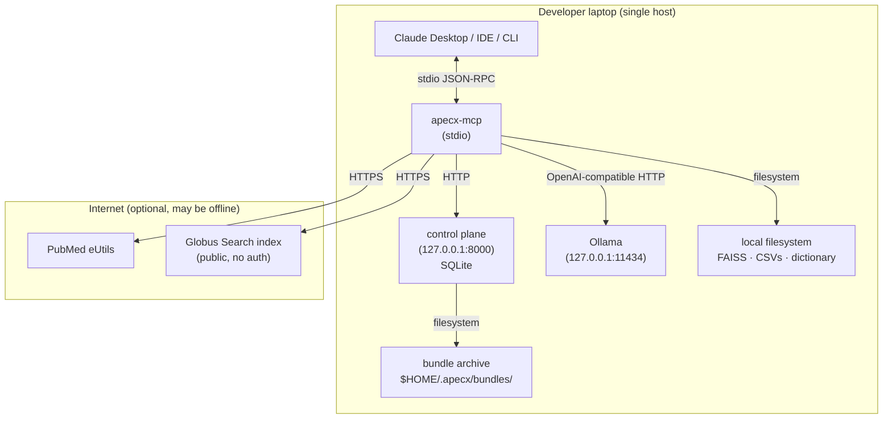
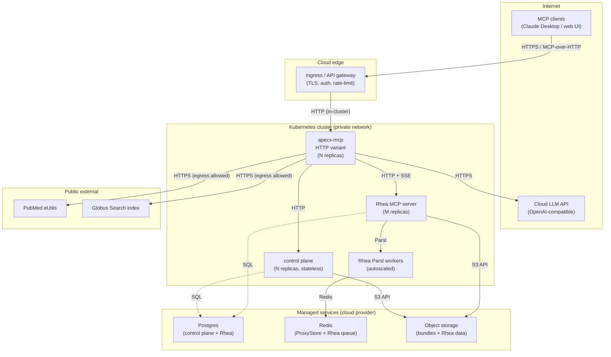
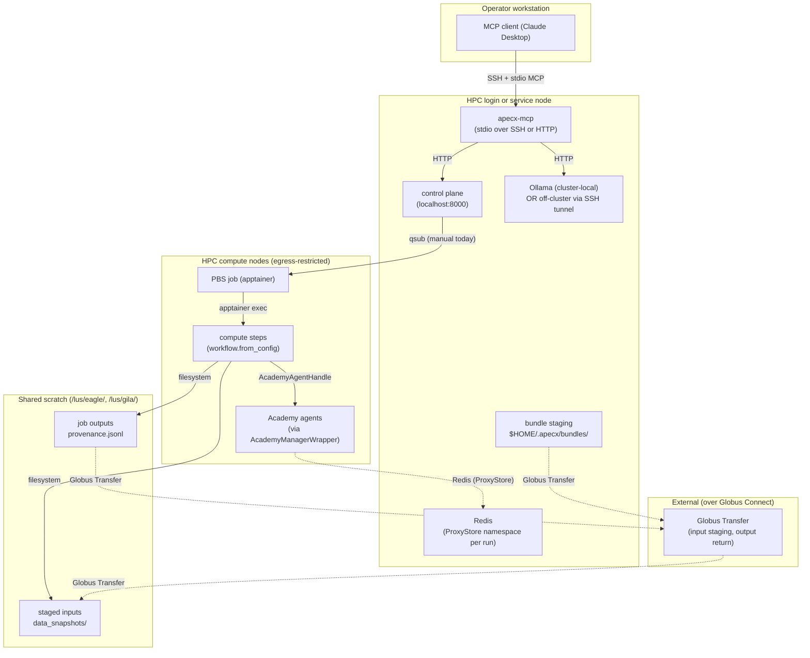
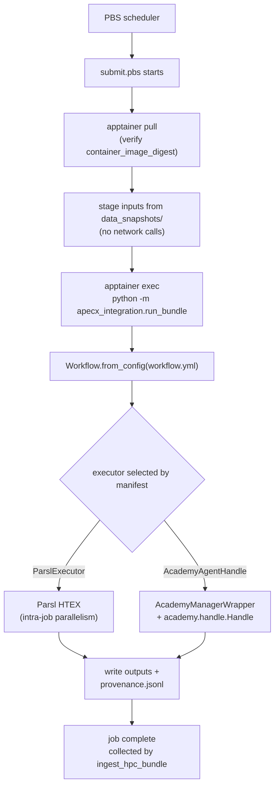

# APECx Deployment Architecture

**Status:** Design / pre-implementation
**Audience:** Operators, deployment engineers, anyone choosing where APECx will run
**Supersedes:** Nothing — fills the deployment-topology gap identified in `nanobrain_alignment_audit.md §3.8 C-53`
**Read first:** `architecture.md` (current 3-tier topology) · `multiagent_architecture.md` (target 4-tier topology) · `external_tool_integration.md` (Rhea infrastructure deps) · `hpc_reproducibility_spec.md §8` (HPC executor profiles)

---

## 1. Why this document exists

Every existing design doc names services in passing. None draws the
topology. An operator standing up APECx today reverse-engineers the
picture from `CLAUDE.md`, `architecture.md §8.1`, the FastMCP entry
point, the control-plane README, and `external_tool_integration.md
§3.5`. Feasible but error-prone: the env-var contract is scattered;
service-discovery rules are implicit; the failure-mode catalogue is
partial.

This document fills the gap. It draws the complete picture for three
deployment modes (local-dev, cloud-managed, HPC), enumerates every
service, names failure modes, and defines a phased migration path from
today's single-laptop reality to a multi-mode production posture. It is
NOT an implementation deliverable: no Kubernetes manifests, no
docker-compose, no shell scripts. The doc makes the topology decidable
so manifests can be written without architectural drift.

The audit constraint (`nanobrain_alignment_audit.md §3.8 C-53`)
classifies deployment as APECX-SPECIFIC: service topology, secrets, and
scaling are deployment policy. Nanobrain ships the executors used here;
this doc extends nothing in the framework.

---

## 2. Three deployment modes

The system supports three first-class deployment modes. Each mode is a
defensible end-state with a target user, a representative latency budget,
and a fixed list of services that are present or absent.

| Mode | Target user | Representative workflow latency | Services present | Services absent |
|---|---|---|---|---|
| **L — Local-dev** | Solo developer; integration-test author; demo operator | 30–90 s end-to-end (LLM-bound) | apecx-mcp (stdio) · control plane (auto-start) · Ollama on localhost · SQLite | Rhea · managed Postgres/Redis/MinIO · Aurora · PBS · ProxyStore Redis |
| **C — Cloud-managed** | Multi-user organisation; analysts behind a web client | 30–120 s; concurrency-limited by LLM quota | apecx-mcp (HTTP) · control plane (HA) · cloud LLM API · Rhea · managed Postgres + Redis + MinIO · ProxyStore Redis | Aurora · PBS |
| **H — HPC** | HPC user with allocation; reproducibility-driven analysis | minutes to hours (large compute jobs) | apecx-mcp + control plane on login/service node · cluster-local Ollama (or VPN) · Aurora Academy · PBS · in-cluster Redis (ProxyStore) · apptainer · Globus Connect | Rhea (HPC compute is sufficient) · cloud-managed Postgres |

The three modes are not mutually exclusive within an organisation. A
common production posture deploys C for interactive analysts and H for
allocation-bound batch work, with the same control plane backing both.
Mode L is always present somewhere — every developer machine runs Mode L.

**Mode-selection driver:**

| Question | Answer → Mode |
|---|---|
| Does the operator have an HPC allocation (Polaris, Aurora, similar)? | yes → H |
| Does the operator need to serve more than one human concurrently? | yes → C |
| Otherwise | L |

A workflow authored in Mode L runs unchanged in Mode C. A workflow authored
in Mode L runs in Mode H after `export_hpc_bundle` produces the qsub-able
artifact. The framework guarantees this via the executor-swap contract
(`hpc_reproducibility_spec.md §8`): the workflow YAML never names an
executor; the executor profile is selected per-deployment.

---

## 3. Service catalogue

Every service required by any of the three modes. Owner column:
**nanobrain** = ships with the framework; **apecx** = ships with this repo;
**external** = a third-party service the platform operator runs.

| Service | Purpose | Owner | Required in modes | Talks to |
|---|---|---|---|---|
| `apecx-mcp` (FastMCP server) | MCP-protocol surface; entry point for the MCP client | apecx | L, C, H | control plane, LLM endpoint, data sources, FAISS, dictionary, Globus index |
| Control plane (`apecx-cp serve`) | Workflow / run / approval / artifact state; cost accounting; audit log | apecx | L, C, H | Postgres or SQLite; signed-config / KMS in C, H |
| LLM endpoint (Ollama or OpenAI-compatible API) | Completion calls for synthesis, composition, entity extraction | external | L, C, H | none (called by apecx-mcp + executor steps) |
| Rhea MCP server | RAG-indexed external tool catalogue + Parsl/Academy execution | external | C (optional in L, absent in H) | Postgres (catalogue), Redis (ProxyStore), Parsl pool, Academy containers |
| Postgres | Control-plane state in Mode C; Rhea catalogue in C | external | C (Mode L uses SQLite; Mode H uses SQLite or Postgres on a service node) | apecx-cp, Rhea |
| Redis | Rhea queue + ProxyStore reference store | external | C, H (absent in L — in-process ProxyStore) | Rhea, ProxyStore-using steps, Academy agents |
| MinIO (or S3) | Rhea object storage + bundle archive in C | external | C (Mode L uses local FS; Mode H uses Globus Collection on shared scratch) | Rhea, control plane |
| Academy on Aurora | Distributed agent runtime for HPC compute | nanobrain (`AcademyManagerWrapper`) | H | Redis (ProxyStore), apptainer, MPI |
| PBS scheduler | HPC job queue (Polaris, Aurora) | external | H | apptainer, shared scratch |
| Globus Search index | APECx harvested-corpus index — read-only consumer | external | L, C, H (optional; auto-skips when SDK absent) | apecx-mcp + synthesis assembly step |
| PubMed eUtils | Literature retrieval over the network | external | L, C, H (optional; auto-skips on network failure) | synthesis assembly step |
| Object storage (HPC bundle archive) | Persisted qsub-able bundles + ingested provenance | external (S3 / MinIO / Globus Collection) | C, H | export_hpc_bundle, ingest_hpc_bundle |
| Synonym dictionary builder | Lazy nanobrain workflow at apecx-mcp startup | apecx | L, C, H (skippable via `APECX_SKIP_DICT_BUILD=1`) | OLS (offline), DomainDB CSVs |
| Domain RAG index (FAISS) | Pre-built embedding index for semantic retrieval | apecx | L, C, H | none (read-only filesystem artifact) |
| Autonomous orchestrator runner | Long-lived service; runs `WorkflowRunner` (G21) over the meta-workflow with `WorkflowEntryTrigger` (G22); honors operator commands via control-plane polling | apecx | L (optional), C (optional), H (optional) | control plane (autonomous_task table), LLM endpoint, data sources (whatever the orchestrator needs); same dependencies as the interactive orchestrator |

### 3.1 Per-service ports, state, scaling, health

| Service | Default port | Persistent state | Scaling unit | Health check | Restart cost |
|---|---|---|---|---|---|
| apecx-mcp | none (stdio); 8765 (HTTP) | none | per MCP-client connection | stdio: process liveness; HTTP: `GET /health` | seconds (FAISS load 5–10 s warm) |
| Control plane | 8000 (HTTP) | SQLite (L); Postgres (C); SQLite or Postgres (H) | stateless API process; horizontal in C | `GET /healthz` returns 200 | sub-second |
| Ollama | 11434 | model weights on disk | one model per GPU | `GET /api/tags` | minutes (model load) |
| Cloud LLM API | 443 | none | quota-bound | first-call probe | n/a |
| Rhea | 8080 (HTTP + SSE) | catalogue in Postgres+pgvector; data in Redis | one front + Parsl auto-scaled workers | MCP `initialize` round-trip | seconds–minutes |
| Postgres | 5432 | DB volume | vertical primary + read replicas | `pg_isready` | n/a (managed) |
| Redis | 6379 | AOF persistence | per-cluster, namespace prefixes | `PING` | sub-second |
| MinIO / S3 | 443 / 9000 | object volume / bucket | bucket-per-tenant | `HEAD` on known object | n/a |
| Academy (Aurora) | n/a | none in wrapper; per-handle inside | wrapper per run; agent per task | manager init + first dispatch | tens of seconds |
| PBS | n/a (qsub on login) | queue + scratch artifacts | per-job allocation (nodes × walltime) | `qstat` returns 0 | n/a (site-operated) |
| Globus Search | 443 | index (read-only here) | managed | first query; auto-skip on error | n/a |
| PubMed eUtils | 443 | n/a | 3 req/s (10 with key) | first query; auto-skip | n/a |
| Bundle archive | filesystem / 443 / 9000 | bundles + ingested provenance | bucket-per-tenant | `HEAD` on known object | n/a |
| Autonomous orchestrator runner | none (no inbound port; pulls from `autonomous_task` table) | none (state in control plane) | one runner per autonomy partition; horizontal in C with task-queue claim semantics | heartbeat row in `autonomous_task` (60s cadence); watchdog (separate workflow, scheduled every 5 min) flags stale heartbeats | seconds (cold start re-claims any incomplete in-flight task) |

### 3.2 Notes on managed-service primitives

- **Postgres** 14+. Control plane uses one schema; Rhea uses another.
  Connection pooling (pgbouncer) required at scale.
- **Redis** 7+. ProxyStore namespaces are key prefixes; per-tenant memory
  quotas are enforced via `maxmemory-policy volatile-ttl`.
- **MinIO / S3**: bucket-per-tenant in multi-tenant deployments.

### 3.3 PBS interaction model

APECx's relationship with PBS is one-directional today: `export_hpc_bundle`
writes a qsub-able bundle; the operator runs `qsub` manually; on completion
`ingest_hpc_bundle` re-ingests provenance. The control plane does NOT drive
`qsub` today; that automation is Phase 5 (§14).

### 3.4 Academy and Globus references

`AcademyManagerWrapper` ships in nanobrain core (real path delivered
2026-04-24; see CLAUDE.md). The default Globus Search index UUID is
public; override via `APECX_GLOBUS_SEARCH_INDEX_UUID`
(`architecture.md §8.1`).

---

## 4. Network topology

Three diagrams, one per mode. Conventions:

- Solid arrows: data-plane traffic (request/response or stream).
- Dashed arrows: control-plane traffic (state updates, health checks).
- Dotted boxes: trust boundaries (process, host, cluster, internet).

### 4.1 Mode L — Local-dev



All services are bound to `127.0.0.1`. Nothing is publicly addressable.
There is no ingress and no auth; the laptop's local-user permissions are
the security boundary. PubMed and Globus calls auto-skip on network
failure, so the mode is fully offline-capable for the synthesis pipeline
(retrieval branches will return empty bundles; the synthesizer's
`fail_on_empty_retrieval` gate fires if every branch is empty).

### 4.2 Mode C — Cloud-managed



The ingress is the only publicly addressable surface. apecx-mcp, control
plane, and Rhea sit behind it and talk over the cluster's private network.
Managed Postgres / Redis / S3 are reachable only from inside the cluster
(via VPC peering or private endpoint).

### 4.3 Mode H — HPC



Compute nodes have restricted egress (Polaris and Aurora policy: outbound
HTTPS is denied or proxied). All external data must be cached into
`data_snapshots/` before `qsub`. The login/service node is the only host
that talks to the operator, the LLM endpoint, and Globus Connect.
Cluster-local Redis is mandatory for ProxyStore (`hpc_reproducibility_spec.md
§8.3`); the in-process store does not survive cross-node reads.

---

## 5. Service discovery

Service discovery is **environment-variable-driven** in every mode. There
is no service-registry abstraction; the env-var contract from
`apecx-mcp-integration/CLAUDE.md §MCP surface` is the source of truth.
This section enumerates what discovery looks like per mode and extends
the existing contract where new variables are needed.

### 5.1 Discovery by mode

| Mode | Mechanism | Source of truth |
|---|---|---|
| L | hardcoded localhost defaults; env vars override | `mcp_surface/server.py` defaults |
| C | Kubernetes Service DNS (`<service>.<namespace>.svc.cluster.local`); env vars set by Deployment manifest | k8s manifest (downstream deliverable) |
| H | cluster-local DNS for service-node addresses; PBS env (`$PBS_O_WORKDIR`) for in-job paths | site documentation + `submit.pbs` template |

### 5.2 The env-var contract

The contract below extends the variables documented in `architecture.md §12`.
Variables marked **(new)** are introduced by this doc; they are
documentation-only until the implementing PR lands.

| Variable | Default | Modes | Purpose |
|---|---|---|---|
| `APECX_LLM_BASE_URL` | `http://localhost:11434/v1` | L, C, H | LLM endpoint base URL |
| `APECX_LLM_MODEL` | `mistral-nemo:latest` | L, C, H | model name |
| `APECX_LLM_API_KEY` | `unused` | L, C, H | bearer token; `unused` for Ollama |
| `APECX_LLM_TEMPERATURE` | `0.0` | L, C, H | temperature ceiling (see `hpc_reproducibility_spec.md §9`) |
| `APECX_LLM_MAX_TOKENS` | `2048` | L, C, H | per-call ceiling |
| `APECX_CONTROL_PLANE_URL` | `http://localhost:8000` | L, C, H | control plane base URL |
| `APECX_DATA_ROOT` | unset | L, C, H | root of DB CSVs and FAISS artifacts |
| `APECX_SYNONYM_DICT_PATH` | `~/.apecx/dictionary/dictionary.sqlite` | L, C, H | synonym dictionary file |
| `APECX_WORKSPACE_ROOT` | unset (marker walk fallback) | L, C, H | repo-root override |
| `APECX_GLOBUS_SEARCH_INDEX_UUID` | public default | L, C, H | Globus index override |
| `APECX_GLOBUS_SEARCH_DISABLED` | unset | L, C, H | hard-disable Globus branch |
| `APECX_SKIP_DICT_BUILD` | unset | L, C, H | skip lazy dictionary build at startup |
| `APECX_MCP_AUTOSTART_BACKEND` | `1` | L | auto-start the control plane on first MCP call |
| `APECX_RHEA_URL` | unset | C (optional in L, absent in H) | Rhea MCP base URL |
| `APECX_RHEA_PROXYSTORE_URL` | unset | C, H | Redis URL for ProxyStore |
| `APECX_GALAXY_MCP_URL` | unset | C (optional) | GalaxyMCP base URL when available |
| `APECX_BUNDLE_ARCHIVE_URL` (new) | filesystem in L; `s3://...` in C; `globus://...` in H | C, H | bundle archive endpoint |
| `APECX_KMS_URL` (new) | unset | C, H | KMS for signing keys (ed25519 per `hpc_reproducibility_spec.md §10`) |
| `APECX_TENANT_ID` (new) | `default` | C | per-tenant namespace prefix (Postgres schema, Redis key prefix, S3 bucket) |
| `APECX_AUDIT_LOG_URL` (new) | local file in L; managed log sink in C | C, H | audit-log endpoint |
| `APECX_T13B_SANDBOX_EXECUTE` | unset | L, C | enable Docker sandbox runtime (scaffold; see CLAUDE.md) |

**Precedence:** env var > secret-store reference > config file >
hardcoded default. No secret in a git-committed config file. The
control plane and apecx-mcp startup both honour this order.

### 5.3 What is NOT a discovery mechanism

- **Hardcoded URLs in YAML.** Workflow YAMLs name no services.
- **Hostname inference.** No `/etc/hosts` parsing, no mDNS. Cluster-local
  DNS in Mode H is set up by the site; the service is named explicitly
  in `APECX_LLM_BASE_URL`.
- **Service registries.** No Consul, etcd, or service mesh by default.
  Mode C may layer one in; the env-var contract remains canonical.

---

## 6. Scaling model

The unit of horizontal scale is per-service. Vertical scale (more CPU/RAM
for an existing instance) is the lever for stateful services.

| Service | Scaling axis | Bottleneck | Mitigation |
|---|---|---|---|
| apecx-mcp | horizontal: 1 process per MCP-client connection (stdio); 1 pod per N concurrent HTTP requests | FAISS load on cold start; per-process FAISS memory | warm-pool replicas in C; cache FAISS via shared volume |
| Control plane | horizontal stateless behind Postgres | DB write throughput (audit log) | partition audit-log table; archive cold partitions to S3 |
| LLM endpoint (Ollama) | vertical: GPU per concurrent model load | GPU VRAM; one model per GPU | multiple GPUs; pin small models; dispatch by role |
| LLM endpoint (cloud API) | quota-bound; transparently horizontal at the provider | rate limit | per-tenant quotas; exponential backoff |
| Rhea (front) | horizontal | catalogue-search latency under fan-out | pgvector tuning; cache `find_tools` results per session |
| Rhea worker | Parsl auto-scales | cluster capacity; container-pull latency | pre-warm container images; bound concurrent workers |
| Postgres | vertical primary + read replicas | connection count; bloat on append-heavy tables | pgbouncer; partition large tables |
| Redis | vertical (single shard) until throughput requires cluster | OOM under unevicted ProxyStore writes | per-run TTL; per-tenant memory quota |
| MinIO / S3 | horizontal at provider | request rate per prefix | sharded prefixes per tenant |
| Academy | one wrapper per workflow run; one agent per task | wrapper-singleton lifetime; agent-launch latency | reuse wrapper across runs in the same process; pre-warm agent pool |
| Synonym dictionary build | not scaled — runs once at apecx-mcp startup | OLS round-trip latency | lazy build; cache the SQLite artifact across restarts |

### 6.1 Concurrency limits today

The current path runs **one workflow per user session**. The
`synthesize_query` MCP tool serialises work behind a single FAISS-loaded
step instance. Multi-tenant concurrent workflow execution within one
apecx-mcp process is future work; today's pattern is "one process per
user session".

| Limit | Where it bites | Today's behaviour |
|---|---|---|
| One LLM call in flight per apecx-mcp process | synthesis pipeline | sequential; second caller queues |
| SQLite writer (Mode L) | run + approval writes | sub-second contention; invisible |
| Postgres pool slot per pod (Mode C) | bursts | pgbouncer transaction-mode pooling |
| Rhea Parsl worker pool ceiling | tool-heavy workflows | configure HTEX; capability-gap on exceed |
| Aurora walltime | HPC bundle execution | R3-marked bundle on kill; user notified |

### 6.2 The "one venv, one workspace" rule (Mode L)

`.venv/bin/python` is the authoritative interpreter; sibling-repo
editable installs live there (`apecx_integration`,
`apecx_db_integration`, `nanobrain`). Running apecx-mcp under system
Python yields `ModuleNotFoundError`. Hardening recommendation: install
via `pipx` from the project venv, or ship as a single static binary
when Mode C ships.

---

## 7. Secrets management

Every secret has exactly one home. The home is determined by mode and
secret class.

| Secret | Lives in (L) | Lives in (C) | Lives in (H) | Read by | Rotation |
|---|---|---|---|---|---|
| LLM API key (cloud) | env var or `~/.apecx/secrets` | KMS / secret manager | site secret store | apecx-mcp + control plane | per-org policy; typically 90 days |
| Globus refresh token | `~/.globus/` (Globus SDK cache) | per-user secret namespace | per-user secret namespace | apecx-mcp + Globus Transfer | Globus SDK auto-refresh |
| Bundle signing key (ed25519) | local file (dev only — clearly marked) | KMS or HashiCorp Vault | site KMS | bundle export, replay verification | per-release |
| Postgres credentials | n/a (SQLite) | managed-service IAM or rotated secret | n/a (SQLite) or service-node secret | control plane, Rhea | managed-service rotation |
| Redis credentials | n/a (in-process) | managed-service token | site Redis token | ProxyStore consumers | per-tenant |
| Object-store credentials | n/a (filesystem) | managed-service IAM role | Globus refresh token | bundle archive, Rhea | IAM rotation; Globus SDK |
| HITL approval session token | n/a (process-local) | per-user JWT (15 min) | per-user JWT | control plane → MCP client | short-lived; refresh on use |
| Capability tokens (per `hitl_safety_gates.md §7`) | unused | per-user, short-lived | per-user, short-lived | control plane gates | per-workflow |
| Audit-log signing key | local file | KMS | site KMS | control plane | per-release |

### 7.1 The precedence rule

The same precedence applies to every secret:

```
1. Environment variable (e.g., APECX_LLM_API_KEY)
2. Secret-store reference (resolved at startup; e.g., `kms://...`)
3. Config-file value (only for non-secret defaults)
4. Hardcoded default (only for non-secret values like Globus public index UUID)
```

**No secret in config files committed to git.** The repo's `.gitignore`
covers `.env`, `secrets.yml`, `*.pem`, `*.key`. CI's secret-scan hook
catches accidental commits.

### 7.2 Per-user vs. per-org secrets

- **Per-org**: cloud LLM key, bundle signing key, Postgres credentials.
  Loaded once at service startup; shared across users.
- **Per-user**: Globus refresh token, capability tokens, audit-log
  attribution. Loaded per session; isolated by `APECX_TENANT_ID` +
  `user_id` namespace.

### 7.3 Bundle signing

Every HPC bundle is signed with an ed25519 keypair (per
`hpc_reproducibility_spec.md §10`). The signing key is the most
sensitive secret in the system: forging a signed bundle bypasses the
replay-time integrity check. Mode L: local file (dev-only posture).
Mode C and H: MUST live in a KMS or Vault and be referenced by handle.

---

## 8. HPC integration model

### 8.1 Today's path: manual qsub on a bundle

Operator workflow:

1. Compose / select a workflow in apecx-mcp.
2. Call `export_hpc_bundle` (MCP tool). Output: a directory at
   `$HOME/.apecx/bundles/<run_id>/` containing `submit.pbs`, `run.sh`,
   `workflow.yml`, `staging_plan.yml`, `provenance_seed.json`,
   `manifest.json`, `data_snapshots/`, and `README.md`.
3. Transfer the bundle to cluster scratch via Globus Connect or `scp`.
4. Run `qsub submit.pbs` on a login node.
5. PBS schedules the job; apptainer pulls the pinned container; the
   workflow executes inside the container.
6. On completion (or walltime expiry), the job writes outputs and
   `provenance.jsonl` to `$PBS_O_WORKDIR`.
7. Operator transfers the result directory back to the apecx-mcp host.
8. Call `ingest_hpc_bundle` (MCP tool) to load provenance into the control
   plane and surface results to the user.

The control plane does NOT submit to PBS today; the manual `qsub` step is
preserved by design (the user must be in the loop for HPC allocation
spend).

### 8.2 Future automated path

Phase 5 (§14) introduces optional control-plane-driven `qsub` via SSH or
Globus Connect Personal. Open question: how to authenticate (per-user
SSH key vs. per-tenant Globus Connect collection) — see §16.

### 8.3 Inside the PBS job



### 8.4 File staging

| Direction | Mechanism | Driver |
|---|---|---|
| Inputs in (operator → cluster) | Globus Transfer or `scp`; `data_snapshots/` is pre-cached at bundle export | `staging_plan.yml` enumerates the files |
| Inputs in (cluster-local data) | direct read from shared scratch | step config references absolute path |
| Outputs out (cluster → operator) | Globus Transfer back to control plane's bundle archive | `ingest_hpc_bundle` orchestrates retrieval |

Compute nodes on Polaris and Aurora have **restricted egress**. PubMed,
Globus Search, and any other live API call must be cached into
`data_snapshots/` before `qsub`. A step that hits an uncached live URL
inside a PBS job hangs silently or fails with a timeout
(`hpc_reproducibility_spec.md §8.3`).

### 8.5 Logs and provenance

- `provenance.jsonl` is written to `$PBS_O_WORKDIR` per
  `hpc_reproducibility_spec.md §5`.
- `stderr` and `stdout` are captured by PBS in `<jobname>.o<jobid>` and
  `<jobname>.e<jobid>`.
- On `ingest_hpc_bundle`, all three are uploaded to the bundle archive
  and indexed by `run_id` in the control plane.

Reference: `hpc_reproducibility_spec.md §8` (executor profiles).

---

## 9. Local-dev mode (L) — opinionated single-command setup

This is the canonical developer posture. It is also the canonical posture
for integration tests and demos.

### 9.1 Prerequisites

- One workspace checkout (`apecx-cowork/` with sibling repos cloned).
- One Python 3.11+ venv at `apecx-mcp-integration/.venv`.
- Editable installs of: `apecx_integration`, `apecx_db_integration`,
  `nanobrain`. Ollama installed and `mistral-nemo:latest` pulled.

The `apecx-mcp-integration/CLAUDE.md` discipline is mandatory: invoke all
Python via `.venv/bin/python` or `scripts/run_tests.sh`. Reaching for the
system Python causes silent `ModuleNotFoundError` for sibling-repo
packages.

### 9.2 Service composition

| Service | How it starts | Where it listens |
|---|---|---|
| apecx-mcp | `apecx-mcp` (stdio) — launched by the MCP client | stdio |
| Control plane | auto-started by apecx-mcp on first MCP call (unless `APECX_MCP_AUTOSTART_BACKEND=0`) | `127.0.0.1:8000` |
| Ollama | `ollama serve` (operator-managed) | `127.0.0.1:11434` |
| FAISS / dictionary / DB CSVs | filesystem | n/a (read-only artifacts) |
| Bundle archive | filesystem | `$HOME/.apecx/bundles/` |

### 9.3 What is intentionally absent in Mode L

- **Rhea.** Tool execution falls back to the existing Parsl-local path
  or to native nanobrain tools. Workflows that require Rhea-specific
  tools surface a capability gap (`P9` per
  `reasoning_patterns_library.md`).
- **Managed Postgres / Redis / MinIO.** Control plane uses SQLite;
  ProxyStore uses the in-process store; bundles live on local disk.
- **Auth and tenancy.** The local user owns everything.
- **Rate limiting and quotas.** Bound only by the LLM endpoint (Ollama
  capacity).

### 9.4 Brutal truth about Mode L

- **Control-plane SQLite is a single point of failure.** Intentional —
  dev mode trades durability for setup simplicity. Deleting the SQLite
  file loses every workflow + run history. Bundles on disk survive.
- **Ollama is slow.** 30–90 s per synthesis call on a workstation GPU;
  minutes on CPU. Operators expecting cloud-API latency are surprised.
- **First synonym-dictionary build takes 10–15 minutes.** Cached
  SQLite afterward resolves in <1 s.
- **No multi-process concurrency.** Two apecx-mcp instances against the
  same SQLite produce locked-DB errors. Multi-tenant in Mode L is
  unsupported by design.

---

## 10. Cloud mode (C) — opinionated kubernetes-style deployment

Mode C is the production posture for organisations serving multiple
analysts concurrently from a web client or shared MCP gateway.

### 10.1 Service composition

| Service | Deployment shape | Scaling |
|---|---|---|
| apecx-mcp | Deployment (HTTP variant of FastMCP) behind ingress; auth at gateway | N replicas; scale on RPS |
| Control plane | Deployment (stateless API) backed by managed Postgres | N replicas; scale on DB capacity |
| LLM endpoint | external (cloud LLM API) OR in-cluster Ollama Deployment with GPU node pool | quota-bound or GPU-bound |
| Rhea | Deployment + Parsl HTEX worker pool | autoscaled on queue depth |
| Postgres | managed (RDS / CloudSQL / equivalent) | vendor-managed |
| Redis | managed (ElastiCache / Memorystore / equivalent) | per-tenant memory quota |
| MinIO / S3 | managed object storage | per-tenant bucket |
| Bundle archive | S3 bucket per tenant | per-tenant lifecycle |
| Audit log | managed log sink (CloudWatch / Stackdriver / Loki) | per-tenant partition |

### 10.2 Ingress and auth

| Surface | Auth | Rate-limit |
|---|---|---|
| `apecx-mcp` HTTP | OIDC at gateway; `Authorization: Bearer <jwt>` per request | per-tenant RPS ceiling |
| Control plane API | service-to-service mTLS in cluster; not publicly exposed | n/a |
| HITL approval webhook (callback) | per-org HMAC | per-user |
| Webhooks (run completion) | per-tenant signing secret | n/a |

The MCP HTTP transport is a FastMCP variant; the stdio variant continues
to work for Mode L. Mode C does not deprecate stdio — it supplements it.

### 10.3 What Mode C does NOT do

- Mode C does NOT serve as an HPC submission portal. HPC submissions go
  through Mode H. A Mode C deployment can produce a bundle and hand it to
  the operator, but it does not run `qsub` itself.
- Mode C does NOT bundle a vector database for tool catalogue use beyond
  Rhea's pgvector. Adding a separate vector DB would be a future ticket.
- Mode C does NOT include the `T13b` Docker sandbox by default. The
  sandbox is opt-in via `APECX_T13B_SANDBOX_EXECUTE=1` (per CLAUDE.md
  scaffold); production wiring is Phase-3 work.

### 10.4 Implementation deliverables (out of scope here)

Mode-C implementation artifacts (k8s manifests, Helm charts, Terraform
modules, CI pipelines) are downstream tickets. This doc's job is the
service list and dependency graph; the manifests follow.

---

## 11. HPC mode (H) — opinionated Aurora/Polaris pattern

Mode H is the deployment posture for HPC users with allocations on
Polaris, Aurora, or equivalent DOE-class systems.

### 11.1 Service composition

| Service | Where it runs | Notes |
|---|---|---|
| apecx-mcp + control plane | login or service node | one process per operator session |
| LLM endpoint | cluster-local Ollama on a login node OR off-cluster via SSH tunnel | site-policy-dependent |
| Rhea | NOT used | HPC compute is sufficient; Rhea adds round-trip overhead |
| ProxyStore Redis | service node (one Redis per cluster, namespace-per-run) | mandatory for cross-node ProxyStore reads |
| Academy | Aurora compute nodes (one Academy agent per task) | via `AcademyManagerWrapper` |
| Bundle archive | shared scratch (`/lus/eagle/` Polaris; `/lus/gila/` Aurora) | exposed as a Globus Collection |
| Globus Connect Personal | login or service node | input/output transfer endpoint |

### 11.2 Container management

apptainer is the reference runtime on Polaris and Aurora. Images are
pinned by digest in `manifest.json` (`hpc_reproducibility_spec.md
§3.1`); the digest is verified at job start before any step runs. A
mismatch fails the job and the bundle is marked R3. Image stack: base
(site MPI/BLAS-pinned) → Python venv → editable installs of
`apecx_integration`, `apecx_db_integration`, `nanobrain` → `academy-py`
→ tool dependencies.

### 11.3 Module loads and walltime

`submit.pbs` loads the site module stack before invoking apptainer
(typical: `module load craype-x86-milan` on Aurora;
`PrgEnv-gnu cudatoolkit-standalone` on Polaris). Walltime is declared
in `manifest.json`; the bundle exporter writes the matching `#PBS -l
walltime=...`. Walltime kill is the single most common cause of R3
bundles — use `estimate_cost` to right-size before export.

### 11.4 Networking on compute nodes

Compute nodes have outbound HTTPS denied or proxied. Implications:
all live API calls must be cached in `data_snapshots/` before `qsub`;
the synthesis pipeline's PubMed and Globus branches produce empty
bundles inside a PBS job; LLM calls require cluster-local Ollama or a
pre-cached LLM-response cache (`hpc_reproducibility_spec.md §9`).

### 11.5 Globus Connect

Globus Connect Personal is the canonical staging mechanism. The bundle
archive on shared scratch is exposed as a Globus Collection;
`ingest_hpc_bundle` retrieves results via Globus Transfer (`globus-sdk`).

---

## 12. Multi-tenant considerations

Mode C is multi-tenant by design. Mode L is single-user by design. Mode H
is single-allocation (which may map to a single user or a small team
sharing an allocation).

### 12.1 Per-user isolation

| Concern | Mechanism |
|---|---|
| apecx-mcp process | per-session in stdio (one MCP client connection = one process); per-namespace in HTTP (`APECX_TENANT_ID + user_id` in request header) |
| ProxyStore namespace | per-run UUID prefix (`hpc_reproducibility_spec.md §8.4`); G13 in `nanobrain_capability_gaps.md` |
| Cost accounting | per-user partition in control plane (`user_id` foreign key on every cost row) |
| Capability tokens | per-user, short-lived, scoped to a single workflow run (`hitl_safety_gates.md §7`) |
| Audit log | per-user partition; entries signed by control plane signing key |
| Bundle archive | per-tenant bucket prefix; per-user folder within |

### 12.2 Shared resources

Some resources are shared across tenants for cost reasons:

- LLM endpoint (cloud API): shared per-org; rate-limited per-tenant.
- FAISS index: read-only and immutable; safe to share.
- Synonym dictionary: read-only and immutable; safe to share.

### 12.3 Out of scope today: cross-user workflow sharing

A "publish workflow" surface — where one user makes a workflow available
to other users in their organisation — is a stretch goal. The control-
plane data model anticipates it (workflows have an `owner_user_id` that
could be relaxed to a `published: true` flag), but the policy gates
(who can publish? to which audience? with what versioning?) are not
defined. Treat as Phase-N future work.

---

## 13. Failure-mode atlas

Deployment-level failures, ordered by frequency in operator reports.
Detection signals are concrete (a log line, an exit code, a metric);
mitigations are operator-actionable.

| # | Failure | Detection | Mitigation |
|---|---|---|---|
| 1 | Control plane unreachable on first MCP call | apecx-mcp `exit(2)` with remediation hint pointing at `APECX_CONTROL_PLANE_URL`; `connection refused` on the URL | Mode L: re-enable `APECX_MCP_AUTOSTART_BACKEND=1`; Mode C: check Deployment readiness; Mode H: check service-node availability |
| 2 | Ollama down mid-workflow | `RagSynthesisStep` raises `ValueError`; MCP tool returns `{"error": "synthesis gate failed: ..."}` | Restart Ollama; verify `APECX_LLM_BASE_URL` reachable via `GET /api/tags`; user re-runs the workflow |
| 3 | LLM API rate-limit (cloud) | 429 from provider; control-plane cost-gate metric spikes | exponential backoff in HTTP client; surface to user with retry-after; cost-gate may re-fire if cost class changes after retry |
| 4 | Rhea unreachable | `RheaToolAgent` health probe fails at first dispatch; `connection refused` on `APECX_RHEA_URL` | `ToolExecutionStep` falls back to native catalog (Mode L) or surfaces capability gap (`P9`) for the user to approve degradation |
| 5 | PBS job killed (walltime exceeded) | `qstat` shows job `E` state; `<jobname>.e<jobid>` ends with PBS kill notice; `provenance.jsonl` truncated | bundle marked R3 (incomplete provenance) by `ingest_hpc_bundle`; user notified; remediation: re-export with longer walltime via `estimate_cost` |
| 6 | Globus Transfer failure | Globus task reports `FAILED` or `INACTIVE`; `globus-sdk` raises | control plane retries with exponential backoff; alerts user after N retries (default 3); user can restart the task or transfer manually |
| 7 | Redis OOM (ProxyStore eviction) | upstream step writes a key; downstream step reads → `ProxyRef` dereference fails with `KeyError` | FAIL-FAST surfaces missing key; mitigations: per-run TTL tuning, per-tenant memory quota, evict-on-cluster-policy `volatile-ttl` |
| 8 | Container image pull fail (apptainer) | PBS job stderr: `apptainer: ... not found` or `digest mismatch`; `manifest.json` `container_image_digest` mismatch | bundle's `container_image_digest` mismatch check catches at replay; remediation: re-pull image, verify digest in manifest, re-export bundle |
| 9 | FAISS load segfault on macOS ARM | apecx-mcp process exits with SIGSEGV at startup; no Python traceback | check `domain_rag/index.py` import order — `sentence_transformers` MUST import before `faiss` (workspace rule per `architecture.md §13.6`); do not let auto-sort reorder |
| 10 | Synonym dictionary build hang | apecx-mcp startup blocked at "building synonym dictionary..." for >30 minutes | `APECX_SKIP_DICT_BUILD=1` to opt out; check OLS reachability (`https://www.ebi.ac.uk/ols`); rebuild offline via the dictionary-build workflow |
| 11 | Postgres connection-pool exhaustion | control plane logs `too many connections`; pgbouncer logs `pool_size_limit` | enable transaction-mode pooling; raise `max_connections` on Postgres; reduce per-pod connection count |
| 12 | Bundle signing key unavailable | `export_hpc_bundle` returns `{"error": "signing key not loadable"}`; control-plane log: `KMS handle <kms://...> failed to resolve` | check KMS reachability + IAM permissions; in Mode L, verify the local-file path; in Mode C/H, verify the secret reference syntax |
| 13 | Auto-started control plane fails to bind port | apecx-mcp startup log: `address already in use 127.0.0.1:8000` | another process is using port 8000; set `APECX_CONTROL_PLANE_URL` to a free port and start the control plane manually |
| 14 | MCP-client stdio buffer overflow | Claude Desktop reports tool error; apecx-mcp log shows truncated JSON-RPC | reduce response size (`APECX_LLM_MAX_TOKENS` lower); enable streaming where supported; switch to HTTP transport in Mode C |

### 13.1 Failure escalation

Three escalation buckets: **auto-recover** (rate limits, transient
network errors, container pull retries — no operator action);
**user-visible degradation** (Globus failures, Rhea unavailability —
capability-gap surface lets the user approve continuation or abort);
**operator escalation** (KMS unreachable, FAISS segfault, Postgres
exhaustion — alerted; user sees generic "service unavailable").

The control plane's audit log records every escalation; the bundle's
`provenance.jsonl` records every step-level failure. Two sources of
truth that must agree.

---

## 14. Migration path from today's state

Today's state: Mode L works end-to-end. Mode C and Mode H have working
prerequisites (FastMCP HTTP variant exists; AcademyManagerWrapper ships
real path) but no operator-facing posture has been authored. Phased
migration target:

| Phase | Scope | Exit criterion |
|---|---|---|
| **Phase 1** | Mode L hardened: HTTP variant of FastMCP shipped alongside stdio; control-plane SQLite tooling for backup/restore; `APECX_T13B_SANDBOX_EXECUTE` integration documented | A Mode-L operator can run the HTTP transport against `localhost` and produce identical results to the stdio path |
| **Phase 2** | Mode C MVP: k8s deployment of apecx-mcp + control plane + cloud LLM API; managed Postgres for control plane; ingress + OIDC auth | One pilot tenant runs the synthesis pipeline against the cloud deployment with the same MCP-tool surface |
| **Phase 3** | Mode C + Rhea integration: Rhea deployment in the same cluster; ProxyStore Redis managed; tool-execution path via Rhea | Composer-built workflows can dispatch to Rhea-registered tools and ingest tool outputs into the evidence bundle |
| **Phase 4** | Mode H pilot on Polaris: manual `qsub`; AcademyManagerWrapper drives Aurora-style workloads; ProxyStore Redis on a service node | One operator round-trips a bundle through Polaris and back; provenance ingested cleanly |
| **Phase 5** | Mode H automated: control plane drives `qsub` via SSH or Globus Connect; bundle dispatch is one MCP-tool call | A user with an active allocation can submit, monitor, and ingest without leaving the MCP surface |

### 14.1 What does NOT change

Stable across all phases and modes: the MCP-tool contract; workflow
YAML format (`Workflow.from_config()` semantics); env-var contract
(§5.2); control-plane API surface (additive only); bundle layout
(`hpc_reproducibility_spec.md §4`). This stability is the load-bearing
contract that lets Mode-L workflows run unchanged in Modes C and H.

### 14.2 Sequencing notes

Phase 1 → Phase 2 (HTTP transport prerequisite); Phase 2 → Phase 3
(Rhea needs cluster networking). Phase 4 runs parallel to Phase 2/3
(HPC and cloud are independent surfaces). Phase 5 depends on a
security decision (control-plane → cluster authentication) tracked in
`security_threat_model.md` and §16.3 here.

---

## 15. What lives in nanobrain vs. apecx-mcp vs. external

Per `nanobrain_alignment_audit.md §6`, every concern in this doc maps to
exactly one layer. The table below makes the split explicit so that
implementation tickets land in the right repo.

| Concern | Layer |
|---|---|
| Executors (`LocalExecutor`, `ParslExecutor`, `ProcessPoolExecutor`); `AcademyManagerWrapper` + `AcademyAgentHandle` | nanobrain |
| Workflow loader; step / trigger / link / data-unit primitives; `ConfigBase` + `extra='forbid'` | nanobrain |
| Per-step `ProvenanceContext` (G4); `CheckpointStep` / `ResumeStep` (G5) | nanobrain (proposed) |
| MCP-tool surface (FastMCP server, tool registrations); control-plane API + state model | apecx-mcp |
| Bundle layout, manifest schema, signing tooling | apecx-mcp |
| Cluster Parsl configs, container images, k8s manifests, Helm charts, runbooks | apecx-mcp (deployment package) |
| Postgres, Redis, MinIO / S3 instances | external (platform-operated) |
| Aurora / Polaris compute; PBS scheduler | external (site-operated) |
| Globus Search index, Globus Transfer; PubMed eUtils; cloud LLM APIs | external (vendor-operated) |
| Ollama | external (operator-managed) or apecx-mcp packaged image |

**Where new code lives by default:** new framework primitives →
nanobrain; new MCP tools or control-plane surfaces → apecx-mcp; new
managed-service configurations → external operator; new deployment
manifests → apecx-mcp deployment package. **Promotion rule** (per
`nanobrain_alignment_audit.md §2`): an apecx-mcp primitive that gains a
second non-APECx consumer is a promotion candidate to nanobrain.

---

## 16. Open questions

These are the open deployment-policy decisions that block Phase 2–5
exits. Each is tracked here until it resolves; resolutions feed back into
this doc as updates.

**16.1 Container runtime in HPC mode.** Do we mandate apptainer for Mode
H, or support podman as well? Apptainer is the de-facto runtime on
Polaris and Aurora; podman is gaining traction at smaller HPC sites.
Both-supported requires per-site container config in the bundle
exporter. *Tentative:* apptainer-only for the Phase 4 pilot; revisit
when a non-DOE-class site requests support.

**16.2 Orchestrator replacement in cloud mode.** Should the control
plane be replaced by Argo Workflows or Temporal in Mode C? Mature
durable-execution semantics vs. the cost of expressing the APECx data
model (run, approval, bundle, cost row) in a generic orchestrator.
*Tentative:* keep the control plane through Phase 3; revisit in Phase 5
when bundle dispatch automation forces a durable-execution discussion.

**16.3 MCP authentication for HTTP transport.** When apecx-mcp is HTTP
(Mode C), how do we authenticate Claude Desktop without breaking the
stdio user experience in Mode L? *Tentative:* HTTP variant accepts an
`Authorization: Bearer <token>` issued by the control plane at user
enrollment; stdio mode skips auth (local trust); the MCP client config
carries the token only when pointing at a Mode-C deployment.

**16.4 Bundle archive in cloud mode.** Where does the bundle archive
live in Mode C — S3, a Globus Collection, or per-tenant filesystem?
*Tentative:* abstract behind `APECX_BUNDLE_ARCHIVE_URL` (§5.2); default
in Mode C is S3 per tenant.

**16.5 Cross-cluster workflow execution.** Do we support workflows
that use compute on more than one cluster (e.g., a step on Polaris
feeding a step on Aurora)? ProxyStore namespacing across clusters is
unsolved; cross-cluster data transfer dominates latency; provenance
attribution becomes a multi-cluster join. *Tentative:* explicitly out
of scope through Phase 5.

**16.6 Multi-region cloud deployment.** Does Mode C support
multi-region active-active, or is it single-region? *Tentative:*
single-region through Phase 3; multi-region introduces consistency
questions for the control plane requiring deeper data-model review.

---

## 17. Cross-references

| Document | Why it matters here |
|---|---|
| `architecture.md` | Current 3-tier topology that this doc extends to 4 modes × 4 tiers |
| `multiagent_architecture.md` | Target 4-tier topology; orchestrator agents fit at Tier 1 across all deployment modes |
| `external_tool_integration.md` | Rhea infrastructure dependencies (Postgres, Redis, MinIO) referenced in §3 service catalogue |
| `hpc_reproducibility_spec.md §8` | HPC executor profiles (LocalExecutor / ParslLocal / ParslPBS / Academy on Aurora) — cross-referenced from §8 here |
| `hpc_reproducibility_spec.md §10` | ed25519 bundle signing — cross-referenced from §7.3 here |
| `hitl_safety_gates.md §7` | Capability tokens — cross-referenced from §7 (per-user secrets) |
| `nanobrain_alignment_audit.md §3.8 C-53` | Classification of this doc as APECX-SPECIFIC; nanobrain ships executors, apecx ships deployment policy |
| `nanobrain_alignment_audit.md §6` | The split table that §15 here makes operationally explicit |
| `nanobrain_capability_gaps.md G13` | Multi-tenant ProxyStore namespacing referenced in §12 |
| `apecx-mcp-integration/CLAUDE.md` | env-var contract origin (`APECX_*`); Academy integration (§3.6); T13b sandbox (§5.2) |
| `mcp_integration.md` | Operator-facing install + Claude Desktop config (consumed by Mode L documentation) |
| `mcp_surface.md` | Per-tool input/output shapes referenced by failure modes #1, #2, #4 |
| `_workspace_notes/.../session_friction_log.md` | Recurring time-sinks; informs failure-mode atlas (§13) |
| `security_threat_model.md` (planned) | Threat catalogue + signed-config loader extension; consumed by §7 (secrets) and §16.3 (HTTP auth) |
| `data_layer_evolution.md` (planned) | Data-plane evolution; informs Mode H Globus staging (§8.4) |

---

## Appendix A. Mode comparison summary

A single-page comparison for operators choosing a mode.

| Dimension | Mode L | Mode C | Mode H |
|---|---|---|---|
| Concurrent users | 1 | N | 1 (allocation) |
| MCP transport | stdio | HTTP behind ingress | stdio over SSH |
| Auth | none (local trust) | OIDC + per-user JWT | site-policy (SSH key / Globus identity) |
| Control-plane store | SQLite (local) | managed Postgres | SQLite or service-node Postgres |
| LLM backend | Ollama (local) | cloud API or in-cluster Ollama | cluster-local Ollama or SSH-tunneled |
| Tool execution | LocalExecutor / native catalog | Rhea (Parsl) | ParslPBS / Academy |
| ProxyStore | in-process | managed Redis | service-node Redis |
| Bundle archive | local FS | S3 / MinIO | shared scratch + Globus Collection |
| Object storage | local FS | managed S3 | shared scratch |
| Reproducibility tier ceiling | R3 | R2 | R2 (R1 for purely deterministic steps) |
| Network egress (compute) | unrestricted | unrestricted (cloud egress allowed) | restricted; cache pre-job |
| Failure surfaces | LLM down, FAISS load | LLM quota, Postgres exhaustion, Redis OOM | walltime kill, container digest mismatch, restricted egress |
| Operator action on failure | restart Ollama | check ingress + DB | check qstat + provenance.jsonl |
