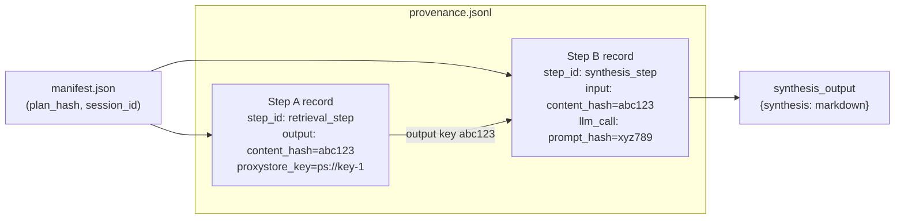

# APECx HPC Reproducibility Specification

**Status:** Design / pre-implementation
**Audience:** Workflow authors, HPC operators, framework reviewers
**Supplements:** `multiagent_architecture.md §7.3` · `architecture.md §4.6` · `nanobrain_workflow_design.md` · `external_tool_integration.md`
**Read first:** `.claude/skills/nanobrain-executors/SKILL.md`

---

## 1. Why this document exists

The `export_hpc_bundle` tool (`architecture.md §4.6`) produces a qsub-able artifact
containing `submit.pbs`, `run.sh`, `workflow.yml`, `staging_plan.yml`,
`provenance_seed.json`, and `README.md`. That is sufficient to submit a job. It is
not sufficient to reproduce one.

Three things are absent from today's bundle:

1. **The agent-authored plan.** The `ExecutionPlan` emitted by Phase 0
   (`agent_workflow_authoring.md §3`) determines which layers run, which tools
   are invoked, and how evidence is accumulated. The bundle carries the lowered
   workflow YAML but not the plan that drove lowering. Without the plan, a
   reviewer cannot tell whether the YAML represents the operator's intent or an
   LLM hallucination that happened to pass validation gates.

2. **The tool descriptors used.** Every external tool invoked during a run is
   addressed through a descriptor (`tool_descriptor_contract.md`). Descriptors
   carry a version field, but the bundle does not snapshot which version was
   active at export time. A tool catalog update between the original run and a
   replay silently changes behavior.

3. **The external-service versions pinned at run time.** The synthesis pipeline
   consumes a FAISS embedding index, a synonym dictionary, live external data
   sources, and an LLM endpoint. None of these are frozen in the current bundle.
   A replay that pulls a refreshed index or a promoted model produces different
   outputs without any error signal.

**Reproducibility is a contract between the bundle and the runtime — neither
alone is sufficient.** A perfect bundle shipped to an environment that silently
upgraded its LLM backend is not reproducible. A frozen environment that ingests a
bundle missing its provenance records cannot verify what it reproduced. Both sides
must participate.

This document defines the reproducibility contract: what the bundle must carry,
what the runtime must verify, and what divergences are acceptable at each tier.

---

## 2. Definitions — three reproducibility tiers

Not all workflows can achieve the same level of reproducibility. The tier system
makes the achievable target explicit so that operators and reviewers share a
common vocabulary.

| Tier | Name | When achievable | What is pinned | What may vary |
|---|---|---|---|---|
| **R1** | Bit-identical | Purely deterministic workflows; no LLM; no live network | Every input byte; every RNG seed; every Python package version; every native library | Nothing — outputs are byte-for-byte identical |
| **R2** | Semantically equivalent | LLM-inclusive workflows with temperature ≤ ε, seed pinned, network sources cached | Model name + weight digest; temperature; seed; cached API responses; container image | Token ordering within declared stochastic bounds; minor formatting variation in LLM output |
| **R3** | Reconstructable | Any workflow where the reasoning chain is auditable | Every input, tool descriptor, and decision point is recorded in provenance | Outputs may differ; reasoning chain must be present and auditable |

**Tier assignment is declared by the bundle author**, not inferred by the runtime.
The manifest carries a `reproducibility_tier` field; the replay protocol enforces
it by checking that the environment satisfies the tier's pinning requirements
before executing any step.

**R1 is only achievable for computational-only layers** — sequence alignment with
a deterministic backend, property prediction with a frozen model file, pure-Python
RNG-controlled transformations. Any step that calls an LLM endpoint or reads from
a live network source is R1-ineligible by definition, regardless of seed pinning,
because external service behavior is not under the bundle's control.

**Most workflows in this system target R2 or R3.** The synthesis pipeline's LLM
call is the primary R1 disqualifier. Workflows that gate all LLM calls behind
cached responses and use only local deterministic tools can reach R1 for their
computational layers while declaring R2 for the workflow as a whole.

---

## 3. The Reproducibility Manifest

Every bundle carries a `manifest.json` at its root. The manifest is the
authoritative index of everything required to reproduce the run. The replay
protocol verifies the manifest before executing any step; a tampered or
incomplete manifest is a hard stop.

### 3.1 JSON Schema

```json
{
  "$schema": "https://apecx.local/schemas/reproducibility-manifest/v1.0.0",
  "bundle_version": "1.0.0",
  "created_at": "ISO-8601 timestamp",
  "created_by": "user_id or service account",
  "session_id": "uuid4",

  "plan_hash": "SHA-256 hex of the ExecutionPlan JSON",
  "skeleton_id": "string — references agent_workflow_authoring.md §4",
  "skeleton_version": "semver",

  "workflow_yaml_hash": "SHA-256 hex of the fully-lowered workflow YAML",

  "python_version": "3.11.9",
  "pip_freeze_hash": "SHA-256 hex of pip freeze output",

  "container_image_digest": "sha256:... (optional; required for R2 on HPC)",

  "tool_descriptors": [
    {
      "descriptor_id": "string",
      "descriptor_hash": "SHA-256 hex of the descriptor JSON",
      "runtime_pin": "version string or digest"
    }
  ],

  "data_sources": [
    {
      "name": "string",
      "version_tag": "string",
      "content_hash": "SHA-256 hex",
      "snapshot_uri": "s3://... or file:// URI (optional)"
    }
  ],

  "llm_pins": [
    {
      "role": "synthesizer | planner | intent_classifier",
      "model_name": "string",
      "base_url": "string",
      "temperature": 0.0,
      "seed": 42,
      "prompt_hash": "SHA-256 hex of the prompt file content"
    }
  ],

  "embedding_index_hash": "SHA-256 hex of the FAISS index binary",
  "synonym_dictionary_hash": "SHA-256 hex of the synonym dictionary SQLite",
  "rng_master_seed": 1234567890,

  "target_executor": "LocalExecutor | ParslLocal | ParslAurora | ParslPolaris | AcademyAurora",

  "expected_walltime_s": 3600,
  "expected_cost_credits": 128,

  "reproducibility_tier": "R1 | R2 | R3"
}
```

### 3.2 Field-by-field constraints

- `bundle_version` is the semver of the manifest schema, not the workflow version.
  Replay tools check this first; an unsupported schema version is a hard stop.
- `plan_hash` ties the manifest to the specific `ExecutionPlan` JSON archived in
  `plan.json`. Any mutation of the plan invalidates this hash and the manifest
  signature.
- `workflow_yaml_hash` must cover the *fully-lowered* YAML — all template holes
  resolved, all skeleton references expanded. A partially-lowered YAML that still
  contains `{{placeholder}}` tokens must not be hashed or bundled.
- `container_image_digest` is optional at export time but becomes required at
  replay time when `target_executor` is `ParslAurora`, `ParslPolaris`, or
  `AcademyAurora` AND the declared `reproducibility_tier` is R2.
- `rng_master_seed` is the single source of randomness for the entire run.
  Per-step seeds are derived from this value using a deterministic scheme
  (`step_seed = HMAC-SHA256(rng_master_seed, step_id)`).

### 3.3 Worked example

```json
{
  "$schema": "https://apecx.local/schemas/reproducibility-manifest/v1.0.0",
  "bundle_version": "1.0.0",
  "created_at": "2026-05-08T14:32:00Z",
  "created_by": "operator-42",
  "session_id": "9f1e2b3c-4d5e-6f7a-8b9c-0d1e2f3a4b5c",

  "plan_hash": "a3f4b2c1d0e9f8a7b6c5d4e3f2a1b0c9d8e7f6a5b4c3d2e1f0a9b8c7d6e5f4",
  "skeleton_id": "layered_reasoning_retrieval_v2",
  "skeleton_version": "2.1.0",

  "workflow_yaml_hash": "b4c5d6e7f8a9b0c1d2e3f4a5b6c7d8e9f0a1b2c3d4e5f6a7b8c9d0e1f2a3b4",

  "python_version": "3.11.9",
  "pip_freeze_hash": "c5d6e7f8a9b0c1d2e3f4a5b6c7d8e9f0a1b2c3d4e5f6a7b8c9d0e1f2a3b4c5",

  "container_image_digest": "sha256:d6e7f8a9b0c1d2e3f4a5b6c7d8e9f0a1b2c3d4e5f6a7b8c9d0e1f2a3b4c5d6",

  "tool_descriptors": [
    {
      "descriptor_id": "sequence_alignment_tool_v3",
      "descriptor_hash": "e7f8a9b0c1d2e3f4a5b6c7d8e9f0a1b2c3d4e5f6a7b8c9d0e1f2a3b4c5d6e7",
      "runtime_pin": "3.1.2"
    }
  ],

  "data_sources": [
    {
      "name": "domain_knowledge_base",
      "version_tag": "2026-04-01",
      "content_hash": "f8a9b0c1d2e3f4a5b6c7d8e9f0a1b2c3d4e5f6a7b8c9d0e1f2a3b4c5d6e7f8",
      "snapshot_uri": "s3://apecx-artifacts/snapshots/domain_kb_20260401.tar.gz"
    }
  ],

  "llm_pins": [
    {
      "role": "synthesizer",
      "model_name": "mistral-nemo:latest",
      "base_url": "http://localhost:11434/v1",
      "temperature": 0.0,
      "seed": 42,
      "prompt_hash": "a9b0c1d2e3f4a5b6c7d8e9f0a1b2c3d4e5f6a7b8c9d0e1f2a3b4c5d6e7f8a9"
    }
  ],

  "embedding_index_hash": "b0c1d2e3f4a5b6c7d8e9f0a1b2c3d4e5f6a7b8c9d0e1f2a3b4c5d6e7f8a9b0",
  "synonym_dictionary_hash": "c1d2e3f4a5b6c7d8e9f0a1b2c3d4e5f6a7b8c9d0e1f2a3b4c5d6e7f8a9b0c1",
  "rng_master_seed": 1234567890,

  "target_executor": "ParslPolaris",

  "expected_walltime_s": 3600,
  "expected_cost_credits": 128,

  "reproducibility_tier": "R2"
}
```

---

## 4. HPC Bundle v2 — File Layout

The current bundle layout (`architecture.md §4.6`) is extended. New files are
added; no existing files are removed or renamed.

### 4.1 Directory tree

```mermaid
graph TD
    ROOT["bundle_<session_id>/"]

    ROOT --> MJ["manifest.json ⬛ export"]
    ROOT --> PL["plan.json ⬛ export"]
    ROOT --> WY["workflow.yml ⬛ export"]
    ROOT --> SY["skeleton.yml ⬛ export"]
    ROOT --> SS["skeleton.schema.json ⬛ export"]
    ROOT --> SB["submit.pbs ⬛ export"]
    ROOT --> RN["run.sh ⬛ export"]
    ROOT --> SP["staging_plan.yml ⬛ export"]
    ROOT --> PS["provenance_seed.json ⬛ export"]
    ROOT --> RM["README.md ⬛ export"]
    ROOT --> PV["provenance.jsonl 🔲 runtime"]

    ROOT --> TD["tool_descriptors/"]
    TD --> TDA["<descriptor_id>.json ⬛ export"]

    ROOT --> DS["data_snapshots/"]
    DS --> DSI["<source_name>.<ext> ⬛ export (small inputs by value)"]
    DS --> DSM["<source_name>.meta.json ⬛ export (large inputs: URI + hash only)"]

    ROOT --> PR["prompts/"]
    PR --> PRA["<role>.md ⬛ export (content-addressed by prompt_hash)"]
```



**Legend:**
- `⬛ export` — file exists at export time (written by `export_hpc_bundle`)
- `🔲 runtime` — file does not exist at export time; written during execution
  by the step runner; absent until the job completes

### 4.2 New files in v2

| File | Purpose | Written when |
|---|---|---|
| `manifest.json` | Reproducibility manifest (§3) | Export |
| `plan.json` | The `ExecutionPlan` JSON from Phase 0 | Export |
| `skeleton.yml` | Snapshot of the skeleton at the pinned version | Export |
| `skeleton.schema.json` | JSON schema for the skeleton's declared holes | Export |
| `tool_descriptors/<id>.json` | UTD snapshot per tool descriptor used | Export |
| `data_snapshots/<name>.*` | Small inputs stored by value | Export |
| `data_snapshots/<name>.meta.json` | Large inputs: URI + content hash | Export |
| `prompts/<role>.md` | Every LLM prompt, content-addressed | Export |
| `provenance.jsonl` | One JSONL record per step execution | Runtime |

### 4.3 What `provenance.jsonl` does NOT exist at export time

`provenance.jsonl` is conspicuously absent from the export artifact. This is
intentional: at export time, the steps have not executed. The file is created
by the step runner on the HPC node, one record written per step upon completion.
A bundle without `provenance.jsonl` is a valid pre-execution bundle; a bundle
with an incomplete `provenance.jsonl` is a partially-executed bundle and must
be marked R3 until the replay protocol can verify all records are present.

---

## 5. The Provenance Graph

Every output produced by the workflow is linked back through a chain of provenance
records to the inputs that produced it. The chain forms a DAG that mirrors the
workflow's step graph.

### 5.1 JSONL record schema

Each line in `provenance.jsonl` is a self-contained JSON object:

```json
{
  "step_id": "string — matches workflow.yml step name",
  "started_at": "ISO-8601",
  "finished_at": "ISO-8601",
  "inputs": [
    {
      "name": "data unit name",
      "content_hash": "SHA-256 hex of serialized input",
      "proxystore_key": "optional — present when input was a ProxyStore reference"
    }
  ],
  "outputs": [
    {
      "name": "data unit name",
      "content_hash": "SHA-256 hex of serialized output",
      "proxystore_key": "optional — present when output was written to ProxyStore"
    }
  ],
  "tool_descriptor_ref": "descriptor_id — present when step invoked an external tool",
  "llm_call": {
    "model": "string",
    "prompt_hash": "SHA-256 hex of the prompt sent",
    "temperature": 0.0,
    "seed": 42,
    "response_hash": "SHA-256 hex of the raw LLM response"
  },
  "executor_metadata": {
    "type": "LocalExecutor | ParslLocal | ParslAurora | AcademyAurora",
    "node_id": "optional — HPC node hostname",
    "parsl_task_id": "optional — Parsl task integer ID"
  }
}
```

The `llm_call` object is present only when the step made an LLM call. The
`tool_descriptor_ref` is present only when the step dispatched to an external
tool. Both may be absent for pure-computation steps.

### 5.2 Provenance DAG

The following diagram shows a minimal two-step workflow: a retrieval step (Step A)
whose output feeds a synthesis step (Step B). Both records link back to the
manifest through their `step_id`, which cross-references `plan.json`.



A reviewer replaying the run can:
1. Verify that Step A's `content_hash` matches what Step B received as input.
2. Verify that Step B's `prompt_hash` matches the file in `prompts/synthesizer.md`.
3. Verify that both records' `step_id` values appear in `workflow.yml`.

If any link in this chain is broken, the replay protocol flags the record and
requires human review before accepting the output as reproduced.

---

## 6. Deterministic-Environment Contract

For each known source of non-determinism, the manifest provides a specific pin
mechanism, and the table below records what reproducibility tier that pin achieves.

| Source | Pin mechanism | R-tier achievable |
|---|---|---|
| Python interpreter | Exact version string in `python_version`; `pip_freeze_hash` covers all installed packages | R2 — package behavior is consistent across identical installs |
| Native dependencies (BLAS, CUDA, MPI) | Container image digest in `container_image_digest` | R2 with container; R3 without (native lib versions vary by host) |
| LLM endpoint | `model_name` + `temperature` + `seed` + `prompt_hash`; Ollama model weight digest when available | R2 if seed is honored by the serving runtime; R3 if cloud API ignores seed |
| FAISS embedding index | `embedding_index_hash` covers the full binary | R2 (index is static between scheduled refreshes) |
| Synonym dictionary | `synonym_dictionary_hash` covers the SQLite file | R2 (dictionary is static between offline rebuild runs) |
| External data sources (live APIs, public databases) | Cache API responses into `data_snapshots/`; pin `content_hash` per source | R2 if snapshot is present and verified; R3 if source is queried live at replay |
| RNG | `rng_master_seed` propagated to per-step seeds via HMAC-SHA256 derivation | R1 for pure-Python RNG-controlled operations; R2 for GPU kernels (CUDA non-determinism within tolerance) |
| ProxyStore key namespace | Per-run UUID prefix applied to all ProxyStore writes | R2 — prevents key collision across concurrent runs on shared Redis |
| Parsl task scheduling order | Parsl does not guarantee task execution order across workers | R2 — step outputs are content-hashed; order does not affect provenance |

**The practical ceiling for this system is R2.** Any workflow that includes at
least one LLM call cannot reach R1 unless the LLM is replaced with a
deterministic local model whose weight file is byte-identical between runs.
Declare R2 in `reproducibility_tier` and document the stochastic budget
(§9) explicitly.

---

## 7. Replay Protocol

The replay protocol is a seven-step procedure for executing a bundle on a fresh
cluster and comparing its outputs against the original run. Execute these steps in
order; stop on the first failure and surface it before proceeding.

**Step 1 — Verify bundle integrity.**
Hash every file in the bundle against the manifest entries. Any mismatch is a
hard stop. Command:

```bash
apecx-bundle verify manifest.json
```

This command reads `manifest.json`, computes SHA-256 for every listed file, and
reports divergences. It must complete with zero divergences before proceeding.

**Step 2 — Reconstruct environment.**
Install Python at the exact version in `python_version`. Install all packages via
`pip install` from the frozen requirements implied by `pip_freeze_hash`. If the
declared `target_executor` requires a container, pull the container by
`container_image_digest` (not by tag — tags are mutable):

```bash
apptainer pull --hash sha256:<digest> oras://registry/image
```

**Step 3 — Restore data snapshots.**
For each entry in `data_sources`:
- If `snapshot_uri` is present: download to `data_snapshots/<name>`, verify
  `content_hash`.
- If `snapshot_uri` is absent: the source was a live API at export time; the
  replay cannot guarantee R2. Downgrade the claimed tier to R3 and log a warning.

**Step 4 — Load workflow.**
```python
wf = Workflow.from_config("workflow.yml")
await wf.initialize()
```
This step exercises the full nanobrain static validation chain. Any
`ComponentConfigurationError` at this stage indicates a workflow YAML that was
not fully lowered at export time (cross-reference `agent_workflow_authoring.md §5`
— the five-gate validation pipeline must have run before export). A failure here
is a bundle defect, not a replay environment defect.

**Step 5 — Inject seeds.**
Set `rng_master_seed` from the manifest into the executor's RNG configuration
before dispatching any step. Per-step seeds are derived automatically by the
framework using `HMAC-SHA256(rng_master_seed, step_id)`.

**Step 6 — Execute.**
Dispatch to the executor specified in `target_executor`. The step runner writes
`provenance.jsonl` as steps complete. Do not interrupt execution to check
intermediate outputs — wait for cascade completion via `wait_for_cascade(timeout,
settle_ms)` before reading any output data unit.

**Step 7 — Compare provenance.**
Diff the newly-written `provenance.jsonl` against the original:

```bash
apecx-bundle diff-provenance original/provenance.jsonl replay/provenance.jsonl \
  --tier R2 --temperature-epsilon 0.05
```

**Acceptable divergences by tier:**

| Tier | Acceptable divergence |
|---|---|
| R1 | Zero — any difference is a failure |
| R2 | LLM response content may differ within declared stochastic bounds (temperature ε, seed-controlled); `content_hash` for LLM outputs is allowed to differ; all non-LLM `content_hash` values must match exactly |
| R3 | Any output divergence is acceptable, provided the `reasoning_chain` is present in provenance and all `step_id` values are accounted for |

When a `content_hash` mismatch falls outside the declared stochastic bounds at
R2, the replay is flagged as a reproducibility failure and requires operator
review. It does not automatically invalidate the original run — it surfaces the
question of whether the divergence is within the system's documented tolerance.

---

## 8. HPC Executor Profiles

Each executor type imposes distinct requirements on what the manifest must contain
and what the bundle must provide for a clean replay.

### 8.1 LocalExecutor

- **Use case:** Developer machine; debugging; integration tests.
- **Default reproducibility tier:** R3. No container is mandated; Python
  environment is the developer's local venv.
- **Manifest requirements:** `python_version`, `pip_freeze_hash`. Container
  digest is not required.
- **Filesystem:** Uses `$TMPDIR` or system temp. ProxyStore uses an in-process
  store (no Redis required).
- **Network egress:** Unrestricted. External API calls proceed normally.
- **Limitation:** Not suitable for production HPC submission. LocalExecutor runs
  in the current event loop; CPU-bound steps starve the event loop. Use
  `ParslLocal` for single-node multi-worker work that must be reproducible.

### 8.2 Parsl LocalProvider (single-node multi-worker)

- **Use case:** Medium workflows on a single powerful machine or a login node.
- **Default reproducibility tier:** R2 achievable when container image is pinned.
- **Manifest requirements:** `python_version`, `pip_freeze_hash`,
  `container_image_digest` for R2.
- **Filesystem:** Shared between Parsl workers and the driver process.
  `staging_plan.yml` must list all input files; Parsl does not auto-stage.
- **Container runtime:** apptainer (Polaris, Aurora) or podman (other nodes).
- **Network egress:** Unrestricted on most login nodes. Check site policy before
  making live API calls inside steps.

### 8.3 Parsl PBS (Polaris, Aurora)

- **Use case:** Full HPC; large-scale parallel execution.
- **Default reproducibility tier:** R2 requires all of: container image digest,
  pinned MPI/BLAS (inside container), and a persistent ProxyStore backend.
- **Manifest requirements:** All fields required; `container_image_digest` is
  mandatory.
- **ProxyStore backend:** Must use a persistent Redis instance (not the ephemeral
  in-process store). PBS jobs run on worker nodes that do not share process
  memory with the driver. ProxyStore keys written by one PBS job step must be
  readable by a subsequent step running on a different node. An ephemeral store
  loses keys at PBS step boundary and produces silent data loss.
- **Filesystem:** Shared scratch (`/lus/eagle/` on Polaris; `/lus/gila/` on
  Aurora). All input files must be staged to shared scratch before `qsub`.
  `staging_plan.yml` drives this.
- **Container runtime:** apptainer. `submit.pbs` must include
  `apptainer exec --bind /lus ...` invocations; do not assume a bare Python
  environment on compute nodes.
- **Network egress:** Compute nodes on Polaris and Aurora have restricted outbound
  network access. All external API calls (live data sources, PubMed, Globus
  Search) must be cached before job start. `data_snapshots/` is the mechanism.
  Any step that makes an uncached live API call inside a PBS job will hang
  silently or fail with a timeout.

### 8.4 Academy on Aurora

- **Use case:** `AcademyManagerWrapper`-driven distributed agent execution
  (`apecx-mcp-integration/CLAUDE.md §Academy integration`).
- **Default reproducibility tier:** R2 achievable.
- **ProxyStore key namespacing:** Each run must use a per-run UUID prefix on all
  ProxyStore writes. Concurrent Academy agents on the same cluster share the Redis
  namespace; a missing prefix causes key collisions where one agent's outputs
  silently overwrite another's. The prefix is derived from `session_id` in the
  manifest and applied by the `AcademyManagerWrapper` before any Academy agent
  dispatches work.
- **Manifest requirements:** Same as Parsl PBS, plus `session_id` for namespace
  derivation.
- **Filesystem:** Same shared scratch as Parsl PBS.
- **Container runtime:** apptainer.
- **Network egress:** Same restrictions as Parsl PBS.

---

## 9. Stochasticity Budget

When the workflow includes an LLM step, exact byte-for-byte reproducibility (R1)
is not the target. The stochasticity budget defines what variation is acceptable
and how to declare it.

### 9.1 Budget declaration

The manifest's `llm_pins` list carries one entry per LLM role. For each entry:

- `temperature` declares the ceiling. A replay run using a temperature higher than
  the declared ceiling is invalid regardless of tier.
- `seed` declares the RNG seed passed to the LLM serving runtime. Cloud APIs
  (OpenAI, Anthropic hosted endpoints) typically ignore this field; Ollama honors
  it for supported models.
- `prompt_hash` ties the LLM call to the exact prompt text. A change in the prompt
  invalidates the pin; the replay must detect prompt mismatch and report it.

### 9.2 R2 conditions

For a workflow to legitimately claim R2 for an LLM step:

1. `temperature=0.0` and `seed` is set.
2. The model weight digest is pinned. For Ollama: the manifest must include the
   model's BLAKE3 digest from `ollama show --format json <model>`.
3. The serving runtime has honored `seed` in prior runs (verified empirically and
   recorded in the bundle's `README.md`).

If any of these conditions fails, the step is R3 regardless of what the manifest
declares. The replay tool must check all three at Step 2 of the replay protocol
and downgrade the tier if conditions are unmet.

### 9.3 Ollama model hot-swap detection

When an Ollama model is updated behind the same base URL, the model name remains
the same but the weight digest changes. This is the most common source of
undetected R2 breakage in local development workflows.

Detection mechanism: at replay Step 2, query the Ollama API for the model digest
and compare it against the `llm_pins[*].model_weight_digest` in the manifest.
If the digest has changed, emit a hard-stop error:

```
REPRODUCIBILITY ERROR: model weight digest mismatch for role 'synthesizer'.
  manifest: sha256:<original_digest>
  current:  sha256:<current_digest>
Replay aborted. Restore the original model weights before proceeding.
```

Do not proceed with replay after a model weight mismatch. A single mismatched LLM
call can invalidate an entire provenance chain because downstream steps received
different inputs.

### 9.4 Budget scope

The stochasticity budget applies **per step**, not per workflow. A workflow with
five LLM steps has five independent budget declarations — one per `llm_pins` entry
keyed by role. If one step uses a cloud API that ignores seed (R3-only), that step
is declared R3 while the other four steps may still claim R2.

When any step in the workflow is R3, the workflow-level `reproducibility_tier`
must be R3. The tier is the minimum across all steps.

---

## 10. Bundle Lifecycle

### 10.1 When bundles are created

Bundles are created in two situations:

1. **Automatic:** For every workflow execution where the resource envelope carries
   `hpc_eligible: true`. The control plane creates the bundle at execution time
   via `export_hpc_bundle`.
2. **Optional (all runs):** When the environment variable
   `APECX_BUNDLE_ALL_RUNS=1` is set, the control plane creates a bundle for
   every workflow execution regardless of HPC eligibility. Useful for audit trails
   and post-hoc analysis of local runs.

### 10.2 Storage

- **Default:** Local filesystem at
  `APECX_BUNDLE_DIR` (defaults to `~/.apecx/bundles/<session_id>/`).
- **Production:** S3-compatible object store. Configure via
  `APECX_BUNDLE_STORE_URL` (e.g., `s3://apecx-artifacts/bundles/`).
  The control plane writes the bundle directory as a tarball; the manifest is also
  indexed in the control plane's SQLite for search.

### 10.3 Retention

| Category | Retention period |
|---|---|
| R2 and R3 runs | 18 months from creation date |
| Signed R1 runs | Indefinite (ed25519 signature present) |
| Runs touching restricted data (GATE-C1, per `hitl_safety_gates.md`) | 7 years minimum; do not delete without compliance review |
| Development runs (`APECX_BUNDLE_ALL_RUNS=1` without `hpc_eligible`) | 30 days; auto-pruned |

### 10.4 Signing

The manifest is signed using an ed25519 key over the manifest's canonical JSON
(using JSON Canonicalization Scheme, JCS — RFC 8785). The signature is stored in
`manifest.sig` alongside `manifest.json`. The replay protocol verifies the
signature before hashing any file.

A tampered manifest (any field modified after signing) is detected at this step
and causes a hard stop. The error message must name the tampered fields explicitly,
not just report "signature mismatch".

Signing is performed by the control plane at bundle creation time. The public key
is published at `APECX_CONTROL_PLANE_URL/v1/keys/bundle-signing`. Offline
verification (on an HPC cluster without network access to the control plane) uses
a key file bundled at `keys/bundle-signing.pub` inside the bundle directory.

---

## 11. Failure-Mode Atlas

The following table catalogs reproducibility-breaking failure patterns that have
been observed or are structurally foreseeable given the system's architecture.
For each pattern, the table gives the detection signal and the mitigation.

| Pattern | Detection | Mitigation |
|---|---|---|
| LLM endpoint hot-swap (model promoted to same name, different weights) | Model weight digest mismatch at replay Step 2; Ollama API returns different BLAKE3 digest than manifest | Pin model weight digest in `llm_pins`; replay tool queries digest before executing any step; hard stop on mismatch |
| External API response drift (live data changed between original run and replay) | `content_hash` mismatch in `data_sources` entries during replay Step 3 | Cache all external API responses into `data_snapshots/` at export time; replay verifies hash before using snapshot |
| Float non-determinism in BLAS (different results across BLAS vendor/version) | Numerical outputs diverge despite seed being set; R2 claimed but outputs differ by >ε | Pin BLAS version inside container image; document as R2-only; accept minor float variation as within bounds |
| RNG seed leak between concurrent runs (two runs sharing a ProxyStore namespace) | Provenance outputs differ across runs despite identical inputs; content hashes do not match | Apply per-run UUID prefix derived from `session_id`; enforce namespace isolation in `AcademyManagerWrapper` (§8.4) |
| Filesystem latency causing trigger reorder (async trigger cascade fires in unexpected order) | `AsyncTriggerExecutor.wait_for_cascade` times out; downstream steps receive stale data units | Increase `settle_ms` in `wait_for_cascade`; cross-reference `architecture.md §3.4` for the four silent-failure trigger bugs |
| Missing `auto_transfer: true` on a DirectLink (link present in YAML; no data transferred) | Workflow loads and validates; downstream step receives empty data unit; no exception raised | Gate 4 in `agent_workflow_authoring.md §6` validation pipeline catches this before bundle export; bundle export is blocked if Gate 4 fails |
| ProxyStore key collision across concurrent runs (missing per-run namespace prefix) | Downstream step receives data from a different run; content hash matches but semantic content is wrong | Enforce per-run namespace prefix (cross-reference `nanobrain_capability_gaps.md G13`); validate namespace prefix presence at bundle export time |
| PBS job killed before `provenance.jsonl` is flushed (OOM kill, walltime exceeded) | `provenance.jsonl` is incomplete; replay cannot verify full chain | Use `fsync`-on-write for each provenance record; mark bundle R3 automatically if `provenance.jsonl` line count is fewer than expected step count |
| Skeleton version mismatch at replay (skeleton updated after bundle export) | `skeleton_version` in manifest does not match the skeleton on disk at replay; lowering produces a different YAML | Snapshot the exact skeleton version into `skeleton.yml` at export time; replay uses the bundled snapshot, not the current skeleton catalog |
| Container image digest missing for HPC executor (R2 claimed but no container pinned) | Replay protocol Step 2 finds `container_image_digest` is null; target executor is PBS or Academy | Manifest validation at export time must fail if `target_executor` is non-local and `reproducibility_tier` is R2 but `container_image_digest` is absent |

---

## 12. Open Questions

The following questions are unresolved at the time of this writing. They are
documented here rather than in private notes so that reviewers can prioritize
them.

**Q1 — Container mandate for R2 on HPC.**
Do we mandate container execution for R2 on all HPC targets, or can a verified
`pip_freeze_hash` without a container achieve R2 on Polaris (where the module
environment is somewhat controlled)? The conservative position is to mandate the
container; the permissive position adds a burden on operators who do not maintain
container registries. The provisional answer in §8.3 is conservative (container
required for R2 on PBS); this decision should be reviewed with the Polaris
operations team.

**Q2 — Signing scope.**
Should every bundle be signed, or only bundles marked `hpc_eligible: true`? Signing
every bundle provides a stronger audit trail but requires the key management
infrastructure to be available at every `export_hpc_bundle` call, including
developer machines. A two-tier policy (sign HPC bundles; hash-verify-only for
development bundles) reduces infrastructure dependencies at the cost of a weaker
guarantee for non-HPC runs.

**Q3 — ProxyStore persistence across PBS job boundaries.**
On Polaris, does the shared Redis instance for ProxyStore persist across PBS job
steps, or does it require a separate long-running Redis service that survives
between PBS jobs? This affects the bundle's `staging_plan.yml` design and whether
ProxyStore keys can be passed between a preprocessing PBS step and a compute PBS
step within the same bundle submission. The answer is not documented in the Parsl
or ProxyStore public documentation for Polaris specifically.

**Q4 — Ollama model unavailability at replay.**
When an Ollama model referenced in `llm_pins` is no longer available on the replay
cluster (pulled locally on the original machine, not published to a registry), what
is the fallback? Options: (a) fail the replay with a clear "model not found" error;
(b) allow the operator to substitute a different model and downgrade the tier to R3;
(c) cache the model weights as a bundle artifact (impractical for large models).
Option (a) is the conservative choice and the current provisional position.

**Q5 — Stochasticity budget scope: per-step or per-workflow declaration.**
The current design declares the budget per LLM role (§9.4), which maps roughly to
per-step. But a single step may make multiple LLM calls with different parameters.
Should the budget be declared per LLM call rather than per role? The tradeoff:
per-call precision vs. per-role simplicity. For the current workflow shapes (one
LLM call per synthesizer step), the role-level granularity is sufficient. Revisit
if a step class is added that makes conditional multi-call decisions.

---

## 13. Cross-References

The following table links this document to every relevant sister document. Reading
these documents is not required to understand the reproducibility contract, but is
required to implement any component described here.

| Document | Relationship to this spec |
|---|---|
| `multiagent_architecture.md` | §7.3 defines the HPC execution path this spec extends with the reproducibility manifest |
| `architecture.md` | §4.6 defines the four HPC tools; §13 brutal-truth list identifies the silent-failure bugs this spec guards against |
| `workflow_output_contract.md` | Defines the `ExecutionPlan` schema referenced in the manifest's `plan_hash` field |
| `nanobrain_workflow_design.md` | §5 defines provenance at every step; §5.2 defines the HPC bundle export integration this spec extends |
| `external_tool_integration.md` | §3.3 defines the ProxyStore I/O model; §6.2 defines the tool provenance requirement |
| `tool_descriptor_contract.md` | Defines the descriptor schema snapshotted into `tool_descriptors/<id>.json` |
| `nanobrain_capability_gaps.md` | G13 (ProxyStore key collision) is the gap motivating per-run namespace prefixing in §8.4 and §11 |
| `reasoning_patterns_library.md` | Documents the tournament and planning patterns whose outputs the manifest's `plan_hash` covers |
| `hitl_safety_gates.md` | GATE-C1 defines the restricted-data category that triggers 7-year retention in §10.3 |
| `agent_workflow_authoring.md` | §3 defines the `ExecutionPlan` JSON; §4 defines the skeleton library; §5 defines the five-gate validation pipeline that must pass before bundle export; §6 defines the repair contract |
| `development_roadmap.md` | Tracks implementation milestones for the manifest schema, replay tool, and signing infrastructure |
