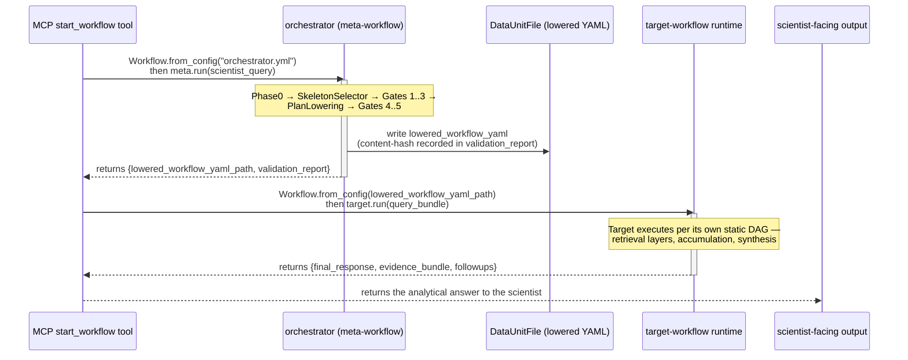

# Meta-Workflow Orchestration — The Orchestrator IS a Nanobrain Workflow

**Status:** Design / pre-implementation
**Audience:** Nanobrain framework reviewers, orchestrator implementors, composer maintainers, anyone debugging a "the workflow built but did nothing" failure
**Supplements:** `nanobrain_alignment_audit.md` (the ground-truth findings that motivate this doc), `agent_workflow_authoring.md` (policy/contract layer above this topology), `nanobrain_workflow_design.md` (the static-DAG-with-conditional-gating pattern that the meta-workflow itself uses), `workflow_output_contract.md` (Phase 0 ExecutionPlan), `nanobrain_capability_gaps.md` (G1, G6, G9 + the new G14–G19)
**Read first:** `.claude/skills/nanobrain-workflow-authoring/SKILL.md`, `.claude/skills/nanobrain-step-authoring/SKILL.md`, `.claude/skills/nanobrain-data-units-triggers-links/SKILL.md`, `.claude/skills/nanobrain-from-config/SKILL.md`, `.claude/skills/nanobrain-config-yaml/SKILL.md`

---

## 1. Why this document exists

The `nanobrain_alignment_audit.md` produced six DUPLICATES-REWRITE findings against
`agent_workflow_authoring.md`. Three of them collapse into a single design defect: the
orchestrator that builds analytical workflows was specified as a procedural pipeline of
LLM calls and code-owned helper functions sitting *outside* the nanobrain framework.

The relevant audit findings, quoted verbatim:

- **F-1** (`agent_workflow_authoring.md §3`) — "ExecutionPlan described as free-form
  'JSON object emitted by LLM'. Recast as `ExecutionPlanConfig` (Pydantic ConfigBase)
  carried in a `DataUnitMemory`. The schema lives in apecx-mcp; the carrier and
  validation are nanobrain."
- **F-2** (`agent_workflow_authoring.md §5`) — "Plan-to-YAML lowering described as
  'code-owned function'. Recast as `PlanLoweringStep` (nanobrain `BaseStep` subclass).
  Inputs: `ExecutionPlanConfig` DataUnit + `SkeletonRefConfig` DataUnit. Output:
  `WorkflowYamlConfig` DataUnit. The Step IS the lowering."
- **F-3** (`agent_workflow_authoring.md §6`) — "5-gate validation pipeline as
  procedural pseudocode. Recast as 5 nanobrain Steps connected by `DirectLink`s with
  `auto_transfer: true`. Each gate's failure triggers FAIL-FAST
  `ComponentConfigurationError`."
- **F-6** (`agent_workflow_authoring.md §7`) — "Repair loop as procedural retry. Recast
  as `LoopController` step + `ConditionalLink` predicate; max-iteration enforced by step
  config."

This document is the canonical specification of the **orchestrator topology** that
satisfies all four findings simultaneously. It is the doc the alignment audit's §5
(*The unification anchor*) and §7 action item #1 demand.

The relationship to its sister doc `agent_workflow_authoring.md` is layered:
the sister doc is the **policy/contract layer** (the three strategies, the
rejection schema, the repair contract, the conversation-chaining decision
rule, the failure-mode atlas — *what* the orchestrator does); this doc is
the **canonical topology layer** (which Steps, DataUnits, Links, Triggers,
YAML — *how* the orchestrator is wired as a real nanobrain `Workflow`).

The two docs are in lockstep: every behavior the policy doc mandates is
realized by a Step or Link specified here. Where the policy doc says "the
agent re-emits a plan after a Gate 3 rejection", this doc says "the
`ConditionalLink` from `gate3_hole_bindings` to `repair_step` evaluates the
predicate `validation_report.failed_gate == 'gate3'`; the trigger on
`repair_step` fires; the agent inside `repair_step` writes a corrected
`ExecutionPlanConfig` back to re-fire the chain."

This document supersedes `agent_workflow_authoring.md` *for the orchestrator
topology specifically*. It does not supersede the policy/contract material in
that doc; references go both ways.

<!-- SECTION_1_END -->
---

## 2. The unification claim

> **The orchestrator IS a nanobrain workflow. The ExecutionPlan IS a DataUnit shape.
> The plan-to-YAML lowering IS a Step. The 5 validation gates ARE 5 Steps. The repair
> loop IS a ConditionalLink. The lowered workflow YAML produced as the orchestrator's
> output is a `DataUnitFile` payload that the target-workflow runtime then loads via
> `Workflow.from_config()`.**

There is exactly one nanobrain framework on the table. Every load-bearing concept in
the orchestrator surface is expressed in nanobrain primitives — Steps, Links,
Triggers, DataUnits, Agents — composed by a `WorkflowConfig` YAML. There is no
parallel "orchestrator runtime" sitting beside the framework; there is no
hand-rolled procedural pipeline; there is no place where a code-owned function
substitutes for a Step that should have existed.

This unification has four direct consequences:

1. **The same `Workflow.from_config()` load path runs the orchestrator and the target
   workflow it constructs.** No special-case loader for the orchestrator. No
   special-case scheduler.
2. **Every orchestrator invocation produces a provenance trail using the same
   per-step provenance hook (`G4 ProvenanceContext`) that the target workflow uses.**
   The audit log shows the full authoring journey from query to lowered YAML in the
   same JSONL the target workflow's records land in (see §14).
3. **The orchestrator's static-DAG validation runs against the orchestrator itself**
   — the `Workflow.from_config()` integrity validator (cycle detection, orphan
   detection, plural-data-units enforcement per `architecture.md §13` brutal-truth
   #4) catches authoring errors in the orchestrator topology with the same
   FAIL-FAST messages it uses everywhere else.
4. **Strategy pivots A/B/C are configurations of the same topology, not separate
   topologies.** A different Phase 0 system_prompt and a different `SkeletonLoader`
   adapter swap in via the YAML's `class:` + `config:` references; the meta-workflow
   shape is invariant (see §9).

Cross-reference: `nanobrain_alignment_audit.md §5` ("The unification anchor —
orchestrator IS a nanobrain workflow") establishes this claim at the audit level;
this document operationalizes it.

<!-- SECTION_2_END -->
---

## 3. Meta-workflow topology

The meta-workflow is a linear gate chain with one repair-loop fan-in. It expands the
diagram from `nanobrain_alignment_audit.md §5` by labelling every link with the
DataUnit name that flows across it. Names match §5 (Data unit catalogue) verbatim.

```mermaid
flowchart LR
    Q[scientist_query<br/>DataUnitMemory] -->|scientist_query| P0[phase0_planning<br/>Phase0PlanningStep<br/>Agent inside]
    P0 -->|execution_plan| SS[skeleton_selector<br/>SkeletonSelectorStep]
    SS -->|skeleton_ref| G1[gate1_plan_schema<br/>Gate1PlanSchemaStep]
    G1 -->|execution_plan + validation_report| G2[gate2_skeleton_exists<br/>Gate2SkeletonExistsStep]
    G2 -->|skeleton_ref + validation_report| G3[gate3_hole_bindings<br/>Gate3HoleBindingsStep]
    G3 -->|hole_bindings + validation_report| PL[plan_lowering<br/>PlanLoweringStep]
    PL -->|lowered_workflow_yaml| G4[gate4_static_validation<br/>Gate4StaticValidationStep]
    G4 -->|lowered_workflow_yaml + validation_report| G5[gate5_resource_envelope<br/>Gate5ResourceEnvelopeStep]
    G5 -->|lowered_workflow_yaml| OUT([Workflow output:<br/>lowered_workflow_yaml<br/>DataUnitFile])

    G1 -. ConditionalLink<br/>failed_gate==gate1 .-> RP[repair_step<br/>RepairStep<br/>Agent inside]
    G2 -. ConditionalLink<br/>failed_gate==gate2 .-> RP
    G3 -. ConditionalLink<br/>failed_gate==gate3 .-> RP
    G4 -. ConditionalLink<br/>failed_gate==gate4 .-> RP
    G5 -. ConditionalLink<br/>failed_gate==gate5 .-> RP
    RP -->|execution_plan revised| P0

    RP -. exhausted<br/>repair_attempts>=2 .-> ESC[escalate_to_user<br/>EscalateToUserStep]
    ESC --> ERR([Workflow output:<br/>escalation_payload<br/>DataUnitMemory])
```



Reading the diagram: solid arrows are `DirectLink` instances with
`auto_transfer: true` (the silent-failure shape from `architecture.md §13`
brutal-truth #3 is structurally excluded). Dotted arrows are `ConditionalLink`
instances using the declarative DSL from `nanobrain_capability_gaps.md G1`
(no Python predicates inline); the predicate operates on the
`validation_report` payload. The repair routing uses one `ConditionalLink` per
gate, all targeting `repair_step`; `RepairStep` writes a corrected
`execution_plan` back to re-fire the chain from `phase0_planning`. The
`escalate_to_user` step is the terminal failure path, gated by `RepairStep`'s
internal attempt counter (§13).

The topology is intentionally **linear-with-one-fan-in**. Gates fire in
sequence because each gate depends on the prior gate's output (a parsed plan,
a resolved skeleton, validated bindings, a lowered YAML); there is nothing to
parallelize. Total wall time is the sum of individual gate latencies (~500 ms
typical, dominated by Gate 4's `Workflow.from_config()` dry-run).

<!-- SECTION_3_END -->
---

## 4. Step inventory

Every box in the diagram is a nanobrain `BaseStep` subclass instantiated via
`from_config`. The table below enumerates each Step. The **Lives in** column
classifies each Step per `nanobrain_alignment_audit.md §6`: domain-neutral Steps
belong in `nanobrain/`, APECx-vocabulary Steps belong in `apecx-mcp-integration/`.

| Step ID | Class | Purpose | Inputs (DataUnit names) | Outputs | Triggers | Lives in | Notes |
|---|---|---|---|---|---|---|---|
| `phase0_planning` | `Phase0PlanningStep` (apecx-mcp) | Wraps a nanobrain `Agent` whose `system_prompt` is the Phase 0 planner. Reads the raw query; emits a structured `ExecutionPlanConfig`. | `scientist_query` | `execution_plan` | `DataUnitChangeTrigger` on `scientist_query` | apecx-mcp | The Step's only nanobrain-side responsibility is to call its embedded `Agent`. The system_prompt (per workspace rule "no hardcoded prompts") lives in YAML at `composition/agents/phase0_planner_agent.yml`. The Agent's output is parsed against `ExecutionPlanConfig` (G16) before being written to the output DataUnit. |
| `skeleton_selector` | `SkeletonSelectorStep` (apecx-mcp) | Reads `execution_plan.skeleton_id` + `skeleton_version`; resolves against the skeleton catalogue; emits a `SkeletonRefConfig` carrying the resolved `skeleton.yml` path + `skeleton.schema.json` path + content digest. | `execution_plan` | `skeleton_ref` | `DataUnitChangeTrigger` on `execution_plan` | apecx-mcp | The catalogue lookup is APECx-specific (the catalogue contents are domain-vocabulary). Once `G9 SkeletonLoaderStep` lands in nanobrain, the lookup can be delegated to it; until then this Step holds both the catalogue index and the loader logic. |
| `gate1_plan_schema` | `Gate1PlanSchemaStep` (nanobrain) | Validates `execution_plan` against `ExecutionPlanConfig`'s Pydantic schema. On pass, forwards the plan unchanged; on fail, writes a structured `ValidationReportConfig` with `failed_gate: "gate1"` to `validation_report`. | `execution_plan` | `execution_plan` (passthrough), `validation_report` | `DataUnitChangeTrigger` on `execution_plan` | nanobrain | Domain-neutral: schema validation is a framework concern. The Step's config takes a `schema_ref` field pointing at any `ConfigBase` subclass (G6). |
| `gate2_skeleton_exists` | `Gate2SkeletonExistsStep` (nanobrain, with apecx adapter) | Confirms `skeleton_ref` resolved against a registry that returns the same digest the plan pinned. On pass, forwards `skeleton_ref` unchanged; on fail, emits `validation_report` with `failed_gate: "gate2"`. | `skeleton_ref`, `execution_plan` | `skeleton_ref` (passthrough), `validation_report` | `DataUnitChangeTrigger` on `skeleton_ref` | nanobrain (the registry-confirm shape is generic; the registry adapter is APECx) | The Step takes a `registry_adapter` config field. The default adapter is `apecx.composition.SkeletonRegistry` (apecx-mcp); other registries (e.g., a federated catalogue) can be plugged in. |
| `gate3_hole_bindings` | `Gate3HoleBindingsStep` (nanobrain) | Reads `execution_plan.parameter_bindings` + `execution_plan.tool_invocations`; validates against `skeleton_ref.schema_path`'s declared holes (types, required/optional, defaults applied). On pass, emits `hole_bindings`; on fail, `validation_report` with `failed_gate: "gate3"`. | `execution_plan`, `skeleton_ref` | `hole_bindings`, `validation_report` | `DataUnitChangeTrigger` on `skeleton_ref` (which arrives strictly after `execution_plan` in the chain) | nanobrain | The hole grammar (per `agent_workflow_authoring.md §4.1`) is a typed subset of JSON Schema. The Step's logic is generic; APECx contributes the catalogue contents the schemas describe. |
| `plan_lowering` | `PlanLoweringStep` (nanobrain) | Reads `execution_plan` + `skeleton_ref` + `hole_bindings`; performs the seven-step lowering (skeleton resolution, binding validation, hole substitution, ConditionalLink predicate rewriting, tool descriptor embedding, provenance seed injection, content hash computation) per `agent_workflow_authoring.md §5.1`. Emits a fully-lowered `WorkflowYamlConfig` payload to `lowered_workflow_yaml`. | `execution_plan`, `skeleton_ref`, `hole_bindings` | `lowered_workflow_yaml` | `AllDataReceivedTrigger` on `[execution_plan, skeleton_ref, hole_bindings]` | nanobrain | The lowering is deterministic — same inputs produce the same bytes and the same content hash (load-bearing for reproducibility per `hpc_reproducibility_spec.md`). The Step's `process()` is a pure transformation; no LLM call. |
| `gate4_static_validation` | `Gate4StaticValidationStep` (nanobrain) | Wraps `Workflow.from_config(lowered_yaml)` + `Workflow.initialize()` in a dry-run mode (no executors launched, no data emitted). Catches every FAIL-FAST shape the framework can detect at init: cycles, orphans, missing data units, `auto_transfer=False` on DirectLinks (the dominant silent-failure shape from `architecture.md §13.3`). | `lowered_workflow_yaml` | `lowered_workflow_yaml` (passthrough), `validation_report` | `DataUnitChangeTrigger` on `lowered_workflow_yaml` | nanobrain | This Step is the framework-side wrapper around `Workflow.from_config()`. It is domain-neutral — it just executes the loader and catches `ComponentConfigurationError` with the `FAIL-FAST:` prefix. The wrapper is the Step's contribution; the loader is already shipped. |
| `gate5_resource_envelope` | `Gate5ResourceEnvelopeStep` (nanobrain) | Reads the lowered YAML's per-step `resource_envelope` blocks (G12), aggregates per-workflow CPU/memory/walltime, and compares against per-user thresholds + per-executor caps from the workflow config. On pass, forwards `lowered_workflow_yaml`; on fail, emits `validation_report` with `failed_gate: "gate5"`. | `lowered_workflow_yaml` | `lowered_workflow_yaml` (terminal output), `validation_report` | `DataUnitChangeTrigger` on `lowered_workflow_yaml` | nanobrain | Aggregation logic is generic per G12 (`aggregate_resource_envelope()`); the threshold-source is configurable. APECx-specific cost catalogues are injected via the Step's `cost_catalog_ref` config field. |
| `repair_step` | `RepairStep` (apecx-mcp) | Wraps a nanobrain `Agent` whose `system_prompt` is the repair-loop prompt. Reads the failing `validation_report` + the rejected `execution_plan`; produces a corrected `execution_plan` that addresses the `suggested_repair` field. Increments an internal attempt counter; on `repair_attempts >= 2` short-circuits and routes to `escalate_to_user` instead of re-emitting. | `validation_report`, `execution_plan` | `execution_plan` (revised) OR `escalation_payload` (when exhausted) | `DataUnitChangeTrigger` on `validation_report` | apecx-mcp | The repair prompt is APECx-specific (it references the gate vocabulary); the bookkeeping (attempt counter, exhaust routing) is domain-neutral but lives here until `G18 LoopController` lands. See §13 for the migration plan. |
| `escalate_to_user` | `EscalateToUserStep` (apecx-mcp) | Terminal failure path. Reads the `gate_failures` history accumulated across the repair cycles + the latest `validation_report`; produces a structured `escalation_payload` (matching `agent_workflow_authoring.md §7.3`) that the MCP surface returns to the user. Halts the workflow. | `validation_report`, `gate_failures_history` | `escalation_payload` | `DataUnitChangeTrigger` on `validation_report` (gated on attempt counter via ConditionalLink) | apecx-mcp | The payload shape and the `required_information` heuristic are APECx-specific; the "halt the workflow" mechanics are framework-level (the workflow's `output_data_units` carry the escalation payload, and the cascade settles). |

**Summary by destination** (cross-references `nanobrain_alignment_audit.md §6`):

- **In nanobrain (5 Steps):** `Gate1PlanSchemaStep`, `Gate2SkeletonExistsStep` (with
  pluggable registry adapter), `Gate3HoleBindingsStep`, `PlanLoweringStep`,
  `Gate4StaticValidationStep`, `Gate5ResourceEnvelopeStep`.
- **In apecx-mcp (4 Steps):** `Phase0PlanningStep`, `SkeletonSelectorStep`,
  `RepairStep`, `EscalateToUserStep`.

Every "in nanobrain" Step is **domain-neutral, composable, and worth the lifecycle
cost** per the audit's split rule (§2). Every "in apecx-mcp" Step carries APECx
vocabulary (the Phase 0 prompt, the skeleton catalogue, the repair prompt, the
escalation payload shape) and depends on apecx-mcp services.

<!-- SECTION_4_END -->
---

## 5. Data unit catalogue

Every DataUnit in the meta-workflow. The `Carrier of` column names the
Pydantic-shaped payload (every payload is an explicit Pydantic model with
`extra='forbid'` per workspace memory `pydantic_extra_forbid_rule.md`).

| Name | Class | Schema (Pydantic model) | Carrier of |
|---|---|---|---|
| `scientist_query` | `DataUnitMemory` | `QueryBundle` (apecx-mcp) | `{query: str, session_id: str, user_id: str, intent_hint: Optional[str], session_context: Optional[SessionContext]}` — the raw inbound query plus session metadata. Created by the MCP `start_workflow` tool from the inbound MCP request. |
| `execution_plan` | `DataUnitMemory` | `ExecutionPlanConfig` (apecx-mcp; per audit G16) | The structured plan the Phase 0 planner emits. Schema matches `agent_workflow_authoring.md §3.1` (plan_version, strategy, skeleton_id, skeleton_version, active_layers, parameter_bindings, tool_invocations, resource_envelope, provenance_seed). Carried as a Pydantic instance, NOT a free-form JSON string — this is the F-1 fix. |
| `skeleton_ref` | `DataUnitMemory` | `SkeletonRefConfig` (nanobrain, with apecx-mcp catalogue contents) | `{skeleton_id: str, skeleton_version: str, skeleton_yml_path: Path, schema_json_path: Path, content_digest: str, holes: Dict[str, HoleSpec]}` — the resolved pointer to the skeleton on disk plus its hole declarations cached for downstream gates. |
| `hole_bindings` | `DataUnitMemory` | `HoleBindingsConfig` (nanobrain) | `{bindings: Dict[str, Any], applied_defaults: Dict[str, Any], tool_descriptor_resolutions: Dict[str, ResolvedToolDescriptor]}` — the type-checked bindings ready for Step 3 (hole substitution) of the lowering. The `tool_descriptor_resolutions` field carries pre-resolved UTDs so `PlanLoweringStep` does not re-fetch them. |
| `lowered_workflow_yaml` | `DataUnitFile` | `WorkflowYamlConfig` (nanobrain — but the payload IS a `WorkflowConfig`-shaped YAML on disk) | The fully-lowered, dry-run-validated workflow YAML written to a deterministic path. The `DataUnitFile` choice is intentional: the YAML is the durable artifact downstream consumers (HPC bundle exporter, replay tool, audit log) reference by path. The companion content-hash is recorded in `validation_report.lowered_yaml_hash`. |
| `validation_report` | `DataUnitMemory` | `ValidationReportConfig` (nanobrain) | `{plan_hash: str, gate_results: List[GateResult], failed_gate: Optional[Literal["gate1","gate2","gate3","gate4","gate5"]], error_code: Optional[str], error_detail: Optional[str], suggested_repair: Optional[str], lowered_yaml_hash: Optional[str]}` — accumulates per-gate pass/fail records. On any gate failure, `failed_gate` is set and the chain's ConditionalLinks route to `repair_step`. On full pass, `failed_gate` is None and the meta-workflow's output cascade settles. |
| `escalation_payload` | `DataUnitMemory` | `EscalationPayloadConfig` (apecx-mcp) | The structured escalation message per `agent_workflow_authoring.md §7.3`: `{reason, gate_failures: List[GateFailure], suggested_action, required_information}`. Written by `escalate_to_user` after repair exhaustion. |

**Workflow-level data units** (per `architecture.md §13` brutal-truth #4 — both
`input_data_units` and `output_data_units` MUST be plural maps at the workflow
level, NOT pulled into individual Steps):

- **Inputs (workflow level):** `scientist_query`.
- **Outputs (workflow level):** `lowered_workflow_yaml` (success path),
  `escalation_payload` (failure path), `validation_report` (always, for audit).

The full validation_report is exposed as a workflow-level output even on the success
path because the cumulative gate-result history is the audit trail the provenance
recorder consumes (see §14).

A note on schema ownership: per the audit (§3.1, C-2), the `ExecutionPlanConfig`
schema lives in `apecx-mcp` (the *plan vocabulary* is APECx-domain) but the
`DataUnitMemory` carrying it is nanobrain. This matches the audit's split rule:
the carrier and validation are nanobrain; the schema content is apecx-mcp.

<!-- SECTION_5_END -->
---

## 6. Link catalogue

Every Link in the meta-workflow. All `DirectLink` instances declare
`auto_transfer: true` explicitly — this is the structural enforcement of
`architecture.md §13` brutal-truth #3 (the dominant silent-failure shape). The
`ConditionalLink` predicates use the declarative DSL proposed in
`nanobrain_capability_gaps.md G1` (no Python predicates inline).

| Source | Target | Class | auto_transfer | Predicate (if conditional) |
|---|---|---|---|---|
| `scientist_query` (workflow input) | `phase0_planning.input` | `DirectLink` | `true` | — |
| `phase0_planning.execution_plan` | `skeleton_selector.execution_plan` | `DirectLink` | `true` | — |
| `skeleton_selector.skeleton_ref` | `gate1_plan_schema.skeleton_ref` | `DirectLink` | `true` | — |
| `phase0_planning.execution_plan` | `gate1_plan_schema.execution_plan` | `DirectLink` | `true` | — |
| `gate1_plan_schema.execution_plan` | `gate2_skeleton_exists.execution_plan` | `DirectLink` | `true` | — |
| `gate1_plan_schema.skeleton_ref` | `gate2_skeleton_exists.skeleton_ref` | `DirectLink` | `true` | — |
| `gate2_skeleton_exists.skeleton_ref` | `gate3_hole_bindings.skeleton_ref` | `DirectLink` | `true` | — |
| `gate2_skeleton_exists.execution_plan` | `gate3_hole_bindings.execution_plan` | `DirectLink` | `true` | — |
| `gate3_hole_bindings.hole_bindings` | `plan_lowering.hole_bindings` | `DirectLink` | `true` | — |
| `gate3_hole_bindings.skeleton_ref` | `plan_lowering.skeleton_ref` | `DirectLink` | `true` | — |
| `gate3_hole_bindings.execution_plan` | `plan_lowering.execution_plan` | `DirectLink` | `true` | — |
| `plan_lowering.lowered_workflow_yaml` | `gate4_static_validation.lowered_workflow_yaml` | `DirectLink` | `true` | — |
| `gate4_static_validation.lowered_workflow_yaml` | `gate5_resource_envelope.lowered_workflow_yaml` | `DirectLink` | `true` | — |
| `gate5_resource_envelope.lowered_workflow_yaml` | `lowered_workflow_yaml` (workflow output) | `DirectLink` | `true` | — |
| `gate5_resource_envelope.validation_report` | `validation_report` (workflow output) | `DirectLink` | `true` | — |
| `gate1_plan_schema.validation_report` | `repair_step.validation_report` | `ConditionalLink` | `true` | `{op: eq, field: "failed_gate", value: "gate1"}` |
| `gate2_skeleton_exists.validation_report` | `repair_step.validation_report` | `ConditionalLink` | `true` | `{op: eq, field: "failed_gate", value: "gate2"}` |
| `gate3_hole_bindings.validation_report` | `repair_step.validation_report` | `ConditionalLink` | `true` | `{op: eq, field: "failed_gate", value: "gate3"}` |
| `gate4_static_validation.validation_report` | `repair_step.validation_report` | `ConditionalLink` | `true` | `{op: eq, field: "failed_gate", value: "gate4"}` |
| `gate5_resource_envelope.validation_report` | `repair_step.validation_report` | `ConditionalLink` | `true` | `{op: eq, field: "failed_gate", value: "gate5"}` |
| `repair_step.execution_plan_revised` | `phase0_planning.repair_input` | `ConditionalLink` | `true` | `{op: ne, field: "escalation_required", value: true}` |
| `repair_step.escalation_payload` | `escalate_to_user.input` | `ConditionalLink` | `true` | `{op: eq, field: "escalation_required", value: true}` |
| `escalate_to_user.escalation_payload` | `escalation_payload` (workflow output) | `DirectLink` | `true` | — |

The repair-routing back-edge (`repair_step.execution_plan_revised` →
`phase0_planning.repair_input`) is a controlled cycle. Until `G18 LoopController`
lands, this back-edge is implemented as a manual trigger reset: `RepairStep`
writes to a *separate* DataUnit (`phase0_planning.repair_input`, distinct from
the original `scientist_query` link target). The DAG remains acyclic in the
strict graph sense; the cycle is at the data-flow level, bookkept by the
attempt counter inside `RepairStep`. See §11 and §13 for the migration.

**Why two ConditionalLinks out of `repair_step` and not one TransformLink:**
TransformLink is forbidden by the apecx-mcp-integration "Composer prompt
engineering is load-bearing" rule (LLMs hallucinate `transform_function` import
paths). Shape-bridging is done by a dedicated Step: `RepairStep`'s `process()`
produces both `execution_plan_revised` and `escalation_payload` outputs; the
two ConditionalLinks read the appropriate one based on the boolean
`escalation_required` field.

<!-- SECTION_6_END -->
---

## 7. Trigger catalogue

Every Trigger declared inside the meta-workflow's Steps. Per the
`nanobrain-data-units-triggers-links` SKILL, triggers are owned by the Step (NOT
the workflow) and configured in each Step's YAML.

| Trigger | Type | Watches | Notes |
|---|---|---|---|
| `phase0_planning_trigger` | `DataUnitChangeTrigger` | `phase0_planning.input` (which arrives via the workflow-input DirectLink from `scientist_query`) | Fires once per workflow invocation on the initial `scientist_query` write. The repair-routing back-edge writes to a *separate* `repair_input` DataUnit (see §6); a second trigger on that unit handles re-fires. |
| `phase0_planning_repair_trigger` | `DataUnitChangeTrigger` | `phase0_planning.repair_input` | Fires when `repair_step` writes a corrected plan. The Step's `process()` examines which input fired and routes accordingly (initial vs. repair variant of the prompt). |
| `skeleton_selector_trigger` | `DataUnitChangeTrigger` | `skeleton_selector.execution_plan` | Standard cascade — fires on each upstream emission. |
| `gate1_plan_schema_trigger` | `DataUnitChangeTrigger` | `gate1_plan_schema.execution_plan` | — |
| `gate2_skeleton_exists_trigger` | `DataUnitChangeTrigger` | `gate2_skeleton_exists.skeleton_ref` | The skeleton_ref arrives strictly after the execution_plan in the chain (selector runs after planning), so a single-input change-trigger is sufficient. |
| `gate3_hole_bindings_trigger` | `DataUnitChangeTrigger` | `gate3_hole_bindings.skeleton_ref` | Same ordering rationale. |
| `plan_lowering_trigger` | `AllDataReceivedTrigger` | `[execution_plan, skeleton_ref, hole_bindings]` | This is the only `AllDataReceivedTrigger` in the meta-workflow today. PlanLoweringStep needs all three inputs to compute. The expected set is **static** (no `expected_set_source` per `nanobrain_capability_gaps.md G2`) because the meta-workflow's gating is at the link level (ConditionalLink routes failures to `repair_step`, not gates around `plan_lowering`). The static set is sound for this DAG. |
| `gate4_static_validation_trigger` | `DataUnitChangeTrigger` | `gate4_static_validation.lowered_workflow_yaml` | — |
| `gate5_resource_envelope_trigger` | `DataUnitChangeTrigger` | `gate5_resource_envelope.lowered_workflow_yaml` | — |
| `repair_step_trigger` | `DataUnitChangeTrigger` | `repair_step.validation_report` | One trigger covers all five fan-in ConditionalLinks; each link writes to the same input DataUnit, and the Step's `process()` reads `failed_gate` to dispatch. |
| `escalate_to_user_trigger` | `DataUnitChangeTrigger` | `escalate_to_user.input` | Fires when `repair_step` writes the `escalation_payload` after exhaust. |

**No `AllDataReceivedTrigger` is used at the repair convergence point today.** A
multi-strategy meta-workflow that dispatched to several parallel planners (e.g., a
Strategy A planner racing a Strategy B composer) and waited for both before
selecting a winner WOULD use `AllDataReceivedTrigger` at the convergence Step. The
current single-strategy design does not need it. The future possibility is called
out here so a reader does not assume the absence is an oversight.

**Trigger-payload-wrapping discipline** (per `architecture.md §13.5`): every
trigger receives a `{unit_name: payload}` envelope from the framework. Steps
unwrap it inside `_execute_process` (the framework's wrapper); the Step's
`process()` sees the raw payload. This is uniform across the meta-workflow; no
Step looks at the wrapper itself.

<!-- SECTION_7_END -->
---

## 7.5 Long-lived autonomous variant

The trigger catalogue above (§7) describes the **interactive** orchestrator —
each invocation is initiated by a synchronous `start_workflow` MCP call and
the orchestrator runs to completion (or to a HITL pause) within that
call's lifecycle. The same orchestrator workflow can also run as a
**long-lived autonomous task** (per `autonomous_workflow_agent.md`) without
changes to the orchestrator's step graph. Only the entry trigger and the
runtime context differ.

### 7.5.1 Same code, different lifecycle

The autonomous variant uses the **same** orchestrator.yml from §8 with
**no changes to the steps, links, or internal triggers**. The differences
sit at two boundaries:

| Boundary | Interactive variant | Autonomous variant |
|---|---|---|
| Entry trigger | `phase0_planning_trigger` (DataUnitChangeTrigger) wakes on the `scientist_query` write driven by the synchronous `start_workflow` MCP call | `WorkflowEntryTrigger` (gap **G22**) wraps a `TimerTrigger` / `ManualTrigger` / `EventTrigger` and calls `Workflow.run_detached()` (gap **G21**) |
| Runtime ownership | The MCP request handler's asyncio loop owns the workflow run; on request completion, the run terminates | A `WorkflowRunner` (G21) owns the loop; the run survives MCP client disconnects, persists state to the durability backend, and resumes from checkpoint after process restart |

The orchestrator's internal steps (Phase 0 planning, skeleton selection, the
five validation gates, repair routing, and lowering) are identical. The
HITL gates emit Approval rows the same way; the difference is that under
autonomous mode the gates may auto-resolve on timeout per the
`autonomous_workflow_agent.md §3` autonomy_level (and per the per-gate
behavior matrix in `hitl_safety_gates.md §3.1.1`).

### 7.5.2 Why "same code, different lifecycle" is the right boundary

We considered a separate "autonomous orchestrator" workflow definition. The
arguments against:

1. **Skeleton library reuse.** The interactive orchestrator's lowering
   pipeline produces a workflow YAML that gets executed; the autonomous
   variant produces the same YAML and executes it the same way. A separate
   workflow definition would duplicate the lowering pipeline.
2. **Validation gate parity.** The five gates in §6 must apply identically
   to both modes — an autonomous task that bypasses Gate 4 would silently
   ship `auto_transfer=False` workflows. Forking the workflow risks gate
   drift.
3. **Provenance graph continuity.** The same `lowered_yaml_hash` discipline
   applies (`hpc_reproducibility_spec.md §3`). A separate fork would compute
   different hashes for the same logical workflow.

The decision: **one orchestrator definition; two trigger configurations.** The
autonomous variant ships as a sibling YAML
(`composition/workflows/orchestrator/orchestrator.autonomous.yml`) that
imports the interactive orchestrator and overrides only the entry trigger.

### 7.5.3 Entry-trigger override sketch

```yaml
# composition/workflows/orchestrator/orchestrator.autonomous.yml
class: nanobrain.core.workflow.Workflow
config:
  name: meta_workflow_orchestrator_autonomous
  # Inherit step graph from the interactive variant:
  inherit_from: composition/workflows/orchestrator/orchestrator.yml
  # Override the entry trigger:
  entry_trigger:
    class: nanobrain.library.runtime.WorkflowEntryTrigger        # G22
    config:
      inner_trigger:
        class: nanobrain.core.trigger.TimerTrigger
        config:
          cron: "0 2 * * 0"
      target_workflow: meta_workflow_orchestrator
      payload_factory: apecx_integration.composition.payloads.weekly_digest
      autonomy_level: pure_autonomous
      cost_envelope_template: weekly_digest_default
  # Override the runtime context:
  runtime:
    runner_class: nanobrain.library.runtime.WorkflowRunner       # G21
    persistence_backend: apecx_integration.control_plane.runtime.PostgresTaskStore
```

The `inherit_from` field is itself a small framework extension (call it
G22a if it surfaces as needing its own gap entry; for now it's covered by
G22's scope as "wiring triggers to workflow entries"). It loads the parent
YAML, then overlays the named fields.

### 7.5.4 What the autonomous variant adds beyond trigger override

Three behavioral additions live in the autonomous variant but require no
changes to the interactive variant:

1. **Heartbeat emission.** The runner emits a heartbeat every 60s
   (`autonomous_workflow_agent.md §5.2`) to the `autonomous_task` table.
   The interactive variant has no heartbeat (the MCP request lifetime is
   the implicit liveness signal).
2. **Cost envelope enforcement.** The runner aggregates per-step cost
   actuals and halts the task when a cap is hit
   (`autonomous_workflow_agent.md §8`). The interactive variant aggregates
   for billing but does not halt — the user's MCP timeout is the implicit
   limit.
3. **Operator control plane.** The runner honors the four new MCP tools
   (`pause_autonomous_task`, `cancel_autonomous_task`, etc.) that target
   the task by `task_id`. The interactive variant has no equivalent
   surface — its lifecycle is the user's MCP session.

These three additions are **runtime concerns** (owned by the
`WorkflowRunner`), not orchestrator-step concerns. The orchestrator's step
graph is unaware of which variant it's running under, which is the point.

<!-- SECTION_7.5_END -->
---

## 8. The full YAML — annotated example

The orchestrator lives at
`apecx-mcp-integration/composition/workflows/orchestrator/orchestrator.yml`. Every
field referenced by `WorkflowConfig` (per the `nanobrain-workflow-authoring`
SKILL) is present; no `...` placeholders. Every `auto_transfer: true` is explicit
(per `architecture.md §13` brutal-truth #3); every nested reference uses the
`class:` + `config:` recursive pattern (per `nanobrain-config-yaml` SKILL); both
`input_data_units` and `output_data_units` are present at the workflow level (per
brutal-truth #4).

```yaml
# composition/workflows/orchestrator/orchestrator.yml
# Meta-workflow that constructs analytical workflows.
# Loaded by Workflow.from_config(); produces a lowered_workflow_yaml that the
# target-workflow runtime then loads via Workflow.from_config() again.

name: orchestrator_meta_workflow
version: "1.0"
description: >
  The orchestrator that builds analytical workflows. This workflow IS a
  nanobrain workflow per nanobrain_alignment_audit.md §5. Its output is a
  fully-lowered Workflow YAML that the target-workflow runtime loads.

config_version: 2                    # G7: auto_transfer defaults True under v2
gate_semantics: gate_to_bottom       # G10: ConditionalLink-off writes sentinel

# Workflow-level data units (plural maps per architecture.md §13 brutal-truth #4)
input_data_units:
  scientist_query:
    class: "nanobrain.core.data_unit.DataUnitMemory"
    name: scientist_query
    config:
      schema_ref:
        class: "apecx_integration.composition.schemas.QueryBundle"

output_data_units:
  lowered_workflow_yaml:
    class: "nanobrain.core.data_unit.DataUnitFile"
    name: lowered_workflow_yaml
    config:
      base_path: "${env:APECX_LOWERED_YAML_DIR:/tmp/apecx/lowered}"
      filename_template: "lowered_${run_id}.yml"

  validation_report:
    class: "nanobrain.core.data_unit.DataUnitMemory"
    name: validation_report
    config:
      schema_ref:
        class: "apecx_integration.composition.schemas.ValidationReportConfig"

  escalation_payload:
    class: "nanobrain.core.data_unit.DataUnitMemory"
    name: escalation_payload
    config:
      schema_ref:
        class: "apecx_integration.composition.schemas.EscalationPayloadConfig"

# Workflow-level provenance (G4); see §14
provenance:
  enabled: true
  sink:
    class: "nanobrain.core.provenance.JsonlSink"
    config:
      path: "${env:APECX_PROVENANCE_DIR:/tmp/apecx/provenance}/orchestrator.jsonl"
      flush_every: 1
  redact:
    - "scientist_query.user_id"

# Per-run context (G13)
run_context:
  class: "nanobrain.core.workflow.WorkflowRunContext"
  config:
    run_id_strategy: uuid_v7
    proxystore_namespace_template: "orchestrator_run_${run_id}"

# Steps — every box in the §3 diagram (destinations per §4 / audit §6)
steps:
  phase0_planning:
    class: "apecx_integration.composition.steps.Phase0PlanningStep"
    config: "steps/phase0_planning_step.yml"
    executor: local

  skeleton_selector:
    class: "apecx_integration.composition.steps.SkeletonSelectorStep"
    config: "steps/skeleton_selector_step.yml"
    executor: local

  gate1_plan_schema:
    class: "nanobrain.core.gates.Gate1PlanSchemaStep"
    config: "steps/gate1_plan_schema_step.yml"
    executor: local

  gate2_skeleton_exists:
    class: "nanobrain.core.gates.Gate2SkeletonExistsStep"
    config: "steps/gate2_skeleton_exists_step.yml"
    executor: local

  gate3_hole_bindings:
    class: "nanobrain.core.gates.Gate3HoleBindingsStep"
    config: "steps/gate3_hole_bindings_step.yml"
    executor: local

  plan_lowering:
    class: "nanobrain.core.gates.PlanLoweringStep"
    config: "steps/plan_lowering_step.yml"
    executor: local

  gate4_static_validation:
    class: "nanobrain.core.gates.Gate4StaticValidationStep"
    config: "steps/gate4_static_validation_step.yml"
    executor: local

  gate5_resource_envelope:
    class: "nanobrain.core.gates.Gate5ResourceEnvelopeStep"
    config: "steps/gate5_resource_envelope_step.yml"
    executor: local

  repair_step:
    class: "apecx_integration.composition.steps.RepairStep"
    config: "steps/repair_step.yml"
    executor: local

  escalate_to_user:
    class: "apecx_integration.composition.steps.EscalateToUserStep"
    config: "steps/escalate_to_user_step.yml"
    executor: local

# Links — every arrow in §3 (ConditionalLink predicates use the G1 DSL)
links:
  query_to_planning:
    class: "nanobrain.core.link.DirectLink"
    config:
      source: "scientist_query"
      target: "phase0_planning.input"
      auto_transfer: true

  planning_to_selector:
    class: "nanobrain.core.link.DirectLink"
    config:
      source: "phase0_planning.execution_plan"
      target: "skeleton_selector.execution_plan"
      auto_transfer: true

  planning_to_gate1_plan:
    class: "nanobrain.core.link.DirectLink"
    config:
      source: "phase0_planning.execution_plan"
      target: "gate1_plan_schema.execution_plan"
      auto_transfer: true

  selector_to_gate1_skel:
    class: "nanobrain.core.link.DirectLink"
    config:
      source: "skeleton_selector.skeleton_ref"
      target: "gate1_plan_schema.skeleton_ref"
      auto_transfer: true

  gate1_to_gate2_plan:
    class: "nanobrain.core.link.DirectLink"
    config:
      source: "gate1_plan_schema.execution_plan"
      target: "gate2_skeleton_exists.execution_plan"
      auto_transfer: true

  gate1_to_gate2_skel:
    class: "nanobrain.core.link.DirectLink"
    config:
      source: "gate1_plan_schema.skeleton_ref"
      target: "gate2_skeleton_exists.skeleton_ref"
      auto_transfer: true

  gate2_to_gate3_skel:
    class: "nanobrain.core.link.DirectLink"
    config:
      source: "gate2_skeleton_exists.skeleton_ref"
      target: "gate3_hole_bindings.skeleton_ref"
      auto_transfer: true

  gate2_to_gate3_plan:
    class: "nanobrain.core.link.DirectLink"
    config:
      source: "gate2_skeleton_exists.execution_plan"
      target: "gate3_hole_bindings.execution_plan"
      auto_transfer: true

  gate3_to_lowering_holes:
    class: "nanobrain.core.link.DirectLink"
    config:
      source: "gate3_hole_bindings.hole_bindings"
      target: "plan_lowering.hole_bindings"
      auto_transfer: true

  gate3_to_lowering_skel:
    class: "nanobrain.core.link.DirectLink"
    config:
      source: "gate3_hole_bindings.skeleton_ref"
      target: "plan_lowering.skeleton_ref"
      auto_transfer: true

  gate3_to_lowering_plan:
    class: "nanobrain.core.link.DirectLink"
    config:
      source: "gate3_hole_bindings.execution_plan"
      target: "plan_lowering.execution_plan"
      auto_transfer: true

  lowering_to_gate4:
    class: "nanobrain.core.link.DirectLink"
    config:
      source: "plan_lowering.lowered_workflow_yaml"
      target: "gate4_static_validation.lowered_workflow_yaml"
      auto_transfer: true

  gate4_to_gate5:
    class: "nanobrain.core.link.DirectLink"
    config:
      source: "gate4_static_validation.lowered_workflow_yaml"
      target: "gate5_resource_envelope.lowered_workflow_yaml"
      auto_transfer: true

  gate5_to_workflow_output_yaml:
    class: "nanobrain.core.link.DirectLink"
    config:
      source: "gate5_resource_envelope.lowered_workflow_yaml"
      target: "lowered_workflow_yaml"
      auto_transfer: true

  gate5_to_workflow_output_report:
    class: "nanobrain.core.link.DirectLink"
    config:
      source: "gate5_resource_envelope.validation_report"
      target: "validation_report"
      auto_transfer: true

  # --- Repair routing — five ConditionalLinks (one per gate) into repair_step
  gate1_to_repair:
    class: "nanobrain.core.link.ConditionalLink"
    config:
      source: "gate1_plan_schema.validation_report"
      target: "repair_step.validation_report"
      auto_transfer: true
      predicate:
        op: eq
        field: "failed_gate"
        value: "gate1"

  gate2_to_repair:
    class: "nanobrain.core.link.ConditionalLink"
    config:
      source: "gate2_skeleton_exists.validation_report"
      target: "repair_step.validation_report"
      auto_transfer: true
      predicate:
        op: eq
        field: "failed_gate"
        value: "gate2"

  gate3_to_repair:
    class: "nanobrain.core.link.ConditionalLink"
    config:
      source: "gate3_hole_bindings.validation_report"
      target: "repair_step.validation_report"
      auto_transfer: true
      predicate:
        op: eq
        field: "failed_gate"
        value: "gate3"

  gate4_to_repair:
    class: "nanobrain.core.link.ConditionalLink"
    config:
      source: "gate4_static_validation.validation_report"
      target: "repair_step.validation_report"
      auto_transfer: true
      predicate:
        op: eq
        field: "failed_gate"
        value: "gate4"

  gate5_to_repair:
    class: "nanobrain.core.link.ConditionalLink"
    config:
      source: "gate5_resource_envelope.validation_report"
      target: "repair_step.validation_report"
      auto_transfer: true
      predicate:
        op: eq
        field: "failed_gate"
        value: "gate5"

  # --- Repair fan-out — corrected plan back to planning, escalation to user
  repair_to_planning:
    class: "nanobrain.core.link.ConditionalLink"
    config:
      source: "repair_step.execution_plan_revised"
      target: "phase0_planning.repair_input"
      auto_transfer: true
      predicate:
        op: ne
        field: "escalation_required"
        value: true

  repair_to_escalation:
    class: "nanobrain.core.link.ConditionalLink"
    config:
      source: "repair_step.escalation_payload"
      target: "escalate_to_user.input"
      auto_transfer: true
      predicate:
        op: eq
        field: "escalation_required"
        value: true

  escalation_to_workflow_output:
    class: "nanobrain.core.link.DirectLink"
    config:
      source: "escalate_to_user.escalation_payload"
      target: "escalation_payload"
      auto_transfer: true
```

Per-step YAMLs (`steps/phase0_planning_step.yml` etc.) follow the standard
`StepConfig` shape with `step_input_schema` / `step_output_schema` references
(per `nanobrain_capability_gaps.md G6`); each Agent-wrapping Step (Phase 0,
Repair) references its agent config via `agent: {class, config}`, and each
agent YAML carries a `system_prompt_file` (NOT an inline `system_prompt` —
load-bearing per the workspace "no hardcoded prompts" rule and the
`nanobrain-agents-tools` SKILL). Triggers are declared per-Step under
`triggers:` per the §7 catalogue. The conventions are framework-standard; no
exotic shapes appear in the per-Step files.

This is the canonical YAML. The framework loads it with
`Workflow.from_config("composition/workflows/orchestrator/orchestrator.yml")`;
no special-case loader; no orchestrator runtime sitting beside the framework.

<!-- SECTION_8_END -->
---

## 9. Strategy pivots — A vs. B vs. C

The three authoring strategies from `agent_workflow_authoring.md §2` are the same
meta-workflow YAML parameterized differently. The topology is invariant; the
behavior changes via:

1. The Phase 0 system_prompt loaded by `phase0_planning`'s embedded Agent.
2. The `SkeletonSelectorStep` adapter mode.
3. The `PlanLoweringStep` lowering adapter.

There is **one orchestrator YAML, three configurations of it**. This is the
direct payoff of the unification claim (§2): different authoring strategies are
not different topologies; they are different bindings on the same topology.

### 9.1 Strategy A — Skeleton selection + parameter binding

| Component | Configuration |
|---|---|
| Phase 0 prompt | `composition/agents/prompts/phase0_strategy_a.md` — instructs the planner to pick exactly one skeleton and bind its holes. |
| `SkeletonSelectorStep` | `mode: single` — returns one `SkeletonRefConfig`. |
| `PlanLoweringStep` | `adapter: pure_substitution` — Steps 1–7 of the §5 lowering pipeline from `agent_workflow_authoring.md`; no inter-skeleton stitching. |
| Capability flags | `composer.allow_composition: false`, `composer.allow_synthesis: false`. |

Strategy A is the default for every new orchestrator deployment and the only
strategy that does not require an HITL gate before the lowering pipeline runs.

### 9.2 Strategy B — Skeleton composition

| Component | Configuration |
|---|---|
| Phase 0 prompt | `composition/agents/prompts/phase0_strategy_b.md` — instructs the planner to pick K skeletons and declare typed inter-skeleton links. |
| `SkeletonSelectorStep` | `mode: multi` — returns a list of `SkeletonRefConfig`s. The Step's output DataUnit becomes a `SkeletonRefBundle` (carrying the list); downstream gates accept the bundle shape. |
| `PlanLoweringStep` | `adapter: composition_stitching` — Steps 1–7 PLUS a stitching pass that wires the inter-skeleton links from `execution_plan.inter_skeleton_links`. The resulting YAML is a single composite Workflow with the K skeletons embedded as sub-workflows. |
| Capability flags | `composer.allow_composition: true`. |
| HITL | GATE-A1 (composition plan elevation) fires on the `execution_plan` between `gate3_hole_bindings` and `plan_lowering`. |

The HITL gate is a sixth Step (`gate_a1_composition_approval`) inserted between
`gate3_hole_bindings` and `plan_lowering` *only when* `composer.allow_composition`
is true. It is omitted by config (the YAML's `steps:` map and `links:` map are
loaded conditionally per the deployment's composer config). The topology is still
the same shape; one Step is added to the gate chain.

### 9.3 Strategy C — Constrained YAML synthesis

| Component | Configuration |
|---|---|
| Phase 0 prompt | `composition/agents/prompts/phase0_strategy_c.md` — instructs the planner to emit a frozen-catalog free-synthesis plan; the plan declares step classes, link classes, trigger types, and executors only from the registered catalog. |
| `SkeletonSelectorStep` | `mode: meta_skeleton` — returns the **empty-DAG meta-skeleton** (`composition/skeletons/empty_dag/skeleton.yml`), which is a valid `WorkflowConfig` with no Steps and a single hole `{{free_synthesis_body: object}}` at the `steps:` + `links:` position. |
| `PlanLoweringStep` | `adapter: free_synthesis` — substitutes the entire synthesized body into the meta-skeleton's hole. The catalog is frozen; any class reference outside the catalog fails Gate 4. |
| Capability flags | `composer.allow_synthesis: true`. |
| HITL | GATE-A1 (synthesis plan elevation) AND a second HITL gate after lowering, before output (operator sees the lowered YAML diff). |

The Strategy C lowering is still deterministic: same inputs (frozen catalog +
synthesized body) produce the same lowered YAML bytes. The risk surface is the
synthesized body, not the lowering.

**The topology is invariant across A/B/C.** All three configurations load the
same `orchestrator.yml`. The variations are entirely in the per-Step config
files (`phase0_planning_step.yml`, `skeleton_selector_step.yml`,
`plan_lowering_step.yml`) and the agent prompt files. This is the unification
claim's payoff in operational form: one workflow YAML, three deployments.

<!-- SECTION_9_END -->
---

## 10. The meta-workflow's output IS a Workflow YAML

The meta-workflow's terminal output (`lowered_workflow_yaml`, a `DataUnitFile`)
is a fully-resolved `WorkflowConfig`-shaped YAML on disk. The **target-workflow
runtime then loads it via `Workflow.from_config()` and executes it.** Two
nanobrain workflows in sequence: meta-workflow constructs target-workflow;
target-workflow runs.

The handoff is intentionally simple. The MCP `start_workflow` tool, having
received a request, drives:



Key points: two distinct `Workflow.from_config()` calls (meta-workflow load,
then target-workflow load) — each goes through the standard loader; the
`lowered_workflow_yaml` is a `DataUnitFile` (not Memory) precisely so the
handoff is by path and supports cross-process consumption (e.g., HPC bundle
shipped to a cluster); the content hash in `validation_report.lowered_yaml_hash`
is the reproducibility key the HPC bundle exporter and replay protocol consume;
the `provenance_seed` injected by `PlanLoweringStep` Step 6 threads
`session_id`, `user_id`, `intent`, and `phase0_evidence_refs` into every
target-workflow Step's provenance record so the audit chain is unbroken.

The MCP tool wrapper (`start_workflow` in
`src/apecx_integration/mcp_surface/tools/workflows.py`) coordinates the
two-step sequence. This is the ONE place an "orchestrator runtime" exists: a
~30-line adapter that loads the meta-workflow, retrieves the lowered YAML
path, then loads the target workflow. There is no broader runtime.

The target-workflow YAML the meta-workflow produces is a normal nanobrain
`WorkflowConfig` (per the `nanobrain-workflow-authoring` SKILL): its own
`input_data_units` (typically a `QueryBundle`), `output_data_units` (typically
`final_response`, `evidence_bundle`, `followups` per
`workflow_output_contract.md`), `steps:` + `links:` per the
`nanobrain_workflow_design.md §2` static DAG. Indistinguishable from a
hand-authored workflow — the unification claim's strongest form.

<!-- SECTION_10_END -->
---

## 11. Required nanobrain extensions

The meta-workflow can be specified end-to-end against the proposed gap surface
in `nanobrain_capability_gaps.md`. Some gaps are blocking (the design depends on
them); some are nice-to-have (the design works without them but is cleaner with
them). The table below enumerates each, with the FALLBACK that ships in
apecx-mcp until the gap lands in nanobrain.

| Gap ID | Gap | Required by | Status if absent | Fallback in apecx-mcp |
|---|---|---|---|---|
| **G1** | Declarative ConditionalLink predicate DSL | The five `gateN_to_repair` ConditionalLinks; `repair_to_planning` and `repair_to_escalation` | Workflow loads but predicates are Python callable references, which the LLM-side review cannot validate at workflow-load time. | Implement predicates as Python callables in `apecx_integration.composition.predicates` with a strict module-level allowlist; emit a WARNING on load citing G1; migrate when G1 lands. |
| **G6** | Typed result schemas at the framework boundary | `step_output_schema` on every meta-workflow Step; pre-validates the `ExecutionPlanConfig` and `ValidationReportConfig` payloads before they cross link boundaries. | Schema mismatches are caught at the consuming Step's `process()`, deeper in the cascade and harder to debug. | Validate inside each Step's `process()` against the apecx-mcp Pydantic models; raise `ComponentConfigurationError` with the `FAIL-FAST:` prefix on mismatch. |
| **G9** | First-class skeleton primitive (`SkeletonLoaderStep`, `Workflow.from_skeleton()`) | `SkeletonSelectorStep`'s registry lookup; `PlanLoweringStep`'s skeleton resolution + hole substitution | Composer must roll its own skeleton-loading code. | Ship `apecx_integration.composition.skeleton.SkeletonLoader` (a python helper, NOT a Step). `SkeletonSelectorStep` and `PlanLoweringStep` call it directly. When G9 lands, recast the loader as a nanobrain Step and delete the apecx-side helper. |
| **G14** | `PromptTemplate` primitive (versioning, content-addressing, hole substitution, few-shot bundling) | The Phase 0 prompt and the Repair prompt — both are content-addressed (the prompt hash is part of the provenance record). | Prompts live as flat Markdown files; the prompt hash is computed inline in the Step. No few-shot bundling. | Ship `apecx_integration.composition.prompts.SimplePromptLoader` that reads the Markdown file, computes its SHA-256, and exposes `{template, hash}`. Migrate when G14 lands. |
| **G16** | `ExecutionPlanConfig` Pydantic shape | The `execution_plan` DataUnit's payload schema; F-1 fix from the audit. | `execution_plan` carries a free-form dict; downstream gates re-parse it; type errors surface late. | Define `ExecutionPlanConfig` as an apecx-mcp Pydantic ConfigBase (`extra='forbid'`); reference it from `DataUnitMemory` via `schema_ref`. Promote to nanobrain core when G16 lands. |
| **G17** | `PlanLoweringStep` + `SkeletonLoaderStep` built-ins | The `plan_lowering` Step is the F-2 fix; needs to live in nanobrain per audit §6 (domain-neutral). | Lives in apecx-mcp as `apecx_integration.composition.steps.PlanLoweringStep` until G17 lands. | Ship in apecx-mcp under that import path; promote to `nanobrain.core.gates.PlanLoweringStep` when G17 lands. The YAML's `class:` reference is the only line that changes. |
| **G18** | `LoopController` step + bounded-cycle relaxation | The repair loop's back-edge from `repair_step.execution_plan_revised` to `phase0_planning.repair_input` is structurally a cycle. | Use the manual back-edge pattern documented in §6 (separate `repair_input` DataUnit, attempt counter inside `RepairStep`). Workflow integrity validator does not flag the back-edge because the strict graph remains acyclic. | Manual back-edge + attempt counter inside `RepairStep`. When G18 lands, replace `RepairStep`'s bookkeeping with a `LoopController` step and a single back-edge link; the topology compresses. |
| **G19** | `SignedConfig` loader option | Production deployments where the orchestrator's own YAML and the skeleton catalog must be signed (threat-model mitigation). | Skeletons and orchestrator.yml load unsigned; the integrity guarantee is operational (file-system perms) rather than cryptographic. | Skip signing in apecx-mcp dev/test; document in deployment-architecture.md that production must add filesystem-level integrity checks until G19 lands. |
| **G4** | Per-step `ProvenanceContext` | The unified provenance trail described in §14. | Each Step writes its own log; the audit log is a best-effort collation across files. | Ship `apecx_integration.composition.provenance.JsonlProvenanceRecorder` that wraps each Step's `process()` from a workflow-level decorator; promote when G4 lands. |
| **G12** | Declarative `resource_envelope` on a Step | `Gate5ResourceEnvelopeStep` reads per-step envelopes from the lowered YAML to compute aggregates. | Without G12, the lowered YAML carries no envelope; Gate 5 falls back to a heuristic cost model that under-counts new heavy steps (per `nanobrain_capability_gaps.md G12` symptom). | Use `apecx_integration.composition.cost.HeuristicCostModel` keyed on step class name. Migrate when G12 lands; the heuristic falls away. |

**No gap is truly blocking** — every gap has a viable fallback in apecx-mcp. The
meta-workflow can ship today using the fallbacks; the migration story is "swap a
class reference and delete the fallback adapter" for each gap as it lands. This is
the audit's preferred posture (additive over breaking; incremental over
big-bang).

<!-- SECTION_11_END -->
---

## 12. What lives in nanobrain vs. apecx-mcp

Every Step class introduced in §4, mapped to its destination per the audit's
split rule (`nanobrain_alignment_audit.md §2`, §6). A Step lives in **nanobrain**
when it is domain-neutral, composable, and worth the lifecycle cost; otherwise
in **apecx-mcp**.

| Step class | Lives in | Justification |
|---|---|---|
| `Phase0PlanningStep` | apecx-mcp | The Step's only behavior is to call its embedded Agent with the Phase 0 system_prompt. The system_prompt is APECx-specific (it references the analytical-workflow vocabulary and the skeleton catalogue). The Step's lifecycle is tied to the prompt; promoting the Step would require promoting the prompt, which is APECx-vocabulary by definition. |
| `SkeletonSelectorStep` | apecx-mcp | The Step's catalogue lookup depends on the apecx-mcp skeleton catalogue contents. The lookup *interface* is generic; once `G9 SkeletonLoaderStep` lands in nanobrain, the apecx-side Step becomes a thin adapter that routes to the framework loader. |
| `Gate1PlanSchemaStep` | nanobrain | Schema validation against any `ConfigBase` subclass. Domain-neutral; reusable by any workflow that wants schema-gated input. |
| `Gate2SkeletonExistsStep` | nanobrain (with apecx adapter) | The "look up a content-addressed artifact in a registry and confirm digest" shape is generic; the registry adapter is APECx-specific. The Step ships in nanobrain with a `registry_adapter` config field; the default adapter (`apecx.composition.SkeletonRegistry`) lives in apecx-mcp. |
| `Gate3HoleBindingsStep` | nanobrain | The hole grammar is a typed subset of JSON Schema; the validation logic is domain-neutral. APECx contributes hole *content* (the catalog), not the gate. |
| `PlanLoweringStep` | nanobrain (per audit §6 + G17) | The lowering is a deterministic transformation against a generic skeleton + bindings + plan. APECx contributes the *catalogue* of skeletons; the transformation is framework-side. The F-2 fix from the audit is precisely this Step's promotion. |
| `Gate4StaticValidationStep` | nanobrain | The Step is the framework-side wrapper around `Workflow.from_config()` + `Workflow.initialize()` in dry-run mode. As framework-internal as it gets. |
| `Gate5ResourceEnvelopeStep` | nanobrain | Aggregation logic is generic per G12; threshold sources are configurable. APECx provides the cost catalogue; the gate is generic. |
| `RepairStep` | apecx-mcp | The repair prompt references the gate vocabulary, which is shared, but the prompt content (instructions, few-shot examples, error-mapping heuristics) is APECx-specific. When `G18 LoopController` lands, the bookkeeping migrates into the framework; the prompt-bearing wrapper stays in apecx-mcp. |
| `EscalateToUserStep` | apecx-mcp | The escalation payload shape and the `required_information` heuristic are APECx-specific (per `agent_workflow_authoring.md §7.3`). The "halt and surface" mechanics are framework-level (workflow output cascade settles); the payload shaping is APECx. |

**Boundary summary** (matching `nanobrain_alignment_audit.md §6`):

- **Nanobrain owns** Steps, Workflows, DataUnits, Triggers, Links, Agents, Tools,
  Executors, ConfigBase, the loop controller (G18 proposed), the provenance hooks
  (G4 proposed), the typed schemas (G6), the skeleton primitive (G9 + G17), the
  declarative predicate DSL (G1), and the five domain-neutral gates above.
- **apecx-mcp-integration owns** the skeleton catalogue contents (apecx
  vocabulary), the agent system_prompts (APECx prompt engineering), the
  unified-tool-descriptor catalog (APECx scientific tools), the four APECx Steps
  above, the cost catalogue, the deployment policy.

The boundary is clean. There is no concept that wants to live in both layers.
Per the audit's clarification: a Step that *starts* APECx-specific can be
promoted to nanobrain when its second non-APECx consumer materializes. The
promotion is mechanical (code transplant + import update); nothing else changes.

<!-- SECTION_12_END -->
---

## 13. Failure semantics

How failures propagate through the meta-workflow. The four-tier failure ladder
is intentional — each tier corresponds to a different recovery action.

**Tier 1 — Gate FAIL-FAST (per-gate rejection).** When any of Gates 1–5
detects a violation, it writes a `ValidationReportConfig` with `failed_gate`
set. The matching `gateN_to_repair` ConditionalLink fires; downstream gates
do not fire because the failing gate emits only `validation_report`, not its
passthrough. The cascade quiesces and re-routes through repair. The
`validation_report` payload includes the verbatim framework error message on
Gate 4 failures (the `FAIL-FAST: ...` string from `nanobrain/core/step.py` or
`nanobrain/core/workflow_graph.py`); this is what the agent inside
`RepairStep` reads.

**Tier 2 — RepairStep correction attempt.** `RepairStep` reads the
`validation_report` and the original `execution_plan`, calls its Agent with
the repair system_prompt, and emits a corrected plan to
`execution_plan_revised`. The `repair_to_planning` ConditionalLink (predicate
`escalation_required != true`) routes back to `phase0_planning.repair_input`;
the chain re-fires. The attempt counter is internal to `RepairStep`, scoped
per-workflow-run via the G13 `RunContext`; it resets on a fresh
`scientist_query`.

**Tier 3 — Repair exhaustion → escalate.** After two failed repair attempts
(initial plan + 2 revisions = 3 total submissions), `RepairStep`
short-circuits: instead of `execution_plan_revised`, it emits an
`escalation_payload` with `escalation_required: true`. The
`repair_to_escalation` ConditionalLink fires; `escalate_to_user` runs and
writes the structured message to the workflow output. The two-attempt cap is
**tighter than the workspace three-attempt rule** (`CLAUDE.md` rule 3) by
design (`agent_workflow_authoring.md §7.1`); the workspace cap governs the
outer orchestration, this cap governs the inner authoring loop.

**Tier 4 — Catastrophic framework failure.** If a Step raises an unhandled
exception (Phase 0 LLM endpoint down, skeleton file corrupt, disk full), the
workflow raises and the exception propagates to the caller of
`Workflow.run()` (the MCP wrapper), which translates it to a structured
error response. The provenance recorder (G4) still captures the failed
Step's invocation with the exception type.

### 13.5 Failure-mode mapping

The failure modes from `agent_workflow_authoring.md §9` (the failure-mode
atlas) map onto these tiers as follows:

| Failure mode | Tier | Recovery |
|---|---|---|
| Required hole unbound | Tier 1 (Gate 3) | Tier 2 repair |
| `auto_transfer=False` on a DirectLink in the lowered YAML | Tier 1 (Gate 4) | Tier 2 repair (the agent fixes the skeleton-bindings interaction or the plan re-routes to a different skeleton) |
| Cyclic DAG in the lowered YAML | Tier 1 (Gate 4) | Tier 2 repair, but typically Tier 3 escalate (a sound skeleton cannot produce a cycle from well-formed bindings — the skeleton itself is suspect) |
| Tool descriptor not found | Tier 1 (Gate 3) | Tier 2 repair (agent picks an alternative descriptor) |
| Cost exceeds threshold | Tier 1 (Gate 5) | Tier 2 repair (agent reduces active layers or switches executor) |
| Phase 0 LLM endpoint down | Tier 4 | Surfaces as MCP error; user retries |
| Skeleton file corrupt | Tier 4 | Surfaces as MCP error; operator alerted |

The four-tier ladder is the meta-workflow's full failure surface. There is no
fifth tier; there is no place where a failure goes unhandled.

<!-- SECTION_13_END -->
---

## 14. Provenance threading

Every meta-workflow Step's invocation is recorded in the same provenance JSONL
that the target workflow's per-step records land in. This is the unification
claim's strongest operational consequence: there is one audit trail for the
entire authoring + execution journey, from raw query through lowered YAML to
final answer.

The mechanism is the proposed `G4 ProvenanceContext` (see
`nanobrain_capability_gaps.md G4`). The framework injects a `ProvenanceContext`
into every Step at workflow load; the framework wraps each Step's
`_execute_process` so the recorder sees every invocation, including those that
raise an exception.

The orchestrator's provenance configuration (visible in §8's annotated YAML)
points its sink at `${env:APECX_PROVENANCE_DIR}/orchestrator.jsonl`. The
target-workflow's provenance configuration (carried in the lowered YAML, injected
by `PlanLoweringStep` Step 6) points its sink at the same file (or, in the HPC
bundle scenario, at a sibling file that the post-run ingestion merges).

### 14.1 Provenance record shape (per `hpc_reproducibility_spec.md §5`)

Each record is a JSONL entry with the fields:

| Field | Source |
|---|---|
| `run_id` | `WorkflowRunContext` (G13) — same run_id for the meta-workflow and the target workflow it builds |
| `workflow_name` | The loaded workflow's `name` field; distinguishes meta-workflow records from target-workflow records |
| `step_name` | Per-Step name (e.g., `phase0_planning`, `gate3_hole_bindings`) |
| `step_class` | The Step's fully-qualified class name |
| `step_code_identity` | `{module_path, git_sha?}` per G4 |
| `inputs` | DataUnitRefs (key + size + hash for `DataUnitMemory`; key for `DataUnitProxyRef`) |
| `outputs` | DataUnitRefs |
| `executor_metadata` | `{host, pid, walltime_seconds}` |
| `timing` | `{started_at, finished_at, duration_ms}` |
| `exception` | Present only on failure: `{type, message, traceback_summary}` |
| `provenance_seed` | Threaded through from the meta-workflow's `scientist_query` payload |

### 14.2 Authoring-trail visibility

A reviewer reading the JSONL after a run sees, in order: `phase0_planning`
invocation (with the Agent's prompt hash recorded under `step_code_identity`
per the G14 fallback) → `skeleton_selector` (with resolved digest) → Gates
1/2/3 each recording its `validation_report` → if repair, `repair_step`
records (attempt counter in metadata) → if escalate, `escalate_to_user`
terminal record → on success, `plan_lowering` (output is the lowered YAML
path + content hash) → Gates 4/5 → then the target-workflow records (Phase 0
reasoning, layer Steps, accumulation, synthesis, follow-ups) appearing in
the same JSONL with the same `run_id`, structurally indistinguishable from
the meta-workflow's records.

This trail is what the bundle exporter consumes (per
`hpc_reproducibility_spec.md §5`), what the replay protocol references
(`hpc_reproducibility_spec.md §7`), and what a reviewer inspects when a
workflow's behavior is questioned post-hoc.

### 14.3 Provenance + privacy

Per the §8 YAML's `provenance.redact` field, fields containing user-identifying
information (e.g., `scientist_query.user_id`) are redacted before being written
to the JSONL. The provenance recorder reads the redact list at workflow load
and applies it inline. The list is configurable per deployment.

<!-- SECTION_14_END -->
---

## 15. Open questions

These questions are unresolved and block or constrain implementation. Each is a
conscious deferral, not an oversight. Resolving any one of them may require a
material change to the topology, the YAML, or the failure semantics.

1. **Should the meta-workflow itself produce a reproducibility manifest
   (recursive)?** The target workflow produces an HPC bundle (per
   `hpc_reproducibility_spec.md §4`). The meta-workflow could produce its own
   bundle (orchestrator YAML + plan + skeleton + lowered YAML + meta-workflow
   provenance JSONL), enabling exact reconstruction of the authoring step.
   Cost: storage + bundle-management complexity. Value: replayable authoring
   decisions for debugging. Decision needed: ship recursive bundles, or rely
   on the target bundle's `provenance_seed` referring back to authoring
   inputs by hash and accept that the authoring run itself is not separately
   replayable.

2. **Can the meta-workflow be re-run later with the same query+seed for
   repair-loop debugging?** The lowering is deterministic (per F-2, §10), but
   the Phase 0 LLM call is not. Two options: (a) record the LLM call's
   `messages` + `response` verbatim in the provenance and replay
   deterministically against the recording; (b) re-call the LLM with the same
   `temperature=0` + same model version and accept best-effort
   reproducibility. (a) is cleaner but storage-heavy.

3. **Where does the catalogue of skeletons live — packaged with apecx-mcp or
   a separate registry service?** Today's design (§4) has `SkeletonSelectorStep`
   reading from a filesystem catalogue. A federated registry service would
   let multiple deployments share a catalogue and allow cross-deployment
   content-addressed lookup. Decision needed before the catalogue exceeds
   ~20 skeletons.

4. **When G18 (LoopController) lands, can the repair loop's ConditionalLink +
   manual-step-rerun be replaced by a single LoopController?** §11 says yes
   but defers the migration shape. Open: does the YAML change (fewer Steps,
   no separate `phase0_planning.repair_input`) or does it stay the same
   shape with `RepairStep` as a thin wrapper around `LoopController`?
   Audit's "additive over breaking" preference suggests the latter; cleaner
   topology suggests the former.

5. **Should the meta-workflow's executor always be `LocalExecutor`
   (latency-critical) or can it be `ParslExecutor` for batch authoring?**
   The §8 YAML pins every Step to `executor: local`. Batch authoring
   (overnight job pre-building 10,000 lowered YAMLs) would benefit from
   `ParslExecutor` fan-out. Decision needed: parameterize per deployment, or
   hard-pin to local until the batch use-case materializes.

6. **What happens when two orchestrator runs for the same user hit a shared
   cache simultaneously?** Skeleton-registry lookup is read-only and safe;
   prompt-template loader is read-only and safe; lowered-YAML write goes to
   a unique `lowered_${run_id}.yml` path. But if `RepairStep` ever caches
   its corrected plans across runs, cache-key collision becomes a concern.
   Decision needed before any cross-run caching is added.

7. **How does the meta-workflow surface partial progress to a streaming MCP
   client?** Today's design returns the lowered YAML at completion or the
   escalation payload at exhaustion. Streaming clients would benefit from
   intermediate signals. Nanobrain has `DataUnitStream`; integration with
   the MCP transport is an open design point.

<!-- SECTION_15_END -->
---

## 16. Cross-references

| Document | Why it matters here |
|---|---|
| `nanobrain_alignment_audit.md` | The ground-truth audit. F-1 / F-2 / F-3 / F-6 motivate this doc; §5 (unification anchor) and §6 (split summary) are operationalized in §2, §10, and §12. G14–G19 are listed in §11. |
| `agent_workflow_authoring.md` | The policy/contract layer above this topology. This doc supersedes that doc *only for the orchestrator topology*; the rejection schema, repair contract, conversation-chaining decision rule, failure-mode atlas, and three-strategy taxonomy are still owned there. |
| `nanobrain_workflow_design.md` | The static-DAG-with-conditional-gating pattern that the meta-workflow itself uses (recursively — the meta-workflow is a static DAG with conditional gating, and the target workflows it builds are static DAGs with conditional gating). |
| `workflow_output_contract.md` | The Phase 0 ExecutionPlan shape (§3.2 of that doc) is what `phase0_planning` emits; the `EvidenceBundle` and `FinalResponse` shapes are what the target workflow emits. |
| `nanobrain_capability_gaps.md` | G1, G6, G9 (existing) and G14–G19 (added by the audit) are the framework extensions §11 references. The gap doc is the canonical source for each gap's status. |
| `hpc_reproducibility_spec.md` | The provenance JSONL shape (§5 of that doc) is what §14 of this doc threads through; the bundle layout (§4) is what the target workflow emits, with `lowered_workflow_yaml` becoming `inputs/workflow.yml` inside the bundle. |
| `tool_descriptor_contract.md` | The UTD shape (§2) is the type of every `tool_descriptor_ref` that `Gate3HoleBindingsStep` resolves and `PlanLoweringStep` Step 5 embeds. |
| `hitl_safety_gates.md` | GATE-A1 (composition plan elevation) is the additional Step inserted into Strategy B and C configurations of the meta-workflow (§9). The gate uses the existing `ApprovalStep` primitive. |
| `external_tool_integration.md` | The `ToolStep` (G11) that the lowered target workflow uses to invoke external tools; the meta-workflow itself has no `ToolStep` because its only "tool" is the embedded LLM Agent. |
| `architecture.md` | §13 brutal-truth list (specifically #3 `auto_transfer`, #4 plural data units, #5 trigger payload wrapping, #11 `extra='forbid'`) drives the explicit-everywhere YAML conventions in §8. |
| `mcp_surface.md` | The `start_workflow` MCP tool is the entry point that loads `orchestrator.yml`, runs the meta-workflow, and then loads + runs the lowered YAML. The two-step coordination is documented there. |
| `nanobrain/CLAUDE.md` | Framework-policy ground truth: `from_config` is mandatory, `process()` not `execute()`, system_prompt-in-YAML, no hardcoded prompts. Every Step in §4 respects these. |
| `apecx-mcp-integration/CLAUDE.md` | Repo-policy ground truth: TransformLink is forbidden (composer prompt rule); path-reference `config:` for library components; venv-first Python interpreter for any tooling that loads this YAML. |
| `_design_index.md` | Cross-doc inventory. This doc is added under the "agent-authoring" section. |
| `.claude/skills/nanobrain-workflow-authoring/SKILL.md` | Canonical reference for `WorkflowConfig` schema, link wiring, DAG validation rules. |
| `.claude/skills/nanobrain-step-authoring/SKILL.md` | Canonical reference for `BaseStep` subclassing, the `process()` contract, FAIL-FAST validation messages. |
| `.claude/skills/nanobrain-data-units-triggers-links/SKILL.md` | Canonical reference for DataUnit subclasses, Trigger types, Link types, the `auto_transfer` semantics. |
| `.claude/skills/nanobrain-from-config/SKILL.md` | Canonical reference for `from_config` (the only legal Step instantiation path), the `class:` + `config:` recursive pattern. |
| `.claude/skills/nanobrain-config-yaml/SKILL.md` | Canonical reference for YAML conventions, env var interpolation, file-path resolution order. |
| `.claude/skills/nanobrain-agents-tools/SKILL.md` | Canonical reference for `Agent` config, `system_prompt`-in-YAML rule, A2A protocol surface (relevant for any future agent-to-agent meta-workflow). |
