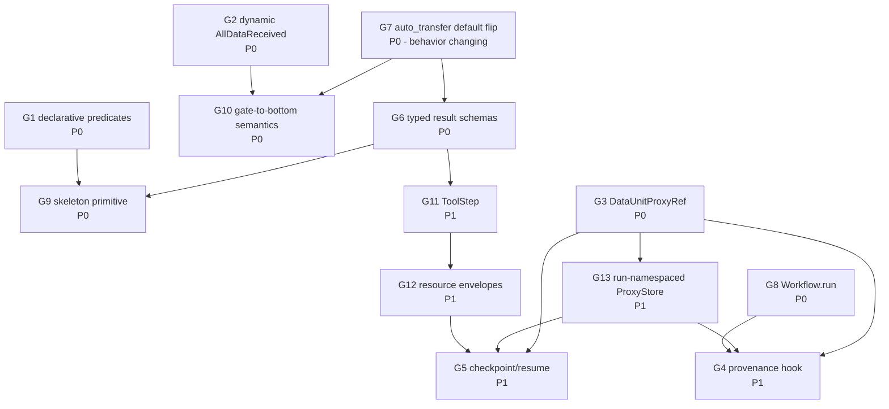

# Nanobrain Capability Gaps for Agent-Authored, HPC-Ready Workflows

**Status:** Design / pre-implementation. Gap analysis with concrete framework proposals.
**Audience:** Nanobrain framework owners; apecx-mcp-integration composer authors;
HPC bundle exporter authors.
**Supplements:** `architecture.md` (§13 brutal-truth list), `nanobrain_workflow_design.md`
(§1 static-DAG-with-conditional-gating premise), `multiagent_architecture.md`,
`workflow_output_contract.md`, `agent_workflow_authoring.md`.
**Sister docs (in this design package, some forthcoming):**
`hpc_reproducibility_spec.md`, `tool_descriptor_contract.md`,
`external_tool_integration.md`, `reasoning_patterns_library.md`,
`development_roadmap.md`.
**Read first (nanobrain skills):**
`.claude/skills/nanobrain-from-config/SKILL.md`,
`.claude/skills/nanobrain-data-units-triggers-links/SKILL.md`,
`.claude/skills/nanobrain-step-authoring/SKILL.md`,
`.claude/skills/nanobrain-workflow-authoring/SKILL.md`,
`.claude/skills/nanobrain-executors/SKILL.md`.

---

## 1. Orientation

This document is a **gap analysis with concrete framework proposals**. It is not a
refactor plan. The existing nanobrain primitives (`FromConfigBase`, `BaseStep`,
`Workflow`, `DataUnit*`, `Trigger*`, `Link*`, `Executor*`) are sound and the mandatory
`from_config` pattern is the right shape for agent-authored workflows. What is
documented here is the set of **additive primitives and validators** required for
agents to safely synthesize *reproducible*, *HPC-ready*, *typed* workflows from a
finite vocabulary.

The user's stated goal anchors this document:

> *"What we need to improve is the Nanobrain workflow capability utilization. We
> want agents to construct reproducible HPC-ready analytical workflows."*

Three constraints flow from that sentence:

1. **Agent-authored.** A workflow YAML is generated by an LLM from a tool descriptor
   library and a workflow skeleton. Anything the agent must guess (a Python lambda
   path, an inline transform function, a magic string) is a defect.
2. **Reproducible.** Every step's inputs, outputs, executor, code identity, and
   timing are recoverable from an artifact bundle without re-running the workflow.
3. **HPC-ready.** Data units that exceed in-process memory must move via reference
   (ProxyStore); resource envelopes (cpu, memory, walltime) must be declared on the
   step, not inferred at submit time; long-running runs must be resumable.

The proposals here are **additive** unless explicitly marked otherwise. Exactly one
proposal in the catalog (G7, the `auto_transfer` default flip) is behavior-changing,
and it is gated behind a workflow config-version bump.

**Catalog versioning note.** Gaps G1–G13 were the original surface. Gaps G14–G20
were added in support of `nanobrain_alignment_audit.md §4.2` after the meta-workflow
unification (the orchestrator IS a nanobrain workflow), the prompt-contract
formalization, and the security threat-model pass identified additional missing
primitives. All G14–G20 entries follow the same uniform structure as G1–G13.

This document does **not** propose any change to the `from_config` enforcement
mechanism, the `process()` / `execute()` split (the FAIL-FAST validation in
`step.py` is correct), or the shape of `ConditionalLink` / `AllDataReceived` /
`TransformLink` (what is missing is a vocabulary, validators, and a small
number of additive primitives). The catalog targets `nanobrain/core/` only;
`nanobrain/library/` is untouched.

Per the workspace policy, claims about current behavior are cited to a file path
(verified in this pass) or marked "behavior described in <skill or doc>; not
directly verified in this pass". No invented confidence. Specifically:
the DataUnit subclass enumeration (G3) and the AsyncTriggerExecutor's
deadlock-prevention semantics (G10) are sourced from
`.claude/skills/nanobrain-data-units-triggers-links/SKILL.md` and not
re-verified against `data_unit.py` / `trigger.py` in this pass; the forthcoming
sister docs (`hpc_reproducibility_spec.md`, `tool_descriptor_contract.md`,
`reasoning_patterns_library.md`) do not yet exist on disk and are referenced as
design-package siblings.

---

## 2. Methodology — how each gap was identified

Three signal sources fed this catalog. A gap qualified for inclusion only if it
appeared in at least one source and could be expressed as a missing or
under-specified *primitive* (not as a documentation defect or a usage bug).

### 2.1 Source A — silent-failure brutal-truth list

`architecture.md §13` enumerates fourteen behaviors that surprised one or more
sessions and were paid for in lost time. The first six are framework-level:

- §13.1 Workflow.process() is fire-and-forget; `wait_for_cascade` was the
  workaround. *(maps to G8)*
- §13.2 `BaseStep.execute()` takes only kwargs. *(documentation, not a gap)*
- §13.3 DirectLink defaults to `auto_transfer=False`. *(maps to G7)*
- §13.4 Workflow integrity validator requires plural `input_data_units` /
  `output_data_units`. *(documentation; reinforces G6 schema posture)*
- §13.5 Step trigger inputs are wrapped `{unit_name: payload}`; direct callers
  pass raw. *(maps to G6 typed-result enforcement)*
- §13.6 FAISS / sentence-transformers import order. *(out of scope; module-level
  import ordering, not a workflow primitive)*
- §13.11 `extra='forbid'` is mandatory on every step config. *(reinforces G6)*

These are *symptoms*. The corresponding gaps are *causes* — primitives the
framework would need so the symptom cannot occur.

### 2.2 Source B — agent-authoring contract

The forthcoming `agent_workflow_authoring.md` proposes that an agent assembles a
workflow by:

1. Selecting a workflow **skeleton** from a finite library.
2. Filling **typed holes** in the skeleton from a tool descriptor library
   (UTD — Universal Tool Descriptor).
3. Lowering the result to a fully-resolved YAML the framework can load.

Today the framework has no notion of a skeleton, a hole, or a binding-time validator.
*(maps to G9.)* Today the framework's `ConditionalLink` predicate is a Python
callable referenced by import path; an agent cannot safely synthesize one.
*(maps to G1.)* Today there is no schema enforcement on `process()`'s return
value; an agent that picks the wrong output unit binding gets a runtime shape
mismatch deep in a downstream consumer. *(maps to G6.)*

### 2.3 Source C — reproducibility + HPC + tool-descriptor contracts

The forthcoming `hpc_reproducibility_spec.md` requires per-step provenance,
checkpoint/resume, and namespaced ProxyStore. *(maps to G3, G4, G5, G13.)*
The forthcoming `tool_descriptor_contract.md` requires a single uniform
ToolStep that consumes a UTD reference. *(maps to G11.)* The
`external_tool_integration.md` requirements add resource envelopes as a step-level
declaration. *(maps to G12.)* The forthcoming `reasoning_patterns_library.md`
proposes patterns (fan-out / fan-in, gated branch, checkpointed long-runner) that
require the active layer set to be query-determined at runtime — already partially
expressed by `nanobrain_workflow_design.md §1` but blocked on `AllDataReceived`'s
fixed expected-set. *(maps to G2 and G10.)*

### 2.4 Inclusion criteria

A candidate gap was promoted to the catalog only if all three hold:

1. It is expressible as an additive primitive on top of the existing
   core/component_base.py + step.py + workflow.py + data_unit.py + trigger.py +
   link.py surface.
2. At least one downstream design doc in this package depends on the proposal.
3. Closing the gap is feasible without changing the `from_config` mandate.

Items that failed at least one criterion went to §6 *Out-of-scope items* with a
short rationale.

---

## 3. Gap catalog

Each subsection uses the same uniform structure: **Symptom**, **Root cause**,
**Proposal**, **API sketch**, **Impact**, **Migration**, **Open questions**.
API sketches are *signatures only* — class declarations, method headers, YAML
fragments; no method bodies. Priority labels (P0 / P1) reflect this document's
opinion of sequencing for the apecx-mcp-integration goal stated in §1, not
nanobrain's standalone roadmap.

---

### G1. ConditionalLink predicate language is ad-hoc — **P0**

**Symptom.** `nanobrain_workflow_design.md §1` relies on `ConditionalLink` to gate
each domain layer step on the Phase 0 `ExecutionPlan`. `nanobrain/core/link.py`
implements `ConditionalLink` (verified at `link.py:298`,`link.py:417`) and accepts
a Python callable as the predicate. The callable is referenced by import path or
as a lambda string in YAML; either shape forces the authoring agent to synthesize
*Python source* and a *correct import path* in a YAML field. The composer prompt
(see `apecx-mcp-integration/CLAUDE.md` "Composer prompt engineering is
load-bearing") already hard-bans `TransformLink` for the same reason
(`transform_function` paths get hallucinated). The same risk applies to
`ConditionalLink` predicates, but is not yet banned because there is no declarative
alternative to recommend.

**Root cause.** No declarative predicate vocabulary exists. The predicate slot is
"any Python callable", which (a) cannot be validated at workflow load time, (b)
cannot be safely synthesized by an LLM, and (c) cannot be inspected by the bundle
exporter to record which fields a workflow gates on.

**Proposal.** Add a declarative predicate DSL with a fixed vocabulary, validated
at workflow load. The DSL covers the patterns observed in the layered-reasoning
workflow: field equality, field membership in a list, list-contains, presence
check, simple boolean combinators.

**API sketch.** YAML in a ConditionalLink config: a leaf `predicate: {op, field,
value}` (op ∈ {eq, ne, in, contains, exists}, field is a dotted path) or a
combinator `predicate: {op: all|any|not, of: [<predicate>, ...]}`.

The predicate's *source* is the link's existing `source:` field — every
ConditionalLink already names a single upstream data unit and the predicate
runs against that data unit's payload. Multi-source predicates are not
expressible (intentionally — multi-source gating belongs in a fan-in step that
emits a derived data unit).

A complete YAML example wiring the layered-reasoning workflow's structural-layer
gate against the Phase 0 ExecutionPlan:

```yaml
# In the workflow YAML, alongside other links:
links:
  - class: nanobrain.core.link.ConditionalLink
    config:
      source: phase0_planning.execution_plan_output       # DataUnit reference
      target: structural_layer.execution_plan_input
      auto_transfer: true                                  # G7 default; required
      predicate:
        op: contains
        field: active_layers
        value: structural
```

For a combined gate (Phase 0 picked the structural layer AND the user opted into
the heavier accessibility computation):

```yaml
predicate:
  op: all
  of:
    - {op: contains, field: active_layers, value: structural}
    - {op: eq,       field: layer_options.structural.compute_accessibility, value: true}
```

Python:

```python
class PredicateConfig(ConfigBase):
    """Declarative predicate over a source data unit's payload.
    Validated at workflow load (workflow.py integrity validator).
    Fixed vocabulary: eq | ne | in | contains | exists | all | any | not.

    Resolution: the predicate runs against the ConditionalLink's `source`
    data unit's payload. `field` is a dotted path (e.g. "active_layers"
    or "layer_options.structural.compute_accessibility") resolved by
    successive __getitem__ on dicts and __getattr__ on Pydantic models.
    Path miss raises ComponentConfigurationError('FAIL-FAST: ...') for
    op != 'exists' (where 'exists' is a presence check).
    """
    op: Literal["eq", "ne", "in", "contains", "exists", "all", "any", "not"]
    field: Optional[str] = None         # dotted path; required for leaf ops
    value: Any = None                   # required for eq/ne/in/contains
    of: Optional[List["PredicateConfig"]] = None  # required for all/any/not
    model_config = {"extra": "forbid"}

class ConditionalLink(LinkBase):
    @classmethod
    def from_config(cls, config, **kwargs) -> "ConditionalLink": ...
    def evaluate(self, payload: Any) -> bool:
        """Pure evaluator. `payload` is the value held by the link's
        configured `source` data unit at the moment the link fires.
        Raises ComponentConfigurationError('FAIL-FAST: ...') on
        dotted-path miss when op != 'exists'.
        """
        ...
```

**Compatibility note.** The leaf op vocabulary is intentionally narrower than
JMESPath / JSONPath. The fixed surface is what the authoring agent (and the
human reviewer) can hold in one prompt without reaching for a reference. Adding
ops requires a framework version bump and a sweep of every skeleton in the
catalog; this is by design.

**Impact.** Unblocks safe agent synthesis of the layered-reasoning workflow
(`nanobrain_workflow_design.md §1`). Lets the bundle exporter record which fields
each gate consults (provenance). Lets `agent_workflow_authoring.md` enumerate the
finite predicate vocabulary in the system prompt without inviting Python-source
hallucination.

**Migration.** Additive. Existing callable-based predicates remain supported in v1
config schema. v2 config schema (G7) requires the declarative form. A workflow
load-time WARNING is emitted on v1 callable predicates pointing at this gap doc.

**Open questions.** Named-predicate registry as an escape hatch for the fixed
vocabulary — defer; a registry reintroduces the "agent hallucinates a name"
failure mode. Multi-source predicates — single-source only for v2; multi-source
gating belongs in a fan-in step.

---

### G2. AllDataReceived cannot be dynamically configured per run — **P0**

**Symptom.** `nanobrain/core/trigger.py` defines `AllDataReceivedTrigger`
(verified at `trigger.py:1181`). It is configured with a fixed list of expected
upstream data units at trigger-init time. `workflow_output_contract.md` requires
that "the active layer set is query-driven", and `nanobrain_workflow_design.md §1`
adopts the workaround of having gated-off layer steps publish empty bundles so the
trigger's fixed expected-set always fires. This forces every layer step to contain
"if I am gated, write an empty bundle" boilerplate — exactly the kind of agent
fragility the framework should eliminate.

**Root cause.** The trigger's expected-set is bound at trigger init, before the
workflow has a `run_id` or any per-run state. There is no protocol for the trigger
to consult a workflow-level data unit (the `ExecutionPlan`) and narrow its
expected-set to the active subset for the current run.

**Proposal.** Extend `AllDataReceivedTrigger` to accept an `expected_set_source`
parameter — a workflow-level data unit reference that, when present, is read once
on the first activation and used to compute the expected upstream set for the
current run. The fixed `inputs:` list remains supported for the static-DAG case.

**API sketch.** YAML adds two trigger fields: `expected_set_source:
workflow.<unit_path>` and `expected_set_field: <dotted.path>` (alongside the
existing static `inputs:` list as fallback).

The `expected_set_source` value is a workflow-level reference of the form
`workflow.<data_unit_name>` resolved against the workflow's top-level data unit
registry. The `expected_set_field` is a dotted path projected onto the
referenced data unit's payload using the same resolver as G1's predicates.
The projected value MUST be a JSON array of strings; each string is a name of
an upstream data unit declared in the trigger's `inputs:` list (which becomes
the *full* expected set, with `expected_set_field` selecting the *active*
subset for the current run).

A complete YAML example wiring the evidence-accumulation trigger to fire on
just the layers Phase 0 selected:

```yaml
# In the workflow YAML, alongside other triggers:
triggers:
  - class: nanobrain.core.trigger.AllDataReceivedTrigger
    config:
      target: evidence_accumulation
      # Static expected set — every layer that COULD ever fire:
      inputs:
        - sequence_layer.layer_result_output
        - structural_layer.layer_result_output
        - functional_layer.layer_result_output
        - cross_source_layer.layer_result_output
      # Dynamic narrowing — read once on first activation:
      expected_set_source: workflow.execution_plan
      expected_set_field: active_layers   # projects to e.g. ["sequence","structural"]
      # The projection becomes a set of {<layer_name>_layer.layer_result_output}
      # via the trigger's `expected_set_naming` rule (see below).
      expected_set_naming: "{value}_layer.layer_result_output"
```

The `expected_set_naming` template wraps each projected string into the
canonical data-unit name. Without it the YAML would have to project pre-suffixed
strings, which is awkward for an LLM to author. The template is a Python
str.format string with a single `{value}` placeholder.

Python:

```python
class AllDataReceivedTriggerConfig(TriggerConfig):
    inputs: list[str] = Field(...)
    expected_set_source: Optional[str] = None     # "workflow.<unit_name>"
    expected_set_field: Optional[str] = None      # dotted path; G1 resolver
    expected_set_naming: str = "{value}"          # template for projection
    model_config = {"extra": "forbid"}

class AllDataReceivedTrigger(TriggerBase):
    """Fires when all expected upstream data units have produced output.
    If `expected_set_source` is set, the expected set is computed on first
    activation by reading the named workflow-level data unit, projecting
    `expected_set_field` (G1 resolver), formatting each projected string
    through `expected_set_naming`, and intersecting with `inputs`.
    Otherwise the full `inputs` list is the expected set.
    """
    @classmethod
    def from_config(cls, config: AllDataReceivedTriggerConfig, **kwargs) -> "AllDataReceivedTrigger": ...

    async def _resolve_expected_set(self) -> set[str]:
        """One-shot. Raises ComponentConfigurationError(
        'FAIL-FAST: expected_set_source <path> missing or empty')
        when the source is configured but unavailable; raises
        'FAIL-FAST: expected_set narrows to {} which is not a subset of inputs={}'
        when the projection names data units not in `inputs`.
        """
        ...
```

**Impact.** Eliminates the "publish empty bundle so trigger fires" boilerplate in
every gated layer step. Unblocks the gate-to-bottom semantics in G10 (the trigger
needs to know the *expected* set before it can interpret a sentinel). Lets
`workflow_output_contract.md` drop the requirement that gated steps still produce
output.

**Migration.** Additive. The static `inputs:` form keeps working with no warning.
New workflows that need dynamic gating add `expected_set_source`.

**Open questions.** Should expected-set re-evaluate if the source changes —
no, it is a per-run quantity decided once; streaming is out of scope. If the
projected set names data units not in the DAG — FAIL-FAST at workflow
integrity-validation time, not at trigger fire time.

---

### G3. ProxyStore-backed DataUnit is missing — **P0**

**Symptom.** `external_tool_integration.md` and the forthcoming
`tool_descriptor_contract.md` require ProxyStore references for HPC-scale tool I/O
(a multi-GB protein structure or an MSA cannot ride a Python dict between steps).
Today's `nanobrain/core/data_unit.py` provides `DataUnitMemory`, `DataUnitFile`,
`DataUnitString`, `DataUnitStream` (subclass surface described in
`.claude/skills/nanobrain-data-units-triggers-links/SKILL.md`; not directly
verified in this pass). `DataUnitMemory` holds the value in-process, so passing a
5 GB payload between two steps in different processes (Parsl executor) requires a
copy. The Aurora demo's link config
(`demos/academylink_aurora_demo/config/aurora_computation_link.yml`) has
`proxystore_enabled: true` at the *link* level, but that flag controls transport,
not storage. A produce-side step still materializes the payload in process memory.

**Root cause.** No DataUnit subclass treats the payload as a *reference* — a
ProxyStore key (or a file path with a deferred-read contract). Every existing
DataUnit subclass owns the payload bytes.

**Proposal.** Add `DataUnitProxyRef` — a DataUnit whose payload is a ProxyStore
key plus minimal metadata (size, mime, namespace). It dereferences lazily on
`.get()`. The producer writes the payload to the ProxyStore, then sets the key
on the data unit. The consumer reads the key, optionally calls `.get()` to
materialize, optionally passes the proxy onward without ever materializing.

**API sketch.** YAML: a `DataUnitProxyRef` declares
`proxystore: {connector: file|redis|globus|endpoint, store_dir, store_name}`
and `metadata: {mime, max_size_bytes}`. Python:

```python
class DataUnitProxyRef(DataUnit):
    """DataUnit whose payload is a ProxyStore reference.

    Guarantees: .set(value) writes to the store and keeps only the key;
    .get() materializes lazily (one round-trip on first call);
    .as_proxy() returns the proxy for fan-out without materialization;
    the change-event payload is the key, not the bytes — so
    AllDataReceivedTrigger fires on key-set, not on materialization.

    Equality + hashing: two DataUnitProxyRef instances are equal iff
    their (store_namespace, key) tuples are equal. The `metadata` block
    is excluded from equality because it is descriptive, not identity-
    bearing — two refs to the same key with different mime hints still
    refer to the same bytes. __hash__ returns hash((namespace, key)).

    This matters for provenance dedup (G4) and for ConditionalLink
    predicates (G1) that compare two ProxyRef payloads — they compare
    by content addressing, not by Python object identity.
    """
    @classmethod
    def from_config(cls, config, **kwargs) -> "DataUnitProxyRef": ...
    async def set(self, value: Any) -> None: ...
    async def get(self) -> Any: ...
    def as_proxy(self) -> Any: ...
    def key(self) -> str: ...
    def namespace(self) -> str: ...
    def __eq__(self, other: object) -> bool: ...
    def __hash__(self) -> int: ...
```

**Impact.** Unblocks every workflow that moves payloads larger than executor
copy budgets. Required by `external_tool_integration.md`,
`tool_descriptor_contract.md`, and `hpc_reproducibility_spec.md` (provenance must
record the proxy key, not the bytes). Composes with G4 (provenance hook records
the key) and G13 (per-run namespace).

**Migration.** Additive. Existing `DataUnitMemory` / `DataUnitFile` users are
untouched. The Aurora demo's link-level `proxystore_enabled` flag stays
supported, but its semantics are clarified: it controls the *transport* (the
link wraps the in-flight payload in a Proxy<T> before sending across the
process boundary, then unwraps on receipt). `DataUnitProxyRef` controls the
*storage* (the data unit's payload is itself a key, never the bytes). The two
are not redundant — they sit at different layers:

| Knob | Layer | What it does | When to use |
|---|---|---|---|
| Link-level `proxystore_enabled: true` | Transport | Wrap in-flight payload in Proxy<T>; consumer materializes on first attribute access | Producer step naturally holds bytes (nanobrain's existing in-process flow); consumer is in a different process and you want to defer the copy |
| `DataUnitProxyRef` | Storage | Producer never holds bytes; the data unit IS a content-addressed key | Producer's payload is HPC-scale (multi-GB), or multiple consumers will fan-out without each consuming a copy, or the payload outlives the producer step's process |

The two MAY be combined (a `DataUnitProxyRef` over a link with
`proxystore_enabled: true` is harmless — the link sees a small key and the
transport-level proxy is degenerate). Future deprecation of the link-level
flag is tracked in §5 sequencing as a possible v3 simplification, but is not
in scope for the current package.

**Open questions.** Eviction policy — workflow runner owns lifecycle; the data
unit only holds the reference. Eviction is a workflow-level policy
(delete on completion / preserve on success / preserve always). Credentials for
endpoint connectors (Globus, Aurora) — env-var interpolation only, never inline.

---

### G4. Step-level provenance threading is implicit — **P1**

**Symptom.** `provenance_seed.json` is written once at HPC bundle export
(`apecx-mcp-integration/src/apecx_integration/execution/pbs_bundle.py`); per-step
provenance is reconstructed post-hoc from log files. There is no framework-level
guarantee that every `process()` call records its inputs, outputs, executor, and
timing. A step that swallows an exception and writes a wrong output silently
produces a misleading provenance trace.

**Root cause.** No framework-level provenance hook. Provenance is whatever a
step's author chose to log — uneven coverage by construction.

**Proposal.** Inject a `ProvenanceContext` into every step at `from_config`
resolution time. On each `process()` call, the framework records (a) input data
unit keys / hashes / sizes, (b) output data unit keys / hashes / sizes, (c)
executor metadata (host, pid, walltime), (d) step code identity (module path,
git sha if available), (e) exception type if raised, into a JSONL sink configured
at workflow level.

**API sketch.** YAML at workflow level: `provenance: {enabled: true, sink:
{class: ..., config: {path, flush_every}}, redact: [...]}`. Python:

```python
class ProvenanceContext(FromConfigBase):
    """Per-run provenance recorder. Injected into each step at workflow init;
    the framework wraps _execute_process so the recorder sees every
    invocation, including those that raise.
    """
    @classmethod
    def from_config(cls, config, **kwargs) -> "ProvenanceContext": ...

    async def record_step_invocation(
        self, step_name: str,
        inputs: Dict[str, "DataUnitRef"], outputs: Dict[str, "DataUnitRef"],
        executor_metadata: Dict[str, Any], code_identity: Dict[str, Any],
        timing: Dict[str, float],
        exception: Optional[Dict[str, Any]] = None,
    ) -> None: ...
```

**Redact vocabulary.** The `redact:` list is a fixed-vocabulary filter applied
to each provenance record before it reaches the sink. The filter rewrites
fields in place but never removes the field — a removed field would break
downstream consumers (the `apecx-bundle verify` round-trip expects every
record to have the same shape). Each redaction primitive replaces the value
with a typed marker that preserves the shape and the audit signal:

| Primitive | Effect | Marker shape | When to use |
|---|---|---|---|
| `payload` | Strip the materialized payload from `inputs[*].value` and `outputs[*].value`. Keys, hashes, sizes, and proxy references are preserved. | `{"redacted": "payload", "size_bytes": <int>, "hash": "<sha256>"}` | Default for any production deployment — payloads are the audit hot path and the size+hash is sufficient for replay. |
| `tool_args` | Strip the structured args of every tool call but preserve tool ID, descriptor hash, and arg-shape fingerprint (a hash over the *schema* of the args, not the values). | `{"redacted": "tool_args", "schema_hash": "<sha256>"}` | When tool args may carry sensitive parameters (PHI / dataset coordinates / API keys) that the user has opted out of recording. |
| `prompts` | Strip the `prompt_text` of every LLM invocation; preserve `prompt_template_id`, `template_version`, and the parameter-hash. | `{"redacted": "prompts", "template_id": "<id>", "template_version": "<sha256>", "param_hash": "<sha256>"}` | Always on for production deployments per `llm_prompt_contracts.md` injection-threat-model — the prompt body may echo user-controlled text. |
| `llm_completions` | Strip the `completion_text`; preserve length, token count, and a hash. | `{"redacted": "llm_completions", "char_count": <int>, "token_count": <int>, "hash": "<sha256>"}` | When completions may echo user-supplied PHI. |
| `executor_env` | Strip env-var values from `executor_metadata`; preserve env-var *names*. | `{"redacted": "executor_env", "names": ["APECX_LLM_API_KEY", "..."]}` | Always on by default — env-var values commonly carry secrets. |
| `path:<dotted_path>` | Targeted redaction of a single dotted path in `executor_metadata` or `code_identity`. Replaces the value with `{"redacted": "path", "path": "<original_path>"}`. | (above) | Surgical redactions when one of the broad primitives is too aggressive. |

`redact:` is a list of these primitive names (or `path:<dotted>` strings).
The framework applies them in declared order; a record never escapes the
filter to the sink without going through every entry.

The default redaction set if `redact:` is omitted is
`["prompts", "executor_env"]` — the two cases that are dangerous to record
in clear in any production deployment. Workflows that want full prompt and
env capture must explicitly set `redact: []`, which the bundle exporter
records in the bundle header so a reviewer can see that the omission was
deliberate.

**Replay compatibility.** The redaction markers preserve enough information
for `apecx-bundle verify` to confirm the record's *shape* matches the original
run. They do NOT preserve enough to *re-execute* the redacted step — replay of
a fully-redacted step requires the operator to opt into a "redacted-step
replay" mode that prompts for the missing values at replay time.

**Impact.** Required by `hpc_reproducibility_spec.md §5` (per-step provenance
records). Lets the bundle exporter merge JSONL with the `provenance_seed.json`
without scraping logs. Composes with G3 (records keys, not bytes) and G5
(checkpoint records what was provenanced up to the checkpoint).

**Migration.** Additive. Existing steps see no API change; the recording is in
the framework's `_execute_process` wrapper. Workflows without a configured
provenance sink default to a no-op recorder, so behavior is unchanged.

**Open questions.** Hashing of large payloads — `DataUnitProxyRef` records key
+ metadata-size; `DataUnitMemory` computes a stable hash of the canonical form;
exact algorithm + collision policy deferred to spec. Sink rotation / size cap —
left to the sink implementation (JsonlSink reference; S3Sink etc. pluggable).

---

### G5. WorkflowCheckpoint / ResumeStep does not exist — **P1**

**Symptom.** A long workflow that fails at step 7 of 9 must restart from step 1.
HPC bundles cannot be resumed mid-execution. Even local Ollama runs (~70 s end-to-end
per `architecture.md §14`) suffer if the LLM call at step 8 fails — the entire
retrieval fan-in is replayed.

**Root cause.** No checkpoint / resume primitive. `Workflow.from_config` always
loads from a clean state; there is no contract for snapshotting a partial run and
re-entering it.

**Proposal.** Add two primitives:

- `CheckpointStep` — a step that, when triggered, snapshots all upstream data
  units to a ProxyStore-backed namespace (composes with G3 + G13). Writes a
  `checkpoint_manifest.json` listing snapshotted unit names + keys + hashes.
- `ResumeStep` — a step that, on workflow re-run, loads the checkpoint manifest,
  restores the upstream data units from the snapshot, and tells the workflow
  runner to skip upstream execution. Interacts with conditional gating: if a
  ConditionalLink would have gated a step that *was* gated in the snapshot run,
  the resume preserves the snapshot decision.

**API sketch.** YAML: a `CheckpointStep` carries `namespace`,
`capture: [<unit>, ...]`, `manifest: <path>`; a `ResumeStep` carries
`manifest: <path>`, `on_missing: fail|skip|rebuild`. Python:

```python
class CheckpointStep(BaseStep):
    """Snapshot upstream data units to a namespaced store; write manifest.
    Idempotent: re-running with the same namespace overwrites only on key change.
    """
    @classmethod
    def from_config(cls, config, **kwargs) -> "CheckpointStep": ...
    async def process(self, input_data, **kwargs) -> Dict[str, Any]: ...
        # returns {'manifest_path': str, 'captured': [name...]}

class ResumeStep(BaseStep):
    """Restore data units from a checkpoint manifest; signal skip-upstream.
    Raises ComponentConfigurationError('FAIL-FAST: manifest <path> missing')
    when on_missing == 'fail' and the manifest is absent.
    """
    @classmethod
    def from_config(cls, config, **kwargs) -> "ResumeStep": ...
    async def process(self, input_data, **kwargs) -> Dict[str, Any]: ...
```

**Impact.** Required by `hpc_reproducibility_spec.md` (resume policy) and by
long-runner patterns in `reasoning_patterns_library.md`. Eliminates the
`object.__new__(StepClass)` shortcut formerly used to share state between steps
(removed 2026-05-05 per `architecture.md §13.7`); checkpoint/resume is the
correct shape.

**Migration.** Additive. Workflows that don't use checkpoints behave identically.

**Resume contract — what survives a checkpoint, what doesn't.**

A checkpoint snapshots:
- All data units listed in `capture:` (their payloads via ProxyStore key, or
  their full content via canonical-form serialization for `DataUnitMemory`).
- The `provenance_seed` and any per-run `session_context` (so the resumed run
  has the same logical identity).
- A code-identity fingerprint: git sha (when available), Python interpreter
  version, declared dependency versions from the venv, container digest if
  any.
- The `ExecutionPlan` (so resume preserves the same gating decisions — see G1
  + G2 interaction below).

A checkpoint does NOT snapshot:
- In-flight executor state (Parsl bag-of-tasks, Academy agent handles, open
  HTTP connections). The resume re-establishes these from the workflow YAML.
- Data units of `DataUnitStream` type (streaming is not snapshottable; the
  workflow-load validator FAIL-FASTs if a stream is in `capture:`).
- Mid-`process()` partial state. A step is either checkpointed *before* or
  *after* its full `process()` invocation; partial completion is not a state
  the framework recognizes.

**Mid-step failure interaction.** If a step fails in `process()` after a
preceding `CheckpointStep`, the resume re-enters at the failed step (not at
the checkpoint). The checkpoint's role is to skip *successful* upstream
execution, not to retry the failure. A step that is repeatedly failing must
be diagnosed, not endlessly resumed — the workspace three-attempt rule applies.

**Conditional-gating preservation.** When ResumeStep loads a manifest, it also
loads the snapshotted `ExecutionPlan` (per the contract above) and binds it
into the resumed workflow's plan data unit. This means every ConditionalLink
(G1) makes the same gating decision on resume that it made on the original
run — the resume cannot "see" new layers that weren't in the original plan,
and cannot drop layers that were in the original plan. To re-plan, the
operator runs a fresh workflow, not a resume.

**Idempotency requirement.** A `CheckpointStep` is idempotent: re-running with
the same `namespace` writes only the keys whose payloads have changed since
the last checkpoint. The manifest's mtime is updated; the namespace's other
keys are untouched. This lets workflows checkpoint at multiple stages cheaply.

**Open questions.** Can a checkpoint capture a `DataUnitStream` — no;
streaming units are not snapshottable; validator must reject the combination at
workflow load. Code-identity mismatch on resume (different git sha) —
ResumeStep records the snapshot's code identity in the manifest and emits a
WARNING (not FAIL-FAST); decision to proceed is on the operator. Container
digest mismatch is treated more strictly: ResumeStep FAIL-FASTs unless the
operator passes `--accept-container-mismatch`, because container drift is
more likely to silently change tool behavior than git-sha drift in pure
Python steps.

---

### G6. Typed result schemas are not enforced at the framework boundary — **P0**

**Symptom.** A step's `process()` may return any dict. Consumers detect shape
mismatch only at runtime, deep in a downstream step or LLM. The composer's
hard-won discipline of `extra='forbid'` on every step config
(`architecture.md §13.11`; workspace memory `pydantic_extra_forbid_rule.md`)
covers *config*, not *step output*. There is no symmetric guarantee on the wire
between two steps.

**Root cause.** `StepConfig` has no `output_schema` field. The framework wraps
the return value of `process()` and writes it to the named output data unit
without validation.

**Proposal.** Add `step_output_schema` (and `step_input_schema`) to `StepConfig`.
Schemas are Pydantic models *or* JSON Schema. The framework validates the return
value of `process()` before writing to output data units. A FAIL-FAST is raised
on mismatch. The same forbid-extras discipline applies: schemas declare every
field; unknown fields are an error.

**API sketch.** YAML: `step_output_schema:` accepts either `class:
<pydantic.model.path>` or `json_schema: {...}` (with
`additionalProperties: false`). Same shape for `step_input_schema`. Python:

```python
class SchemaRef(ConfigBase):
    """Pydantic model class path OR inline JSON Schema."""
    class_: Optional[str] = Field(default=None, alias="class")
    json_schema: Optional[Dict[str, Any]] = None
    model_config = {"extra": "forbid"}

class StepConfig(ConfigBase):
    step_input_schema: Optional[SchemaRef] = None
    step_output_schema: Optional[SchemaRef] = None
    # ... existing fields ...

class BaseStep(FromConfigBase):
    async def _execute_process(self, input_data, **kwargs):
        """Framework wrapper validates input/output against schemas if set.
        Raises ComponentConfigurationError(
            'FAIL-FAST: step <name> output failed schema: ...').
        """
        ...
```

**Impact.** Required by `agent_workflow_authoring.md` (the agent must know each
step's output type to bind it to a downstream input). Composes with G11 (ToolStep
output is the UTD's `output_schema`). Composes with G9 (skeleton holes are typed
by the schemas of the steps they bind).

**Migration.** Additive. Steps without schemas behave identically (no validation).
A workflow-level `require_schemas: true` flag enables strict mode for new
workflows.

**Escape valve — partial success and error envelopes.**

Strict schemas would force a step that wants to communicate "I produced some
results AND encountered errors" to either lie about its output type or wrap
every legitimate field in `Optional`. Both are bad. The escape valve:

Every step output schema implicitly admits a sibling `errors` field of type
`list[StepError]` and a `partial: bool` flag. The framework treats these as
reserved field names in every output schema. A step may always write:

```python
return {
    "primary_output": <typed value matching declared schema>,
    "errors": [{"code": "...", "detail": "...", "source": "..."}],
    "partial": True,
}
```

…even if the declared `step_output_schema` does not list `errors` or `partial`.
The framework's `_execute_process` wrapper validates `primary_output` against
the schema but ignores the reserved fields (they are validated against a
fixed `StepError` shape and a `bool` respectively, defined in the framework).

A consumer step can read `errors` and `partial` without the producer having
to bake them into its declared schema. The `partial: true` flag is also
threaded into the provenance record (G4) so a downstream replay or audit
sees that the upstream step degraded.

This is the only carve-out from "schemas declare every field; unknown fields
are an error." The carve-out is named explicitly so it cannot be abused for
silent contract drift.

**Output_schema vs. DataUnit type.** A step's `step_output_schema` describes
the *payload shape* the step writes; the data unit's class describes the
*carrier* (DataUnitMemory / DataUnitFile / DataUnitProxyRef / DataUnitStream).
The two are orthogonal: a `DataUnitProxyRef` carrier with an output schema
means "the proxy resolves to a value matching this schema" — the framework
validates the schema against the dereferenced value the first time `.get()`
is called, not at write time (writing only stores the key). For producers that
want stricter validation, a `validate_on_set: true` flag on the schema
forces materialization at write time.

---

### G7. DirectLink defaults to `auto_transfer=False` — **P0** (only behavior-changing proposal)

**Symptom.** `architecture.md §13.3` (verified at `nanobrain/core/link.py:218`,
`link.py:608`, `link.py:1052`): `auto_transfer` defaults to `False`. Without an
explicit `auto_transfer: true`, every DirectLink is a runtime no-op. The composer
prompt now mandates the flag and a manually-authored YAML must include it. This
default is the single largest source of silent-failure bugs in
`apecx-mcp-integration` to date.

**Root cause.** A defensive default chosen for a use case (manual data transfer)
that has not survived contact with the agent-authoring workflow. The default is
*correct in name* (you opt in to auto transfer) but *wrong in practice* (every
user wants auto transfer; opting out is the rare case).

**Proposal.** Flip the default in workflow config schema **v2**. Existing v1
configs preserve current behavior (default False). On v1 load, the framework
emits a deprecation WARNING listing every DirectLink without an explicit
`auto_transfer` field. A workflow that declares `config_version: 2` at the top
gets `auto_transfer: True` by default and a deprecation timeline.

**API sketch.**

YAML fragment — under v1 (no `config_version`), DirectLink without
`auto_transfer` defaults False (legacy, deprecation WARNING). Under
`config_version: 2`, the same omission defaults True; opt out with
`auto_transfer: false`.

Python signature sketch:

```python
class WorkflowConfig(ConfigBase):
    config_version: Literal[1, 2] = 1
    # ... existing fields ...

class DirectLinkConfig(LinkConfig):
    auto_transfer: Optional[bool] = None    # None means "use config_version default"
    model_config = {"extra": "forbid"}
```

Workflow loader resolves `None` against `config_version`: v1 → False, v2 → True.

**Impact.** This is the only behavior-changing proposal in the catalog. The
expected impact is a 1-line YAML diff per workflow that wants the new default.
The compensating impact is the elimination of every recurrence of
`architecture.md §13.3`-style silent failures.

**Migration.** Four steps: (1) land `config_version` with v1 default, no
behavior change; (2) emit deprecation WARNING on v1 load when a DirectLink
omits `auto_transfer`; (3) land v2 semantics, but new-workflow default stays
v1; (4) after ≥1 nanobrain release of WARNING coverage, flip new-workflow
default to v2. v1 remains supported indefinitely; the WARNING continues.

**Migration — concrete steps for nanobrain library workflows.** The framework
itself ships ~12 library workflows (under `nanobrain/library/workflows/`).
Each must be audited and either:
- Pinned to `config_version: 1` with a comment explaining why (if the workflow
  intentionally uses `auto_transfer=False` semantics), or
- Migrated to `config_version: 2` with explicit `auto_transfer: true` on every
  DirectLink that requires it.

This audit is a one-shot operator task scheduled with the v2 release. The
migration is mechanical: `grep -l 'class:.*DirectLink' nanobrain/library/`
identifies every YAML; each gets a `config_version: 2` header and explicit
`auto_transfer:` on every DirectLink. The library's own integration tests
catch any workflow whose semantics actually depended on the False default.

**Migration — concrete steps for apecx-mcp.** apecx-mcp's workflow YAMLs all
already declare `auto_transfer: true` explicitly (per the lint rule in CLAUDE.md
"composer prompt engineering is load-bearing"). The migration is therefore a
no-op: every apecx-mcp YAML adds `config_version: 2` and the explicit flags
remain (now redundant but harmless).

**Lint rule ownership.** Until v2 ships, the lint rule that rejects YAMLs
omitting `auto_transfer:` lives in apecx-mcp's CI (it is APECx-policy-tighter
than the framework default). Once v2 ships AND apecx-mcp has migrated to v2
across the board, the lint rule can be deleted — the framework's v2 default
makes the omission harmless. Until then, the lint rule is the only thing
catching omissions in PR review.

**Open questions.** Does `TransformLink` / `ConditionalLink` get the same flip —
yes; `auto_transfer` is on `LinkBase` (verified at `link.py:218`), so the flip
applies to all concrete links under v2. The composer prompt's TransformLink ban
is independent (G1). Library configs that hard-code `auto_transfer: false`
keep working; the flip is on omission, not on explicit values.

---

### G8. Workflow.process() is fire-and-forget; await semantics are explicit — **P0**

**Symptom.** `architecture.md §13.1` (verified): `Workflow.process(input_data)`
returns `{"status": "data_flow_initiated", ...}` immediately. The trigger cascade
fires asynchronously. Callers must use `Workflow.wait_for_cascade(timeout,
settle_ms)` (added 2026-05-05) to await completion. The composer test surface
catches one-shot misuse; ad-hoc callers do not. This is the canonical "the YAML
loaded; nothing happened; no error" failure shape.

**Root cause.** `process()` was originally the *trigger-input* primitive
(deposit a value into the input data unit; let triggers do the rest). It is *not*
a synchronous "run this workflow" call. There is no canonical synchronous entry
point. Every caller invents one.

**Proposal.** Introduce `Workflow.run(input, await_cascade=True, timeout, settle_ms)`
as the canonical synchronous entry point. Internally it calls `process(input)`,
then `wait_for_cascade(...)`, then collects the workflow-level output data units
into a return dict. Preserve `process()` unchanged for the data-driven primitive.

**API sketch.**

```python
class Workflow(BaseStep):
    async def run(self, input_data, await_cascade: bool = True,
                  timeout: Optional[float] = None, settle_ms: int = 250
                 ) -> Dict[str, Any]:
        """Canonical synchronous entry. Deposits input_data into the workflow's
        input data unit, awaits the trigger cascade, returns the workflow-level
        output data units' payloads as a dict. await_cascade=False reverts to
        process()'s fire-and-forget shape; timeout / settle_ms forward to
        wait_for_cascade.
        """
        ...

    async def process(self, input_data, **kwargs) -> Dict[str, Any]:
        """Existing fire-and-forget primitive; returns status dict immediately."""
        ...
```

**Impact.** Closes the largest documentation defect identified in the
brutal-truth list. New callers get the right shape by default; legacy callers
keep working. Composes with G4 (run() emits a single end-of-run provenance
record summarizing the cascade).

**Migration.** Purely additive. No deprecation needed.

**Open questions.** Raise on workflow-level error vs. return error dict — return
the dict (preserves introspection); add a `run_or_raise()` for callers who
prefer exceptions. Does `run()` require declared `output_data_units` — yes;
FAIL-FAST at workflow load when `run()` is invoked on a workflow with no
output units.

---

### G9. No first-class "skeleton" primitive — **P0**

**Symptom.** The forthcoming `agent_workflow_authoring.md` proposes that an
agent assembles a workflow by filling typed holes in a skeleton — a YAML with
explicit binding points. The framework today has no notion of a holed YAML. The
agent must produce a fully-resolved YAML in one shot, which is exactly the
failure mode that motivated the descent into "the LLM hallucinates a
TransformLink import path" (`apecx-mcp-integration/CLAUDE.md` "Composer prompt
engineering is load-bearing").

**Root cause.** `WorkflowConfig` has no notion of typed holes. There is no
loader function that takes (skeleton_path, bindings) and produces a fully-lowered
workflow YAML. The composer reinvents this in prompt engineering.

**Proposal.** Add `SkeletonConfig` (an extension of `WorkflowConfig`) that
declares typed holes. Add a `Workflow.from_skeleton(skeleton_path, bindings)`
loader that lowers the skeleton to a fully-resolved `WorkflowConfig` and then
calls the existing `from_config`.

**API sketch.**

YAML — a skeleton declares typed holes (`type: step_ref|value|predicate`,
`schema:`, `cardinality: one|many`) and references them inside `steps:` /
`links:` via `${holes.<name>}` interpolation, with a `${each(holes.<many>).output}`
form for fan-in over a `cardinality: many` hole. A bindings file pairs each hole
with a concrete value: a list for `many` step_refs, a `{class, config}` record
for `one` step_refs, a literal for value holes. Python:

```python
class Workflow(BaseStep):
    @classmethod
    def from_skeleton(cls, skeleton_path, bindings: Dict[str, Any]) -> "Workflow":
        """Lower skeleton + bindings to WorkflowConfig and call from_config.
        Order: (1) parse hole declarations, (2) validate bindings against hole
        schemas (G6), (3) substitute into body and write resolved YAML to a
        deterministic temp path (for provenance, G4), (4) from_config(resolved).
        Raises ComponentConfigurationError('FAIL-FAST: skeleton hole <name>
        binding failed schema: ...') at step 2.
        """
        ...
```

**Impact.** Unblocks `agent_workflow_authoring.md`. Lets the composer prompt
shrink from "synthesize a full workflow YAML" to "fill these N typed holes",
which is the same shape as MCP tool calling. Composes with G6 (hole schemas =
step output/input schemas) and G11 (ToolStep is a common hole binding).

**Migration.** Additive. Existing workflows continue using `from_config` directly.

**Open questions.** Holes inside link configs — yes for `source` / `target`
(allow referencing a hole's step name); no for `class:` (which would defeat
the validator). `${...}` interpolation — extended beyond env-vars: the
skeleton lowerer runs a hole-substitution pass first, then env-var substitution;
both shapes coexist with documented ordering.

---

### G10. ConditionalLink + AllDataReceived deadlock pattern — **P0**

**Symptom.** When a `ConditionalLink` evaluates false, the producer step does not
run. The downstream `AllDataReceivedTrigger` waits for all expected upstreams,
including the gated-off one, and never fires. Today's workaround
(`nanobrain_workflow_design.md §1`) is to have gated-off layer steps publish
empty bundles. Forgetting that boilerplate produces a deadlock that looks
identical to a real "trigger never fired" bug.

**Root cause.** The framework has no shared semantics for "this upstream is
deliberately silent". The trigger cannot distinguish a gated-off producer from a
slow-but-still-running one.

**Proposal.** Introduce a framework-level **gate-to-bottom** semantics. When a
`ConditionalLink`'s predicate evaluates false, the framework writes a sentinel
value (`_gated_off`, distinct from `None` and any user payload) to the
*downstream* data unit. `AllDataReceivedTrigger` treats sentinels as "satisfied"
for the purpose of firing, and propagates them through the trigger payload so
downstream consumers can filter them out at fan-in.

**API sketch.**

YAML: gate-to-bottom is enabled by `config_version: 2` plus a workflow-level
`gate_semantics: gate_to_bottom | publish_empty` flag (new default for v2 is
`gate_to_bottom`). ConditionalLink config is unchanged. Python:

```python
class ConditionalLink(LinkBase):
    GATED_OFF_SENTINEL = "__nanobrain_gated_off__"

    async def _on_source_change(self, payload):
        """If predicate(payload) is False under gate_to_bottom semantics,
        write GATED_OFF_SENTINEL to the target. Otherwise pass through.
        """
        ...

class AllDataReceivedTrigger(TriggerBase):
    def _is_satisfied(self, unit_name: str, payload: Any) -> bool:
        """Returns True for any non-None payload OR for the gated-off
        sentinel, when gate_semantics == 'gate_to_bottom'.
        """
        ...
```

**Impact.** Eliminates the "publish empty bundle" boilerplate (composes with G2;
gated-off units are tracked, not invisible). Cures the
`AsyncTriggerExecutor`'s deadlock failure mode (referenced in
`.claude/skills/nanobrain-data-units-triggers-links/SKILL.md`; not directly
verified in this pass) for the gating shape.

**Migration.** Behind `config_version: 2` + `gate_semantics: gate_to_bottom`.
Legacy workflows keep `publish_empty` semantics with no change. Recommendation:
make `gate_to_bottom` the default for v2 because the *correct* default for an
agent-authored workflow is "gating produces a sentinel, not a deadlock".

**Open questions.** Sentinel visibility to `process()` — the framework filters
it before calling `process()` and re-injects it only into trigger-satisfaction
logic; user code never sees the magic string. Interaction with G6 schemas —
schemas must permit a `gated_off: true` marker, or the framework injects a
schema-conformant minimum value (empty list / dict) when the schema is
non-Optional; detailed rule deferred.

---

### G11. Tool-step taxonomy missing — **P1**

**Symptom.** Native nanobrain `Tool` (`nanobrain/core/tool.py`) and external
`ToolExecutionAgent` (referenced in `multiagent_architecture.md`) are different
shapes. An agent reasoning over the workflow library cannot uniformly say "this
step calls a tool"; it must distinguish "native tool wrapped in a Step" from
"external tool agent called via A2A". The forthcoming
`tool_descriptor_contract.md` proposes a Universal Tool Descriptor (UTD) that
both shapes implement; the framework needs a step that consumes a UTD reference
and dispatches to the right adapter.

**Root cause.** No common base step for tool invocation. Every workflow that
calls a tool reinvents the dispatch.

**Proposal.** Add `ToolStep` — a step base that consumes a UTD reference,
dispatches to (a) a native nanobrain Tool, (b) an external ToolExecutionAgent,
or (c) an MCP-server-side tool, and writes outputs to typed data units conforming
to the UTD's `output_schema` (composes with G6).

**API sketch.** YAML: `tool_descriptor: <path-to-UTD.yml>`, `adapter: auto |
native | a2a | mcp`, `input_bindings: {<utd_param>: <data_unit_name>}`,
`output_bindings: {<utd_field>: <data_unit_name>}`, with optional
`step_input_schema` / `step_output_schema` (G6) and `resource_envelope` (G12).
Python:

```python
class ToolStep(BaseStep):
    """Step that invokes a tool described by a Universal Tool Descriptor.
    UTD declares tool_id, version, input_schema, output_schema, adapter
    (native | a2a | mcp), adapter-specific config. Dispatch:
      native -> nanobrain.core.tool.Tool subclass
      a2a    -> ToolExecutionAgent via A2A protocol
      mcp    -> MCP client call
    """
    @classmethod
    def from_config(cls, config, **kwargs) -> "ToolStep": ...
    async def process(self, input_data, **kwargs) -> Any:
        """Validate input vs UTD.input_schema, dispatch, validate output
        vs UTD.output_schema, return."""
        ...
```

**Impact.** Required by `tool_descriptor_contract.md §5` and §7. Composes with
G6 (UTD declares input/output schemas), G12 (UTD declares resource envelope),
G9 (a skeleton hole of type `tool_ref` binds to a UTD).

**Migration.** Additive. Existing native-Tool wrapper steps and
ToolExecutionAgent A2A calls keep working unchanged.

**Open questions.** Adapter auto-detection — the UTD declares its primary
adapter; `adapter: auto` reads it; explicit values are escape hatches.
Streaming / long-running tools — defer; first version is request/response only.

---

### G12. No declarative resource envelope on a Step — **P1**

**Symptom.** HPC export today (`pbs_bundle.py`) infers walltime/memory from
configuration outside the step. The cost-approval gate (the `/hpc/estimate_cost`
MCP tool, `architecture.md §15`) consumes a static cost model, not per-step
declarations. A workflow that adds a new heavy step does not automatically reflect
in the cost estimate.

**Root cause.** `StepConfig` carries no `resource_envelope`. Walltime and memory
live in PBS templates and ad-hoc cost-model tables.

**Proposal.** Add `resource_envelope` to `StepConfig`. Fields: cpu, memory_gb,
walltime_minutes, gpu, capability_tokens (a list of strings declaring required
capabilities — "internet", "blast_db_2024_06", "ollama_local", etc.). The bundle
exporter aggregates envelopes; the cost-approval gate consumes them; the agent
authoring the workflow can read them off the UTD.

**API sketch.** YAML on any step: `resource_envelope: {cpu, memory_gb,
walltime_minutes, gpu: {count, type}, capability_tokens: [...], cost_units}`.
Python:

```python
class ResourceEnvelope(ConfigBase):
    cpu: int = 1
    memory_gb: float = 1.0
    walltime_minutes: int = 10
    gpu: Optional["GpuRequest"] = None
    capability_tokens: List[str] = []
    cost_units: Optional[float] = None
    model_config = {"extra": "forbid"}

class StepConfig(ConfigBase):
    resource_envelope: Optional[ResourceEnvelope] = None
    # ... existing fields ...

class Workflow(BaseStep):
    def aggregate_resource_envelope(self) -> ResourceEnvelope:
        """Workflow-level envelope: max walltime, sum cpu, sum memory,
        union capability_tokens. Used by the bundle exporter + cost gate.
        """
        ...
```

**Impact.** Required by `hpc_reproducibility_spec.md` and the `/hpc/estimate_cost`
MCP tool. Composes with G11 (ToolStep reads its envelope from the UTD).

**Migration.** Additive. Steps without an envelope use a workflow-level default
(`default_resource_envelope`). The cost-approval gate falls back to its current
heuristic when envelopes are absent.

**Open questions.** Capability-token validation — registry for HPC capabilities
(queue mappings); free-form for cost-only tokens; defer detailed spec. Fan-out
aggregation — declared per envelope field (memory: sum, walltime: max, cpu:
sum unless executor parallelizes).

---

### G13. Multi-tenant ProxyStore namespacing — **P1**

**Symptom.** When multiple workflow runs share a ProxyStore (file connector at
`/home/.../proxystore_academylink_aurora/` per the Aurora demo), keys from run A
can collide with keys from run B. The framework injects no per-run prefix today.
The Aurora demo's link config sets `proxystore_store_name:
"academylink-aurora-workflow"`, which is a *workflow* identifier, not a *run*
identifier.

**Root cause.** No `run_id` is threaded through the data unit / link layer. The
ProxyStore connector is configured at workflow load, before a run exists.

**Proposal.** Inject a `run_id` (UUIDv7 or equivalent) at workflow run start.
Every ProxyStore-backed data unit (G3) prepends `run_<run_id>/` to its key.
Provenance (G4) records the run_id. Resume (G5) preserves the run_id of the
snapshot run.

**API sketch.** YAML at workflow level: `run_context: {class:
WorkflowRunContext, config: {run_id_strategy: uuid_v7|env:RUN_ID|sequential,
proxystore_namespace_template: "run_${run_id}"}}`. Python:

```python
class WorkflowRunContext(FromConfigBase):
    """Per-run scope; created at Workflow.run() entry; carries run_id,
    start_time, provenance sink, proxystore namespace prefix."""
    run_id: str
    start_time: datetime
    proxystore_namespace: str   # "run_<run_id>"
    @classmethod
    def from_config(cls, config, **kwargs) -> "WorkflowRunContext": ...

class DataUnitProxyRef(DataUnit):
    def _namespaced_key(self, base_key: str) -> str:
        """Prefix base_key with the run context's namespace.
        Falls back to 'unscoped' (with WARNING) when no run context is active.
        """
        ...
```

**Impact.** Required by any production deployment that shares a ProxyStore
across runs. Composes with G3 (the data unit's key generation), G4 (the
provenance record's run_id), G5 (the snapshot manifest's run_id).

**Migration.** Additive. Workflows without a `run_context` get an unscoped
namespace and a WARNING; existing single-run-per-store deployments behave
identically.

**Open questions.** run_id visibility inside `process()` — yes, exposed via a
`RunContext` injected like `ProvenanceContext` (G4). Cleanup policy on run
completion — workflow-level `on_complete: {evict | preserve |
preserve_on_failure}` flag; default `preserve_on_failure`.

---

### G14. `PromptTemplate` primitive — **P1**

*(Added by `nanobrain_alignment_audit.md` §4.2 in support of `llm_prompt_contracts.md`.)*

**Symptom.** `nanobrain/core/prompt_template_manager.py` exists in the source
tree (verified in primitive inventory) but its surface is not formally
documented for skeleton-style hole substitution, content-addressing, few-shot
bundling, or output-schema binding. APECx-side prompt management has therefore
grown ad-hoc: prompts live as `*.md` files referenced from `system_prompt`,
versioning is by git history alone, and there is no framework primitive to
hash + pin a prompt for the reproducibility manifest (per
`hpc_reproducibility_spec.md §3` `prompt_hash` field).

**Root cause.** Prompts are first-class artifacts in agent-authored workflows
(LLM-driven authoring is the prompts' job) but the framework treats them as
opaque strings.

**Proposal.** Formalize / extend `prompt_template_manager.py` to expose a
`PromptTemplate` ConfigBase-derived primitive with explicit fields for
substitution, content-addressing, few-shot bundling, model constraints, and
output schema. Loadable via `from_config` like every other component.

**API sketch.**

```python
class PromptTemplateConfig(ConfigBase):
    template_id: str            # "<name>@<semver>"
    content_hash: str           # auto-computed from system_prompt + holes + few_shots + output_schema
    model_constraint: list[str] # which LLM model names this prompt is calibrated for
    system_prompt: str          # Jinja2-style with {{hole_name}} markers
    holes: dict[str, HoleSchema]   # typed schema per hole
    few_shots: list[FewShotPair] # versioned (input, output) pairs
    output_schema: str | None    # Pydantic model name; binds to agent's response_format
    regression_fixtures: str | None  # path to fixture file for regression tests

class PromptTemplate(FromConfigBase):
    @classmethod
    def _get_config_class(cls): ...
    def render(self, bindings: dict) -> str: ...           # apply hole bindings
    def to_response_format(self) -> dict | None: ...       # returns OpenAI-compatible response_format
    @property
    def hash(self) -> str: ...                             # content_hash accessor
```

**Impact.**
- `llm_prompt_contracts.md` (entire doc anchors here).
- `hpc_reproducibility_spec.md §3` (`prompt_hash` is `PromptTemplate.hash`).
- `agent_workflow_authoring.md` and `meta_workflow_orchestration.md` (Phase 0
  prompt, Repair prompt, Skeleton-selection prompt all become `PromptTemplate`
  instances).
- `tool_descriptor_contract.md` (UTD `long_description` should NOT pass through
  a prompt unsanitized; the `PromptTemplate` enforces a tool-card-as-data
  delimiter).

**Migration.** Additive. Existing agents with inline `system_prompt` strings
continue to work; agents that opt into `PromptTemplate` get the new surface.

**Open questions.** Does the existing `prompt_template_manager.py` already
provide most of this surface? Verification pass needed — if so, G14 reduces to
a contract-documentation effort. Tokenizer-level reproducibility — should the
content hash include the tokenizer used by the model_constraint? Pinning a
tokenizer protects against model-version drift but adds friction.

---

### G15. `UnifiedToolDescriptor` primitive — **P0**

*(Added by `nanobrain_alignment_audit.md` §4.2 in support of `tool_descriptor_contract.md`.)*

**Symptom.** `tool_descriptor_contract.md` defines a Unified Tool Descriptor
(UTD) v1 that EVERY tool backend (Rhea, native nanobrain, GalaxyMCP) must
speak. This shape is domain-neutral but currently positioned as APECx-specific.
The `tool_card` field on nanobrain's existing `ToolConfig` is "optional but
recommended" — there is no schema for what `tool_card` should contain. The
result: each tool backend invents its own card content, defeating the unified
discovery and capability-checking story.

**Root cause.** Nanobrain's `ToolBase` was designed when one Agent registered
tools at startup. It is not designed for catalogue-driven discovery where a
remote service (Rhea) returns tool descriptions an orchestrator must reason
about uniformly.

**Proposal.** Promote the UTD into nanobrain core as `UnifiedToolDescriptor`
(a `ConfigBase` subclass). Make it the canonical content of `tool_card`. Add
`ToolBase.from_descriptor(utd)` constructor that materializes a Tool from a
UTD. Backend adapters (Rhea, Galaxy, native) produce UTDs; nanobrain
consumes them uniformly.

**API sketch.**

```python
class UnifiedToolDescriptor(ConfigBase):
    descriptor_id: str        # "<backend>:<tool_id>@<version>"
    descriptor_hash: str
    display_name: str
    summary: str
    long_description: str
    inputs: list[InputSpec]
    outputs: list[OutputSpec]
    side_effects: SideEffectClass
    determinism: DeterminismClass   # binds to R1/R2/R3 from hpc_reproducibility_spec.md
    resource_class: ResourceClass
    cost_estimate: CostEstimate
    failure_modes: list[FailureMode]
    provenance_pin: ProvenancePin
    requires_capability: list[str]  # capability tokens
    version_history: list[VersionEntry]

class ToolBase:
    @classmethod
    def from_descriptor(cls, utd: UnifiedToolDescriptor) -> "ToolBase": ...
    @property
    def tool_card(self) -> UnifiedToolDescriptor: ...
```

**Impact.**
- `tool_descriptor_contract.md` (UTD now lives in nanobrain core; APECx ships
  the *catalog* and *adapters*, not the schema).
- `hitl_safety_gates.md GATE-A2` (capability check uses `tool_card.requires_capability`).
- `agent_workflow_authoring.md §3` (`tool_descriptor_ref` resolves to a UTD).
- `external_tool_integration.md §2` (the recast per F-4 lands ToolExecutionStep
  consuming a UTD).

**Migration.** Additive. Existing `Tool` instances with no `tool_card` get a
default minimal UTD computed at registration time. Tools that opt into UTD get
catalog discovery + capability gating uniformly.

**Relationship to existing `ToolBase`.** UTD does NOT replace `ToolBase`; it
augments it with a typed descriptor. The two coexist as follows:

| Concern | `ToolBase` (existing) | `UnifiedToolDescriptor` (G15) |
|---|---|---|
| Identity | The Python object that exposes the runnable interface (e.g., `await tool.run(...)`) | The typed metadata that describes the tool (schema, cost, capability) |
| Constructor | `ToolBase.from_config(config)` — the standard `from_config` path | `ToolBase.from_descriptor(utd)` — wraps `from_config` after deriving config from the UTD |
| Discovery | Local registration at agent startup (the existing pattern) | Catalogue-driven discovery (e.g., Rhea's `find_tools` returns UTDs; the orchestrator binds the UTD to a runnable Tool via `from_descriptor`) |
| Capability check | None today | `utd.requires_capability` enforced at `from_descriptor` time + at GATE-A2 |
| Cost estimate | None today | `utd.cost_estimate` consumed by `/hpc/estimate_cost` MCP tool |

A tool author writing a new tool today (using only `ToolBase.from_config`)
keeps working with no change. The framework computes a "default minimal UTD"
for any `ToolBase` instance that doesn't supply one, by introspecting the
class for: input/output type hints (from `process()` signature), the class
docstring (becomes `summary`), `__module__` (becomes `descriptor_id` prefix),
and a constant `determinism: R3` (the safest default — opt up via explicit
declaration). A tool author who opts in by providing a full UTD gets catalogue
discovery, capability gating, and cost estimation.

**`from_descriptor` vs. `from_config` are not redundant.** `from_config`
takes the *implementation parameters* (which API URL, which auth token);
`from_descriptor` takes the *contract description* (input/output schema,
cost, capability). The descriptor names the implementation parameters (via
its `provenance_pin` field which can include a config path or class path);
`from_descriptor` then calls `from_config` internally. The two are
complementary: `from_descriptor` is the catalogue-first entry; `from_config`
is the implementation-first entry; both produce a `ToolBase` instance.

The existing `nanobrain.core.tool.ToolBase.from_config` path is preserved
and is the right entry point for hand-instantiated tools (tests, smoke runs,
integration tests). The `from_descriptor` path is the right entry point for
agent-authored workflows that resolve tools through a catalogue.

**Open questions.** Is the UTD output-type → DataUnit-class mapping (a small
function) part of nanobrain core or a tier-up? Audit C-22 says core; verify
this is the right boundary. Should UTD ship Pydantic v2 schemas or a smaller
JSON-Schema profile (Pydantic is heavier but matches `ConfigBase` discipline)?

---

### G16. `ExecutionPlanConfig` primitive — **P0**

*(Added by `nanobrain_alignment_audit.md` §4.2 in support of
`meta_workflow_orchestration.md` and `agent_workflow_authoring.md`.)*

**Symptom.** The "ExecutionPlan" emitted by the Phase 0 orchestrator is
described in `agent_workflow_authoring.md §3` as a free-form JSON object.
It is a load-bearing handoff between LLM-authored content and the deterministic
plan-to-YAML lowering Step. Without a typed framework primitive, every
authoring strategy invents its own validation; downstream Steps cannot
declare their input schema.

**Root cause.** The plan is conceptually a workflow-construction primitive
(it is consumed by Steps that produce a Workflow YAML), so it deserves
first-class config status.

**Proposal.** Define `ExecutionPlanConfig` as a `ConfigBase` subclass in
nanobrain. Carry it via a `DataUnitMemory` between meta-workflow Steps. The
schema lives in nanobrain; the *catalog of valid skeleton_ids and active_layers*
lives in apecx-mcp.

**API sketch.**

```python
class ExecutionPlanConfig(ConfigBase):
    plan_version: str               # semver
    strategy: Literal["A", "B", "C"]
    skeleton_id: str
    skeleton_version: str            # content hash or semver
    active_layers: list[str]
    parameter_bindings: dict[str, Any]
    tool_invocations: list[ToolInvocationSpec]   # each refs a UTD by descriptor_id (G15)
    resource_envelope: ResourceEnvelopeSpec      # uses G12
    provenance_seed: ProvenanceSeedSpec          # uses G4
    inter_skeleton_links: list[InterSkeletonLink] | None  # Strategy B only
```

**Impact.**
- `agent_workflow_authoring.md §3` recast per F-1.
- `meta_workflow_orchestration.md` (carrier of the plan between meta-workflow
  Steps).
- `hpc_reproducibility_spec.md §3` (`plan_hash` becomes the hash of the
  serialized `ExecutionPlanConfig`).

**Migration.** Additive. Apecx-mcp registers its skeleton/layer vocabulary
with the framework's plan validator (G16 ships the schema; APECx ships the
vocabulary). Backwards-compatible because the framework had no prior plan
primitive.

**Open questions.** Should `ExecutionPlanConfig` also be the carrier between
the Phase 0 LLM and the SkeletonSelectorStep, or is the LLM output a smaller
intermediate (`Phase0Output`) that the SkeletonSelectorStep widens into the
full `ExecutionPlanConfig`? The smaller intermediate is more robust to LLM
underspecification.

---

### G17. `PlanLoweringStep` + `SkeletonLoaderStep` built-ins — **P0**

*(Added by `nanobrain_alignment_audit.md` §4.2; companion to G9 (skeleton
primitive) and G16 (`ExecutionPlanConfig`).)*

**Symptom.** `meta_workflow_orchestration.md` requires that the orchestrator
itself be a nanobrain workflow. Two built-in Step classes are needed: one to
load a skeleton by id+version into a structured representation, and one to
apply parameter bindings to that skeleton and emit a fully-lowered Workflow
YAML. Today, both are described as code-owned helpers (per F-2 in the audit).

**Root cause.** Skeleton lowering is the single deterministic transform that
makes meta-workflows possible. It is domain-neutral (any analytical workflow
benefits) and worth the framework lifecycle cost (every authoring strategy
invokes it).

**Proposal.** Ship two BaseStep subclasses in nanobrain core. Both are
deterministic, side-effect-free, and FAIL-FAST on contract violation.

**API sketch.**

```python
class SkeletonLoaderConfig(StepConfig):
    skeleton_registry: str           # path or URI to the skeleton catalog (apecx-mcp ships this)

class SkeletonLoaderStep(BaseStep):
    """
    inputs:  skeleton_ref (DataUnitMemory carrying SkeletonRefConfig)
    outputs: skeleton (DataUnitMemory carrying loaded skeleton + schema)
    """
    @classmethod
    def _get_config_class(cls): return SkeletonLoaderConfig
    async def process(self, skeleton_ref: SkeletonRefConfig) -> dict: ...

class PlanLoweringStep(BaseStep):
    """
    inputs:
      execution_plan (DataUnitMemory carrying ExecutionPlanConfig — G16)
      skeleton (DataUnitMemory carrying loaded skeleton — output of SkeletonLoaderStep)
      tool_descriptor_catalog (DataUnitMemory carrying UTDs in scope — G15)
    outputs:
      lowered_workflow_yaml (DataUnitFile — the persisted target Workflow YAML)
      workflow_yaml_hash (DataUnitMemory — the content hash for hpc_reproducibility_spec §3)
    """
    @classmethod
    def _get_config_class(cls): return PlanLoweringConfig
    async def process(self, execution_plan, skeleton, tool_descriptor_catalog) -> dict: ...
```

**Impact.**
- `meta_workflow_orchestration.md` (canonical Step inventory uses these two).
- `agent_workflow_authoring.md §5` (recast per F-2).
- `hpc_reproducibility_spec.md` (the `workflow_yaml_hash` from this Step is the
  reproducibility key).

**Migration.** Additive. Existing workflows that synthesize YAML out-of-band
continue to work. New meta-workflows use these built-ins directly.

**Open questions.** Should `PlanLoweringStep` also write the manifest
(`hpc_reproducibility_spec.md §3`) or is that a separate `ManifestEmitStep`?
The audit prefers separate (single responsibility); the integration test will
prove out the right factoring.

---

### G18. `LoopController` step + bounded-cycle relaxation — **P1**

*(Added by `nanobrain_alignment_audit.md` §4.2 in support of patterns P3/P7,
the meta-workflow's repair loop, and any agent-authored refinement loop.)*

**Symptom.** `reasoning_patterns_library.md P3` (Refinement Loop) and P7
(Retry-with-Feedback) require a controlled cycle. The framework today rejects
all cycles (cycle detection FAIL-FAST at workflow load — verified at
`workflow.py`). The meta-workflow's repair loop has the same constraint.
Without explicit support, every cycle is implemented as a workaround
(re-run-the-workflow pattern).

**Root cause.** Cycle detection is a load-bearing safety check; the right
answer is not to disable it but to introduce an *explicit, framework-recognized
loop primitive* the cycle detector permits.

**Proposal.** Introduce `LoopController` as a nanobrain Step subclass that:
1. Emits a `loop_continue` boolean on each iteration to drive a `ConditionalLink`
   back to the loop's body.
2. Carries an `iteration` counter that the cycle detector recognizes.
3. Enforces a `max_iterations` cap (FAIL-FAST when exceeded).
4. Optionally enforces a "convergence predicate" (declarative DSL using G1).
5. Records each iteration as a separate provenance record (G4).

**API sketch.**

```python
class LoopControllerConfig(StepConfig):
    max_iterations: int                            # FAIL-FAST when exceeded
    convergence_predicate: PredicateConfig | None  # uses G1 declarative DSL
    body_step_id: str                              # the loop body's step_id
    body_input_key: str                            # the data unit name on the body that
                                                   # receives the iteration's input

class LoopController(BaseStep):
    """
    inputs:  iteration_input, prior_output, iteration (auto-injected counter)
    outputs: loop_continue (bool), final_output (when loop exits)
    """
    @classmethod
    def _get_config_class(cls): return LoopControllerConfig
    async def process(self, iteration_input, prior_output, iteration) -> dict: ...
```

The workflow integrity validator is extended to permit cycles iff a
`LoopController` step sits at the cycle's apex.

**Impact.**
- `reasoning_patterns_library.md P3, P7` (recast — currently described as
  needing extension, with G18 they're directly expressible).
- `meta_workflow_orchestration.md` (repair loop becomes a `LoopController` +
  `ConditionalLink` instead of ad-hoc routing).
- `agent_workflow_authoring.md §7` (repair contract recast per F-6).

**Migration.** Additive. Workflows without loops are unaffected. The cycle
detector relaxation is gated behind the presence of a `LoopController` step.

**Open questions.** Should `convergence_predicate` and `max_iterations` be
combined into a single termination predicate (the predicate evaluates `true`
when EITHER converged OR exceeded)? How are loop iterations counted in
`hpc_reproducibility_spec.md` cost accounting (per-iteration or aggregated)?

---

### G19. `SignedConfig` loader option — **P2**

*(Added by `nanobrain_alignment_audit.md` §4.2 in support of
`security_threat_model.md` mitigations M-SP1 / M-SK1.)*

**Symptom.** Signed UTDs and signed skeletons are referenced in the threat
model as primary mitigations against tool-descriptor poisoning and skeleton
poisoning. Today the framework's `from_config` loader has no signature
verification path — a malicious YAML file would load successfully if it parses.

**Root cause.** The framework treats configuration files as trusted local
artifacts. In a multi-tenant or third-party-skeleton scenario, this assumption
breaks.

**Proposal.** Extend `from_config` with an optional `signature_policy`
parameter. Three modes:
- `none` (default; current behavior — no signature check)
- `optional` (verify if `.sig` sibling file present; warn if absent)
- `required` (FAIL-FAST if signature absent or invalid)

The signature verification uses ed25519 over the JCS-canonicalized YAML.
Trust roots are configurable via the framework's environment / config.

**API sketch.**

```python
class FromConfigBase:
    @classmethod
    def from_config(
        cls,
        config: Union[str, Path, Dict, BaseModel],
        signature_policy: Literal["none", "optional", "required"] = "none",
        trust_roots: list[VerifyKey] | None = None,
        **kwargs,
    ): ...
```

A workflow-level convenience: `WorkflowConfig.signature_policy: required`
applies to every nested `from_config` call in that workflow's load.

**Impact.**
- `security_threat_model.md` (mitigations M-SP1, M-SK1, M-CL1 partially).
- `tool_descriptor_contract.md §10` (catalog governance — UTDs are signed
  artifacts).
- `agent_workflow_authoring.md §4` (skeleton library validates signatures
  before publish).
- `hpc_reproducibility_spec.md §10` (bundle signing uses the same primitives).

**Migration.** Additive. Default `signature_policy=none` preserves existing
behavior. Signed deployments opt in by setting policy to `optional` or
`required` at the workflow or environment level.

**Open questions.** Where do trust roots live (config file, env, KMS)? Do we
support multi-signer (skeleton signed by author AND blessed by deployer)? How
is signature revocation propagated (e.g., a known-compromised UTD must be
rejected even if signed)?

---

### G20. `class:` path import whitelist — **P2**

*(Added by `nanobrain_alignment_audit.md` §4.2 in support of
`security_threat_model.md` mitigation M-CL1, threat T-CL-1.)*

**Symptom.** Every nanobrain config field with `class:` accepts an arbitrary
dotted Python path. The loader imports the module and constructs the class.
A malicious skeleton or UTD with `class: attacker.module.Backdoor` will
trigger the import at workflow load. Today there is no whitelist; the only
defense is filesystem trust on the config files themselves.

**Root cause.** The flexibility of arbitrary `class:` imports is intentional
for plugin extension, but unconstrained.

**Proposal.** Add a configurable `class_import_whitelist` to the framework
loader. Whitelist entries are module-prefix patterns (e.g.,
`nanobrain.*`, `apecx_integration.*`). Loading a `class:` path not matching
any whitelist entry FAIL-FASTs with `ComponentConfigurationError("FAIL-FAST:
class import 'X' rejected by whitelist policy")`.

**API sketch.**

```python
# Process-level configuration:
nanobrain.set_class_import_whitelist([
    "nanobrain.*",
    "nanobrain.library.*",
    "apecx_integration.*",
    "apecx_integration.composition.*",
])

# Workflow-level override (optional):
class WorkflowConfig(StepConfig):
    class_import_whitelist: list[str] | None = None   # additive to the process-level list
```

The whitelist is also enforceable per `from_config` call:

```python
Workflow.from_config(path, class_import_whitelist=["nanobrain.*"])
```

**Impact.**
- `security_threat_model.md` (mitigation M-CL1 against threat T-CL-1; the
  current state is "no mitigation" — G20 closes the gap).
- `agent_workflow_authoring.md §6` (Gate 4 should verify whitelist policy).
- `tool_descriptor_contract.md` (UTDs that ship `provenance_pin.executable_digest`
  expecting an arbitrary import are now rejected unless the executable's class
  path is in the whitelist).

**Migration.** Additive. Default whitelist permits everything (preserves
current behavior). Production deployments tighten the policy. A future
release MAY change the default to `["nanobrain.*", "apecx_integration.*"]`,
gated behind a config-version bump.

**Open questions.** Is glob-pattern matching sufficient, or do we need full
regex? Should the whitelist also apply to `transform_function` paths in
TransformLink (which is already banned by composer prompt — but a malicious
human author could still set it)? How do we handle the case where a legitimate
plugin's path is not yet in the whitelist (a clear error message + a
"diagnostic mode" that lists the rejected path is required for usability).

---

### G21. Detached / long-running `Workflow.run_detached()` — **P1**

*(Added by `autonomous_workflow_agent.md` §4 — autonomous-agent trigger model.)*

**Symptom.** `Workflow.run()` (G8) is the canonical synchronous entry point;
it blocks the caller until the trigger cascade settles. The autonomous-agent
use case (per `autonomous_workflow_agent.md`) needs an entry point that
returns immediately with a `task_id` and continues running in a managed
background context that survives the caller's exit. There is no such
primitive today; every long-running consumer reinvents the management.

**Root cause.** Nanobrain's runtime is designed for in-process orchestration
under a single asyncio loop. A workflow that outlives its initiating
asyncio loop has no persistent identity, no resumption protocol, no
heartbeat, no graceful-shutdown story.

**Proposal.** Add `Workflow.run_detached(task_id, payload, ...)` that:
1. Persists the task identity to the configured durability backend (the
   apecx-mcp control plane in production; a local SQLite store in dev).
2. Invokes the workflow under a managed runner that owns the asyncio loop
   and the heartbeat (per `autonomous_workflow_agent.md §5.2`).
3. Returns immediately with `{task_id, status: "queued" | "running"}`.
4. The runner persists per-step provenance via G4 and per-checkpoint state
   via G5, so a process restart can resume from the last checkpoint.

The detached runner is itself a long-lived nanobrain workflow (the
"unification anchor" — everything is a workflow); it consumes a queue of
detached-task records and drives them through the standard Step lifecycle.

**API sketch.**

```python
class WorkflowRunner(FromConfigBase):
    """Manages detached workflow lifecycle. Owns the heartbeat,
    the cancellation channel, and the resume-from-checkpoint protocol.
    """
    @classmethod
    def from_config(cls, config: WorkflowRunnerConfig, **kwargs) -> "WorkflowRunner": ...

    async def run_detached(
        self,
        workflow: "Workflow",
        task_id: str,
        payload: Dict[str, Any],
        cost_envelope: "CostEnvelope",
        autonomy_level: Literal["strict_hitl", "opt_in_hitl", "pure_autonomous"],
    ) -> "DetachedTaskHandle":
        """Persist the task; enqueue for execution; return immediately."""
        ...

    async def cancel(self, task_id: str, reason: str) -> None:
        """Hard-cancel; in-flight steps best-effort terminated."""
        ...

    async def pause(self, task_id: str, reason: str) -> None:
        """Soft-pause; in-flight steps complete; no new steps started."""
        ...

class DetachedTaskHandle:
    task_id: str
    status: Literal["queued", "running", "paused", "completed", "cancelled", "failed"]
    last_heartbeat_at: datetime
    cost_actual: Dict[str, Any]
```

YAML — workflow runner declared at framework level:

```yaml
# Process-level config (e.g., apecx-cp startup):
class: nanobrain.library.runtime.WorkflowRunner
config:
  durability_backend:
    class: apecx_integration.control_plane.runtime.PostgresTaskStore
    config: {url: "${POSTGRES_URL}"}
  heartbeat_interval_seconds: 60
  watchdog_stale_threshold_seconds: 600
  max_concurrent_detached_tasks: 16
```

**Impact.** Required by `autonomous_workflow_agent.md` for every autonomous
use case (2.1–2.4). Composes with G5 (resume from checkpoint), G4 (provenance
across restart boundary), G13 (per-task ProxyStore namespace).

**Migration.** Additive. Existing `Workflow.run()` callers behave identically.
The `WorkflowRunner` is opt-in; a deployment without one cannot run detached
tasks but can still run interactive workflows through `run()`.

**Open questions.** What happens when the runner is rolling-restarted
mid-task? G5 checkpoint+resume is the recovery shape, but the resume must
be idempotent over a step that was mid-execution at restart (the step's
`process()` may have partially completed but not committed). Working
hypothesis: every step is either fully-completed (output committed) or
fully-pending (re-runs from scratch); no partial commits.

How does the runner authenticate to the durability backend across restarts?
Working hypothesis: env-injected credentials per the existing
`secrets_management` deployment pattern.

---

### G22. External-event trigger primitives wired into orchestration — **P1**

*(Added by `autonomous_workflow_agent.md` §4 — autonomous-agent trigger model.)*

**Symptom.** Three trigger primitives are needed to wake the autonomous
orchestrator: `TimerTrigger` (cron / interval), `ManualTrigger` (queue
row), and a new `EventTrigger` (webhook / message-bus). The first two
**exist** at `nanobrain/core/trigger.py:1277` and `:1416` but are not
wired into the meta-workflow orchestrator's entry — they trigger
data-flow steps inside an already-running workflow, not the workflow's
own entry. The third (`EventTrigger`) does not exist at all.

**Root cause.** Trigger primitives in nanobrain today fire **inside** a
workflow (waking individual steps); there is no documented pattern for
a trigger to **start** a workflow run. The autonomous agent needs the
latter: a cron expression that starts a fresh `Phase0PlanningStep`
invocation, not a cron that wakes a step inside an already-running
workflow.

**Proposal.** Add a `WorkflowEntryTrigger` adapter that wraps any
existing `TriggerBase` and translates a trigger fire into a
`Workflow.run_detached()` call (G21). Add `EventTrigger` as a new
TriggerBase subclass driven by an HTTP webhook or a message-bus subscription.

**API sketch.**

```python
class WorkflowEntryTriggerConfig(ConfigBase):
    inner_trigger: TriggerConfig             # any existing TriggerBase config
    target_workflow: str                     # path or registered name
    payload_factory: Optional[str] = None    # dotted path to a callable that
                                             # builds the payload from the trigger
    autonomy_level: Literal["strict_hitl", "opt_in_hitl", "pure_autonomous"] = "strict_hitl"
    cost_envelope_template: str              # registered cost envelope name
    model_config = {"extra": "forbid"}

class WorkflowEntryTrigger(TriggerBase):
    """Wraps any TriggerBase. On fire, calls Workflow.run_detached() (G21)
    with a freshly-built payload. Owns no workflow state; the wrapped
    trigger owns its own state per its existing semantics.
    """
    @classmethod
    def from_config(cls, config: WorkflowEntryTriggerConfig, **kwargs) -> "WorkflowEntryTrigger": ...

class EventTrigger(TriggerBase):
    """New TriggerBase: HTTP webhook or message-bus subscription.
    Fires on incoming event; passes the event body to the activation handler.
    """
    @classmethod
    def from_config(cls, config: EventTriggerConfig, **kwargs) -> "EventTrigger": ...
```

YAML — wiring TimerTrigger to start the autonomous orchestrator:

```yaml
# orchestrator.autonomous_schedule.yml
class: nanobrain.library.runtime.WorkflowEntryTrigger
config:
  inner_trigger:
    class: nanobrain.core.trigger.TimerTrigger
    config:
      cron: "0 2 * * 0"
  target_workflow: apecx_integration.composition.orchestrator.MetaWorkflowOrchestrator
  payload_factory: apecx_integration.composition.payloads.weekly_digest
  autonomy_level: pure_autonomous
  cost_envelope_template: weekly_digest_default
```

YAML — webhook-driven EventTrigger:

```yaml
class: nanobrain.library.runtime.WorkflowEntryTrigger
config:
  inner_trigger:
    class: nanobrain.core.trigger.EventTrigger
    config:
      source_kind: http_webhook
      webhook_path: /events/structural_cluster
      event_filter:
        op: contains
        field: cluster.kind
        value: novel
  target_workflow: apecx_integration.composition.orchestrator.MetaWorkflowOrchestrator
  ...
```

The `event_filter` reuses the **G1 predicate DSL** (declarative
`{op, field, value}`); no new vocabulary is introduced for filtering.

**Impact.** Required by `autonomous_workflow_agent.md §4`. Unblocks
schedule-driven (use case 2.1, 2.4), event-driven (use case 2.2), and
queue-driven (use case 2.3) autonomous tasks.

**Migration.** Additive. Existing TimerTrigger / ManualTrigger users that
wake steps inside a running workflow are unaffected; the new
`WorkflowEntryTrigger` is opt-in for workflow-start use cases.

**Open questions.** Webhook-source authentication: does `EventTrigger`
verify a signature on incoming webhook bodies, or is that the deployment's
reverse-proxy responsibility? Working hypothesis: optional HMAC verification
configurable on the trigger, but operators are encouraged to terminate at
the proxy.

Missed-schedule policy (per `autonomous_workflow_agent.md §13 Q5`): does
a cron trigger that fires while the autonomous service is down catch up
on recovery, or skip? Per-trigger policy (`on_missed: catch_up | skip | merge`)
deferred to implementation.

---

Every proposal in §3 respects three rules.

1. **Additive over breaking.** The catalog has exactly one behavior-changing
   proposal — G7 (`auto_transfer` default flip), gated behind `config_version: 2`.
   Every other proposal preserves the behavior of every existing workflow.
   Default for a new feature is "off unless declared".
2. **`from_config` is canonical.** Every new primitive (G1 PredicateConfig,
   G2 expected_set_source, G3 DataUnitProxyRef, G4 ProvenanceContext,
   G5 CheckpointStep / ResumeStep, G6 SchemaRef, G9 Workflow.from_skeleton,
   G11 ToolStep, G12 ResourceEnvelope, G13 WorkflowRunContext, G21
   WorkflowRunner, G22 WorkflowEntryTrigger / EventTrigger) ships with a
   `from_config` constructor and a YAML schema. No python-only entry points.
   Non-negotiable per `nanobrain/CLAUDE.md` and workspace policy.
3. **FAIL-FAST is preserved.** Every new primitive raises
   `ComponentConfigurationError` with the same `FAIL-FAST: ...` prefix used
   today (verified at `nanobrain/core/step.py` and the skill files), preserving
   error grep-ability. New messages follow the existing pattern:
   `"FAIL-FAST: <component-kind> <name> <verb> <details>"`.

A fourth, implicit principle: **schema discipline beats runtime checks**.
Validation lives in `ConfigBase` subclasses with `extra='forbid'` wherever
possible (workspace memory `pydantic_extra_forbid_rule.md`). G6 extends this
discipline to the step output boundary, the only place it was previously absent.

---

## 5. Sequencing & dependencies

The dependency graph between gaps:



**Reading order.** P0 proposals (G1, G2, G3, G6, G7, G8, G9, G10) are the
minimum surface to make agent-authored workflows safe. P1 proposals (G4, G5,
G11, G12, G13) make them HPC-ready and reproducible. Nice-to-have proposals:
none in this catalog — everything here is needed for the user's stated goal.

| Gap  | Priority | Depends on   | Blocks            | Earliest phase from `development_roadmap.md` |
|------|----------|--------------|-------------------|----------------------------------------------|
| G1   | P0       | —            | G9                | Phase 2 (composer hardening)                 |
| G2   | P0       | —            | G10               | Phase 2                                      |
| G3   | P0       | —            | G4, G5, G13       | Phase 3 (HPC export)                         |
| G6   | P0       | G7           | G9, G11           | Phase 2                                      |
| G7   | P0       | —            | G6, G10           | Phase 2                                      |
| G8   | P0       | —            | G4                | Phase 2                                      |
| G9   | P0       | G1, G6       | —                 | Phase 2                                      |
| G10  | P0       | G2, G7       | —                 | Phase 2                                      |
| G4   | P1       | G3, G8, G13  | —                 | Phase 3                                      |
| G5   | P1       | G3, G12, G13 | —                 | Phase 3                                      |
| G11  | P1       | G6           | G12               | Phase 3                                      |
| G12  | P1       | G11          | G5                | Phase 3                                      |
| G13  | P1       | G3           | G4, G5            | Phase 3                                      |
| G14  | P1       | —            | —                 | Phase 2 (concurrent with prompt contract spec) |
| G15  | P0       | G6           | G11, G16, G17     | Phase 3 (tool integration)                   |
| G16  | P0       | G6           | G17               | Phase 2 (meta-workflow MVP)                  |
| G17  | P0       | G9, G15, G16 | —                 | Phase 2 (meta-workflow MVP)                  |
| G18  | P1       | —            | —                 | Phase 3 (refinement-pattern enabler)         |
| G19  | P2       | —            | —                 | Phase 4 (multi-tenant / signed-deployment)   |
| G20  | P2       | —            | —                 | Phase 4 (multi-tenant / signed-deployment)   |

Downstream-doc dependence per gap (compact): G1 → `agent_workflow_authoring.md`,
`nanobrain_workflow_design.md §1`. G2 → `workflow_output_contract.md`,
`nanobrain_workflow_design.md §1`. G3 → `external_tool_integration.md`,
`tool_descriptor_contract.md`, `hpc_reproducibility_spec.md`. G4 →
`hpc_reproducibility_spec.md §5`. G5 → `hpc_reproducibility_spec.md`,
`reasoning_patterns_library.md`. G6 → `agent_workflow_authoring.md`,
`tool_descriptor_contract.md`. G7 → `architecture.md §13.3`. G8 →
`architecture.md §13.1`. G9 → `agent_workflow_authoring.md`. G10 →
`nanobrain_workflow_design.md §1`, `reasoning_patterns_library.md`. G11 →
`tool_descriptor_contract.md §5,§7`. G12 → `hpc_reproducibility_spec.md`, MCP
`/hpc/estimate_cost`. G13 → `hpc_reproducibility_spec.md`, multi-tenant
deployments. G14 → `llm_prompt_contracts.md`, `hpc_reproducibility_spec.md §3`.
G15 → `tool_descriptor_contract.md`, `external_tool_integration.md §2`. G16 →
`agent_workflow_authoring.md §3`, `meta_workflow_orchestration.md`. G17 →
`meta_workflow_orchestration.md`, `agent_workflow_authoring.md §5`. G18 →
`reasoning_patterns_library.md P3,P7`, `meta_workflow_orchestration.md` repair
loop. G19 → `security_threat_model.md` mitigations M-SP1,M-SK1; signed bundles
in `hpc_reproducibility_spec.md §10`. G20 → `security_threat_model.md` threat
T-CL-1.

---

## 6. Out-of-scope items

Proposals that came up during gap-discovery but were *not* promoted. Named
explicitly so a future reader does not have to re-discover each rejection.

1. **Replace ConditionalLink with reactive streams.** Loses static-DAG validation
   (cycle / orphan detection, HPC bundle export). G1 + G10 cover the actual pain.
2. **Replace trigger model with explicit event sourcing.** Would replace
   AsyncTriggerExecutor and the Step/Workflow lifecycle — not additive.
3. **SQL backend for DataUnits.** Wrong shape for multi-GB scientific blobs;
   ProxyStore (G3) is right. Tabular query lives in the DatabaseStore.
4. **General-purpose retry primitive.** Step-author concern; `tenacity` is
   sufficient; framework retry entangles with the trigger model.
5. **Scheduler primitive on top of executors.** Duplicates Parsl. G12 envelopes
   give Parsl the metadata it needs.
6. **Workflow-level transactions / atomicity.** Cannot generalize across
   side-effecting steps; rollback is a per-step concern when needed.
7. **Inline Python predicates by name.** Rejected in G1: a registry reintroduces
   the agent-hallucinates-a-name failure without load-time validation.
8. **Dedicated MCP-server primitive.** `mcp_surface/server.py` (FastMCP) is the
   right boundary; G11 covers nanobrain calling MCP tools.
9. **Rename `process()` / `execute()`.** Global churn for no behavioral gain;
   G8 (the `run()` wrapper) is the additive answer.
10. **Custom YAML loader with macros.** `${env:VAR}` + G9 hole substitution is
    enough; Turing-complete YAML is an anti-pattern (Helm cautionary tale).

---

## 7. Open governance questions

Nanobrain is a sibling repo (`../nanobrain/`) of `apecx-mcp-integration/`. Per
the workspace policy (workspace `CLAUDE.md` "Scope"), nanobrain is read-mostly
unless the current task explicitly authorizes a change. The proposals here are
*not* a change yet — they are a request that nanobrain framework owners
prioritize and review.

Open governance questions to settle before any of G1–G13 lands:

1. **Ownership of the primitives.** Every primitive in this catalog lands in
   `nanobrain/core/` so all downstream consumers benefit. Consumer-specific
   glue (e.g., the UTD library for G11) stays in apecx-mcp-integration.
2. **Integration-test gate.** Per the workspace mocks carve-out, a primitive
   is not done without an integration test against real data. For
   agent-authoring-path primitives (G1, G2, G6, G9, G10, G11), the
   apecx-mcp-integration integration test is the durable artifact. For HPC
   primitives (G3, G4, G5, G12, G13), the integration test runs against a
   real (small) ProxyStore and a real (small) Parsl run.
3. **Test-data parity.** Every unit test that mocks an external dependency
   must be paired with an integration test against the real dependency
   (workspace `CLAUDE.md` "Mocks Carve-Out"). G3: in-memory connector unit /
   file connector integration. G11: stubbed adapter unit / real native + A2A
   + MCP integration.
4. **v1 backward-compatibility horizon.** Minimum two nanobrain releases of
   parallel v1/v2 support after G7 lands, with a deprecation WARNING on every
   v1 load. v1 removal is a separate proposal.
5. **YAML schema versioning.** `config_version: 2` is introduced by G7;
   subsequent changes (G10's `gate_semantics`, etc.) live under v2; v3 is
   reserved for the next behavior-changing proposal (none in this catalog).
6. **Review cadence.** P0 first, in dependency order from §5. One nanobrain
   PR per proposal; no bundled "G3 + G4 + G5" PRs (un-reviewable).
7. **Three-attempt cap.** If a primitive's first three implementation attempts
   fail (workspace `CLAUDE.md` rule 3), it returns to this catalog for
   redesign, not re-attempt. Each attempt's failure mode is recorded.
8. **Commit-message integrity** (workspace `CLAUDE.md` rule 8). Every commit
   that lands a primitive describes that primitive's diff exactly. No
   bundled "ship G3 + tweak G7" commits.

---

## 8. Cross-references

| Topic                                                | Path                                                                  |
|------------------------------------------------------|-----------------------------------------------------------------------|
| Workspace policy (mocks, three-attempt cap, commits) | `../CLAUDE.md` (workspace root)                                       |
| Repo policy (venv, composer prompts, Academy)        | `CLAUDE.md` (this repo)                                               |
| Nanobrain framework policy                           | `../nanobrain/CLAUDE.md`                                              |
| Architecture map (silent-failure list at §13)        | `docs/architecture.md`                                                |
| Layered-reasoning workflow design                    | `docs/nanobrain_workflow_design.md`                                   |
| Multi-agent surface                                  | `docs/multiagent_architecture.md`                                     |
| Workflow output contract                             | `docs/workflow_output_contract.md`                                    |
| Agent workflow authoring                             | `docs/agent_workflow_authoring.md`                                    |
| External tool integration                            | `docs/external_tool_integration.md`                                   |
| Sister docs (forthcoming): tool descriptor / HPC reproducibility / reasoning patterns | `docs/tool_descriptor_contract.md`, `docs/hpc_reproducibility_spec.md`, `docs/reasoning_patterns_library.md` |
| Development roadmap; MCP integration + surface refs  | `docs/development_roadmap.md`, `docs/mcp_integration.md`, `docs/mcp_surface.md` |
| Nanobrain skills (eight files)                       | `.claude/skills/nanobrain-*/SKILL.md`                                 |
| Nanobrain core source files cited above              | `../nanobrain/nanobrain/core/{component_base,step,workflow,data_unit,trigger,link}.py` (notable: `trigger.py:1181` AllDataReceivedTrigger, `link.py:218/608/1052` auto_transfer) |
| Aurora demo (workflow + proxystore link YAMLs)       | `../nanobrain/demos/academylink_aurora_demo/config/`                  |

---
