# APECx Reasoning Patterns Library

**Status:** Design / pre-implementation
**Audience:** Workflow authors, orchestrator authors, the workflow-authoring agent
**Supplements:** `multiagent_architecture.md`, `nanobrain_workflow_design.md`,
`workflow_output_contract.md`, `external_tool_integration.md`,
`tool_descriptor_contract.md`, `agent_workflow_authoring.md`
**Read first:** `.claude/skills/nanobrain-workflow-authoring/SKILL.md`,
`.claude/skills/nanobrain-data-units-triggers-links/SKILL.md`,
`.claude/skills/nanobrain-step-authoring/SKILL.md`

---

## 1. Orientation

This document is a catalog of **reusable multi-agent reasoning patterns** for APECx
analytical workflows. Each pattern is defined in terms of nanobrain primitives — steps,
links, triggers, data units — so it can be implemented as a workflow YAML skeleton and
reused across orchestrators (cross-reference `agent_workflow_authoring.md §4`).

### What this document is

- A **pattern catalog**. Ten named patterns with a uniform template. Authors pick a
  pattern, copy the skeleton, parameterize the step configs, and ship.
- An **opinionated default-mapping**. For each canonical APECx query type
  (single-source lookup, cross-database synthesis, design, conversational follow-up)
  the catalog ends with a recommended pattern.
- A **discipline document**. Anti-patterns are listed explicitly. The framework should
  refuse to instantiate them.

### What this document is not

- **Not a tutorial on multi-agent theory.** Background on debate, tournament, blackboard,
  contract-net, etc. lives in the published literature. This doc is grounded entirely in
  patterns we will instantiate against the use cases in `multiagent_architecture.md §2`.
- **Not a re-spec of nanobrain.** It refers to nanobrain primitives by name and skill.
  When a pattern requires a primitive nanobrain does not yet have, the entry says so
  explicitly with a `depends on Gxx in nanobrain_capability_gaps.md` marker.
- **Not a StructBioReasoner port.** The StructBioReasoner project
  (https://github.com/IDeA-ANL-ORNL/StructBioReasoner) inspired three of the patterns
  below — tournament, manager/worker/CEO, interactive/batch/hybrid invocation modes — but
  APECx adopts only the *shapes*. APECx does NOT depend on StructBioReasoner's codebase,
  its protein-specific tooling (PyMOL, ESM, ProtoGnosis), or its model choices. The
  StructBioReasoner-specific mapping is in §6.

### Pattern taxonomy

The ten catalogued patterns split into four families:

| Family | Patterns | Question they answer |
|---|---|---|
| Decomposition | P1, P6, P9 | "How do I split a problem?" |
| Fan-out / fan-in | P1, P8 | "How do I parallelize and merge?" |
| Iterative refinement | P3, P7 | "How do I converge on an answer?" |
| Competition | P2, P4, P5 | "How do I rank or arbitrate proposals?" |
| Session continuity | P10 | "How do I chain across turns?" |

Some patterns appear in multiple families because they compose orthogonally; see §4.

---

## 2. Pattern documentation template

Every pattern below uses the same nine sub-sections. This is a hard requirement — the
catalog is a lookup table, not an essay. Skipping a sub-section makes the pattern
unusable for reviewers comparing patterns side by side.

| Sub-section | Purpose |
|---|---|
| **Name + summary** | One-line identification |
| **When to use** | Concrete decision criteria; if the criteria do not match, do not pick this pattern |
| **When NOT to use** | The explicit anti-context — required, not optional |
| **Shape** | Mermaid step diagram showing the DAG |
| **Nanobrain primitives** | Existing steps, link types, trigger types; or `depends on Gxx` |
| **Skeleton sketch** | 3–15 line YAML fragment of the workflow shape |
| **Inputs / outputs** | Typed contract on either side |
| **Failure modes** | At least three pattern-specific failure modes |
| **Cost / latency profile** | LLM calls, tool calls, parallelism class |
| **Cross-references** | Related patterns + composition affinities |

### Conventions for the skeleton sketches

- Skeletons are **fragments**, not runnable workflows. They show step IDs and link
  shape. Step configs are referenced by path (`config: "<wrapper_yaml>"`) per the
  composer prompt rules in `apecx-mcp-integration/CLAUDE.md`.
- Link types are written as `type: DirectLink | ConditionalLink | QueueLink`. Trigger
  types as `type: AllDataReceived | DataUnitChange | Manual | Timer`. These match
  `.claude/skills/nanobrain-data-units-triggers-links/SKILL.md`.
- No code paths, no Python, no full agent prompts. Only structure.

---

## 3. Pattern catalog

The ten patterns below are numbered P1–P10. Numbering is stable; new patterns get a
new number and are appended. Re-numbering is forbidden because skeletons reference
patterns by ID in their generator metadata.

### P1. Decompose & Fan-out

**Summary.** A planner step decomposes the request into K independent retrieval /
analysis layers; the layers run in parallel; an accumulator step merges results
behind an `AllDataReceived` trigger.

**When to use.**

- The query maps to multiple independent data sources (no source's result is required
  to formulate another source's query).
- Latency budget is dominated by I/O wait, not compute, so parallelism actually pays.
- Evidence merging is well-defined (deduplicate on canonical entity ID, accumulate by
  source).

**When NOT to use.**

- The query has serial dependencies (sequence retrieval must precede structural
  alignment, which must precede surface-accessibility scoring). Use P5 with manager
  ordering, or express the dependencies via `depends_on` in the ExecutionPlan and
  let Phase 0 sequence the layers — *not* P1.
- Only one source is relevant. P1 over a single layer is pure overhead; route to the
  GenericQueryOrchestrator instead.
- Sources cannot fail independently (one source's failure would make the answer
  meaningless). P1's branch-failure-degrades-to-empty contract assumes orthogonality.

**Shape.**

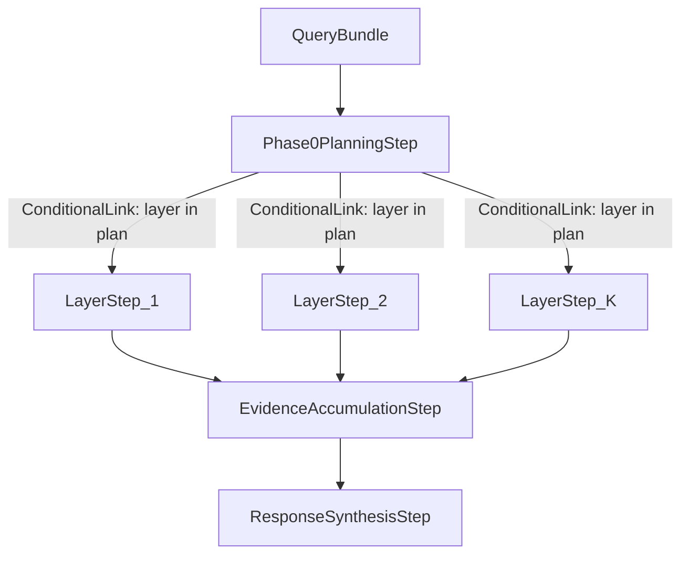

**Nanobrain primitives.**

- Steps: `Phase0PlanningStep` (existing in `nanobrain_workflow_design.md §3.1`),
  `DomainLayerStep` subclasses (existing, §3.2), `EvidenceAccumulationStep`
  (existing, §3.3), `ResponseSynthesisStep` (existing, §3.7).
- Links: `ConditionalLink` from Phase 0 to each layer; `DirectLink` from each layer
  to accumulator; `DirectLink` accumulator → synthesis.
- Trigger: `AllDataReceived` on the accumulator, configured at workflow instantiation
  time with the active layer set (per §3.3).

**Skeleton sketch.**

```yaml
steps:
  phase0:        { config: "phase0_planning_step.yml" }
  sequence:      { config: "sequence_layer_step.yml" }
  structural:    { config: "structural_layer_step.yml" }
  functional:    { config: "functional_layer_step.yml" }
  accumulator:   { config: "evidence_accumulation_step.yml" }
links:
  - { from: phase0, to: sequence,    type: ConditionalLink, when: "sequence in plan.layers" }
  - { from: phase0, to: structural,  type: ConditionalLink, when: "structural in plan.layers" }
  - { from: phase0, to: functional,  type: ConditionalLink, when: "functional in plan.layers" }
  - { from: sequence,   to: accumulator, type: DirectLink }
  - { from: structural, to: accumulator, type: DirectLink }
  - { from: functional, to: accumulator, type: DirectLink }
```

**Inputs / outputs.** In: `QueryBundle(query, session_context?)`. Out:
`EvidenceBundle` (schema in `workflow_output_contract.md §4.2 + §5.1`).

**Failure modes.**

1. **Active-layer set drift.** Phase 0 declares layer L active; the `ConditionalLink`
   gates on a slightly-different predicate; the accumulator's `AllDataReceived`
   trigger waits forever for L's output. Mitigation: the accumulator computes its
   trigger's `data_units` list from `ExecutionPlan.layers` directly, not from the
   workflow YAML.
2. **Branch silent-degradation aggregation.** All layers degrade to empty bundles;
   `fail_on_empty_retrieval` fires only at the synthesis gate, after Phase 0's
   capability-gap declaration is lost. Mitigation: accumulator emits a
   `capability_gaps` field that synthesis is required to surface.
3. **Cross-layer entity collision.** Two layers resolve "Gn" to different canonical
   IDs; the merger silently picks one. Mitigation: entity resolution is centralized
   in `CrossSourceIntegrationStep` (P8) downstream of accumulation, not in each layer.

**Cost / latency profile.** Latency = max(layer latencies) + accumulator + synthesis.
LLM calls = 1 (Phase 0) + ≤K (layer-internal classifiers) + 1 (synthesis). The
parallelism class is "coarse-grained I/O parallelism"; suitable for the local /
threaded executor. Process executor adds no value because layers are I/O-bound.

**Cross-references.** This pattern is the spine of the existing `multi_source_discovery`
skeleton. Use case: 2.1 (multi-database biomarker query) in `multiagent_architecture.md`.
Composes naturally with P8 (concordance), P9 (capability gap declaration), P10
(session reuse). Anti-composes with P3 (refinement loops on top of P1 produce
deadlock-prone DAGs without checkpointing).

---

### P2. Hypothesis Tournament

**Summary.** N specialized proposer agents run in parallel, each generating a ranked
candidate list grounded in evidence. A scoring step merges the lists with confidence
weights; top-K survive to a HITL gate or downstream synthesis.

**When to use.**

- The question is generative ("design X", "rank candidates for Y") rather than
  retrievive.
- Multiple analytical lenses are legitimate (e.g., sequence conservation, structural
  surface accessibility, experimental neutralization, design
  manufacturability). No single lens dominates; the user wants the comparison.
- A HITL gate is appropriate before downstream commitment of expensive resources
  (HPC simulation, wet-lab experiment, paper draft).

**When NOT to use.**

- The question has a single objectively-correct answer (a sequence retrieval,
  a structure ID lookup). Tournament adds N proposer-LLM calls of pure overhead.
- The proposers cannot disagree meaningfully because they all share the same
  evidence and prompt. If you would set N proposers' system_prompts to the same
  string, you have an ensemble with N=1, not a tournament.
- The latency budget is below ~30s. Each proposer is at least one LLM call;
  N proposers in parallel still have one slow tail.

**Shape.**

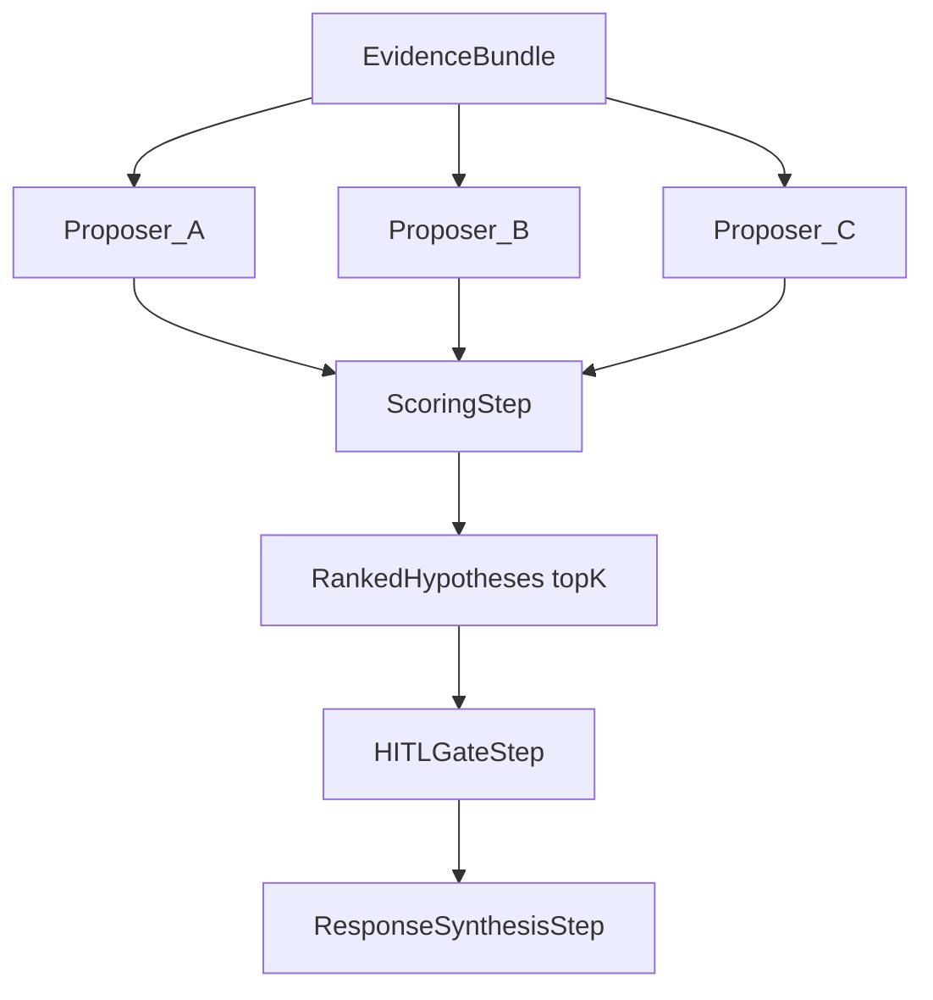

**Nanobrain primitives.**

- Steps: `HypothesisTournamentStep` (existing skeleton in
  `nanobrain_workflow_design.md §3.5`), proposer agents (nanobrain `Agent` with
  distinct `system_prompt` per agent YAML, no proposer-specific Python),
  `HITLGateStep` (§3.6).
- Links: `DirectLink` evidence → each proposer; `DirectLink` each proposer → scoring
  step; `DirectLink` scoring → HITL.
- Trigger on the scoring step: `AllDataReceived` over the proposer outputs, with
  graceful degradation if a proposer returns a structured error object (per §3.5
  "graceful degradation": tournament with ≥2 producing proposers proceeds with a
  warning entry in capability_gaps).

**Skeleton sketch.**

```yaml
steps:
  proposer_A:    { config: "proposer_agent_A.yml" }      # system_prompt: lens A
  proposer_B:    { config: "proposer_agent_B.yml" }      # system_prompt: lens B
  proposer_C:    { config: "proposer_agent_C.yml" }      # system_prompt: lens C
  tournament:    { config: "hypothesis_tournament_step.yml" }
  hitl_gate:     { config: "hitl_gate_step.yml" }
links:
  - { from: evidence,    to: proposer_A, type: DirectLink }
  - { from: evidence,    to: proposer_B, type: DirectLink }
  - { from: evidence,    to: proposer_C, type: DirectLink }
  - { from: proposer_A,  to: tournament, type: DirectLink }
  - { from: proposer_B,  to: tournament, type: DirectLink }
  - { from: proposer_C,  to: tournament, type: DirectLink }
  - { from: tournament,  to: hitl_gate,  type: DirectLink }
```

**Inputs / outputs.** In: `IntegrationResult` (per `workflow_output_contract.md
§5.1`). Out: `RankedHypotheses` — a list of `Hypothesis` objects sorted by score,
truncated to top-K (default K=3 per §3.5). Scoring contract:

| Component | Weight | Source |
|---|---|---|
| Evidence coverage | configurable | `len(supporting_findings) / total_findings` |
| Proposer self-confidence | configurable | proposer-emitted `confidence` field |
| Orthogonality | configurable | diversity penalty: hypotheses with overlapping `supporting_findings` lose score |
| Optional LLM-judge score | configurable | external judge agent (one LLM call); default off |

The four weights sum to 1.0 and are exposed in `hypothesis_tournament_step.yml`. The
default config is documented as one open question (see §7).

**Failure modes.**

1. **Proposer-specialty collapse.** All proposers have nearly-identical prompts and
   produce overlapping hypotheses. The orthogonality penalty saturates, ranking
   becomes unstable. Detection: scoring step logs `n_distinct_supporting_finding_sets
   < n_proposers / 2`. Mitigation: proposer YAMLs must declare a `lens_id`; CI
   refuses two proposers with the same `lens_id`.
2. **Single-proposer dominance.** One proposer always wins (because its lens
   matches the question class). Tournament becomes ensemble-of-1. Mitigation:
   add proposer-class diversity to Phase 0's plan (Phase 0 chooses *which*
   proposers to run, not always all of them).
3. **Discordance erasure.** Top-K cuts off a hypothesis that genuinely contradicts
   the survivors; the user never sees the disagreement. Mitigation: scoring step
   surfaces a `discordance_summary` of cut hypotheses to the synthesis step (per P8).
4. **Bounded-history poisoning.** Per §3.5, proposers maintain a bounded session
   history. A bad turn-1 hypothesis, kept in history, biases turn-2 proposals.
   Mitigation: history entries carry a HITL approval flag; rejected proposals are
   excluded from history replay.

**Cost / latency profile.** N proposer LLM calls in parallel (slow tail = max
proposer latency) + 1 scoring call + optional 1 judge call + 1 HITL gate
(human-bounded). Latency dominated by slowest proposer. Cost scales linearly in N.

**Cross-references.** Use case 2.3 in `multiagent_architecture.md` (multi-factor
scientific construct design). The existing `nanobrain_workflow_design.md §3.5` defines
`HypothesisTournamentStep`; this entry deepens the scoring contract. Composes well
with P5 (the tournament's proposers can themselves be P5 manager/worker subgraphs).
Distinct from P4 (debate) which is *adversarial across rounds*; tournament is
*parallel and independent*.

---

### P3. Refinement Loop with Explicit Termination

**Summary.** A single proposer + critic pair iterates: propose → critique → refine →
critique → … until either the critic's score crosses a threshold, max-iterations is
hit, or successive proposals' scores converge by less than ε.

**When to use.**

- The output is a structured artifact whose quality can be cheaply scored after
  generation (e.g., a YAML the composer is producing — score = `validate_workflow()`
  pass/fail; a draft answer — score = grounded-citation rate).
- The proposer's first attempt is expected to be wrong, but each iteration improves it.
- The critic's signal is *informative*, not just go/no-go. A binary critic doesn't
  benefit from refinement; it benefits from P7 (retry-with-feedback) instead.

**When NOT to use.**

- The critic can only produce binary feedback. Use P7.
- The artifact is non-mutable across iterations (the proposer cannot meaningfully
  re-propose given critic feedback). Use P2 with a different proposer instead.
- No upper bound on iterations is enforceable. **Unbounded loops are forbidden** by
  the workspace three-attempt-cap rule and by `nanobrain_workflow_design.md §8`.

**Shape.**

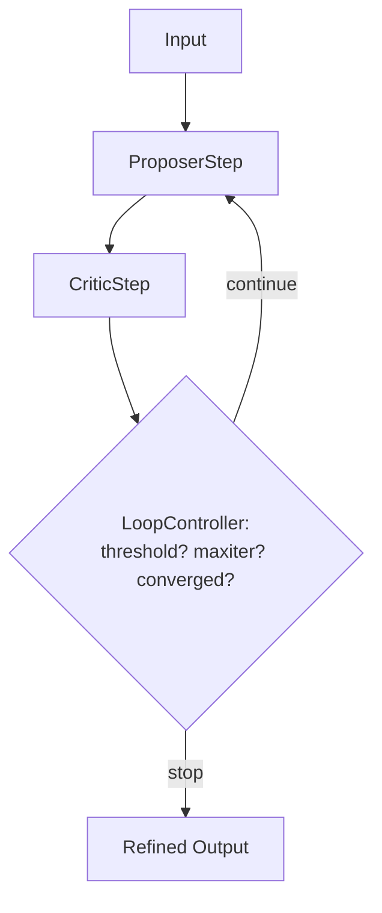

**Nanobrain primitives.**

- Steps: `ProposerStep` (an `Agent` wrapper), `CriticStep` (an `Agent` wrapper),
  `LoopController` (a `BaseStep` that emits a continuation flag).
- Links: `DirectLink` proposer → critic, `DirectLink` critic → controller,
  `ConditionalLink` controller → proposer (when "continue") and controller → output
  (when "stop").
- **Capability gap.** Nanobrain's static-DAG validation refuses self-referencing
  links and back-edges; see `nanobrain-workflow-authoring/SKILL.md`. A
  ConditionalLink-back-edge with explicit cycle-budget is a **proposed extension**:
  `depends on Gxx in nanobrain_capability_gaps.md` (cycle-detection-with-budget rule).
  Until that exists, P3 must be implemented as an inner `process()` loop inside a
  single `RefinementStep` rather than as a multi-step DAG. The `process()`-internal
  loop is the framework-legal form today; the multi-step form is what the catalog
  documents as the target shape.

**Skeleton sketch.**

```yaml
steps:
  proposer:    { config: "refinement_proposer.yml" }
  critic:      { config: "refinement_critic.yml" }
  controller:  { config: "loop_controller.yml" }   # owns max_iter, threshold, epsilon
links:
  - { from: input,      to: proposer,   type: DirectLink }
  - { from: proposer,   to: critic,     type: DirectLink }
  - { from: critic,     to: controller, type: DirectLink }
  - { from: controller, to: proposer,   type: ConditionalLink, when: "decision == 'continue'" }
  - { from: controller, to: output,     type: ConditionalLink, when: "decision == 'stop'" }
```

**Inputs / outputs.** In: `Artifact` + `RefinementBudget(max_iter, threshold,
epsilon)`. Out: `RefinedArtifact` plus a `refinement_trace` listing each
iteration's score for downstream observability and for HITL surfacing.

**Termination contract (mandatory).** The `LoopController` MUST stop when **any**
of the following holds:

1. `critic.score >= threshold` (success).
2. `iter >= max_iter` (budget exhausted; mark output as `unrefined_to_target`).
3. `abs(score[i] - score[i-1]) < epsilon` for two consecutive iterations
   (convergence; mark output as `converged_below_target`).

A controller that lacks all three predicates is a **configuration error** and the
step's `from_config` validator must raise `ComponentConfigurationError`.

**Failure modes.**

1. **Critic / proposer collusion.** Same LLM backs both; critic rubber-stamps
   proposer; threshold reached after one iteration regardless of quality.
   Mitigation: critic and proposer must declare distinct `agent_id`s in YAML;
   integration test asserts that on a deliberately-bad input the critic fails the
   proposer at least once. Mock-only coverage is forbidden by the workspace mocks
   policy.
2. **Score oscillation.** Score zigzags above and below threshold; loop halts
   non-deterministically. Mitigation: termination predicate on threshold uses
   *consecutive* successes (≥2 iterations above threshold), not single-iteration.
3. **Hidden cost overrun.** Each iteration is one proposer + one critic LLM call;
   `max_iter=10` doubles cost vs. `max_iter=3` for marginal gain. Mitigation:
   default `max_iter=3` per the workspace three-attempt-cap; raising it requires a
   commit-message justification.

**Cost / latency profile.** Worst case: `2 * max_iter` LLM calls. Latency is
serial, not parallel — this is the most expensive pattern per unit of output and
should be reserved for cases where refinement clearly pays.

**Cross-references.** Composes inside P2 (the tournament's proposers can each be
P3 refiners). Distinct from P7 (P3 refines a structurally-valid output;
P7 retries after a structurally-*invalid* output failed validation). The
composer's YAML repair loop in `agent_workflow_authoring.md §7` is *not* P3 —
it's P7. P3 is the answer-quality refinement loop above synthesis.

---

### P4. Debate

**Summary.** Two or more agents argue from different priors; each round refutes
the other; a judge synthesizes the resolution.

**When to use.**

- Cross-source contradictions in the evidence bundle (e.g., a biomarker position
  from database A disagrees with a structural annotation from database B; a
  functional score from one source disagrees with experimental data from another).
- The contradiction is *legitimate* — both sources are reliable; the user wants
  the disagreement surfaced, not silently resolved.
- A judge with explicit calibration (rule-based or LLM-judged with documented
  prompt) is available.

**When NOT to use.**

- The "contradiction" is just one source missing data; that's a capability gap,
  not a debate (use P9).
- The dispute is over a single number (concordance score). Compute and surface;
  no debate adds value.
- There is no neutral judge. Two-agent debate without a third-party judge
  collapses into the louder agent winning.

**Shape.**

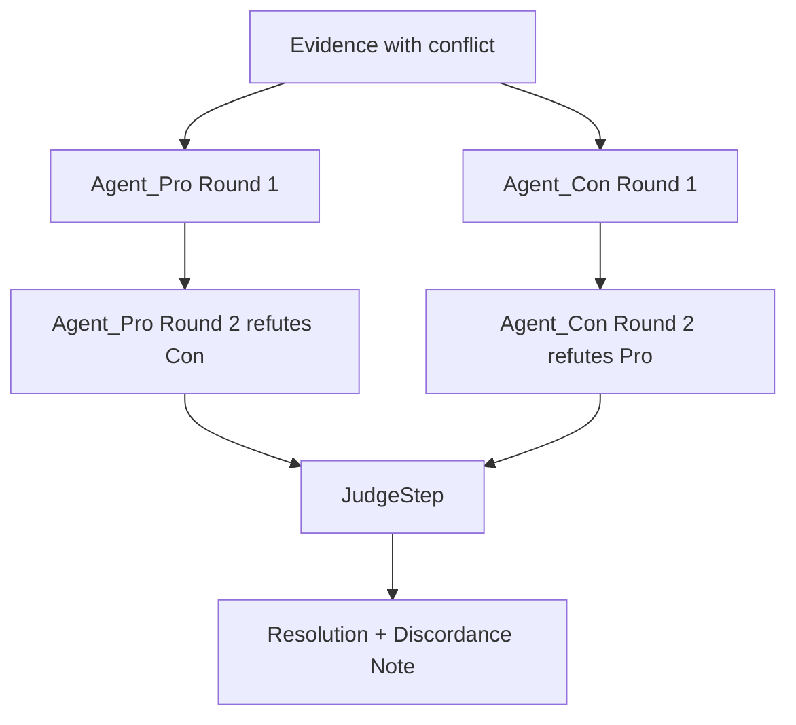

**Nanobrain primitives.**

- Steps: two or more `Agent` wrappers (distinct system_prompts encoding priors),
  a `JudgeStep` (`Agent` with a constrained synthesis prompt).
- Links: `DirectLink` evidence → each agent (round 1); `DirectLink` round-1
  outputs → opposing agent (round 2 input); `DirectLink` final-round outputs → judge.
- **Capability gap.** Multi-round debate with a fixed round count is a chain of
  steps; with a dynamic round count it's a loop and inherits the same
  cycle-detection extension noted in P3. Until that ships, fix the round count at
  workflow-authoring time (default: 2 rounds).

**Skeleton sketch.**

```yaml
steps:
  pro_r1:   { config: "debate_pro_agent.yml" }
  con_r1:   { config: "debate_con_agent.yml" }
  pro_r2:   { config: "debate_pro_agent.yml" }   # same agent, second invocation
  con_r2:   { config: "debate_con_agent.yml" }
  judge:    { config: "debate_judge_step.yml" }
links:
  - { from: evidence, to: pro_r1, type: DirectLink }
  - { from: evidence, to: con_r1, type: DirectLink }
  - { from: con_r1,   to: pro_r2, type: DirectLink }   # pro refutes con
  - { from: pro_r1,   to: con_r2, type: DirectLink }   # con refutes pro
  - { from: pro_r2,   to: judge,  type: DirectLink }
  - { from: con_r2,   to: judge,  type: DirectLink }
```

**Inputs / outputs.** In: `EvidenceBundle` with at least one
`conflicting_findings[]` entry from `workflow_output_contract.md §5.1`. Out:
`Resolution` = `{verdict, supporting_findings, discordance_note}`. The
`discordance_note` is *required* and propagates to the synthesis step's
`cross_source_reasoning` section.

**Failure modes.**

1. **Judge bias toward elaboration.** Judge consistently picks the longer
   argument. Mitigation: judge prompt explicitly forbids using length as a
   signal; integration test seeds two arguments where the shorter one is
   correct and asserts the judge picks correctly more often than chance.
2. **Round-2 echo.** An agent in round 2 simply repeats round-1 claims without
   refuting. Mitigation: critic prompt template requires explicit
   "you-said-X-but" structure; output-contract validator rejects round-2
   outputs that don't reference round-1 content by claim ID.
3. **Silent loser drop.** Judge picks pro; con's argument vanishes from the
   final answer. **Forbidden** by the discordance-must-surface rule (see
   anti-patterns §5). Mitigation: synthesis prompt is required to include the
   loser's argument as a "competing interpretation" paragraph.

**Cost / latency profile.** Fixed cost: 2N + 1 LLM calls (N rounds × 2 agents +
1 judge). Latency is mostly serial within a debate path but rounds can run the
two agents in parallel (saves ~50%). Use case: cross-source contradiction
resolution.

**Cross-references.** Distinct from P2 (tournament): debate is *adversarial
across rounds*; tournament is *parallel and independent*. Composes inside P5
(the manager can dispatch a debate to resolve worker-output contradictions).
Anti-composes with P3: refining a debate's losing position serves no purpose.

---

### P5. Manager / Worker / CEO Hierarchy

**Summary.** A three-layer agent hierarchy. Workers do single-purpose retrieval
or analysis; a manager aggregates, prunes, escalates ambiguity; a CEO makes
terminal decisions or hands off to HITL. Each layer is a nanobrain `Agent` with a
different `system_prompt`; the same LLM may back all three.

**When to use.**

- Long deep-research queries that require coordinating many small tasks
  (single-source lookups, narrow tool calls).
- The user wants a single grounded answer, not a list of intermediate findings.
- Worker outputs are heterogeneous and need normalization before downstream
  steps can consume them.

**When NOT to use.**

- The query is a single-source lookup. Manager + CEO are pure overhead.
- The "manager" would have to do its own LLM-driven analysis (then it's a worker
  and you have an unnamed-CEO). Pick a clear role per layer.
- Total LLM call count exceeds latency budget. M workers + 1 manager + 1 CEO is
  M + 2 LLM calls minimum; for M=10 that's an expensive call.

**Shape.**

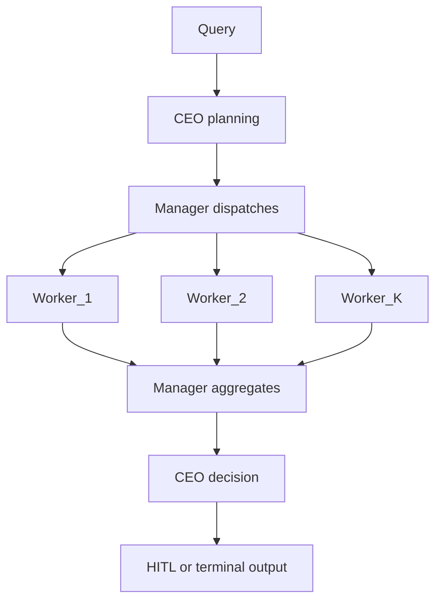

**Nanobrain primitives.**

- Steps: `CEOStep` (`Agent` with system_prompt for high-level planning + final
  arbitration), `ManagerStep` (`Agent` for dispatch/aggregation), `WorkerStep`
  instances (`Agent` per single-purpose role).
- Links: `DirectLink` CEO → manager; `DirectLink` manager → each worker; trigger
  `AllDataReceived` on manager's aggregation phase; `DirectLink` manager → CEO
  for the decision phase.
- The CEO is invoked twice (planning + decision); same `Agent` config can be
  re-used at two points in the DAG. This is legal under nanobrain (a step config
  can be referenced by multiple step IDs as long as the IDs are distinct).

**Skeleton sketch.**

```yaml
steps:
  ceo_plan:    { config: "ceo_agent.yml" }
  manager:     { config: "manager_agent.yml" }
  worker_a:    { config: "worker_retrieval.yml" }
  worker_b:    { config: "worker_analysis.yml" }
  manager_agg: { config: "manager_agent.yml" }      # same agent, aggregation phase
  ceo_decide:  { config: "ceo_agent.yml" }          # same agent, decision phase
links:
  - { from: query,       to: ceo_plan,    type: DirectLink }
  - { from: ceo_plan,    to: manager,     type: DirectLink }
  - { from: manager,     to: worker_a,    type: DirectLink }
  - { from: manager,     to: worker_b,    type: DirectLink }
  - { from: worker_a,    to: manager_agg, type: DirectLink }
  - { from: worker_b,    to: manager_agg, type: DirectLink }
  - { from: manager_agg, to: ceo_decide,  type: DirectLink }
```

**Inputs / outputs.** In: `Query`. Out: `Decision` = `{answer | escalation,
supporting_findings, capability_gaps}`. Escalation triggers the HITL surface.

**Failure modes.**

1. **Worker proliferation.** CEO/manager spawn one worker per sub-question, no
   pooling, latency explodes. Mitigation: manager YAML caps `max_workers` (default
   8); CEO plan that exceeds the cap is rejected and re-planned.
2. **Manager-as-CEO drift.** Manager prompt drifts to include arbitration logic;
   CEO becomes redundant. Detection: integration test asserts that for a fixed
   evidence set the CEO's decision occasionally differs from the manager's
   aggregation summary.
3. **Worker output schema drift.** Each worker emits a slightly different shape;
   manager aggregation logic breaks on the next worker added. Mitigation: every
   worker output is validated against the `LayerResult` schema from
   `workflow_output_contract.md §4.2` before aggregation.

**Cost / latency profile.** M workers in parallel + 2 manager calls + 2 CEO
calls = M + 4 LLM calls. Latency = max(worker latencies) + manager + CEO. This
is a reasonable default for multi-step reasoning queries.

**Cross-references.** Use case 2.1 (multi-database analytical synthesis) maps cleanly onto
P5. Composes with P2 (tournament at the worker layer for design queries) and P9
(workers report capability gaps to manager; manager escalates to CEO). Distinct
from P1: P1 has no manager — Phase 0 plans, layers run, accumulator merges. P5
is recommended when the planning needs to adapt mid-flight (manager re-dispatches
based on partial results), which Phase 0 alone cannot do.

---

### P6. Branch-and-Prune

**Summary.** Early decomposition produces M candidate research paths; a cheap
heuristic scorer prunes to top-K; only K continue to expensive analysis.

**When to use.**

- The candidate space is large (dozens of tool descriptors match a request,
  hundreds of literature hits, many alignment strategies) but only a few merit
  expensive evaluation.
- A cheap scoring signal exists: embedding similarity, descriptor metadata, a
  rule-based filter, a small classifier.
- Expensive analysis cost ≫ pruning cost (typical: 10× to 100×).

**When NOT to use.**

- The cheap signal is unreliable for the task. A bad pruner discards the
  correct candidate, and downstream is blind to the mistake.
- The candidate space is already small (≤K). Pruning adds a step for no win.
- The decision is HITL-bound. Surface all M to the user; do not let an LLM
  choose for the user.

**Shape.**

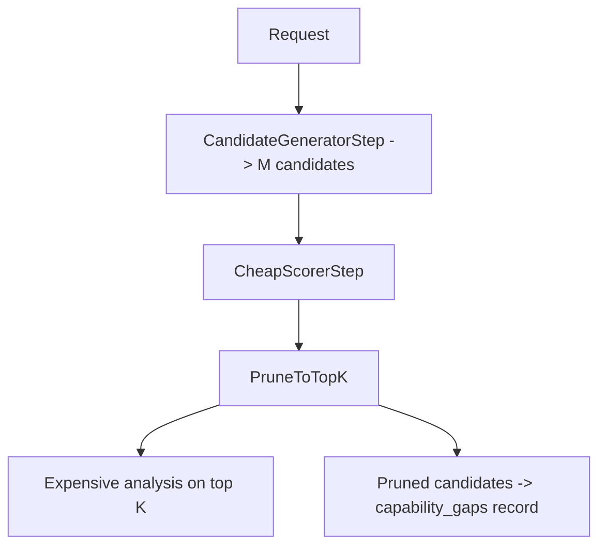

**Nanobrain primitives.**

- Steps: `CandidateGeneratorStep` (e.g., a Rhea descriptor lookup or a FAISS
  semantic search), `CheapScorerStep` (cosine similarity, rule filter, or a
  fast classifier — *not* an LLM call when avoidable), `PruneStep`, downstream
  expensive analysis step.
- Links: `DirectLink` between generator → scorer → pruner. `DirectLink` from
  pruner to *both* the expensive analysis path and the capability-gaps record
  (so dropped candidates are observable).

**Skeleton sketch.**

```yaml
steps:
  candidates:  { config: "candidate_generator.yml" }
  scorer:      { config: "cheap_scorer.yml" }
  pruner:      { config: "prune_topk_step.yml" }     # k configurable
  expensive:   { config: "expensive_analysis.yml" }
  pruned_log:  { config: "pruned_candidate_log.yml" }
links:
  - { from: request,    to: candidates, type: DirectLink }
  - { from: candidates, to: scorer,     type: DirectLink }
  - { from: scorer,     to: pruner,     type: DirectLink }
  - { from: pruner,     to: expensive,  type: DirectLink }
  - { from: pruner,     to: pruned_log, type: DirectLink }
```

**Inputs / outputs.** In: `Request` (e.g., a tool-description query, a list of
literature IDs). Out: `(top_k_candidates, dropped_candidates_with_scores)`.
Dropped candidates with scores are required output, not optional, so the user
or the orchestrator can audit pruning decisions.

**Failure modes.**

1. **Pruner false negative.** The correct candidate scored just below the cut;
   downstream silently misses it. Mitigation: `dropped_candidates_with_scores`
   is logged and surfaced in capability_gaps when score-margin between K-th and
   (K+1)-th is below a configurable epsilon (default 0.05) — meaning the
   pruning was statistically unstable.
2. **Score-saturation collapse.** All M candidates score within 0.01 of each
   other; pruning is meaningless. Mitigation: if score variance < epsilon,
   refuse to prune and pass all M to the expensive step (or HITL).
3. **Cheap-signal dependence on expensive context.** The cheap scorer can only
   rank correctly given context that's not yet computed. The pruner discards the
   right candidate because it's missing the context. Mitigation: don't use P6;
   use P5 with a manager that retrieves context first.

**Cost / latency profile.** Cost dominated by expensive step × K, not × M.
Latency = generator + scorer + max(expensive_per_candidate). If expensive is
LLM and K=3, total LLM cost is 3 + (1 if scorer is LLM) per request.

**Cross-references.** Distinct from P2: P2 evaluates ALL candidates with full
evidence; P6 evaluates with cheap signals first. P6 + P2 composes (prune to K,
then run a tournament across the K). Use case: tool selection from a Rhea
descriptor catalog of 50+ matches, where only ≤3 should run.

---

### P7. Retry-with-Feedback

**Summary.** When a downstream step fails (validation, output schema mismatch,
tool error), the failure record loops back to the upstream proposer with a
structured "your proposal failed because…" message. Bounded retries (cap = 2
per workspace policy).

**When to use.**

- The downstream consumer is a strict validator (YAML schema, output contract,
  tool input shape). Failures are crisp and machine-readable.
- The proposer can plausibly fix the failure given the error message.
- The failure mode is recoverable (a typo, a wrong field, a bad assumption);
  not a logical impossibility (the proposer is being asked for something the
  pattern can't produce).

**When NOT to use.**

- The validator's error is unstructured ("invalid"). The proposer has nothing
  to act on. Fix the validator first.
- The proposer cannot self-correct (it always emits the same wrong shape
  regardless of feedback). Address upstream — reprompt, re-author the agent
  YAML, fix the prompt template — not via retry.
- More than 2 retries are needed. Beyond cap-of-2, escalate to HITL or
  capability gap. Per the workspace three-attempt rule: do not try a fourth.

**Shape.**

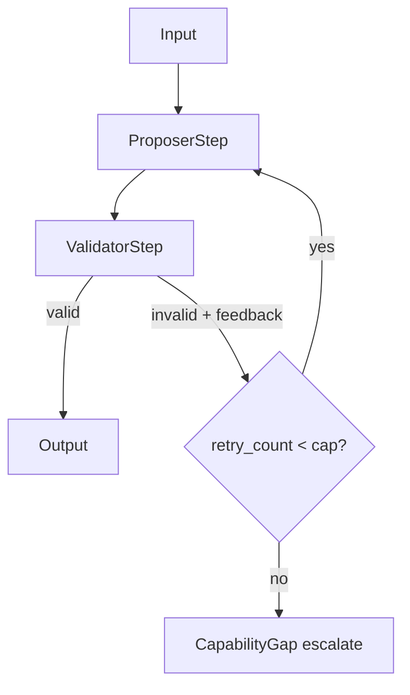

**Nanobrain primitives.**

- Steps: `ProposerStep` (`Agent`), `ValidatorStep` (`BaseStep`).
- Links: `DirectLink` proposer → validator; `ConditionalLink` validator →
  proposer (when invalid AND retry_count < cap, with feedback in the link's
  data unit); `ConditionalLink` validator → output (valid); `ConditionalLink`
  validator → capability-gap escalation (cap reached).
- Same cycle-detection capability gap as P3 applies — until the framework
  permits bounded back-edges, P7 is implemented as an inner loop in the
  proposer's `process()` rather than as a multi-step DAG.

**Skeleton sketch.**

```yaml
steps:
  proposer:   { config: "proposer.yml" }
  validator:  { config: "validator_step.yml" }   # owns retry_cap (default 2)
links:
  - { from: input,      to: proposer,  type: DirectLink }
  - { from: proposer,   to: validator, type: DirectLink }
  - { from: validator,  to: proposer,  type: ConditionalLink, when: "invalid and retries < 2" }
  - { from: validator,  to: output,    type: ConditionalLink, when: "valid" }
  - { from: validator,  to: gap_log,   type: ConditionalLink, when: "invalid and retries >= 2" }
```

**Inputs / outputs.** In: `Input` + `RetryBudget(cap)`. Out: `ValidProposal`
or `CapabilityGap` (one of the two; never both, never neither).

**Failure modes.**

1. **Cap-creep.** Authors raise `retry_cap` to "make tests pass". Mitigation:
   `retry_cap > 2` requires a justification field in the validator config and
   triggers a CI warning.
2. **Feedback information loss.** Validator emits "invalid" without the
   structured reason; proposer's second attempt is blind. Mitigation: validator
   contract requires `error.reason_code` and `error.field_path` — schema
   enforced at `from_config`.
3. **Non-deterministic proposer.** Proposer succeeds on retry purely because
   of LLM sampling, not because of feedback. Detection: compare retry-success
   rate when feedback is the empty string vs. structured feedback; if
   identical, the proposer is not actually using feedback.

**Cost / latency profile.** Worst case 2 × proposer + 3 × validator (initial +
2 retries). Latency serial. Should be cheap because the proposer is typically
small (one focused LLM call) and validator is fast (rule-based).

**Cross-references.** The composer's YAML repair loop in
`agent_workflow_authoring.md §7` is an instance of P7. Distinct from P3
(refinement on a structurally-valid output). Anti-composes with P2 inside the
tournament: tournament proposers should fail-soft (return error structures),
not cause a P7 retry storm.

---

### P8. Evidence Accumulation with Cross-Source Concordance

**Summary.** Outputs from layers L1…LN are merged into an evidence bundle, and
the merger explicitly records *concordance* (sources agree) and *discordance*
(sources disagree). The synthesizer is required to surface discordance to the
user.

**When to use.**

- Multiple sources contribute findings about the same entity / claim.
- The user wants to know whether sources agree (this is the default in
  scientific work).
- Downstream synthesis must be evidence-grounded.

**When NOT to use.**

- Single-source query. Concordance is meaningless with one source.
- Sources are not independent (the same paper indexed in two databases). Detect
  with deduplication on `external_id` before scoring concordance, otherwise
  agreement is artifactual.

**Shape.**

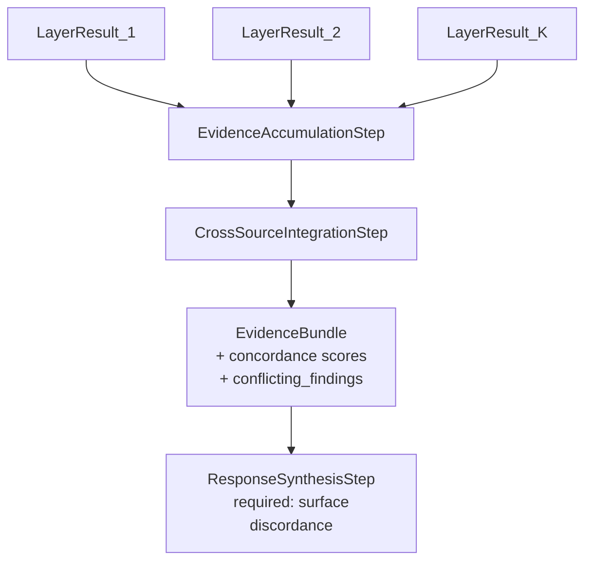

**Nanobrain primitives.**

- Steps: `EvidenceAccumulationStep` (existing, `nanobrain_workflow_design.md
  §3.3`), `CrossSourceIntegrationStep` (existing, §3.4).
- Trigger: `AllDataReceived` on accumulator (per §3.3 design note).
- Single canonical entity-resolution call inside `CrossSourceIntegrationStep`.
  Layer steps are forbidden from doing their own entity normalization.

**Skeleton sketch.**

```yaml
steps:
  accumulator:   { config: "evidence_accumulation_step.yml" }
  integrator:    { config: "cross_source_integration_step.yml" }
links:
  - { from: layer_1, to: accumulator, type: DirectLink }
  - { from: layer_2, to: accumulator, type: DirectLink }
  - { from: layer_n, to: accumulator, type: DirectLink }
  - { from: accumulator, to: integrator,  type: DirectLink }
  - { from: integrator,  to: synthesis,   type: DirectLink }
```

**Inputs / outputs.** In: list of `LayerResult`. Out: `EvidenceBundle` with
`cross_source_concordance` + `conflicting_findings` populated per
`workflow_output_contract.md §5.1`.

**Failure modes.**

1. **Conflict erasure.** Integrator picks one side of a conflict and drops the
   other. **Forbidden.** Mitigation: `conflicting_findings[]` schema is
   non-droppable; synthesis prompt is required to surface conflicts.
2. **Spurious concordance.** Two sources agree only because one indexed the
   other (transitive citation). Mitigation: dedupe by `external_id` before
   scoring; concordance method declared explicitly per
   `IntegrationResult.cross_source_concordance.method`.
3. **Entity-resolution drift.** Two LayerResults reference "Gn" with different
   surface forms; integrator fails to canonicalize; concordance computed on
   the wrong key. Mitigation: integrator runs `CanonicalEntityResolver.resolve`
   on every claim's entity refs; unresolved entities flagged as conflicts.

**Cost / latency profile.** Accumulator cost is N records × O(1). Integrator
cost dominated by entity resolution (cached), then concordance scoring. No LLM
calls required if concordance is rule-based; one LLM call if concordance uses
an LLM-judged method (configurable).

**Cross-references.** This pattern is the integration phase of every
multi-source APECx query. Composes with P1 (after fan-out, accumulate). Always
present in P2 outputs (the tournament's evidence bundle goes through P8 before
proposers see it). Anti-composes with mutating downstream steps (see
anti-patterns §5: evidence overwriting).

---

### P9. Capability Gap Declaration

**Summary.** When an agent encounters a sub-task no available tool can perform,
it emits a structured `CapabilityGap` record (which capability, what would
unblock, suggested remediation) rather than fabricating an answer.

**When to use.**

- The orchestrator's plan includes a layer or tool the deployment doesn't have
  (e.g., a structural surface-accessibility computation, but no PDB layer
  configured).
- The agent recognizes its own ignorance from the evidence bundle (no relevant
  records returned across all available sources).
- The user's question requires data not yet ingested into the available
  databases.

**When NOT to use.**

- The capability *exists* but the agent failed to find it (a retrieval miss).
  Use P7 (retry-with-feedback) with a different query first.
- The gap is fixable mid-flight (e.g., FAISS index not loaded yet, retry after
  load). Use a startup check, not a runtime gap.

**Shape.**

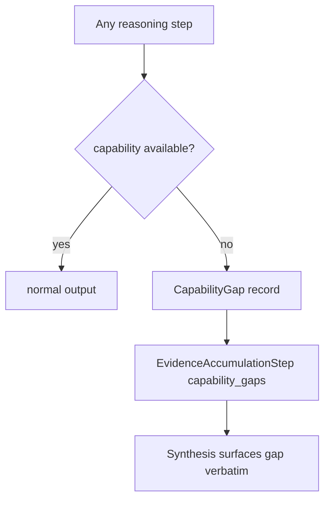

**Nanobrain primitives.**

- Any step (retrieval, layer, tool-execution) can emit a `CapabilityGap`. The
  emission is via the step's standard output data unit, with a discriminator
  field (`record_type: "capability_gap"`).
- The `EvidenceAccumulationStep`'s `capability_gaps[]` field aggregates all
  emitted gaps. Synthesis surfaces them per `workflow_output_contract.md §6.1`
  rule 3 ("gap transparency").

**Skeleton sketch.**

```yaml
steps:
  some_step: { config: "any_step.yml" }
  accumulator: { config: "evidence_accumulation_step.yml" }
  synthesis: { config: "response_synthesis_step.yml" }   # required to surface gaps
links:
  - { from: some_step,    to: accumulator, type: DirectLink }
  - { from: accumulator,  to: synthesis,   type: DirectLink }
# CapabilityGap records ride the same data unit as normal output;
# discriminator field record_type="capability_gap" routes them.
```

**Inputs / outputs.** In: any step input that triggers a missing-capability
realization. Out: `CapabilityGap = {capability_id, what_blocked, suggested_remediation,
required_data_sources?, required_tools?}`. The schema lives in
`workflow_output_contract.md §3.2` (capability_gaps field) and is referenced by
the user-facing surface in the planned `hitl_safety_gates.md`.

**Failure modes.**

1. **Silent fabrication.** Agent generates a plausible-but-unsupported answer
   instead of declaring a gap. **This is the failure mode the pattern exists to
   prevent.** Mitigation: synthesis grounding gate (every `key_result.finding_ids`
   must reference a real finding) catches it.
2. **Gap-spam.** Agent declares a gap on every borderline case; gap list bloats
   and loses signal. Mitigation: cap on gaps per workflow run (default 5); a
   gap budget exceeded causes synthesis to surface only the top-N most-blocking.
3. **Generic-gap dilution.** Agent emits "no data found" without specifying the
   missing capability. Mitigation: schema requires `capability_id` and
   `suggested_remediation` non-empty; `from_config` validator enforces.

**Cost / latency profile.** Zero additional LLM calls (gap emission rides on
existing step outputs). The downstream synthesis cost is unaffected because
the prompt template already has a `capability_gaps` slot.

**Cross-references.** Composes with every other pattern. Particularly important
in P5 (worker → manager → CEO escalation when a worker hits a gap) and P2
(when the tournament's evidence is insufficient for any proposer to score
above a confidence floor). Cross-reference `workflow_output_contract.md §3.2`
for the schema and the planned `hitl_safety_gates.md` for the user-facing
surface.

---

### P10. Conversation Chaining via Session Evidence

**Summary.** Follow-up questions reuse a prior workflow's `EvidenceBundle` as
`session_context`; Phase 0 decides between full-rerun, delta-rerun, and
pure-synthesis-rerun.

**When to use.**

- The user's new question references entities or findings from the prior turn
  (a real follow-up, not an unrelated query).
- The session evidence is fresh (within TTL, default 24h per
  `workflow_output_contract.md §9`).
- The downstream layers can reuse partial evidence without re-querying every
  source.

**When NOT to use.**

- The new question is unrelated to the prior turn. A full rerun is cheaper
  than carrying irrelevant evidence into a fresh Phase 0 call.
- The session has expired (TTL exceeded). Fresh start.
- The user explicitly asks for fresh evidence ("re-run from scratch"). Honor
  the request.

**Shape.**

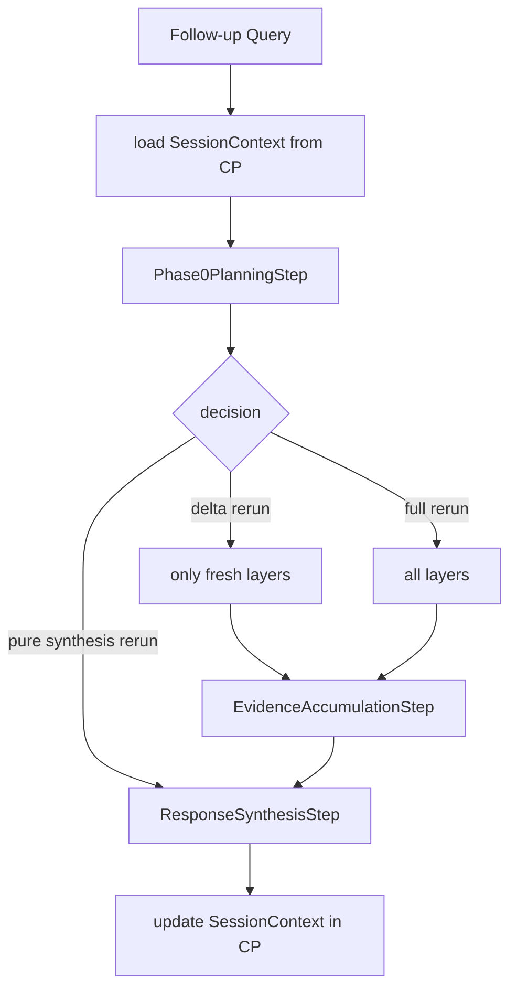

**Nanobrain primitives.**

- The session store lives in the control plane (apecx-cp), not in the
  workflow. The workflow receives `SessionContext` as a top-level input
  parameter (per `nanobrain_workflow_design.md §4.1`) and emits an updated
  `SessionContext` as a top-level output.
- `Phase0PlanningStep` is responsible for the decision (full / delta / pure
  synthesis), per the existing decision logic in §4.2.
- All layer steps consult `LayerInput.session_evidence`; if non-empty and
  TTL-valid, they bypass retrieval (per §3.2).

**Skeleton sketch.**

```yaml
inputs:
  - query
  - session_context        # optional; injected by MCP `ask` tool
steps:
  phase0:        { config: "phase0_planning_step.yml" }
  # Layer / accumulator / synthesis steps as in P1; each layer
  # checks session_evidence before retrieving.
outputs:
  - final_response
  - updated_session_context
```

**Inputs / outputs.** In: `(query, session_context?)`. Out: `(FinalResponse,
updated_SessionContext)`. The `updated_SessionContext` is written back to the
control plane by the MCP surface, not by the workflow itself.

**Failure modes.**

1. **Stale-evidence reuse.** Source data changed between turn N and turn N+1;
   reused evidence is now wrong. Mitigation: TTL (default 24h), plus
   per-source freshness probe in Phase 0 for sources known to update
   frequently.
2. **Entity-name drift across turns.** Turn 1 resolved "Gn" to canonical ID X;
   turn 2's user types "the Gn protein"; if entity registry isn't consulted,
   resolution drifts. Mitigation: `entity_registry` persists across turns
   (per §9 rule 2).
3. **Capability-gap forgetting.** Turn 1 declared a gap; turn 2's plan doesn't
   know about it and re-attempts the failed capability. Mitigation: capability
   gaps persist in `execution_history`; Phase 0 reads them and routes around.

**Cost / latency profile.** Pure-synthesis rerun: 1 LLM call. Delta rerun:
≤K layer calls + accumulator + synthesis. Full rerun: same cost as a fresh P1.
Saves substantial cost on conversational dialogues — typical follow-up is a
delta rerun on 1–2 layers.

**Cross-references.** Cross-reference `agent_workflow_authoring.md §8` (full
vs. delta vs. synthesis-only rerun decision criteria). Composes with every
data-bearing pattern. The MCP `ask` tool is the only canonical session entry
point; direct workflow invocation that bypasses the control plane forfeits
P10.

---

## 4. Pattern composition

Patterns are designed to nest. The legal compositions and the canonical
illegal ones are summarized here.

### 4.1 Legal compositions

| Outer pattern | Inner pattern | Where it nests | Example |
|---|---|---|---|
| P5 (manager/worker/CEO) | P2 (tournament) | At the worker layer | A "design" worker in the manager's dispatch is itself a tournament of design proposers |
| P5 | P4 (debate) | At the manager's arbitration phase | When two workers' findings conflict, manager spawns a P4 debate before sending to CEO |
| P1 (decompose & fan-out) | P6 (branch-and-prune) | Inside one layer | A retrieval layer that prunes 50 Rhea descriptors to 3 before tool execution |
| P1 | P9 (capability gap) | Inside any layer | Any layer step can emit a `CapabilityGap` |
| P2 | P3 (refinement) | Inside one proposer | A proposer that uses propose-critique-refine before emitting its hypothesis |
| P10 (conversation) | P1 | Always | The conversation pattern wraps the canonical fan-out workflow |
| P8 (concordance) | (any data-bearing pattern) | At the integration phase | Always present after multi-source accumulation |
| P7 (retry-with-feedback) | (any output-validating pattern) | At the validator boundary | The composer's YAML emit / validate cycle |

### 4.2 Composition diagram — Generic multi-factor design query

The canonical multi-factor design query (use case 2.3 from `multiagent_architecture.md`)
composes P1 (fan-out retrieval), P2 (hypothesis tournament), P9 (capability gap
declaration), and P10 (conversation chaining):

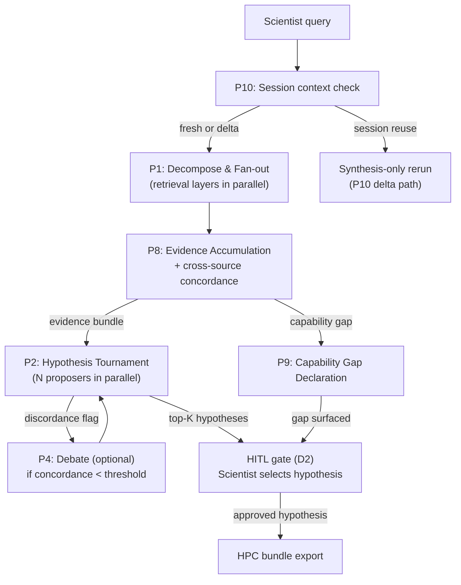

This composition is the primary template for design-type queries. Each sub-pattern
is independently substitutable — the tournament proposers, the debate judge, and
the HITL payload are all configured in the workflow YAML, not hardcoded.
