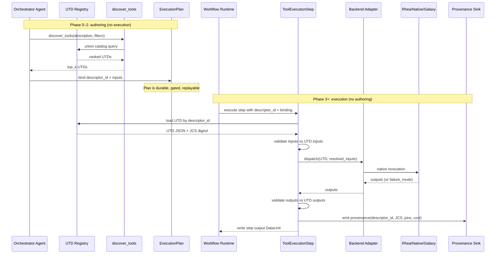

# Unified Tool Descriptor Contract

**Status:** Design / pre-implementation
**Audience:** Tier-2B implementors, orchestrator-agent authors, tool-catalog publishers,
nanobrain framework reviewers
**Supplements:** `external_tool_integration.md` (integration architecture),
`multiagent_architecture.md §7` (tool execution tier),
`agent_workflow_authoring.md` (orchestrator's plan-authoring contract),
`workflow_output_contract.md §7` (tool_outputs evidence shape),
`nanobrain_capability_gaps.md G15` (the framework primitive that ships the UTD schema)
**Supersedes:** Nothing. This doc defines a contract `external_tool_integration.md`
references but does not specify.

> **Audit note (`nanobrain_alignment_audit.md` §4.1, finding F-5):** the
> Unified Tool Descriptor (UTD) shape defined in this document is
> **domain-neutral** and serves as the canonical content of nanobrain's
> `tool_card` field. The schema therefore belongs in **nanobrain core**
> (proposed as **G15** in `nanobrain_capability_gaps.md`), not in
> apecx-mcp. APECx ships the *catalog* (the aggregation of Rhea, native,
> and GalaxyMCP descriptors), the *adapters* that materialize UTDs from
> backend metadata, and the *capability vocabulary* — but the UTD
> primitive itself is framework-level. The split is documented in §11
> (catalog governance) and §13 (cross-references).

---

## 1. Why this document exists

`external_tool_integration.md` defines the *integration architecture* — the
`ToolExecutionStep` interface, the Rhea HTTP+SSE transport, ProxyStore reference-based
I/O, and the conditional GalaxyMCP path. It does **not** specify the descriptor schema
each backend must speak so that the orchestrator agent can reason uniformly about every
tool it might invoke.

Without that schema, the three concrete tool surfaces present three incompatible
shapes to the orchestrator:

- A **Rhea tool** is whatever JSON the upstream catalog publishes alongside the
  embedding used by `find_tools`. The shape is defined by Rhea, not by APECx, and
  changes when Rhea's catalog changes.
- A **GalaxyMCP tool** (when it lands) will be Galaxy's tool XML schema flattened into
  an MCP carrier — dozens of fields APECx does not care about, missing several it does
  (capability tokens, R-tier determinism, content-addressed pins).
- A **native nanobrain `Tool`** is a Python class plus a YAML config. Its "descriptor"
  is the docstring and the YAML — neither parseable as a contract.

The orchestrator's authoring strategies — Phase 0 intent extraction, Phase 1 tool
selection, Phase 2 input binding, Phase 5 cost/capability validation — all assume the
agent can answer five questions about a candidate tool *before* committing it to an
ExecutionPlan slot: what it consumes, what it produces, what side effects it has,
whether it is deterministic enough for the requested R-tier, and whether the user
holds the required capability tokens. If those questions must be answered five
different ways for five backends, the authoring contract is unsafe — a typo in a
descriptor field name silently becomes "the field isn't there" and the agent picks a
stochastic tool for an R3-required plan.

The goal of this doc is one shape, three thin adapters:

> **One Unified Tool Descriptor (UTD) schema. One discovery API.
> One execution API. One failure-mode taxonomy. Each backend (Rhea, native nanobrain,
> GalaxyMCP) implements a thin adapter that materializes UTDs from its native catalog.**

Everything in `external_tool_integration.md` continues to apply unchanged. This document
adds the field-level contract every backend adapter must satisfy and the runtime checks
the framework performs against that contract.

### 1.1 What this document does not do

It does not change the `ToolExecutionStep` runtime envelope from
`external_tool_integration.md §2`; the UTD is the static description, not the runtime
envelope. It does not specify Rhea's internal catalog format (the adapter projects),
the cost-approval gate UI (lives in `hitl_safety_gates.md`), or the registry hosting
model (directory / SQLite / service is a deployment choice).

---

## 2. The Unified Tool Descriptor (UTD) v1

A UTD is a JSON document. Content-addressable: hashing the canonicalized JSON (RFC
8785 JCS) yields a digest that is the catalog's secondary key and that every
provenance record pins. The primary key is `descriptor_id`.

### 2.1 Required fields

| Field | Type | Notes |
|---|---|---|
| `descriptor_id` | string | `<backend>:<tool_id>@<version>` — see §2.2 |
| `display_name` | string | Human-readable. Shown in approvals UI. |
| `summary` | string | One line. The LLM uses this for selection ranking. |
| `long_description` | string (multiline) | Used for RAG-based discovery embedding. |
| `inputs` | array of `Input` | See §2.3. |
| `outputs` | array of `Output` | See §2.4. |
| `side_effects` | enum | `pure` \| `network` \| `filesystem_temp` \| `filesystem_persistent` \| `external_compute` |
| `determinism` | enum | `deterministic` \| `seedable` \| `stochastic` |
| `resource_class` | enum | See §2.5. |
| `cost_estimate` | `CostEstimate` | See §2.6. |
| `failure_modes` | array of `FailureMode` | See §9. |
| `provenance_pin` | `ProvenancePin` | See §2.7. |
| `requires_capability` | array of string | Capability tokens; see §6. |
| `version_history` | array of `VersionEntry` | Semver + change note. |

### 2.2 `descriptor_id` grammar

```
descriptor_id := backend ":" tool_id "@" semver
backend       := "rhea" | "native" | "galaxy"
tool_id       := <namespace>"."<name>     ; both [a-z0-9_-]+
semver        := MAJOR "." MINOR "." PATCH ( "-" prerelease )?
```

Examples:

- `rhea:muscle.align@5.1.0`
- `native:domain_db_lookup@1.2.0`
- `galaxy:fastqc@0.12.1`

The grammar enforces uniqueness across backends (see §12 open question on collisions:
the registry rejects two tools whose `<backend>:<tool_id>` collide; two backends cannot
both claim ownership of `muscle.align`).

### 2.3 `Input` schema

```json
{
  "name": "string",
  "type": "scalar | proxystore_key | dataunit_ref | file_uri | array | object",
  "schema": { /* JSON Schema for the inner value */ },
  "required": true,
  "default": null,
  "description": "string"
}
```

- `scalar` — number, string, bool, null. Inline only; hard cap 4 KiB JSON-serialized.
  Larger payloads MUST be `proxystore_key` or `file_uri`.
- `proxystore_key` — opaque Redis-backed ProxyStore key (`external_tool_integration.md §3.3`);
  resolved at the backend.
- `dataunit_ref` — reference to an upstream step's DataUnit. Resolved through the link
  layer at runtime; the descriptor must declare the expected DataUnit subclass (§7).
- `file_uri` — URI the backend can fetch (`file://`, `s3://`, `https://`). The backend
  may copy into ProxyStore; that's its implementation detail.
- `array`, `object` — composites. `schema` must constrain element/property types.

`required: true` with no `default` means the orchestrator must bind this input from a
preceding step's output or from the user's query. `required: false` with a `default`
means the orchestrator may omit it.

### 2.4 `Output` schema

```json
{
  "name": "string",
  "type": "scalar | proxystore_key | file_uri | array | object | dataunit_ref",
  "schema": { /* JSON Schema for the inner value */ },
  "description": "string"
}
```

Outputs do not carry `required`/`default` — every declared output is produced on success.
Failure modes are declared separately (§9). A tool that conditionally emits an output
must wrap that output's `schema` with `nullable: true` and document the condition in
`description`.

### 2.5 `resource_class` values

| Class | Meaning | Where it runs |
|---|---|---|
| `inline_lt_1s` | Pure function, sub-second, no I/O | In the orchestrator's process |
| `local_short` | Local CPU, < 60 s, < 2 GiB RAM | apecx-mcp host |
| `local_long` | Local CPU, < 1 hr, < 16 GiB RAM | apecx-mcp host |
| `parsl_node` | Single-node compute via Parsl | Rhea Parsl pool |
| `parsl_multinode` | Multi-node compute via Parsl | Rhea Parsl pool |
| `academy_aurora` | Aurora HPC via Academy | Argonne Aurora |

The class is advisory at descriptor time; the actual scheduler chooses the executor
based on this class plus the user's profile (see `agent_workflow_authoring.md §6`).

### 2.6 `CostEstimate` schema

```json
{
  "cpu_seconds_p50": 0.0,
  "cpu_seconds_p95": 0.0,
  "wall_seconds_p50": 0.0,
  "wall_seconds_p95": 0.0,
  "memory_bytes_p95": 0,
  "estimate_source": "static | telemetry | static+telemetry",
  "telemetry_run_count": 0,
  "telemetry_window_days": 0
}
```

Static estimates are required at publication time. Telemetry-blended estimates
overwrite static after a configurable run-count threshold (default: 30 successful
invocations within a 30-day window — see §8).

### 2.7 `ProvenancePin` schema

```json
{
  "executable_digest": "sha256:...",
  "container_digest": "oci://registry/image@sha256:...",
  "model_digest": "sha256:...",
  "model_revision": "string"
}
```

All four fields are nullable. Native nanobrain Tools typically pin `executable_digest`
(the Python wheel hash) and nothing else. Rhea tools typically pin `container_digest`.
LLM-backed tools (a tool whose internal action is an LLM call) MUST pin both
`model_digest` (the model weights hash if available) and `model_revision` (the
provider-side revision string), because reproducibility against a hosted LLM is
weaker than against a local container.

### 2.8 `VersionEntry` schema

```json
{
  "version": "5.1.0",
  "released_at": "2026-04-01T00:00:00Z",
  "change_note": "Switched scoring matrix default from BLOSUM62 to BLOSUM50.",
  "deprecates": null
}
```

`deprecates` is the prior `descriptor_id@version` this version supersedes, or null. The
registry retains deprecated descriptors indefinitely so prior bundles remain replayable.

---

## 3. Worked examples

Three complete UTDs follow. Every required field is filled. These are illustrative —
they are not normative descriptors for these tools.

### 3.1 Rhea descriptor: `rhea:muscle.align@5.1.0`

```json
{
  "descriptor_id": "rhea:muscle.align@5.1.0",
  "display_name": "MUSCLE multiple sequence alignment",
  "summary": "Multiple sequence alignment of protein or nucleotide sequences using MUSCLE 5.1.",
  "long_description": "MUSCLE (MUltiple Sequence Comparison by Log-Expectation) v5.1 produces a multiple sequence alignment from a FASTA-formatted set of unaligned sequences. Suitable for protein and nucleotide inputs up to ~1000 sequences. Output is FASTA-aligned with gap characters. Deterministic given identical inputs and the same MUSCLE binary build.",
  "inputs": [
    {"name": "sequences", "type": "proxystore_key", "schema": {"description": "FASTA byte stream"}, "required": true, "description": "Input sequences (ProxyStore key)."},
    {"name": "alphabet", "type": "scalar", "schema": {"type": "string", "enum": ["protein", "nucleotide"]}, "required": false, "default": "protein", "description": "Sequence alphabet."},
    {"name": "max_iterations", "type": "scalar", "schema": {"type": "integer", "minimum": 1, "maximum": 32}, "required": false, "default": 16, "description": "Iterative refinement cap."}
  ],
  "outputs": [
    {"name": "alignment", "type": "proxystore_key", "schema": {"description": "FASTA-aligned byte stream"}, "description": "Aligned sequences in FASTA format with gaps."},
    {"name": "tree", "type": "proxystore_key", "schema": {"description": "Newick guide tree"}, "description": "Guide tree used during alignment."}
  ],
  "side_effects": "external_compute",
  "determinism": "deterministic",
  "resource_class": "parsl_node",
  "cost_estimate": {
    "cpu_seconds_p50": 18.0,
    "cpu_seconds_p95": 95.0,
    "wall_seconds_p50": 18.0,
    "wall_seconds_p95": 95.0,
    "memory_bytes_p95": 1073741824,
    "estimate_source": "static+telemetry",
    "telemetry_run_count": 412,
    "telemetry_window_days": 30
  },
  "failure_modes": [
    {"code": "INPUT_VALIDATION_FAILED", "description": "FASTA parse error", "retryable": false},
    {"code": "EXECUTION_TIMEOUT", "description": "Walltime exceeded", "retryable": true},
    {"code": "EXECUTION_OOM", "description": "Memory exceeded", "retryable": false},
    {"code": "BACKEND_UNREACHABLE", "description": "Rhea HTTP/SSE error", "retryable": true},
    {"code": "OUTPUT_VALIDATION_FAILED", "description": "Empty alignment", "retryable": false}
  ],
  "provenance_pin": {"executable_digest": null, "container_digest": "oci://ghcr.io/rhea/muscle@sha256:9f2c...", "model_digest": null, "model_revision": null},
  "requires_capability": ["network_egress", "parsl_compute"],
  "version_history": [
    {"version": "5.1.0", "released_at": "2026-04-01T00:00:00Z", "change_note": "Initial Rhea catalog entry.", "deprecates": null}
  ]
}
```

### 3.2 Native nanobrain descriptor: `native:domain_db_lookup@1.2.0`

```json
{
  "descriptor_id": "native:domain_db_lookup@1.2.0",
  "display_name": "Domain database tabular lookup",
  "summary": "Direct pandas lookup over the bundled local domain-database tables and their precomputed joins.",
  "long_description": "Wraps locally-hosted CSV/TSV data bundles exposed through the apecx-mcp database tools. Given a query token (ontology identifier, controlled-vocabulary term, or free-text field value), returns matching rows from the configured tables and precomputed join views. Pure read; no network. Deterministic against a given data bundle revision.",
  "inputs": [
    {"name": "query", "type": "scalar", "schema": {"type": "string", "minLength": 1, "maxLength": 256}, "required": true, "description": "Token to search across the database's indexable columns."},
    {"name": "tables", "type": "array", "schema": {"type": "array", "items": {"type": "string"}}, "required": false, "default": null, "description": "Subset of configured tables to consult; null means all tables."},
    {"name": "max_rows", "type": "scalar", "schema": {"type": "integer", "minimum": 1, "maximum": 1000}, "required": false, "default": 100, "description": "Per-table row cap."}
  ],
  "outputs": [
    {"name": "rows", "type": "object", "schema": {"type": "object", "additionalProperties": {"type": "array"}}, "description": "Per-table arrays of matching rows, keyed by table name."}
  ],
  "side_effects": "filesystem_temp",
  "determinism": "deterministic",
  "resource_class": "inline_lt_1s",
  "cost_estimate": {
    "cpu_seconds_p50": 0.04,
    "cpu_seconds_p95": 0.18,
    "wall_seconds_p50": 0.04,
    "wall_seconds_p95": 0.18,
    "memory_bytes_p95": 134217728,
    "estimate_source": "telemetry",
    "telemetry_run_count": 9211,
    "telemetry_window_days": 30
  },
  "failure_modes": [
    {"code": "INPUT_VALIDATION_FAILED", "description": "Empty or oversized query token", "retryable": false},
    {"code": "TOOL_NOT_FOUND", "description": "Data bundle missing under APECX_DATA_ROOT", "retryable": false},
    {"code": "OUTPUT_VALIDATION_FAILED", "description": "Schema mismatch on a returned row", "retryable": false}
  ],
  "provenance_pin": {"executable_digest": "sha256:0b5c4f...", "container_digest": null, "model_digest": null, "model_revision": null},
  "requires_capability": ["filesystem_local_data_root"],
  "version_history": [
    {"version": "1.2.0", "released_at": "2026-05-01T00:00:00Z", "change_note": "Added join-view fast path.", "deprecates": "native:domain_db_lookup@1.1.0"}
  ]
}
```

### 3.3 GalaxyMCP placeholder descriptor: `galaxy:fastqc@0.12.1`

This is illustrative only; `external_tool_integration.md §4.3` defers GalaxyMCP until
deployability is confirmed.

```json
{
  "descriptor_id": "galaxy:fastqc@0.12.1",
  "display_name": "FastQC quality control report",
  "summary": "Quality control metrics for FASTQ-formatted high-throughput sequencing reads.",
  "long_description": "FastQC v0.12.1 produces per-base and per-read QC metrics (adapter content, GC distribution, duplication, length distribution) for an input FASTQ file. Output is a multi-section HTML report plus a parseable text summary. Deterministic against a given FastQC binary build.",
  "inputs": [
    {"name": "reads", "type": "file_uri", "schema": {"description": "FASTQ or gzipped FASTQ"}, "required": true, "description": "Input reads. Galaxy dataset ID resolved by the GalaxyMCP adapter."}
  ],
  "outputs": [
    {"name": "report_html", "type": "file_uri", "schema": {"description": "FastQC HTML report"}, "description": "Human-readable QC report."},
    {"name": "summary_text", "type": "file_uri", "schema": {"description": "Parseable summary"}, "description": "Per-section pass/warn/fail summary."}
  ],
  "side_effects": "external_compute",
  "determinism": "deterministic",
  "resource_class": "parsl_node",
  "cost_estimate": {
    "cpu_seconds_p50": 22.0,
    "cpu_seconds_p95": 180.0,
    "wall_seconds_p50": 22.0,
    "wall_seconds_p95": 180.0,
    "memory_bytes_p95": 2147483648,
    "estimate_source": "static",
    "telemetry_run_count": 0,
    "telemetry_window_days": 0
  },
  "failure_modes": [
    {"code": "INPUT_VALIDATION_FAILED", "description": "Not a valid FASTQ file", "retryable": false},
    {"code": "EXECUTION_TIMEOUT", "description": "Walltime exceeded", "retryable": true},
    {"code": "BACKEND_UNREACHABLE", "description": "GalaxyMCP unreachable", "retryable": true}
  ],
  "provenance_pin": {"executable_digest": null, "container_digest": null, "model_digest": null, "model_revision": null},
  "requires_capability": ["network_egress", "galaxy_account"],
  "version_history": [
    {"version": "0.12.1", "released_at": "2026-04-15T00:00:00Z", "change_note": "Initial Galaxy adapter entry.", "deprecates": null}
  ]
}
```

---

## 4. Backend adapters

Each backend supplies a thin adapter that produces UTDs from its native catalog. The
adapter is the *only* code that knows the backend's native shape; everything above the
adapter sees only UTDs.

### 4.1 Rhea adapter

Rhea exposes a single MCP tool, `find_tools`, that does RAG over its embedded catalog
and returns ranked candidates (see `external_tool_integration.md §3.2`). The Rhea
adapter wraps that protocol.

**Discovery cycle (Rhea path):**

1. The orchestrator emits a natural-language `tool_description` (Phase 0 of the
   authoring contract).
2. The adapter calls Rhea's `find_tools(description, top_k)`.
3. Rhea returns a `tools/list` notification with N ranked candidates, each carrying
   Rhea's native fields (name, description, parameter schema, container reference,
   optional cost annotations).
4. The adapter projects each candidate into a UTD:
   - `descriptor_id = "rhea:" + rhea.tool_id + "@" + rhea.version`.
   - Copies `display_name`, `summary`, `long_description` from Rhea.
   - Translates Rhea's parameter schema into UTD `inputs[]`, defaulting unspecified
     types to `proxystore_key` (Rhea's I/O is reference-based by default).
   - Translates declared outputs to UTD `outputs[]`; a single unnamed return becomes
     `{name: "result", type: "proxystore_key"}`.
   - `side_effects = "external_compute"` (always — Academy container).
   - `determinism` from Rhea's tag if present, else `stochastic` (fail-closed; §10).
   - `resource_class` inferred from the declared Parsl pool (`parsl_node` /
     `parsl_multinode`). Absent annotation → `parsl_node` + publishing warning.
   - `cost_estimate.estimate_source = "static"` until §8 telemetry threshold crosses.
   - `provenance_pin.container_digest` from Rhea. **The adapter rejects any Rhea tool
     without a container digest** — an undigested container makes provenance
     unfalsifiable.
   - `requires_capability = ["network_egress", "parsl_compute"]` plus Rhea-declared
     extras (e.g. `"gpu_a100"`).
5. The orchestrator picks ONE descriptor_id and records the rank index
   (`selected_rank: 1`) so reviewers can see it didn't pick a low-confidence candidate.

**Native vs. inferred:** Rhea provides name, description, parameter schema, container
ref, optional pool annotation. The adapter defaults `determinism` (→ `stochastic`),
`resource_class` (from pool), `failure_modes` (always the §9 canonical six),
`requires_capability` (network + parsl + extras), `cost_estimate.estimate_source`
(`static` until telemetry accrues). The adapter must NOT invent
`provenance_pin.container_digest` — absence is a hard reject.

### 4.2 Native nanobrain adapter

Any nanobrain `Tool` subclass (`async def execute`) registered in a local catalog
produces a UTD at registration time. Native UTDs are authored by the tool's author, not
inferred — the framework does not introspect the Python class to manufacture a UTD.

**Registration manifest** (`tool_collection/manifest.yml`):

```yaml
tools:
  - descriptor: "tool_collection/domain_db_lookup/descriptor.json"
    class: "apecx_integration.tools.domain_db_lookup.DomainDbLookupTool"
    config: "tool_collection/domain_db_lookup/tool.yml"
  - descriptor: "tool_collection/synonym_expand/descriptor.json"
    class: "apecx_integration.tools.synonym_expand.SynonymExpandTool"
    config: "tool_collection/synonym_expand/tool.yml"
```

Each manifest row points at:

- The UTD JSON file (the descriptor itself, content-addressed by JCS digest).
- The Python class implementing the tool (`Tool` subclass).
- The nanobrain YAML used to instantiate the class via `from_config`. Capability tokens
  for the tool are declared in this YAML's `metadata.capabilities` block, NOT in the
  Python class — capabilities are deployment-policy data, not implementation data:

```yaml
class: apecx_integration.tools.domain_db_lookup.DomainDbLookupTool
config:
  data_root: "${APECX_DATA_ROOT}"
  metadata:
    capabilities:
      - filesystem_local_data_root
```

At registration time the adapter:

1. Loads the UTD JSON and verifies its JCS digest against the registry's expected hash.
2. Loads the YAML and extracts `metadata.capabilities`. The set on the descriptor and
   the set on the YAML must match exactly; mismatches are a registration error.
3. Imports the Python class lazily and verifies it is a `Tool` subclass with an
   `async def execute(...)`. No execution at registration time.
4. Inserts the descriptor into the local UTD catalog under `descriptor_id`.

A native tool that does not ship a UTD JSON is **not** registered. There is no
"discover from docstring" fallback; the docstring is documentation, not a contract.

### 4.3 GalaxyMCP adapter (placeholder)

Deferred until Galaxy MCP availability is confirmed (`external_tool_integration.md §4.3`).
Expected mapping:

| Galaxy tool XML field | UTD field |
|---|---|
| `<tool id>` + `<tool version>` | `descriptor_id` (prefix `galaxy:`) |
| `<tool name>` / `<description>` / `<help>` | `display_name` / `summary` / `long_description` |
| `<inputs><param>` / `<outputs><data>` | `inputs[]` / `outputs[]` |
| `<requirements><container>` | `provenance_pin.container_digest` (if digested) |
| `<requirements><package>` | folded into `requires_capability` |

Galaxy XML does not declare determinism, resource class, or capability tokens. The
adapter requires a per-installation overlay file to fill these; absent overlay, the
tool is rejected. Fail-closed by design — Galaxy's catalog contains tools with hidden
network egress the orchestrator must not invoke without operator review.

---

## 5. Discovery protocol — agent perspective

The orchestrator never calls a tool's `execute` directly. It only chooses a
`descriptor_id` and writes it into the ExecutionPlan. The framework is responsible
for resolving and invoking that descriptor at workflow runtime.

### 5.1 The discovery API

```
discover_tools(
    description: str,
    top_k: int = 5,
    filters: {
      "determinism": "deterministic" | "seedable" | "stochastic" | None,
      "resource_class": [resource_class] | None,
      "side_effects": ["pure", "network", ...] | None,
      "requires_capability_subset_of": [capability_token] | None,
    } | None
) -> list[UTD]
```

Returns a list of UTDs ranked by RAG relevance against `description`, drawn from the
union of all enabled backend catalogs (Rhea + native + (later) GalaxyMCP), deduplicated
by `descriptor_id`. If two backends advertise tools with the same `<backend>:<tool_id>`,
the registry rejects the collision at publish time (§12); the discovery API will never
see colliding ids.

The `filters` block lets the orchestrator narrow the search BEFORE ranking, which is
load-bearing: the agent should never see a `stochastic` tool if it's authoring an
R3-determinism plan, because the LLM will pick the higher-summary-similarity candidate
even when that candidate violates the plan's tier.

### 5.2 The selection rule

The agent selects exactly ONE `descriptor_id` per `tool_invocations` slot in the
ExecutionPlan. Inputs are bound by reference — either to a literal value, a
ProxyStore key, or a preceding step's output DataUnit (see
`agent_workflow_authoring.md §3`). The selected descriptor and the input bindings are
serialized into the plan; the agent never produces an executable artifact directly.

**Forbidden:** the agent never invokes the tool inline ("dry run it to see what
happens"). The plan is the only durable output. Inline invocation would smuggle side
effects past every gate that reads the plan (cost approval, capability check, R-tier
audit).

### 5.3 Caching contract

Descriptor lookups are cached per `descriptor_id`, keyed by
`descriptor_id + skeleton_version`. `skeleton_version` is the workflow skeleton's
content-addressed hash from the composer; it changes whenever the skeleton's structure
changes, invalidating tool selections that may have depended on different upstream
shapes.

Cache hits are recorded in provenance as
`{tool_lookup: cached, descriptor_id, skeleton_version, cached_at}`. Cache misses
trigger a fresh `discover_tools` round trip and the resulting UTD is stored under the
cache key.

For Rhea specifically, the descriptor cache TTL is bounded by the
`discovery_cache_ttl_seconds` setting in `external_tool_integration.md §3.5`. After
the TTL expires, the adapter re-fetches from Rhea even if the cache key is present —
Rhea's catalog can change underfoot (§12 open question on Rhea catalog pinning).

---

## 6. Execution protocol — runtime perspective

At runtime, the `ToolExecutionStep` step receives a UTD reference + a binding map and
performs the steps below. This is the runtime counterpart to `external_tool_integration.md §2`.

### 6.1 Step sequence

1. **Load the UTD.** Resolve `descriptor_id` against the local registry. If the plan
   does not pin `@<version>`, prefer the latest deployed version (see §8). If pinned,
   use exactly that version.
2. **Validate the binding map against `inputs[]`.** Missing required inputs or type
   mismatches → raise `ComponentConfigurationError("FAIL-FAST: ...")`. No silent
   coercion (nanobrain framework convention).
3. **Resolve `proxystore_key` references** against the run's ProxyStore namespace.
   Resolution is the backend's job; unresolved keys surface as `BACKEND_UNREACHABLE`
   (Redis unreachable) or `INPUT_VALIDATION_FAILED` (key absent).
4. **Resolve `dataunit_ref` inputs** through the link layer. The DataUnit subclass
   MUST match what the descriptor declares (§7), else `ComponentConfigurationError`.
5. **Dispatch to the backend adapter:**
   - `rhea:` → HTTP+SSE `invoke` call with resolved inputs as ProxyStore keys; stream
     progress to completion.
   - `native:` → `await tool.execute(**resolved_inputs)`; the class is instantiated
     via `Tool.from_config` (the nanobrain `from_config` rule).
   - `galaxy:` → adapter posts to Galaxy's MCP carrier; wait for job completion.
6. **Validate outputs against `outputs[]`.** Mismatch → `OUTPUT_VALIDATION_FAILED`.
   Non-retryable: re-running with the same inputs produces the same bad output.
7. **Write outputs into the step's output DataUnit** per §7's type mapping.
8. **Emit a provenance record** with `descriptor_id`, the UTD's JCS digest, the
   `provenance_pin` block, cost actuals (cpu/wall/memory), and the I/O ProxyStore
   keys. Appended to the run's evidence package (`workflow_output_contract.md §7`).
9. **On failure**, consult `failure_modes[]`. Retryable failures back off up to a cap
   of 3 attempts (the workspace three-attempt rule applies at runtime too). All other
   failures bubble up and the step is marked failed.

### 6.2 Sequence diagram



---

## 7. Result-typing into nanobrain DataUnits

A UTD output type maps to exactly one nanobrain DataUnit subclass. The framework uses
this mapping at link-wiring time to verify that downstream steps consume the correct
type.

| UTD output type | DataUnit subclass | Notes |
|---|---|---|
| `scalar` | `DataUnitMemory` | Inline value. |
| `object` | `DataUnitMemory` | Inline dict. JSON-serializable. |
| `array` (small) | `DataUnitMemory` | List inline. |
| `array` (large) | `DataUnitProxyRef` | Threshold: 64 KiB JSON-serialized. Backend chooses. |
| `file_uri` | `DataUnitFile` | URI is the content; the file may be streamed lazily. |
| `proxystore_key` | `DataUnitProxyRef` | Proposed extension; see `nanobrain_capability_gaps.md`. |
| `dataunit_ref` | (passthrough) | The ref is whatever upstream produced. |

`DataUnitProxyRef` is a proposed extension. Today the orchestrator falls back to
`DataUnitMemory` for `proxystore_key` outputs and resolves keys inline at the step
boundary — defeating ProxyStore's purpose by forcing materialization through the
apecx-mcp host's memory. The extension is tracked in `nanobrain_capability_gaps.md`
and gates multi-tool composition.

The type system matters because the linker must know what each step *produces* to
wire downstream inputs. Today the knowledge is implicit: a step returning `dict` and a
step returning `dict[str, ProxyStoreKey]` look identical to the link layer, and the
second silently inserts a key where downstream expects raw data. Under multi-tool
composition this fails late, often after a costly upstream tool has run. UTD-typed
outputs surface the mismatch at plan-validation time, before any execution.

---

## 8. Cost & resource declarations

Costs serve two consumers:

1. **The cost-approval gate** (`hitl_safety_gates.md`) — sums cost across all
   `tool_invocations` in a plan and surfaces the total to the operator before
   execution. The gate consumes `cost_estimate.cpu_seconds_p95`,
   `wall_seconds_p95`, and `memory_bytes_p95`. p95 not p50, because operators are
   approving worst-case spend.
2. **The scheduler** — uses `resource_class` plus `cost_estimate.cpu_seconds_p50` to
   select an executor (inline, local, Parsl pool size, Aurora reservation).

### 8.1 Static estimates

Every UTD ships with static estimates at publication time. For native tools the
publisher fills them from a developer-time benchmark; for Rhea tools they are inferred
from Rhea's catalog annotation (or set to a defensive upper bound when the annotation
is absent).

### 8.2 Telemetry blending

After 30 successful invocations within a 30-day rolling window (configurable per
deployment), the registry computes telemetry-derived p50 and p95 for cpu_seconds,
wall_seconds, and memory_bytes, and overwrites the static fields. The
`estimate_source` is updated to `static+telemetry` and `telemetry_run_count` /
`telemetry_window_days` are filled.

Telemetry is **per `descriptor_id` including version**. A new version always starts
with `estimate_source: "static"` and re-accrues telemetry independently. This is
deliberate — versions can change runtime characteristics (a new MUSCLE iteration cap, a
new container base image), and inheriting telemetry across versions is unsound.

### 8.3 Version pinning

The agent uses the LATEST descriptor version unless the plan pins `@<version>`.
Pinning is rare — used to reproduce a prior run exactly, or to hold a known-good
version while a newer one is under review. Default is "latest deployed" because
telemetry and bug fixes accumulate at head.

If a plan pins a version that has been removed (should never happen per §10
retention), execution fails fast with `TOOL_NOT_FOUND`, not a fallback.

---

## 9. Failure mode taxonomy

Every backend MUST surface failures using these canonical codes. Adapters translate
backend-native errors into these codes; the orchestrator and approval UIs render only
these codes.

| Code | Description | Retryable | Surface to |
|---|---|---|---|
| `INPUT_VALIDATION_FAILED` | Input did not match the declared schema. | false | Authoring agent (for repair) |
| `TOOL_NOT_FOUND` | descriptor_id absent from the registry, or backend says the tool is gone. | false | Authoring agent |
| `EXECUTION_TIMEOUT` | Wall-clock cap exceeded. | true (with backoff) | Runtime; surface to operator on third failure |
| `EXECUTION_OOM` | Memory cap exceeded. | false | Operator |
| `BACKEND_UNREACHABLE` | Network/transport failure to the backend (Rhea HTTP, Galaxy job queue, ProxyStore Redis). | true (with backoff) | Operator |
| `OUTPUT_VALIDATION_FAILED` | Tool produced output that did not match the declared schema. | false | Tool publisher |
| `CAPABILITY_DENIED` | The user's profile lacks a capability the tool requires. | false | Authoring agent (re-author with a different tool) |

### 9.1 Backend mapping

**Rhea:** Rhea returns errors as JSON-RPC error envelopes plus structured stderr from
Academy containers. The Rhea adapter maps:

- HTTP 4xx with `code == "validation_error"` → `INPUT_VALIDATION_FAILED`.
- HTTP 404 / `code == "tool_not_found"` → `TOOL_NOT_FOUND`.
- Container exit signal `SIGKILL` + Parsl OOM annotation → `EXECUTION_OOM`.
- Container exit on Parsl `walltime_exceeded` → `EXECUTION_TIMEOUT`.
- HTTP 5xx, connection refused, SSE stream broken → `BACKEND_UNREACHABLE`.
- Container exit code 0 + post-run schema check failure → `OUTPUT_VALIDATION_FAILED`.

**Native nanobrain Tools:** Python exceptions thrown by `Tool.execute` map as:

- `pydantic.ValidationError` on input → `INPUT_VALIDATION_FAILED`.
- `ImportError` on the Python class → `TOOL_NOT_FOUND` (the registration manifest
  pointed at a class that isn't importable).
- `asyncio.TimeoutError` → `EXECUTION_TIMEOUT`.
- `MemoryError` → `EXECUTION_OOM` (best-effort; the process is usually already dead).
- `pydantic.ValidationError` on output → `OUTPUT_VALIDATION_FAILED`.
- `PermissionError` on a declared capability check → `CAPABILITY_DENIED`.
- Anything else → re-raised as `BACKEND_UNREACHABLE` *only if* the exception arose
  during transport-equivalent work (e.g. an HTTP client inside the tool); otherwise
  re-raised as a framework-level error so the workflow runtime can mark the step
  failed without faking a known taxonomy entry.

**GalaxyMCP:** TBD; expected to mirror Rhea's mapping with Galaxy job state codes
substituted for HTTP status.

### 9.2 The `CAPABILITY_DENIED` surface

`CAPABILITY_DENIED` is the only failure code surfaced *back to the authoring agent*
at execution rather than to the operator. The agent treats it as a signal to
re-author with a tool whose capabilities the user satisfies. Necessary because
capability mismatches can survive the authoring gate when the user's profile changes
between authoring and execution.

---

## 10. Catalog governance

The UTD registry is the authoritative catalog the orchestrator reasons about. Its
governance rules:

> **Framework grounding (audit U-6).** Every UTD descriptor file MUST be loadable
> via nanobrain's `from_config` pattern: it is a `ConfigBase`-derived schema (the
> `UnifiedToolDescriptor` proposed as **G15** in `nanobrain_capability_gaps.md`) and
> inherits the framework's constructor prohibition + `extra: forbid` strictness.
> Unknown fields fail-fast at descriptor load. Cross-reference
> `nanobrain_alignment_audit.md §4.3 U-6`.

### 10.1 Publication

A UTD enters the registry through one of three paths:

- **Native:** the apecx-mcp-integration repo's `tool_collection/` directory is the
  source. Each `descriptor.json` is committed to git; on apecx-mcp startup the native
  adapter loads them. Adding a UTD requires a PR.
- **Rhea:** the Rhea adapter materializes UTDs on `find_tools` calls. These are
  ephemeral in the registry's runtime view but cached per §5.3. They are NOT
  persisted across apecx-mcp restarts; the next run discovers them fresh.
- **Galaxy:** when implemented, a one-time import job converts a Galaxy tool registry
  into UTDs and writes them to a deployment-local store. Imports are reviewed by an
  operator before activation.

### 10.2 Signing

Every published UTD is signed by the publisher with ed25519. The signature covers the
JCS-canonicalized JSON minus the `signature` field. The registry verifies signatures at
load time; an unsigned or invalid-signature UTD is rejected.

For native UTDs, the publisher key is the maintainer key listed in the repo. For Rhea
UTDs the signature is over the *adapter-projected* JSON, signed by the adapter's key —
because Rhea does not sign its catalog entries, the signing chain ends at the
adapter, not the upstream tool author. This is documented in provenance so reviewers
know which key vouched for the descriptor.

### 10.3 Content-addressable bundling

When a workflow run is exported as a bundle (PBS bundle path,
`apecx-mcp-integration/CLAUDE.md §PBS bundle export`), every UTD referenced by the
plan is copied verbatim into `bundle/tool_descriptors/<descriptor_id>.json`. The bundle's
provenance record pins each descriptor's JCS digest. At replay, the executor verifies
that the bundled descriptor's digest matches the provenance pin; mismatch fails the
replay.

This makes a bundle reproducible against a *frozen* descriptor set, even if the live
registry has moved on. It also makes bundle review possible — a reviewer can audit
exactly which descriptors a run used without reaching back into a registry that may
have been updated.

### 10.4 Retention

- Native UTDs: retained indefinitely. Old versions are never deleted; deprecated
  versions are marked via `version_history[].deprecates` but remain loadable so
  prior bundles replay.
- Rhea-projected UTDs: retained only for the lifetime of the cache (TTL per
  `discovery_cache_ttl_seconds`). Bundles that need durable Rhea descriptors copy
  them at bundle-export time.
- Galaxy UTDs: retained for the deployment's lifetime; admin can prune.

### 10.5 Review

Native UTD additions and modifications go through the repo's standard PR review. The
review must verify:

- All required UTD fields are present.
- `provenance_pin` is filled appropriately for the tool type (executable digest for
  pure-Python tools; container digest for containerized tools; model digest for
  LLM-backed tools).
- `requires_capability` matches the YAML's `metadata.capabilities` block.
- `cost_estimate` is plausible (not zero, not the maximum integer).
- `failure_modes` includes at least the three universally-applicable codes
  (`INPUT_VALIDATION_FAILED`, `OUTPUT_VALIDATION_FAILED`, `BACKEND_UNREACHABLE`).

---

## 11. Migration path from today

Today's MCP surface (`apecx-mcp-integration/CLAUDE.md §MCP surface (Tier 1)`) ships 23
tools across `workflows.py`, `discovery.py`, `database_tools.py`, `canonical_entity.py`,
`synthesis.py`, `globus_search.py`, `approvals.py`, `hpc.py`. None of those tools is a
UTD today. They are FastMCP-decorated functions whose schemas are inferred by FastMCP
from their type hints.

The migration is **non-breaking and additive**:

1. **Generate a UTD per existing MCP tool at startup.** The native adapter gains a
   "FastMCP wrapping" mode that introspects each registered FastMCP tool and builds a
   UTD with the inferred parameter schema, defensive `cost_estimate` defaults,
   `side_effects` filled by a per-tool overlay file, and `requires_capability = []`.
   `descriptor_id = "native:<tool_name>@<repo_version>"`.
2. **MCP surface unchanged.** Claude Desktop continues calling existing MCP tools such as `synthesize_query`,
   `synthesize_query`, etc. through FastMCP exactly as today.
3. **Orchestrator gains a parallel path.** When authoring a plan, the orchestrator
   can reach the same tools through the descriptor catalog under `native:`,
   composing them with newly-integrated Rhea tools in the same plan.
4. **Per-tool overlays backfill over time.** Until an overlay is filled, the tool's
   UTD carries conservative defaults — discoverable but not preferable for plans that
   filter on determinism or cost. That is the right default for unreviewed tools.

No breaking change to any caller of any existing MCP tool — purely additive, strictly
typed.

---

## 12. Open questions

1. **Fail-closed on missing descriptor file vs. fail-open on a discovered descriptor
   without a hash.** Native UTD JSON missing → reject (§4.2); Rhea container digest
   missing → reject (§4.1). But a Rhea tool with a digest yet no determinism
   annotation defaults to `stochastic`, possibly excluding useful deterministic tools
   that simply don't carry the upstream tag. **Decision needed:** allow operator-signed
   per-deployment overrides that promote determinism, recorded in provenance.

2. **Pinning a Rhea catalog version.** `find_tools` returns the live state; APECx
   has no clean snapshot pin. Options: (a) accept live + rely on bundle-time
   descriptor copying for reproducibility (current default); (b) request a
   `catalog_revision` field from upstream Rhea; (c) maintain an APECx-side digest-keyed
   mirror — strongest reproducibility, operationally heavy.

3. **Policy when a tool's cost estimate is missing.** Today: registry rejects
   publication. But what about Rhea tools that arrive without cost annotation? The
   adapter currently fills defensive upper bounds (cpu_seconds_p95 = 600, memory_bytes_p95
   = 8 GiB, etc.) and emits a warning. **Decision needed:** is the warning enough, or
   should the cost-approval gate refuse to schedule a tool whose cost is purely
   default-derived?

4. **Two backends advertising the same `descriptor_id`.** The grammar enforces
   uniqueness via `<backend>:<tool_id>` so two backends *cannot* claim the same
   descriptor_id. A registry that imports a colliding entry rejects it. Confirmed
   behavior; leaving here as a decision-of-record.

5. **Capability tokens — closed vocabulary or open?** Today's set (`network_egress`,
   `filesystem_persistent`, `gpu_a100`, `aurora_compute_credits`, `phi_data_access`,
   `parsl_compute`, `galaxy_account`, `filesystem_local_data_root`) covers known
   integrations and will grow. **Decision needed:** curate a single YAML registry of
   tokens in this repo, enforce that every UTD's `requires_capability` references only
   registered tokens, require a PR to add a new token.

6. **Telemetry attribution under composition.** When tool A's output feeds tool B and
   B OOMs, the OOM is plausibly attributable to A's output size, not B's profile.
   Telemetry blending (§8.2) currently attributes to B. **Open:** add input-size
   covariates so the cost estimate is a function of input shape, not a point estimate.

7. **Descriptor field deprecation.** UTD v1 has 13 required fields; v2 may add
   `data_residency`, `phi_safe`, etc. What does a v1-only descriptor look like under
   a v2-aware orchestrator — soft-default with a warning, or reject? Soft-default has
   precedent in nanobrain; reject is more honest. **Decision needed.**

---

## 13. Cross-references

| Concern | Document |
|---|---|
| Tool execution integration architecture | `external_tool_integration.md` |
| Tier-2B tool execution placement | `multiagent_architecture.md §7` |
| Workflow output evidence shape (incl. tool_outputs) | `workflow_output_contract.md §7` |
| Orchestrator authoring strategy + plan gates | `agent_workflow_authoring.md` |
| HPC reproducibility tiers (R0–R3) | `hpc_reproducibility_spec.md` (forward ref) |
| HITL gates including capability + cost approval | `hitl_safety_gates.md` (forward ref) |
| ProxyStore-backed DataUnit proposal | `nanobrain_capability_gaps.md` (forward ref) |
| MCP surface tool inventory | `apecx-mcp-integration/CLAUDE.md §MCP surface (Tier 1)` |
| Nanobrain Tool authoring | `.claude/skills/nanobrain-agents-tools/SKILL.md` |
| DataUnits, triggers, links | `.claude/skills/nanobrain-data-units-triggers-links/SKILL.md` |
| Rhea upstream | https://github.com/chrisagrams/rhea |
| Galaxy MCP (deferred) | `external_tool_integration.md §4.3` |
| PBS bundle export (descriptors copied at bundle-time) | `apecx-mcp-integration/CLAUDE.md §PBS bundle export` |
